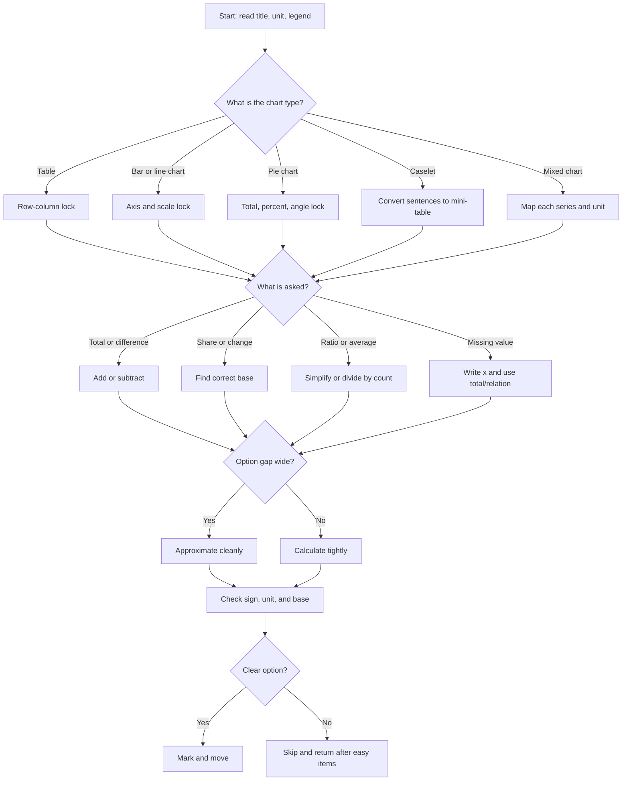

## Corpus Pressure

The promoted SSC book corpus currently gives this topic **419 promoted questions**. That is enough volume to treat DI as a scoring system, not as a small chapter. The largest cluster is `Data Interpretation QR Supplement`, which contributes **328 promoted questions** and drives the note structure below: set classification, row-column lock, base discipline, option gap decisions, and 36-second set selection. The next visible clusters are `ssc-maths-6800-mcq-p0601-p0620`, which contributes **35 promoted questions**, and `ssc-maths-6800-mcq-p0621-p0640`, which contributes **28 promoted questions**. Smaller crossover clusters from Profit and Loss, Discount, and Number System matter because SSC often hides those ideas inside charts.

For 200/200 preparation, DI must be trained as a table|bar chart|pie chart|caselet|approximation engine. The question is rarely "hard maths"; it is usually a penalty for reading the wrong base, the wrong row, the wrong legend, or the wrong total. Your default standard is not "I can solve it"; it is "I can classify it in five seconds and finish it without re-reading."

## Concept Ladder

**First principles: data is arithmetic under pressure**  
DI is percentage, ratio, average, total, difference, and approximation arranged inside a table, bar chart, pie chart, line graph, mixed chart, or caselet. The visual format only decides where the numbers live. The operation is still ordinary arithmetic.

**Level 1 - First 5-Second Classification**  
Before touching calculation, classify the set:
- Table: row and column headers carry the answer.
- Bar chart: axis scale and legend carry the answer.
- Pie chart: total, percentage share, and angle conversion carry the answer.
- Line graph: year/month sequence and change from one point to another carry the answer.
- Caselet: sentences must be converted into a mini-table.
- Mixed chart: each data series has its own unit and legend.

**Level 2 - Row-Column Lock**  
Every table question begins with a row-column lock. Say the row and column mentally before reading the number: "City B, 2024", "Product A, profit", "male candidates, selected". This prevents the most common SSC DI error: using a correct number from the wrong coordinate.

**Level 3 - Base Discipline**  
Base discipline decides percentage accuracy. For percentage change, the base is the old value. For percentage share, the base is the total. For discount/profit crossover, the base may be marked price, cost price, or selling price; do not transfer a base from a previous question unless the stem says the same total continues.

**Level 4 - Operation Choice**  
Once data is locked, choose one operation only:
- Total: add row, column, or selected categories.
- Difference: larger minus smaller, unless the stem asks for "decrease from X to Y".
- Share: part divided by total.
- Percentage change: difference divided by old value.
- Ratio: two locked values simplified by GCD.
- Average: sum divided by count.
- Pie angle: share multiplied by 3.6.
- Missing data: total minus known parts, or equation from the caselet.

**Level 5 - Option Gap**  
Option gap means the distance between choices. If options are far apart, approximate. If two options are close, calculate tightly. SSC wastes time by tempting exact calculation when rough work is enough and by punishing rough work when options are close.

**Level 6 - 36-Second Set Selection**  
For a five-question DI set, spend the first 6-8 seconds reading the title, units, chart type, and legends. Start with direct cell, total, difference, and ratio questions. Leave missing data, multi-step average, and caselet inference for the end. The goal is not to "respect the set order"; the goal is to harvest marks with minimum rereading.

## Type System

| Type | Recognition cue | First move | Fast method | Main trap |
|---|---|---|---|---|
| Simple table | Rows and columns with yearly/category values | Row-column lock | Add, subtract, ratio, average | Swapping row and column |
| Bar chart | Vertical or horizontal bars | Check axis scale and legend | Compare heights, then subtract/divide | Misreading scale interval |
| Pie chart | Circle with percentage, angle, or category shares | Confirm total | Share = percent of total; angle = percent x 3.6 | Treating percent as count |
| Line graph | Points across time | Check period order | Consecutive change, average, peak/low | Confusing slope with value |
| Caselet | Paragraph with related quantities | Draw a mini-table | Convert every sentence into equation/table cell | Missing one condition |
| Mixed chart | Two chart types or two units | Map every legend | Solve each series separately | Mixing revenue/profit/unit |
| Missing data | Blank cell, total, or relation | Write unknown as x | Known total minus known parts | Assuming blank is zero |

## Speed Methods

**Core formulas**

| Ask | Formula | 36-second shortcut |
|---|---|---|
| Percentage share | part / total x 100 | Convert total to 100, 200, 400, 500, or 1000 if possible |
| Percentage increase | increase / old x 100 | Difference first, base second |
| Percentage decrease | decrease / old x 100 | Old value is still the base |
| Ratio | A:B | Divide both sides by GCD |
| Average | sum / count | Pair numbers before adding |
| Central angle | percent x 3.6 | 25% = 90, 30% = 108, 40% = 144 |
| Missing value | total - known values | Write the equation before arithmetic |

**Fraction memory for DI**

| Fraction | Percent | Use case |
|---|---:|---|
| 1/2 | 50% | Half-year, half total, 180 degrees |
| 1/3 | 33.33% | Three equal sectors/categories |
| 1/4 | 25% | Quarter of total, 90 degrees |
| 1/5 | 20% | One of five categories |
| 1/6 | 16.67% | Six equal sectors |
| 1/8 | 12.5% | 45-degree pie sector |
| 1/10 | 10% | Fast benchmark |
| 1/20 | 5% | Fine adjustment |
| 1/25 | 4% | Useful when total is 25/50/100 based |

**36-second execution loop**
- 0-5 seconds: classify the chart and the operation.
- 5-15 seconds: lock row/column/legend/base.
- 15-28 seconds: compute with exact or approximate method based on option gap.
- 28-36 seconds: match, check sign/base once, mark, and move.

**When to skip inside DI**
- You cannot identify the base in 10 seconds.
- A mixed chart has two legends and the question needs both.
- A caselet requires three equations before any option can be checked.
- Two options are close and your rough value sits between them.

## Trap Table

| Trap | Trigger wording | Wrong move | Correct move | Repair drill |
|---|---|---|---|---|
| Row-column swap | "City B in 2024" | Read City A or 2023 | Say both labels before reading | 20 table-lock reps |
| Wrong base | "increase from 240 to 300" | Divide by 300 | Divide by 240 | Underline "from" |
| Percentage point | "rise by 4 percentage points" | Take 4% of value | Add 4 to the percent figure | Contrast percent vs point |
| Total vs average | "average per month" | Return total | Divide by number of months | Say operation before numbers |
| Pie count vs percent | "25% of 800" | Answer 25 | 200 | Always locate total |
| Pie angle | "sector angle for 30%" | Answer 30 | 108 degrees | Multiply by 3.6 |
| Scale interval | Axis marked 0, 50, 100, 150 | Treat each grid as 100 | Read interval first | Write scale on rough sheet |
| Mixed unit | Revenue in crore, profit in percent | Add unlike units | Convert using correct unit | Circle legend/unit |
| Missing blank | Blank cell in a total table | Treat blank as 0 | Solve from total | Write x |
| Option gap misuse | Options 98, 100, 102, 104 | Round heavily | Calculate tightly | Check spacing before rounding |
| Carry-forward error | Previous total used in next question | Reuse without checking | Confirm same dataset and condition | Mark set total separately |
| Direction error | "decrease from 525 to 450" | Use 525-450 but divide by 450 | Divide by 525 | Base is old value |

## Flowchart

## Solved Examples

**Example 1: Table Total**  
The table shows sales of A, B, C, and D as 120, 150, 180, and 210 units. What is the total sales?  
Options: (a) 540 (b) 600 (c) 660 (d) 720  
**Solution**: Total = 120 + 150 + 180 + 210 = (120 + 180) + (150 + 210) = 300 + 360 = 660. **Answer: (c) 660**

**Example 2: Percentage Share**  
Total students are 800. Science has 25 percent. How many students are in Science?  
Options: (a) 160 (b) 180 (c) 200 (d) 240  
**Solution**: 25 percent = 1/4. Science students = 800/4 = 200. **Answer: (c) 200**

**Example 3: Percentage Increase**  
Production rose from 240 units to 300 units. What is the percentage increase?  
Options: (a) 20 percent (b) 25 percent (c) 30 percent (d) 35 percent  
**Solution**: Increase = 60. Base = old value = 240. Percentage increase = 60/240 x 100 = 25 percent. **Answer: (b) 25 percent**

**Example 4: Ratio from Table**  
Boys and girls are 36 and 24. What is the ratio of boys to girls?  
Options: (a) 2:3 (b) 3:2 (c) 4:3 (d) 5:4  
**Solution**: 36:24. Divide by 12. Ratio = 3:2. **Answer: (b) 3:2**

**Example 5: Average from Data**  
Five values are 12, 18, 20, 25, and 30. What is their average?  
Options: (a) 19 (b) 20 (c) 21 (d) 22  
**Solution**: Sum = 105. Average = 105/5 = 21. **Answer: (c) 21**

**Example 6: Difference Question**  
Exports in 2024 and 2025 are 450 crore and 525 crore. What is the difference?  
Options: (a) 50 crore (b) 65 crore (c) 75 crore (d) 90 crore  
**Solution**: Difference = 525 - 450 = 75 crore. **Answer: (c) 75 crore**

**Example 7: Approximation**  
Find the closest value of 19.8 percent of 505.  
Options: (a) 80 (b) 90 (c) 100 (d) 120  
**Solution**: 19.8 percent is near 20 percent and 505 is near 500. 20 percent of 500 = 100. Options are far, so approximation is enough. **Answer: (c) 100**

**Example 8: Pie Chart Angle**  
If a category is 30 percent of a pie chart, what is its central angle?  
Options: (a) 90 degrees (b) 100 degrees (c) 108 degrees (d) 120 degrees  
**Solution**: Angle = 30 x 3.6 = 108 degrees. **Answer: (c) 108 degrees**

**Example 9: Combined Ratio**  
Two departments have 48 and 72 employees. If 25 percent of the first and 50 percent of the second are women, how many women are there in total?  
Options: (a) 36 (b) 42 (c) 48 (d) 54  
**Solution**: First = 12 women. Second = 36 women. Total = 48. **Answer: (c) 48**

**Example 10: Caselet Total**  
A shop sold 80 pens on Monday, 90 on Tuesday, and 110 on Wednesday. Thursday sales were 20 percent more than Wednesday. What was the four-day total?  
Options: (a) 392 (b) 402 (c) 412 (d) 422  
**Solution**: Thursday = 110 + 22 = 132. Total = 80 + 90 + 110 + 132 = 412. **Answer: (c) 412**

**Example 11: Row-Column Lock**  
A table gives candidates selected from City A, B, C in 2023 and 2024. City B values are 180 and 240. What is the increase for City B from 2023 to 2024?  
Options: (a) 40 (b) 50 (c) 60 (d) 80  
**Solution**: Lock City B row and 2023/2024 columns. Increase = 240 - 180 = 60. **Answer: (c) 60**

**Example 12: Percentage Decrease**  
Sales fell from 500 to 425. What is the percentage decrease?  
Options: (a) 12 percent (b) 15 percent (c) 17.5 percent (d) 20 percent  
**Solution**: Decrease = 75. Base = 500. Percentage decrease = 75/500 x 100 = 15 percent. **Answer: (b) 15 percent**

**Example 13: Pie Sector Count**  
A pie chart represents 1200 students. The English sector is 15 percent. How many students chose English?  
Options: (a) 160 (b) 170 (c) 180 (d) 200  
**Solution**: 10 percent = 120 and 5 percent = 60. Total = 180. **Answer: (c) 180**

**Example 14: Pie Angle from Count**  
In a school of 900 students, 225 students chose Science. What is the central angle?  
Options: (a) 60 degrees (b) 75 degrees (c) 90 degrees (d) 120 degrees  
**Solution**: Share = 225/900 = 1/4 = 25 percent. Angle = 25 x 3.6 = 90 degrees. **Answer: (c) 90 degrees**

**Example 15: Bar Chart Ratio**  
A bar chart shows production of X and Y as 320 and 400 units. Find X:Y.  
Options: (a) 3:4 (b) 4:5 (c) 5:4 (d) 8:9  
**Solution**: 320:400. Divide by 80. Ratio = 4:5. **Answer: (b) 4:5**

**Example 16: Line Graph Consecutive Growth**  
Revenue for three years is 240, 300, and 360 crore. What is the percentage increase from year 2 to year 3?  
Options: (a) 15 percent (b) 20 percent (c) 25 percent (d) 30 percent  
**Solution**: Increase = 60. Base = 300. Percentage = 60/300 x 100 = 20 percent. **Answer: (b) 20 percent**

**Example 17: Missing Table Cell**  
A table row total is 760. Three visible cells are 180, 220, and 140. Find the missing cell.  
Options: (a) 180 (b) 200 (c) 220 (d) 240  
**Solution**: Known sum = 180 + 220 + 140 = 540. Missing = 760 - 540 = 220. **Answer: (c) 220**

**Example 18: Caselet Ratio Split**  
A total of 720 candidates are divided between A and B in the ratio 5:4. How many are in B?  
Options: (a) 300 (b) 320 (c) 360 (d) 400  
**Solution**: Total parts = 9. One part = 720/9 = 80. B = 4 x 80 = 320. **Answer: (b) 320**

**Example 19: Weighted Average Table**  
Two batches have 30 and 50 students with average marks 60 and 72. Find combined average.  
Options: (a) 66 (b) 67.5 (c) 68 (d) 69  
**Solution**: Total marks = 30 x 60 + 50 x 72 = 1800 + 3600 = 5400. Students = 80. Average = 5400/80 = 67.5. **Answer: (b) 67.5**

**Example 20: Option Gap Approximation**  
A chart value is 31.2 percent of 398. Closest value?  
Options: (a) 95 (b) 105 (c) 124 (d) 160  
**Solution**: 31.2 percent is near 31 percent and 398 is near 400. 31 percent of 400 = 124. Options are spread, so this is enough. **Answer: (c) 124**

**Example 21: Mixed Chart Legend**  
A mixed chart shows revenue bars and profit-percent line. Revenue in 2025 is 600 crore and profit is 20 percent. Find profit amount.  
Options: (a) 100 crore (b) 110 crore (c) 120 crore (d) 140 crore  
**Solution**: Use bar for revenue and line for profit percent. Profit = 20 percent of 600 = 120 crore. **Answer: (c) 120 crore**

**Example 22: Percentage Point vs Percent**  
The literacy rate rose from 68 percent to 74 percent. What is the rise in percentage points?  
Options: (a) 6 (b) 8.82 (c) 9 (d) 12  
**Solution**: Percentage points are direct subtraction: 74 - 68 = 6. **Answer: (a) 6**

**Example 23: Carry-Forward Total**  
In a DI set, the total exports are 1500 crore. Category A is 28 percent and category B is 12 percent. What is A + B?  
Options: (a) 500 crore (b) 550 crore (c) 600 crore (d) 650 crore  
**Solution**: A + B = 40 percent of 1500 = 600 crore. **Answer: (c) 600 crore**

**Example 24: Complement Method**  
A pie chart total is 2000. Four categories are 22 percent, 18 percent, 25 percent, and 15 percent. Find the remaining category.  
Options: (a) 300 (b) 350 (c) 400 (d) 450  
**Solution**: Known share = 22 + 18 + 25 + 15 = 80 percent. Remaining = 20 percent of 2000 = 400. **Answer: (c) 400**

**Example 25: Set-Selection Decision**  
Two DI sets are available. Set A has direct table totals and ratios. Set B has a caselet with two unknowns and close options. Which should be attempted first in a 15-minute quant section?  
Options: (a) Set A (b) Set B (c) Both together (d) Skip DI entirely  
**Solution**: 200/200 mode prioritizes marks per second. Direct table totals and ratios have lower reread risk. Attempt Set A first, then return to Set B if time remains. **Answer: (a) Set A**

## PYQ Mapping

**Practice route**  
/exams/ssc-cgl/topics/data-interpretation

**Corpus cluster: Data Interpretation QR Supplement**  
This cluster supplies the main promoted volume. Practice it by classifying each set first, then tagging every miss as row-column lock, base discipline, option gap, arithmetic, or set-selection error.

**Corpus cluster: ssc-maths-6800-mcq-p0601-p0620**  
This cluster should be used for pure DI speed: tables, charts, direct totals, percentage shares, ratios, and averages. Target: 35 questions with no more than 2 rereads.

**Corpus cluster: ssc-maths-6800-mcq-p0621-p0640**  
This cluster should be used for second-pass DI: mixed data, slightly longer calculations, and caselet-style extraction. Target: complete a 20-question block with every skipped question tagged.

**Crossover clusters**  
Profit and Loss, Discount, Number System, Percentages, Ratio-Proportion, Averages, and Time-Speed-Distance can appear inside DI. Whenever a chart uses cost, revenue, discount, population, distance, or production, solve the arithmetic topic first and the chart second.

## 200/200 Drill

**Daily DI block: 18 minutes**

1. Table lock drill, 3 minutes: open any table set and call row plus column aloud before writing the value.
2. Base discipline drill, 3 minutes: solve 10 percentage change questions and write the base before the fraction.
3. Option gap drill, 3 minutes: decide exact vs approximate before computing.
4. Pie and bar sprint, 3 minutes: convert percent-count-angle and bar differences.
5. Caselet extraction, 3 minutes: turn paragraph data into a mini-table.
6. Repair log, 3 minutes: tag every error into row-column lock, base discipline, option gap, arithmetic, or time.

**36-second table routine**
- First look: title, unit, period.
- Second look: row and column.
- Third look: operation.
- Fourth look: option gap.
- Final look: unit and sign.

**Repair rules**
- Row/column error: 20 no-calculation lookup reps.
- Wrong base: 20 percentage-change reps using "from X to Y".
- Slow addition: 50 pair-sum reps.
- Approximation error: compare exact value and rounded value, then write whether the option gap allowed rounding.
- Caselet miss: rewrite the paragraph as a table before checking the answer.

DI becomes high accuracy when it is mechanical. The corpus volume is large enough to make it automatic: classify, lock, compute, match, and move.
<!-- SSC-FINAL-PRACTICE-QUEUE:START -->
## Final Practice Queue

1. Start one-by-one practice: [Data Interpretation practice](/exams/ssc-cgl/practice/data-interpretation). Finish every question in this topic bank, not just the samples in the note.
2. Move to timed sets: [SSC CGL tests](/exams/ssc-cgl/tests?topic=data-interpretation). Use topic drills first, then section mocks once accuracy is stable.
3. Repair every miss immediately: record the error label, redo 20 mixed questions from the same topic, then retest after 24 hours.
4. 200/200 rule: do not mark this topic exam-ready until correct answers come within 36 seconds and wrong answers are explained without looking at the solution.

<!-- SSC-FINAL-PRACTICE-QUEUE:END -->
