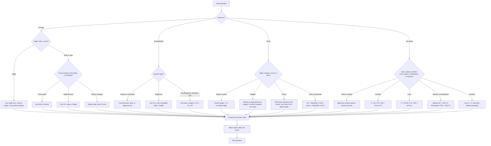

## Concept Ladder

**First Principles**  
Geometry studies shapes, sizes, and properties of space. Mensuration measures length, area, surface area, and volume. Start with points, lines, angles. Angle sum of triangle = 180deg. Complementary (90) and supplementary (180) angles. Types: acute, right, obtuse, straight, reflex.

### Corpus Pressure

The uploaded book-PYQ corpus marks `geometry-mensuration` as a 200/200 dominant-repeat Quant topic with 1207 promoted questions. This is not a small formula chapter. It is one of the largest Quant scoring areas in the current corpus: 603 questions are tagged under Mensuration and 531 under Geometry, with additional linked chapter pages carrying mixed rectangle, circle, triangle, volume, and theorem prompts. A 50/50 Quant plan must treat this topic as a daily speed chapter.

The corpus pressure means three things:

| Corpus signal | What it demands | 36-second implication |
|---:|---|---|
| Mensuration | **603 promoted questions** on perimeter, area, surface area, volume, and recasting formulas | Formula recall must finish in 5-8 seconds, leaving time for arithmetic |
| Geometry | **531 promoted questions** on triangle, quadrilateral, circle, tangent, chord, cyclic quadrilateral, and similarity | The theorem trigger must be seen before writing equations |
| `ssc-maths-6800-mcq-p0101-p0120` | **27 promoted questions** from mixed arithmetic-geometry pages | Check units and diagram structure before calculating |
| `ssc-maths-6800-mcq-p0621-p0640` | **21 promoted questions** from mixed applied mensuration pages | Expect composite figures, pi-choice traps, and dimension conversion |
| `ssc-maths-6800-mcq-p0201-p0220` | **17 promoted questions** from mixed Quant support pages | Keep Pythagorean triples, ratio, and percentage-change arithmetic fast |
| Frequent 3D prompts | Cylinder, cone, sphere, hemisphere, frustum, cube, cuboid | Separate CSA, TSA, and volume automatically |
| High trap density | Radius vs diameter, area ratio vs side ratio, volume preservation vs surface area | One wrong assumption creates a 2.5-mark swing |

The mastery standard is direct: every common 2D or 3D formula should be recallable without searching memory, and every theorem prompt should be reduced to a diagram trigger. If a geometry/mensuration question takes longer than 36 seconds, the delay should come from arithmetic, not from deciding what rule applies.

**Step 1: Triangles**  
- Types by sides: equilateral, isosceles, scalene.  
- Types by angles: acute, right, obtuse.  
- Important lines: median (vertex to midpoint of opposite side), altitude (perpendicular), angle bisector, perpendicular bisector.  
- Properties: centroid (median intersection), incenter (angle bisector intersection), circumcenter (perpendicular bisector intersection), orthocenter (altitude intersection). For equilateral all coincide.  
- Pythagoras: a^2 + b^2 = c^2 for right triangles. Common triples: 3-4-5, 5-12-13, 8-15-17, 7-24-25.  
- Congruence: SSS, SAS, ASA, AAS, RHS.  
- Similarity: AA, SAS, SSS. Ratio of areas = square of ratio of sides.  
- Area formulas: 1/2 * base * height; Heron's: sqrt[s(s-a)(s-b)(s-c)]; for equilateral: (sqrt3/4)a^2.

**Step 2: Quadrilaterals**  
- Sum of interior angles = 360.  
- Types: square, rectangle, parallelogram, rhombus, trapezium, kite.  
- Area: square a^2; rectangle l*b; parallelogram b*h; rhombus (1/2)d1*d2; trapezium (1/2)(a+b)*h; kite (1/2)d1*d2.  
- Properties: diagonals bisect each other for parallelogram; diagonals are equal for rectangle; diagonals perpendicular for rhombus; one diagonal bisects angles for rhombus and kite.

**Step 3: Circles**  
- Radius, diameter, chord, arc, sector, segment.  
- Theorems: angle subtended by chord at center is twice at circumference. Angles in same segment equal. Angle in semicircle = 90deg.  
- Tangents: radius perpendicular to tangent; tangents from external point equal.  
- Chord properties: perpendicular from center bisects chord; equal chords equidistant from center.  
- Cyclic quadrilateral: opposite angles supplementary. Exterior angle equals interior opposite angle.  
- Length: circumference = 2*pi*r; arc length = theta/360 * 2*pi*r (theta in degrees).  
- Area: pi*r^2; sector area = theta/360 * pi*r^2; segment area = sector area minus triangle area.

**Step 4: 2D Mensuration**  
- Perimeter and area formulas for all shapes above.  
- Also: regular polygon: perimeter = n * side; area = (1/2) * n * side * apothem.  
- Composite figures: break into standard shapes, sum areas, subtract overlaps.

**Step 5: 3D Mensuration**  
- Cube: SA = 6a^2, V = a^3.  
- Cuboid: SA = 2(lb + bh + hl), V = l*b*h.  
- Cylinder: CSA = 2*pi*r*h; TSA = 2*pi*r(r+h); V = pi*r^2*h.  
- Cone: slant height l = sqrt(r^2 + h^2); CSA = pi*r*l; TSA = pi*r(r+l); V = (1/3)*pi*r^2*h.  
- Sphere: SA = 4*pi*r^2; V = (4/3)*pi*r^3.  
- Hemisphere: CSA = 2*pi*r^2; TSA = 3*pi*r^2; V = (2/3)*pi*r^3.  
- Frustum: slant height L = sqrt(h^2 + (R-r)^2); CSA = pi*(R+r)*L; TSA = pi*(R+r)*L + pi*R^2 + pi*r^2; V = (1/3)*pi*h*(R^2 + Rr + r^2).  
- Conversion: when shapes change (e.g., melting a sphere into a cylinder), volume remains constant.

**Exam-Level Integration**  
- Diagram discipline: draw even if not given; mark known lengths, angles.  
- Theorem triggers: when you see a circle with chords, think of angle subtended properties; for tangent, think radius to tangent 90deg.  
- Elimination: use dimensional analysis (units) to rule out options. For area, unit is m^2; volume m^3.  
- 36-second attempt plan: classify question as theorem-based (use known facts and properties) or formula-based (plug into standard formula). For theorem, use flowchart and speed methods; for formula, recall exact formula and substitute carefully. If stuck >36s, mark and skip, return if time allows.

## Type System

### First 5-Second Classification

Before writing a formula, classify the question. This is the main difference between a 35/50 Quant attempt and a 50/50 Quant attempt.

| First signal | Immediate classification | First action |
|---|---|---|
| The answer asks for an angle | Theorem question | Mark linear pair, triangle sum, exterior angle, cyclic pair, tangent-radius right angle, or same-segment angle |
| Two triangles share angles or parallel lines | Similarity question | Write side ratio first; square it only for area |
| Radius, diameter, chord, tangent, arc, or sector appears | Circle question | Circle diameter values and mark whether answer is length or area |
| Painting, sheet, cloth, or curved wall appears | Surface-area question | Decide CSA, LSA, TSA, one-base, two-base, or open-top before substituting |
| Tank, capacity, melted, recast, or filled appears | Volume question | Equate volumes for recasting and convert litres only after volume |
| Side, radius, or height changes by percent | Dimension-change question | Convert every changed dimension to a multiplier |
| Shaded region or combined figure appears | Composite-area question | Make a plus/minus shape list before arithmetic |
| Options are multiples of pi or fractions | Symbolic calculation question | Keep pi symbolic and cancel common factors |
| Options are far apart | Option-gap question | Approximate only to the precision needed |
| No shape is obvious by 5 seconds | Diagram-rebuild question | Draw a rough shape, mark units, and set a 25-second abandon alarm |

| Type | Recognition Cue | Method | Speed Target | Trap |
|---|---|---|---|---|
| Triangle angle sum | Sum of two angles given, find third | Use 180 - (sum) | 10s | Confuse complementary vs supplementary |
| Pythagoras | Right triangle; two sides given | a^2+b^2=c^2 | 15s | Forget to take square root |
| Triangle area (base-height) | Base and height explicitly given | 1/2 * base * height | 10s | Use wrong base-height pair |
| Triangle area (Heron) | Three sides given | Heron's formula | 20s | Arithmetic error in semiperimeter |
| Triangle similarity | Two triangles, parallel lines, or angle marks | Ratio of corresponding sides squared for area | 20s | Take ratio of sides instead of squared for area |
| Angle bisector theorem | A bisector divides opposite side | BD/DC = AB/AC | 15s | Apply wrong ratio |
| Medians and centroid | Triangle with median | Centroid divides median 2:1 | 15s | Think 1:1 |
| Quadrilateral area | Irregular shape with coordinates or split | Break into triangles or use formula | 25s | Miss diagonal split |
| Circle: angle at center | Angle at center and circumference from same chord | Central angle = 2*circumference angle | 12s | Invert: 2*center = circle? |
| Circle: tangent length | Tangent from external point | Length equal | 10s | Forget to subtract given radius |
| Circle: chord distance | Chord length and distance from center | Half chord, center distance, radius form a right triangle | 20s | Using full chord as the leg |
| Circle: angle in semicircle | Diameter as chord | Angle in semicircle = 90deg | 10s | Treating it as a normal chord |
| Cyclic quadrilateral | Rectangle, or all vertices on circle | Opposite angles sum to 180 | 15s | Treat as normal quadrilateral |
| Arc length | Angle and radius | theta/360 * 2*pi*r | 15s | Use area formula by mistake |
| Sector area | Angle and radius | theta/360 * pi*r^2 | 15s | Forget that arc is length and sector is area |
| Segment area | Sector plus triangle shown | Sector area - triangle area | 30s | Giving sector area directly |
| Cube/Cuboid surface area | Named shape, dimensions | Correct formula | 10s | Mix curved and total surface |
| Cylinder volume | Cylinder, radius, height | pi*r^2*h | 10s | Use diameter instead of radius |
| Cylinder TSA/CSA | Cylinder open/closed/curved wording | CSA = 2*pi*r*h, TSA = 2*pi*r(r+h) | 15s | Adding circular bases when open |
| Cone volume | Cone, radius, height | (1/3)*pi*r^2*h | 10s | Forget 1/3 |
| Cone slant height | Cone with radius and height | l = sqrt(r^2+h^2) | 15s | Using height as slant height |
| Sphere volume | Sphere, radius | (4/3)*pi*r^3 | 10s | Use 4*pi*r^2 (surface area) |
| Hemisphere TSA | Bowl/hemisphere with base | TSA = 3*pi*r^2 | 12s | Using CSA = 2*pi*r^2 |
| Frustum | Bucket/conical frustum, two radii | Use R, r, h, L formulas carefully | 30s | Treating as full cone |
| Volume conversion | Shape melts/recruits into other | Volume unchanged | 20s | Assume surface area equal |
| Percentage change in dimensions | Length/breadth/radius changed by percent | Convert each dimension to multiplier | 25s | Adding percent changes directly |
| Composite shape | Rectangle plus semicircle, square minus circle | Add/subtract standard areas | 30s | Double-counting overlapped area |
| Unit conversion | cm and m mixed, litres/cubic cm | Convert before formula | 10s | Mixing cm, cm^2, cm^3 |
| Dimensions elimination | No diagram, only text | Rule out options with impossible lengths (negative, zero) | 10s | Overshoot and pick plausible but wrong |

### Full Type Tree for 50/50

Use this as the checklist before declaring the chapter "done". If any row still feels slow, it belongs in the next repair drill.

| Cluster | Subtype | Recognition cue | Fast action | Minimum standard |
|---|---|---|---|---|
| Basic angles | Complement, supplement, linear pair | 90deg, 180deg, straight line | Write the missing angle immediately | Under 10 seconds |
| Triangle angles | Third angle, exterior angle | Two angles or one exterior angle given | Use 180deg sum or exterior = sum of opposite interiors | Under 12 seconds |
| Isosceles/equilateral | Equal sides or equal angles | AB = AC, all sides equal | Mark equal angles before calculating | Under 15 seconds |
| Right triangle | Two sides, diagonal, height | Right angle or rectangle diagonal | Use Pythagorean triple before squaring | Under 15 seconds |
| Heron | Three sides only | No height given | Compute s, then factors | Under 30 seconds |
| Similar triangles | Parallel line, same angles, scale factor | DE parallel BC, map/height/shadow | Side ratio for length, square ratio for area | Under 25 seconds |
| Median/centroid | G centroid, median drawn | AG:GD or BG:GE | Use 2:1 from vertex | Under 15 seconds |
| Angle bisector | Internal bisector divides opposite side | AD bisects angle A | Opposite side split follows adjacent side ratio | Under 20 seconds |
| Quadrilateral sum | Four-angle figure | Find missing angle | Interior angle sum = 360deg | Under 12 seconds |
| Parallelogram | Opposite sides parallel | Area or diagonal properties | Area = base x height, diagonals bisect | Under 15 seconds |
| Rhombus/kite | Diagonals given | Area asked | Area = 1/2*d1*d2 | Under 12 seconds |
| Trapezium | Parallel sides and height | Area asked | Area = 1/2*(sum parallel sides)*height | Under 15 seconds |
| Circle length | Radius/diameter with circumference | Perimeter or fencing | Convert diameter to radius; use 2*pi*r | Under 15 seconds |
| Circle area | Radius/diameter with area | Area or painted surface | Use pi*r^2 | Under 15 seconds |
| Arc/sector | Central angle theta | Length or area of part of circle | Arc uses 2*pi*r; sector uses pi*r^2 | Under 20 seconds |
| Chord theorem | Perpendicular from center to chord | Chord length, distance, radius | Half chord forms right triangle | Under 25 seconds |
| Tangent theorem | Tangents from external point | PA, PB, radius to contact point | Equal tangents; radius perpendicular tangent | Under 20 seconds |
| Cyclic quadrilateral | Four points on circle | Opposite angles | Opposite angles sum 180deg | Under 15 seconds |
| Cube/cuboid | Box, room, tank, brick | Volume or painting | Choose volume, LSA, TSA by wording | Under 18 seconds |
| Cylinder | Pipe, roller, well, vessel | Curved surface or volume | Radius first, then formula | Under 20 seconds |
| Cone | Tent, heap, conical vessel | Slant height or volume | l^2 = r^2+h^2 before CSA/TSA | Under 25 seconds |
| Sphere/hemisphere | Ball, bowl, dome | Surface area or volume | Sphere full, hemisphere half plus base when TSA | Under 20 seconds |
| Frustum | Bucket, cone cut by parallel plane | Two radii | Keep R, r, h, L separate | Under 35 seconds |
| Recasting | Melted, recast, converted | New shape made from old | Equate volumes only | Under 30 seconds |
| Composite area | Shaded region | Added or removed pieces | Draw plus/minus map | Under 35 seconds |
| Dimension percent | Radius/side changes by percent | Area/volume percent change | Square/cube the multiplier | Under 25 seconds |

### Formula Bank With Units

| Shape/idea | Formula | Unit check | Exam trap |
|---|---|---|---|
| Square perimeter | 4a | length | Perimeter is not area |
| Square area | a^2 | square units | Side from diagonal needs Pythagoras |
| Rectangle perimeter | 2(l+b) | length | Do not use l*b |
| Rectangle area | l*b | square units | Convert units first |
| Triangle area | 1/2*b*h | square units | Height must be perpendicular |
| Equilateral triangle area | sqrt3/4*a^2 | square units | Side is not height |
| Heron | sqrt[s(s-a)(s-b)(s-c)] | square units | s = half perimeter |
| Circle circumference | 2*pi*r or pi*d | length | Radius vs diameter |
| Circle area | pi*r^2 | square units | Area changes with square of radius |
| Arc length | theta/360*2*pi*r | length | theta must be central angle |
| Sector area | theta/360*pi*r^2 | square units | Not the same as arc length |
| Cube volume | a^3 | cubic units | Edge from volume requires cube root |
| Cube TSA | 6a^2 | square units | Painted one face means subtract faces |
| Cuboid volume | l*b*h | cubic units | Tank capacity may be in litres |
| Cuboid TSA | 2(lb+bh+hl) | square units | Open box has one face missing |
| Cylinder volume | pi*r^2*h | cubic units | Diameter must be halved |
| Cylinder CSA | 2*pi*r*h | square units | Curved wall excludes bases |
| Cylinder TSA | 2*pi*r(r+h) | square units | Closed cylinder includes two bases |
| Cone volume | 1/3*pi*r^2*h | cubic units | Missing 1/3 is common |
| Cone CSA | pi*r*l | square units | l is slant height, not vertical height |
| Cone TSA | pi*r(l+r) | square units | Add base only when closed |
| Sphere surface area | 4*pi*r^2 | square units | Surface area, not volume |
| Sphere volume | 4/3*pi*r^3 | cubic units | Volume changes with cube of radius |
| Hemisphere CSA | 2*pi*r^2 | square units | Curved surface excludes base |
| Hemisphere TSA | 3*pi*r^2 | square units | Total includes circular base |
| Hemisphere volume | 2/3*pi*r^3 | cubic units | Half of sphere volume |
| Frustum CSA | pi*(R+r)*L | square units | Use slant height L |
| Frustum volume | 1/3*pi*h*(R^2+Rr+r^2) | cubic units | Do not average radii |
| Litres conversion | 1000 cm^3 = 1 litre | capacity | Convert after volume, not before area |

## Speed Methods

**Recall Table: Surface Area & Volume**

| Shape | Lateral/Curved SA | Total SA | Volume |
|---|---|---|---|
| Cube | 4a^2 | 6a^2 | a^3 |
| Cuboid | 2h(l+b) | 2(lb+bh+hl) | lbh |
| Cylinder | 2*pi*r*h | 2*pi*r(h+r) | pi*r^2*h |
| Cone | pi*r*l | pi*r(l+r) | (1/3)*pi*r^2*h |
| Sphere | 4*pi*r^2 | 4*pi*r^2 | (4/3)*pi*r^3 |
| Hemisphere | 2*pi*r^2 | 3*pi*r^2 | (2/3)*pi*r^3 |
| Frustum | pi*(R+r)*L | pi*(R+r)*L+pi*R^2+pi*r^2 | (1/3)*pi*h(R^2+Rr+r^2) |

**Decision Rules**

1. **Is the question about angle relationships?** --> Use theorem triggers (angle sum, circle theorems, cyclic quad).  
2. **Is it about length/area/volume?** --> Identify shape and pick formula.  
3. **Two similar triangles?** --> Ratio of sides squared for area.  
4. **Chord/tangent in a circle?** --> Radius to tangent = 90deg.  
5. **Volume after melting?** --> Volume unchanged.  
6. **Option testing for unknown dimensions?** --> Substitute plausible values from options; smallest usually works.  
7. **Approximation for pi** --> Use 22/7 or 3.14 as given; if options differ by multiples of pi, keep pi symbolic.  
8. **Skip-and-return when:** question has no diagram and seems abstract; more than two unknown variables; time >36s without progress.

**Step-by-step algorithms**

**Algorithm for area of a triangle given three sides (Heron):**  
- Step 1: Compute semiperimeter s = (a+b+c)/2.  
- Step 2: Compute s-a, s-b, s-c.  
- Step 3: Area = sqrt[s * (s-a) * (s-b) * (s-c)].  
- Check: All factors positive; if zero, triangle degenerate.

**Algorithm for frustum volume:**  
- Step 1: Identify R (larger radius), r (smaller), h (height).  
- Step 2: Compute R^2, r^2, Rr.  
- Step 3: Volume = (1/3)*pi*h*(R^2 + Rr + r^2).  
- Speed tip: memorise term R^2+Rr+r^2 as "sum of squares plus product".

**Algorithm for cyclic quadrilateral:**  
- If any quadrilateral inscribed in a circle, opposite angles sum to 180.  
- Exterior angle at one vertex equals interior opposite angle.

**36-Second Attempt Plan**  
- 0-10s: Read question, identify shape/keyword (triangle, circle, volume).  
- 10-20s: Choose formula or theorem; write known values.  
- 20-35s: Compute; if midway stuck, check option values; use elimination based on units.  
- 35-36s: If answer not reached, mark and skip per sectional strategy.

### 36-Second Decision Discipline

Geometry and mensuration questions fail under speed because students calculate before classifying. Use this order in the Quant section:

1. **Name the object in 3 seconds.** Triangle, circle, quadrilateral, cube, cuboid, cylinder, cone, sphere, hemisphere, frustum, or composite.
2. **Name the asked unit in 3 seconds.** Length, area, surface area, volume, angle, or ratio. This prevents perimeter-area-volume confusion.
3. **Choose theorem or formula by 10 seconds.** If it is a diagram/theorem problem, mark equal angles, equal sides, parallel lines, tangents, or cyclic pairs. If it is mensuration, write the exact formula.
4. **Control radius and height by 15 seconds.** Diameter must become radius; vertical height and slant height must not be swapped.
5. **Calculate only to option precision.** If options are far apart, cancel pi and common factors first. If options are exact multiples of pi, do not decimalize.
6. **Final unit check.** cm, cm^2, and cm^3 are different answer worlds. This one check saves avoidable negatives.

### Dimension-Change Shortcuts

When dimensions change by percentage, do not add percentages for area and volume. Convert each dimension to a multiplier.

| Situation | Multiplier method | Example | Result |
|---|---|---|---|
| Side of square increases 20 percent | Area multiplier = 1.2^2 | 1.44 | Area increases 44 percent |
| Radius of circle decreases 10 percent | Area multiplier = 0.9^2 | 0.81 | Area decreases 19 percent |
| Radius of sphere doubles | Volume multiplier = 2^3 | 8 | Volume becomes 8 times |
| Length +20 percent, breadth -10 percent | Area multiplier = 1.2*0.9 | 1.08 | Area increases 8 percent |
| All cuboid dimensions increase 10 percent | Volume multiplier = 1.1^3 | 1.331 | Volume increases 33.1 percent |

Use multipliers because SSC options often include the tempting direct addition answer. For example, increasing radius by 20 percent does not increase circle area by 20 percent; it increases by 44 percent.

When to use:  
- **Direct formula**: most area/volume questions.  
- **Option testing**: when formula yields messy fraction, compare with options; plug each option into condition.  
- **Approximation**: when pi appears and options are numeric (e.g., 314 vs 628), use the pi value given in the question.  
- **Substitution**: for unknown variables in ratio questions, assign simplest numbers (e.g., let side=2).  
- **Skip-and-return**: if question asks for "which is true?" with multiple conditions; too lengthy.

## Trap Table

| Trap | Trigger Wording | Wrong Move | Correct Move | Repair Drill |
|---|---|---|---|---|
| Complementary vs Supplementary | "complement of an angle" | Use 180 instead of 90 | Use 90 - angle | Practice supplement vs complement quick quiz |
| Pythagoras: square root | "find the hypotenuse" | Stop at a^2+b^2 | Take square root of sum | Drill: always write c = sqrt(...) |
| Heron: huge numbers | sides 17, 25, 28 | Compute s as fraction incorrectly | Multiply all by 2 to avoid decimals | Use (2s) = a+b+c; keep integer |
| Congruence vs Similarity | "same shape but different size" | Use congruence conditions | Use similarity ratio | Memorise: congruent = identical, similar = same shape |
| Angle bisector: wrong segment | "AD is bisector of angle A" | BD/DC = AB/AC but swap | Keep same order: BD opposite AB? | Draw triangle, label vertices |
| Centroid ratio | "G is centroid" | Divide 1:1 | G divides median 2:1 from vertex | Practice median division |
| Circle: tangent length | "tangent from external point P" | Use PA = PB but forget radius OP | Use right triangle OPA; OA perpendicular PA | Always draw radius to point of tangency |
| Cyclic quadrilateral: opposite angles | "ABCD is cyclic" | Sum of adjacent =180 | Opposite angles sum to 180 | Mark pairs opposite, practice |
| Sector area: angle in degrees | "central angle 60" | Use circumference logic | Sector area = theta/360*pi*r^2 | Keep degrees inside theta/360 formula |
| Hemisphere total surface area | "hemisphere" | Use 2*pi*r^2 only | Total = 3*pi*r^2 (includes base circle) | Write total TSA = curved + base |
| Volume conversion: assume SA constant | "sphere melted into cylinder" | Equate surface areas | Equate volumes | Drill: melting -> volume same |
| Units inconsistency | "radius in cm, height in m" | Mix units directly | Convert to same unit (cm or m) | Always write units in step |
| Right triangle hypotenuse double-check | "legs 9 and 12" | Compute 9^2+12^2=81+144=225, sqrt=15 correct | But sometimes pick 13 (common triple mistake) | Remember 3-4-5 multiplied: 9-12-15 |
| Ratio of areas in similar triangles | "sides ratio 2:3" | Area ratio = 2:3 | Area ratio = 4:9 (square) | Drill: square the ratio |
| Pi approximation error | "use pi = 22/7" | Approximate as 3.14 to give mismatched answer | Use given pi exactly | Stick to the given pi value in problem |
| Volume of cone: missing 1/3 | "cone volume" | Use pi*r^2*h | Use (1/3)*pi*r^2*h | Write formula each time: V=(1/3)*pi*r^2*h |
| Diameter treated as radius | "diameter is 14 cm" | Put r = 14 | Put r = 7 | Circle all diameter values before formula |
| Open tank surface area | "open from top" | Use full TSA | Subtract top face | Read open/closed/lid wording |
| Frustum radius swap | "top diameter and bottom diameter" | Use diameters directly | Halve both, then identify R and r | Convert diameters before formula |
| Composite shaded area | "shaded region" | Add all visible parts | Add required parts and subtract cut-outs | Make plus/minus list before arithmetic |
| Area-volume confusion | "capacity" | Use surface area formula | Capacity means volume | Unit should be cubic or litres |
| Percentage dimension change | "side increased by 20 percent" | Area also +20 percent | Square or cube multiplier | Length percent is not area percent |

## Flowchart

## Solved Examples

**Example 1** (Triangles - Angle Sum)  
In triangle ABC, angle A = 50 deg and angle B = 70 deg. Find angle C.  
A) 40 deg  B) 50 deg  C) 60 deg  D) 70 deg  
Solution: Sum = 180. 180 - (50+70) = 60. Answer: C.

**Example 2** (Pythagoras)  
Find the length of the hypotenuse of a right triangle with legs 6 cm and 8 cm.  
A) 10 cm  B) 12 cm  C) 14 cm  D) 16 cm  
Solution: 6^2+8^2=36+64=100; sqrt=10. Answer: A.

**Example 3** (Area of Triangle - Heron)  
Find the area of a triangle with sides 13 cm, 14 cm, 15 cm.  
A) 84 cm^2  B) 90 cm^2  C) 96 cm^2  D) 100 cm^2  
Solution: s=(13+14+15)/2=21; s-a=8, s-b=7, s-c=6; area=sqrt(21*8*7*6)=sqrt(7056)=84. Answer: A.

**Example 4** (Circle - Angle at Centre)  
In a circle, a chord subtends an angle of 40 deg at the circumference. Find the angle subtended by the same chord at the centre.  
A) 20 deg  B) 40 deg  C) 80 deg  D) 160 deg  
Solution: Angle at centre = 2 * angle at circumference = 80 deg. Answer: C.

**Example 5** (Cyclic Quadrilateral)  
PQRS is a cyclic quadrilateral. Angle P = 70 deg. Find angle R.  
A) 70 deg  B) 90 deg  C) 110 deg  D) 140 deg  
Solution: Opposite angles sum to 180. R = 180 - 70 = 110. Answer: C.

**Example 6** (Volume of Cylinder)  
Find the volume of a cylinder with radius 7 cm and height 10 cm. (Use pi = 22/7)  
A) 1540 cm^3  B) 2200 cm^3  C) 3080 cm^3  D) 6160 cm^3  
Solution: V = pi*r^2*h = (22/7)*7*7*10 = 22*7*10 = 1540. Answer: A.

**Example 7** (Volume of Cone)  
Find the volume of a cone with radius 6 cm and height 8 cm. (Take pi = 3.14)  
A) 301.44 cm^3  B) 402.12 cm^3  C) 502.40 cm^3  D) 603.18 cm^3  
Solution: V = (1/3)*pi*r^2*h = (1/3)*3.14*36*8 = 3.14*12*8 = 3.14*96 = 301.44. Answer: A.

**Example 8** (Sphere - Surface Area)  
Find the surface area of a sphere of radius 14 cm. (Use pi = 22/7)  
A) 2464 cm^2  B) 1232 cm^2  C) 2864 cm^2  D) 4928 cm^2  
Solution: SA = 4*pi*r^2 = 4*(22/7)*14*14 = 4*22*2*14 = 2464. Answer: A.

**Example 9** (Volume Conversion)  
A metallic sphere of radius 6 cm is melted and recast into a cylinder of radius 4 cm. Find the height of the cylinder.  
A) 9 cm  B) 12 cm  C) 18 cm  D) 36 cm  
Solution: Volume of sphere = (4/3)*pi*6^3 = 288*pi. Volume of cylinder = pi*4^2*h = 16*pi*h. Equate: 16*pi*h = 288*pi, so h = 18. Answer: C.

**Example 10** (Triangle Similarity & Area)  
In triangle ABC, DE || BC, AD = 2 cm, DB = 3 cm. The area of triangle ADE is 8 cm^2. Find the area of triangle ABC.  
A) 18 cm^2  B) 25 cm^2  C) 32 cm^2  D) 50 cm^2  
Solution: Triangles ADE and ABC are similar. Ratio of sides AD:AB = 2:(2+3)=2:5. Area ratio = (2/5)^2 = 4/25. So area ABC = 8 * (25/4) = 50 cm^2. Answer: D.

**Example 11** (Chord Distance)  
A chord of length 24 cm is at a distance of 5 cm from the center of a circle. Find the radius.  
A) 11 cm  B) 12 cm  C) 13 cm  D) 14 cm  
Solution: Half chord = 12 cm. Radius, half chord, and perpendicular distance form a right triangle. r^2 = 12^2 + 5^2 = 144 + 25 = 169, so r = 13. Answer: C.

**Example 12** (Tangents from External Point)  
From point P, two tangents PA and PB touch a circle at A and B. If PA = 9 cm, find PB.  
A) 6 cm  B) 9 cm  C) 12 cm  D) 18 cm  
Solution: Tangents drawn from the same external point are equal. PA = PB = 9 cm. Answer: B.

**Example 13** (Radius and Tangent Right Triangle)  
OP is the radius to point of contact P, and AP is tangent. If OA = 13 cm and OP = 5 cm, find AP.  
A) 8 cm  B) 10 cm  C) 12 cm  D) 18 cm  
Solution: OP perpendicular AP, so triangle OPA is right angled. AP^2 = OA^2 - OP^2 = 169 - 25 = 144, so AP = 12 cm. Answer: C.

**Example 14** (Trapezium Area)  
The parallel sides of a trapezium are 12 cm and 20 cm, and its height is 7 cm. Find its area.  
A) 98 cm^2  B) 112 cm^2  C) 128 cm^2  D) 224 cm^2  
Solution: Area = 1/2*(12+20)*7 = 16*7 = 112 cm^2. Answer: B.

**Example 15** (Rhombus Area)  
The diagonals of a rhombus are 18 cm and 24 cm. Find its area.  
A) 108 cm^2  B) 216 cm^2  C) 324 cm^2  D) 432 cm^2  
Solution: Area = 1/2*d1*d2 = 1/2*18*24 = 216 cm^2. Answer: B.

**Example 16** (Arc Length)  
Find the length of an arc subtending 90deg at the center of a circle of radius 14 cm. Use pi = 22/7.  
A) 11 cm  B) 22 cm  C) 44 cm  D) 88 cm  
Solution: Arc = theta/360*2*pi*r = 90/360*2*(22/7)*14 = 1/4*88 = 22 cm. Answer: B.

**Example 17** (Sector Area)  
Find the area of a sector of angle 60deg in a circle of radius 7 cm. Use pi = 22/7.  
A) 77/3 cm^2  B) 154/3 cm^2  C) 77 cm^2  D) 154 cm^2  
Solution: Sector area = theta/360*pi*r^2 = 60/360*(22/7)*49 = 1/6*154 = 77/3 cm^2. Answer: A.

**Example 18** (Hemisphere Total Surface Area)  
Find the total surface area of a hemisphere of radius 7 cm. Use pi = 22/7.  
A) 154 cm^2  B) 308 cm^2  C) 462 cm^2  D) 616 cm^2  
Solution: TSA of hemisphere = 3*pi*r^2 = 3*(22/7)*49 = 462 cm^2. Answer: C.

**Example 19** (Open Cubical Tank)  
A cubical tank of side 10 cm is open at the top. Find the area of sheet required to make it.  
A) 400 cm^2  B) 500 cm^2  C) 600 cm^2  D) 1000 cm^2  
Solution: Open cube needs 5 faces, not 6. Area = 5*a^2 = 5*100 = 500 cm^2. Answer: B.

**Example 20** (Cylinder Curved Surface Area)  
A roller is cylindrical with radius 7 cm and length 20 cm. Find its curved surface area. Use pi = 22/7.  
A) 440 cm^2  B) 660 cm^2  C) 880 cm^2  D) 1760 cm^2  
Solution: CSA = 2*pi*r*h = 2*(22/7)*7*20 = 880 cm^2. Answer: C.

**Example 21** (Cone Slant Height and CSA)  
A cone has radius 5 cm and height 12 cm. Find its curved surface area. Use pi = 22/7.  
A) 440/7 cm^2  B) 1430/7 cm^2  C) 220 cm^2  D) 286 cm^2  
Solution: Slant height l = sqrt(5^2+12^2) = 13. CSA = pi*r*l = (22/7)*5*13 = 1430/7 cm^2. Answer: B.

**Example 22** (Frustum Volume)  
A frustum has radii 7 cm and 4 cm and height 6 cm. Find its volume. Use pi = 22/7.  
A) 4092/7 cm^3  B) 682 cm^3  C) 818 cm^3  D) 924 cm^3  
Solution: V = 1/3*pi*h*(R^2+Rr+r^2). Here R^2+Rr+r^2 = 49+28+16 = 93. V = 1/3*(22/7)*6*93 = 2*(22/7)*93 = 4092/7 cm^3. Answer: A.

**Example 23** (Dimension Percentage: Square)  
The side of a square is increased by 20 percent. By what percent does its area increase?  
A) 20 percent  B) 40 percent  C) 44 percent  D) 48 percent  
Solution: Side multiplier = 1.2. Area multiplier = 1.2^2 = 1.44. Increase = 44 percent. Answer: C.

**Example 24** (Volume Percentage: Cube)  
The edge of a cube is doubled. How many times does its volume become?  
A) 2 times  B) 4 times  C) 6 times  D) 8 times  
Solution: Volume depends on cube of edge. Multiplier = 2^3 = 8. Answer: D.

**Example 25** (Composite Area)  
A rectangle of 20 cm by 14 cm has a semicircle of radius 7 cm attached on one shorter side. Find the total area. Use pi = 22/7.  
A) 280 cm^2  B) 357 cm^2  C) 434 cm^2  D) 588 cm^2  
Solution: Rectangle area = 20*14 = 280. Semicircle area = 1/2*pi*r^2 = 1/2*(22/7)*49 = 77. Total = 357 cm^2. Answer: B.

**Example 26** (Circle Diameter Trap)  
The diameter of a circle is 28 cm. Find its area. Use pi = 22/7.  
A) 616 cm^2  B) 1232 cm^2  C) 2464 cm^2  D) 88 cm^2  
Solution: Radius = 14 cm, not 28 cm. Area = pi*r^2 = (22/7)*14*14 = 616 cm^2. Answer: A.  
36-second route: circle the word diameter before writing the formula.

**Example 27** (Similar Triangles Length Ratio)  
Two similar triangles have corresponding sides in the ratio 3:5. If the smaller triangle has area 45 cm^2, find the area of the larger triangle.  
A) 75 cm^2  B) 100 cm^2  C) 125 cm^2  D) 150 cm^2  
Solution: Area ratio = 3^2:5^2 = 9:25. Larger area = 45*(25/9) = 125 cm^2. Answer: C.  
36-second route: square side ratio for area.

**Example 28** (Open Cuboid Tank)  
A cuboid tank has length 12 cm, breadth 8 cm, and height 5 cm. It is open at the top. Find the sheet area required.  
A) 280 cm^2  B) 296 cm^2  C) 376 cm^2  D) 480 cm^2  
Solution: Open tank area = lb + 2h(l+b) = 12*8 + 2*5*(12+8) = 96 + 200 = 296 cm^2. Answer: B.  
36-second route: open top means one rectangular face is excluded.

**Example 29** (Cylinder Capacity)  
A cylindrical tank has radius 7 cm and height 20 cm. Find its capacity in litres. Use pi = 22/7.  
A) 1.54 litres  B) 2.54 litres  C) 3.08 litres  D) 15.4 litres  
Solution: Volume = (22/7)*7*7*20 = 3080 cm^3. Since 1000 cm^3 = 1 litre, capacity = 3.08 litres. Answer: C.  
36-second route: compute cubic centimetres first, then convert.

**Example 30** (Frustum Slant Height and CSA)  
A frustum has radii 10 cm and 4 cm and height 8 cm. Find its curved surface area. Use pi = 3.14.  
A) 351.68 cm^2  B) 439.6 cm^2  C) 527.52 cm^2  D) 879.2 cm^2  
Solution: Slant height L = sqrt(8^2 + (10-4)^2) = sqrt(64+36) = 10. CSA = pi*(R+r)*L = 3.14*(10+4)*10 = 439.6 cm^2. Answer: B.  
36-second route: find slant height before CSA; do not use vertical height as slant height.

## PYQ Mapping

Practice route: /exams/ssc-cgl/topics/geometry-mensuration

- **Triangles (Angles, Pythagoras, Area, Similarity)**: Appear across book-PYQ style Quant sets. Focus on angle sums, Pythagorean triples, Heron, centroid, angle bisector, and similar-area ratios. Use speed methods for quick elimination.  
- **Circle theorems**: Angle subtended, cyclic quadrilateral, tangent lengths. High frequency. Practice with diagram variation.  
- **Quadrilateral area**: Especially trapezium and rhombus. Also coordinate geometry style area using vertices.  
- **3D Mensuration**: Cone, cylinder, sphere; volume conversion is classic. Frustum appears occasionally but worth one practice.  
- **Composite figures**: Combination of rectangle and semicircle, etc. One question likely.  

Solidify with:  
- 5 questions on angle sums and Pythagoras per day for a week.  
- 5 questions on circle theorems per day.  
- 10 3D formula recall drills in 5 minutes.  
- 5 volume conversion problems.  

Also advanced trigonometry for elevation/depression? That's under Trigonometry topic, not here. But some combo questions may appear; practice at: /exams/ssc-cgl/topics/trigonometry

For full quant sprint: /exams/ssc-cgl/tests/ssc-cgl-quantitative-aptitude-speed-sprint

## 200/200 Drill

**Timed Micro-Drills** (Set timer per set)

1. **Angle Quickfire** (10 questions, 2 minutes)  
   - Triangle angle sums, supplement/complement, circle angle theorems.  
2. **Formula Flash** (10 questions, 3 minutes)  
   - SA and volume recall with random dimensions.  
3. **Area of Triangle Sprints** (5 questions, 2 minutes)  
   - Use Heron; base-height; coordinate; similar area ratios.  
4. **Volume Conversion** (5 questions, 3 minutes)  
   - Melting/recasting problems.  
5. **Circle Tangents & Chords** (5 questions, 2 minutes)  
   - Apply radius-tangent perpendicular; equal tangents theorem.

**Repair Rules**  
- After each drill, note errors; if trap type appears (e.g., flipped supplementary), write the correct rule 3 times.  
- For formula mistakes: write the formula 10 times with units.  
- For time outs: redo drill aiming 36s per question.  
- Every 2 days, combine all drills into a 15-minute 25-question mock (simulating actual Quant time).  

**Final Repair Routine**  
- If a concept fails (e.g., frustum volume), revisit **Concept Ladder** section for that shape.  
- Practice elimination: when stuck, test options by plugging into the condition (especially in angle questions, use sum property to eliminate).  
- For theorem questions: draw flowchart mentally; circle theorems must be automatic.

### Error Autopsy for 50/50 Quant

After every geometry/mensuration drill, tag each miss with one of these repair labels. The purpose is to identify the first wrong move, not only the final wrong answer.

| Error label | Symptom | Repair action | Next-day retest |
|---|---|---|---|
| Formula recall failure | You paused to remember CSA/TSA/volume | Rewrite the formula bank for the exact shape three times | 10 direct formula questions in 4 minutes |
| Radius-diameter failure | Diameter used as radius | Circle all diameter words before solving | 10 circle questions with mixed radius/diameter |
| Unit failure | Answer has cm when asked cm^2 or cm^3 | Write the unit beside the formula before substitution | 10 mixed perimeter/area/volume questions |
| Theorem trigger failure | You did arithmetic before seeing tangent/cyclic/similarity | Redraw the diagram and mark theorem symbols first | 10 theorem-only questions in 5 minutes |
| Surface-area type failure | CSA, TSA, open tank, or closed tank confused | Write "curved", "one base", "two bases", or "open" before formula | 10 surface-area questions in 6 minutes |
| Recasting failure | You equated surface areas | Write "melt/recast -> volume same" above the question | 5 recasting questions in 4 minutes |
| Composite failure | Added a cut-out instead of subtracting | Make plus/minus shape list before arithmetic | 5 shaded-region questions in 5 minutes |
| Percent-dimension failure | Added dimension percentages directly | Convert every changed dimension to a multiplier | 10 area/volume percent-change questions |
| Arithmetic failure | Rule was correct, computation was wrong | Redo with cancellation and option-gap check | Same set repeated under timer |
| Time failure | Correct after 60+ seconds | Rewrite first 10-second classification step | 25-question mixed set with 36-second average |

### Mastery Standard

Geometry and mensuration is ready for exam pressure only when these checks pass:

1. You can write all circle, triangle, quadrilateral, cylinder, cone, sphere, hemisphere, cuboid, cube, and frustum formulas from memory in under 4 minutes.
2. You can classify any question as theorem, direct formula, composite, recasting, or dimension-change within 10 seconds.
3. You never use diameter as radius without halving it.
4. You can solve a 25-question mixed geometry/mensuration drill in 15 minutes with at least 23 correct and no more than 2 blanks.
5. Every wrong answer has a repair label from the autopsy table.

With this drill schedule, aim for 50/50 in Quant and protect the full 200/200 target. Mastery comes from instant classification, exact formula recall, and ruthless trap control.
<!-- SSC-FINAL-PRACTICE-QUEUE:START -->
## Final Practice Queue

1. Start one-by-one practice: [Geometry and Mensuration practice](/exams/ssc-cgl/practice/geometry-mensuration). Finish every question in this topic bank, not just the samples in the note.
2. Move to timed sets: [SSC CGL tests](/exams/ssc-cgl/tests?topic=geometry-mensuration). Use topic drills first, then section mocks once accuracy is stable.
3. Repair every miss immediately: record the error label, redo 20 mixed questions from the same topic, then retest after 24 hours.
4. 200/200 rule: do not mark this topic exam-ready until correct answers come within 36 seconds and wrong answers are explained without looking at the solution.

<!-- SSC-FINAL-PRACTICE-QUEUE:END -->
