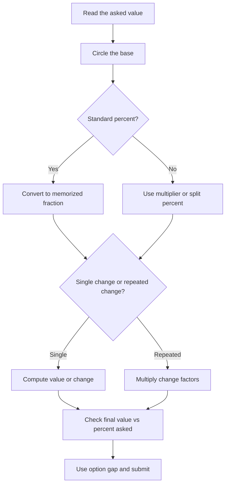

## Concept Ladder

Percentages are the central arithmetic language of SSC CGL Quant. Profit-loss, discount, simple interest, compound interest, data interpretation, population change, election questions, mixture change, and comparison questions all reduce to one question: what is the base? A 50/50 Quant attempt cannot treat percentage as a formula list. It must become a 36-second reflex.

The first rule is that percent means "per 100". So 17 percent is 17/100. That sounds simple, but SSC traps are built by hiding the base. If salary increases from 8000 to 10000, the increase is 2000 on the old base 8000, so increase percent is 25 percent. If the question asks by what percent 8000 is less than 10000, the base becomes 10000, so the answer is 20 percent. Same numbers, different base, different answer.

The second rule is to use fraction conversion before multiplication. In 36 seconds, writing 37.5/100 x 640 is slower than seeing 37.5 percent as 3/8 and writing 640 x 3/8 = 240. Memorized fractions are not optional for 50/50. They are the shortcut layer that lets you answer percentage, DI, and SI/CI questions without long arithmetic.

Core conversions:

| Percent | Fraction | Use |
|---|---:|---|
| 50 percent | 1/2 | Half, discount, vote share |
| 33.33 percent | 1/3 | One-third, pie chart |
| 66.67 percent | 2/3 | Two-third share |
| 25 percent | 1/4 | Quarter, discount, profit |
| 75 percent | 3/4 | Three-quarter completion |
| 20 percent | 1/5 | Successive change, DI |
| 40 percent | 2/5 | Vote and ratio |
| 60 percent | 3/5 | Share and selection |
| 12.5 percent | 1/8 | Discount and area |
| 37.5 percent | 3/8 | DI, mixture |
| 62.5 percent | 5/8 | DI, mixture |
| 16.67 percent | 1/6 | One-sixth share |
| 14.28 percent | 1/7 | Rare but useful |
| 11.11 percent | 1/9 | Repeated one-ninth |
| 9.09 percent | 1/11 | Less frequent but fast |

The third rule is successive change. If a value changes by a percent and then by b percent, total change is a + b + ab/100. Treat decrease as negative. A 20 percent rise followed by a 20 percent fall is 20 - 20 - 400/100 = -4 percent, not zero. This trap appears constantly in price, population, area, salary, and production questions.

The fourth rule is percentage points versus percent change. If literacy rises from 60 percent to 75 percent, the rise is 15 percentage points. The percent increase in literacy rate is 15/60 x 100 = 25 percent. SSC often uses both styles in answer options.

The fifth rule is compare by making a 100 model. If A is 25 percent more than B, take B = 100, A = 125. Then B is 25/125 x 100 = 20 percent less than A. If A is 20 percent less than B, take B = 100, A = 80; then B is 20/80 x 100 = 25 percent more than A. The inverse is not numerically same.

For the exam route, treat every percentage question as:

1. Mark old base, new base, or comparison base.
2. Convert percent to fraction or multiplier.
3. Compute only as much as the options require.
4. Check whether the answer asks final value, change value, or change percent.

### Corpus Pressure

The uploaded book-PYQ corpus currently marks `percentages` as a 200/200 high-yield Quant topic with 381 promoted questions. The largest tagged bucket is direct `Percentage`, followed by mixed arithmetic pages where percentage appears inside mensuration, ratio, DI, simple interest, profit-loss, and calculation-speed sets. That distribution matters: a percentage note is not complete if it only teaches "x percent of y". It must train base discipline across disguised applications.

For 50/50 Quant, use this priority order:

| Priority | Corpus signal | What must become automatic | Why it costs marks |
|---|---:|---|---|
| 1 | 255 direct percentage-tagged questions | Base, fraction conversion, increase/decrease, original value | These are the fastest marks if reflexive and the easiest silly losses if rushed |
| 2 | Mixed mensuration percentage questions | Area/volume multipliers after dimension change | Students add length and breadth changes instead of multiplying |
| 3 | Linked profit-loss and discount questions | CP base, MP base, SP output, successive discounts | The same percent is applied to the wrong price level |
| 4 | Linked DI questions | Share of total, percent change between rows, approximation | Exact arithmetic burns time when options are far apart |
| 5 | Linked SI/CI and population questions | Time-based multiplier and reverse percent | Final amount is mistaken for original base |

If you miss one direct percentage question, you lose either 2 marks for a blank or 2.5 marks for a wrong answer. If the mistake is a base habit, it will repeat in profit-loss, DI, SI/CI, ratio, averages, and mensuration. That is why percentage repair has to be treated as a Quant infrastructure repair, not as a single chapter revision.

## Type System

| Type | Recognition cue | 36-second method | Common trap |
|---|---|---|---|
| Direct percent of value | "x percent of y" | Convert x percent to fraction and multiply y | Multiplying by x instead of x/100 |
| Find percent | "a is what percent of b" | a/b x 100 | Reversing numerator and denominator |
| Increase/decrease percent | "from old to new" | Change/old x 100 | Using new as base |
| Less than/more than | "A is how much less than B" | Difference/base named after "than" | Using the smaller number always |
| Successive change | "increased by a then decreased by b" | a + b + ab/100 | Adding changes directly |
| Final value after change | "price after x percent" | Multiply by 1 +/- x/100 | Calculating only the change |
| Original value | "after increase/decrease value is..." | Final divided by multiplier | Subtracting percent from final |
| Population change | "growth rate for n years" | Successive multiplier | Applying simple percent every year |
| Area change | "length and breadth changed" | Apply changes separately | Treating area change as length change |
| Election/votes | "won by margin, invalid votes" | Start from valid votes | Taking total votes as base when valid is base |
| Exam marks | "x percent passed/failed" | Use total candidates as base | Mixing passed and failed bases |
| DI share | "sector has x percent of total" | Use fraction of total | Using angle instead of percent |
| Percentage points | "rate changed from p percent to q percent" | q - p points | Reporting percent change when points asked |

### Full Type Tree for 200/200

Use this tree after every mock result. A missed percentage question must be tagged into exactly one row. If you cannot tag it, you did not review it deeply enough.

| Type code | Question shape | Setup in first 8 seconds | Fast route | Red flag |
|---|---|---|---|---|
| P1 | x percent of y | Convert x to fraction or split | Fraction table, complement, or 1 percent unit | Multiplying by x instead of x/100 |
| P2 | a is what percent of b | Write a/b x 100 | Cancel before multiplying by 100 | Reversing a and b |
| P3 | from old to new | Change/old x 100 | Difference first, old base second | Using final value as denominator |
| P4 | A is more than B | Difference/B x 100 | Put B = 100 if relation is verbal | Answering inverse percent |
| P5 | A is less than B | Difference/B x 100 | Put B = 100, A below B | Using A as base because A appears first |
| P6 | B is what percent less than A after A is p percent more than B | Build 100 model | If A = 125 and B = 100, loss is 25/125 | Saying p percent again |
| P7 | successive increase/decrease | Write multipliers | Multiply factors; do not add | 20 up and 20 down called no change |
| P8 | original after increase | Final / increased multiplier | 5/4 final means original = final x 4/5 | Subtracting p percent of final |
| P9 | original after decrease | Final / remaining multiplier | 4/5 final means original = final x 5/4 | Adding p percent to final |
| P10 | percentage point | q - p | No denominator unless percent change asked | Treating points and percent as same |
| P11 | election/valid votes | Remove invalid first | Valid votes become base | Taking total votes as base |
| P12 | population/salary repeated year | Chain yearly multiplier | Use (1 +/- r/100)^n or step multipliers | Applying simple percent once |
| P13 | area after dimension changes | Separate dimension multipliers | Length factor x breadth factor | Adding length and breadth percent |
| P14 | volume after dimension changes | Multiply all dimension factors | l x b x h factors | Treating it like area |
| P15 | DI percent share | Total x share | Fraction of total and option gap | Reading chart angle as percent |
| P16 | DI percent change | Difference/base row x 100 | Base row is usually previous year or named row | Dividing by the larger value automatically |
| P17 | approximation | Estimate only to option gap | Round total and percent together | Exact arithmetic when options are wide |
| P18 | hidden percentage in ratio | Convert percent relation to ratio | p percent of means p:100 | Keeping percentages instead of ratio |

### Direct Percentage

When asked to find 18 percent of 450, avoid 18/100 x 450 if a faster split exists: 10 percent = 45, 5 percent = 22.5, 3 percent = 13.5, total = 81. For friendly percentages, fraction route wins. For unfriendly percentages, split around 10 percent or 1 percent.

### Percentage Change

Formula: change percent = change/original x 100. The word "original" is non-negotiable. If a value moves from 72 to 90, change is 18 and base is 72. 18/72 = 1/4 = 25 percent. If asked how much 72 is less than 90, base is 90, so 18/90 = 20 percent.

### Successive Change

Use multipliers for safety. 20 percent increase means x 1.2. 25 percent decrease means x 0.75. Combined multiplier = 1.2 x 0.75 = 0.9, so net 10 percent decrease. This method is safer than formula when there are three or more changes.

### Original Value

If a value after 20 percent increase is 600, original = 600/1.2 = 500. If after 20 percent decrease it is 600, original = 600/0.8 = 750. The trap is subtracting 20 percent of 600; that is using the final value as base.

### Area Change

If length increases by 20 percent and breadth decreases by 10 percent, area multiplier = 1.2 x 0.9 = 1.08, so area increases by 8 percent. Do not average the two changes.

## Speed Methods

**Method 1: 100-value model**  
Use when relation is worded as more than or less than. Example: A is 25 percent more than B. Let B = 100 and A = 125. Now every inverse comparison becomes visible. This avoids algebra.

**Method 2: Multiplier method**  
Use for final value, original value, successive changes, population, and price. Increase by p percent means multiply by (100 + p)/100. Decrease by p percent means multiply by (100 - p)/100.

**Method 3: Fraction table method**  
Use when percent is standard. 12.5 percent of 896 = 1/8 of 896 = 112. 37.5 percent of 960 = 3/8 of 960 = 360. This is the fastest SSC route.

**Method 4: Difference-base method**  
For "A is what percent more/less than B", write difference first, then circle the base. In "more than B", base is B. In "less than B", base is B. In "A is less than B", B is base.

**Method 5: Option-gap approximation**  
In DI, if options are 410, 520, 630, 740 and the calculation is 24.8 percent of 2090, use 25 percent of 2080 = 520. Stop. Exact arithmetic wastes time.

**Method 6: Complement method**  
For 87.5 percent, use 100 percent - 12.5 percent. 87.5 percent of 720 = 720 - 90 = 630. For 83.33 percent, use 5/6. For 91.67 percent, use 11/12 if clean.

**Method 7: Percent to ratio method**  
If A is 40 percent of B, then A:B = 40:100 = 2:5. If A is 60 percent more than B, then A:B = 160:100 = 8:5. This links percentages to ratio questions.

**Method 8: Reverse percentage ladder**  
If final after 25 percent increase is 750, original = 750 x 4/5 = 600. If final after 37.5 percent decrease is 500, remaining is 62.5 percent = 5/8, original = 500 x 8/5 = 800.

### 36-second attempt plan

Percentages must run on a clock. Do not merely solve; decide how much calculation the question deserves.

| Time | Action | If not done |
|---:|---|---|
| 0-5 sec | Identify whether the question asks value, percent, change, original, or comparison | Mark and move if wording is unclear |
| 5-10 sec | Circle the denominator base: original, compared value, valid votes, total, previous year | If base is not clear, do not calculate |
| 10-18 sec | Choose fraction, multiplier, 100-model, or approximation | If method is unclear, convert to 100-model |
| 18-30 sec | Calculate only to option precision | If arithmetic is growing, use options |
| 30-36 sec | Check base and answer form | Submit or mark for return |

The 36-second target does not mean every percentage question must finish in 36 seconds. It means your average Quant speed survives the section. Direct percentage and base-change questions should finish in 20-30 seconds. Multi-step DI or mensuration percentage questions may take 45-55 seconds, but only if you saved time on direct ones.

### Speed Sheet A: Fraction Recall

Write this table until recall is instant. The useful range for SSC is not only 1/2 to 1/10; it includes eighths, twelfths, and common compound fractions.

| Fraction | Percent | Mental anchor | Typical SSC use |
|---:|---:|---|---|
| 1/2 | 50 | Half | votes, discount, pie chart |
| 1/3 | 33.33 | One of three equal parts | DI share, ratio conversion |
| 2/3 | 66.67 | Two of three equal parts | completion, majority |
| 1/4 | 25 | Quarter | profit, discount, SI |
| 3/4 | 75 | Three quarters | completion, attendance |
| 1/5 | 20 | One of five | successive change |
| 2/5 | 40 | Two of five | ratio and election |
| 3/5 | 60 | Three of five | selection and valid votes |
| 4/5 | 80 | Remaining after 20 percent loss | reverse decrease |
| 1/6 | 16.67 | One of six | average and DI |
| 5/6 | 83.33 | 100 minus 16.67 | complement method |
| 1/8 | 12.5 | Half of quarter | discount, area |
| 3/8 | 37.5 | 1/4 + 1/8 | DI and mixed arithmetic |
| 5/8 | 62.5 | 1/2 + 1/8 | reverse decrease |
| 7/8 | 87.5 | 100 minus 12.5 | complement method |
| 1/9 | 11.11 | One of nine | rare share questions |
| 1/10 | 10 | Decimal shift | approximation |
| 1/11 | 9.09 | Repeating 09 | comparison and ratio |
| 1/12 | 8.33 | Half of 1/6 | time/year splits |

### Speed Sheet B: Multiplier Recall

For final-value questions, stop thinking in "increase by". Think in multipliers.

| Change | Multiplier | Reverse multiplier | Example reflex |
|---:|---:|---:|---|
| +10 percent | 11/10 | 10/11 | Final 550 means original 500 |
| +12.5 percent | 9/8 | 8/9 | Final 900 means original 800 |
| +20 percent | 6/5 | 5/6 | Final 720 means original 600 |
| +25 percent | 5/4 | 4/5 | Final 750 means original 600 |
| +33.33 percent | 4/3 | 3/4 | Final 800 means original 600 |
| +37.5 percent | 11/8 | 8/11 | Final 880 means original 640 |
| +50 percent | 3/2 | 2/3 | Final 900 means original 600 |
| -10 percent | 9/10 | 10/9 | Final 540 means original 600 |
| -12.5 percent | 7/8 | 8/7 | Final 700 means original 800 |
| -20 percent | 4/5 | 5/4 | Final 640 means original 800 |
| -25 percent | 3/4 | 4/3 | Final 600 means original 800 |
| -37.5 percent | 5/8 | 8/5 | Final 500 means original 800 |
| -50 percent | 1/2 | 2 | Final 400 means original 800 |

### Option Testing Rules

Option testing is not guessing. It is controlled reverse checking.

Use option testing when:

1. The question gives final value and asks original.
2. Options are clean and spread out.
3. The percent is awkward but the multiplier is clear.
4. Algebra would take longer than checking one or two options.

Example: After a 16.67 percent increase, the value becomes 840. Find original. Since 16.67 percent = 1/6, final = 7/6 original. Original = 840 x 6/7 = 720. If options include 720, stop. Do not write a full equation.

Do not use option testing when:

1. Options are very close.
2. The question asks percent change and all options are plausible.
3. Rounding can change the answer.
4. It is a DI question where total extraction is the real work.

### Skip-and-return rules

Skip a percentage question on first pass if any of these happen by 20 seconds:

- You cannot identify the base.
- You have more than two successive changes and no clean fractions.
- It is DI and the table/chart value extraction is messy.
- Options are close and arithmetic is not simplifying.
- The question combines percent with time, ratio, and profit-loss in one paragraph.

Returning later is not failure. In a 25-question Quant section, a 70-second percentage question can steal two easy questions. The 200/200 rule is: protect the section, then repair the hard question with leftover time.

## Trap Table

| Trap | Wrong instinct | Correct fix |
|---|---|---|
| Same numbers, different bases | Treat increase and less-than as same | Circle the denominator base |
| Successive rise and fall | Add percentages | Use multiplier or a + b + ab/100 |
| Final value given | Take percent of final | Divide by remaining/increased multiplier |
| Percentage points | Call it percent increase | Check whether the question says points |
| Profit-discount overlap | Use marked price as cost price | Identify CP, SP, MP separately |
| Invalid votes | Use total votes when valid asked | Remove invalid votes first |
| Area change | Add length and breadth changes | Multiply dimension multipliers |
| Population for n years | Use simple growth | Apply yearly multiplier |
| DI approximation | Calculate exact value always | Use option gap to decide precision |
| "A is less than B" | Use A as base | Base is B because A is compared to B |

### Error Autopsy Table

After every mock, do not write "silly mistake". Use this autopsy table.

| Error label | Symptom in your solution | Root cause | Repair rule |
|---|---|---|---|
| Base missing | You calculated before writing denominator | Reading too fast | Write `base = ___` before every percent equation for 20 drills |
| Inverse comparison | A more than B and B less than A got same percent | No 100 model | Force B = 100, then reverse |
| Final-as-original | Original value questions wrong | You used final as denominator | Convert final to remaining/increased fraction |
| Successive-addition | 20 up, 20 down answered zero | Linear thinking | Use multiplier only for 30 questions |
| Point-percent mix | Rate 60 to 75 answered 25 when points asked | Ignored wording | Underline "points" or "percent increase" |
| Area linearization | Dimension change question wrong | Added percentages | Multiply dimension factors |
| Valid-total miss | Election answer too high | Invalid votes not removed | Write total, invalid, valid before share |
| Over-calculation | Correct but took 70 seconds | No option-gap check | Estimate first, exact only if options close |
| Fraction recall miss | Used decimal long multiplication | Weak table recall | Daily fraction sheet until instant |
| Sign error | Decrease treated as increase | Multiplier sign not written | Use 1 + p/100 or 1 - p/100 explicitly |
| Rounding trap | Approximation picked adjacent option | Rounded too aggressively | Check option gap before rounding |
| Mixed-unit trap | Percent of rupees/time/marks confused | Units not tracked | Write unit beside each value |

### Repair Micro-Drills

Use these micro-drills after the error label is known.

| Drill | Duration | Rule | Pass condition |
|---|---:|---|---|
| Base lock drill | 8 minutes | Read 30 questions and write only the base, no solving | 28/30 correct bases |
| Fraction flash drill | 5 minutes | Convert 40 fractions/percents both ways | Under 5 seconds per conversion |
| Reverse percent drill | 10 minutes | 20 final-to-original questions | 18/20 correct under 35 seconds |
| Successive multiplier drill | 10 minutes | 20 two-step changes | No direct addition mistake |
| DI approximation drill | 10 minutes | 15 questions solved by option gap | No exact arithmetic unless options close |
| Area multiplier drill | 8 minutes | 15 dimension-change questions | Every solution uses factor x factor |
| Election base drill | 8 minutes | 15 valid/invalid vote questions | Valid total written before share |

## Flowchart

## Solved Examples

**Example 1: Direct Fraction Route**  
Find 37.5 percent of 640.  
Options: (a) 220 (b) 240 (c) 260 (d) 280  
**Solution**: 37.5 percent = 3/8. 640 x 3/8 = 80 x 3 = 240. **Answer: (b) 240**

**Example 2: Base Change**  
A number increases from 80 to 100. What is the percentage increase?  
Options: (a) 20 percent (b) 25 percent (c) 30 percent (d) 40 percent  
**Solution**: Change = 20. Base = old value 80. 20/80 x 100 = 25 percent. **Answer: (b) 25 percent**

**Example 3: Less Than Trap**  
80 is what percent less than 100?  
Options: (a) 20 percent (b) 25 percent (c) 30 percent (d) 40 percent  
**Solution**: Difference = 20. Base = 100 because 80 is compared with 100. 20/100 x 100 = 20 percent. **Answer: (a) 20 percent**

**Example 4: Successive Change**  
A price rises by 20 percent and then falls by 10 percent. Find the net change.  
Options: (a) 8 percent increase (b) 10 percent increase (c) 12 percent increase (d) 2 percent decrease  
**Solution**: Multiplier = 1.20 x 0.90 = 1.08. Net change is 8 percent increase. **Answer: (a) 8 percent increase**

**Example 5: Original Value After Increase**  
After a 25 percent increase, salary becomes Rs 7500. Find the original salary.  
Options: (a) Rs 5600 (b) Rs 6000 (c) Rs 6250 (d) Rs 6500  
**Solution**: After 25 percent increase, final is 5/4 of original. Original = 7500 x 4/5 = 6000. **Answer: (b) Rs 6000**

**Example 6: Original Value After Decrease**  
After a 20 percent decrease, a value is 640. Find original value.  
Options: (a) 700 (b) 760 (c) 800 (d) 840  
**Solution**: After 20 percent decrease, remaining is 80 percent = 4/5. Original = 640 x 5/4 = 800. **Answer: (c) 800**

**Example 7: Area Percentage Change**  
Length of a rectangle increases by 20 percent and breadth decreases by 10 percent. Find area change.  
Options: (a) 8 percent increase (b) 10 percent increase (c) 12 percent decrease (d) No change  
**Solution**: Area multiplier = 1.20 x 0.90 = 1.08. Area increases by 8 percent. **Answer: (a) 8 percent increase**

**Example 8: Election Base**  
In an election of 5000 votes, 10 percent votes are invalid. A gets 60 percent of valid votes. How many valid votes does A get?  
Options: (a) 2500 (b) 2700 (c) 3000 (d) 3200  
**Solution**: Invalid = 10 percent of 5000 = 500. Valid = 4500. A gets 60 percent of 4500 = 2700. **Answer: (b) 2700**

**Example 9: Percentage Points**  
Literacy rate rises from 60 percent to 75 percent. By how many percentage points did it rise?  
Options: (a) 15 (b) 20 (c) 25 (d) 35  
**Solution**: Percentage points = 75 - 60 = 15. **Answer: (a) 15**

**Example 10: Percent Increase in Rate**  
Literacy rate rises from 60 percent to 75 percent. What is the percent increase in the rate?  
Options: (a) 15 percent (b) 20 percent (c) 25 percent (d) 30 percent  
**Solution**: Change = 15. Base = old rate 60. 15/60 x 100 = 25 percent. **Answer: (c) 25 percent**

**Example 11: DI Approximation**  
Find the closest value of 24.9 percent of 2008.  
Options: (a) 400 (b) 500 (c) 600 (d) 700  
**Solution**: 24.9 percent is close to 25 percent and 2008 is close to 2000. 25 percent of 2000 = 500. **Answer: (b) 500**

**Example 12: Reverse Comparison**  
A is 25 percent more than B. B is what percent less than A?  
Options: (a) 20 percent (b) 25 percent (c) 30 percent (d) 33.33 percent  
**Solution**: Let B = 100. Then A = 125. Difference = 25. B is less than A by 25/125 x 100 = 20 percent. **Answer: (a) 20 percent**

### More Solved Type Examples

**Example 13: Final After Two Changes**  
A shopkeeper increases the price of an item by 25 percent and then gives a discount of 20 percent. What is the net effect?  
Options: (a) 5 percent increase (b) No change (c) 5 percent decrease (d) 10 percent increase  
**Solution**: Multiplier = 1.25 x 0.80 = 1.00. Net effect is no change. **Answer: (b) No change**

**Example 14: Three Successive Changes**  
A value increases by 10 percent, decreases by 20 percent, and then increases by 25 percent. Find the net change.  
Options: (a) 5 percent increase (b) 10 percent increase (c) 10 percent decrease (d) No change  
**Solution**: Multiplier = 1.10 x 0.80 x 1.25 = 1.10. Net change is 10 percent increase. **Answer: (b) 10 percent increase**

**Example 15: Election Valid Vote Base**  
In an election, 12 percent of 7500 votes are invalid. A candidate gets 55 percent of valid votes. How many votes did the candidate get?  
Options: (a) 3425 (b) 3630 (c) 4125 (d) 4500  
**Solution**: Invalid = 12 percent of 7500 = 900. Valid = 6600. Candidate gets 55 percent of 6600 = 50 percent + 5 percent = 3300 + 330 = 3630. **Answer: (b) 3630**

**Example 16: Population Reverse**  
The population of a town after a 20 percent increase is 48,000. What was the original population?  
Options: (a) 36,000 (b) 38,400 (c) 40,000 (d) 42,000  
**Solution**: After 20 percent increase, final = 6/5 original. Original = 48000 x 5/6 = 40000. **Answer: (c) 40,000**

**Example 17: Percentage Point Trap**  
The pass percentage in an exam increased from 72 percent to 81 percent. What is the increase in percentage points?  
Options: (a) 9 (b) 10 (c) 12.5 (d) 18  
**Solution**: Percentage points = 81 - 72 = 9. No denominator is needed. **Answer: (a) 9**

**Example 18: Percent Increase in Rate**  
The pass percentage increased from 72 percent to 81 percent. What is the percent increase in the pass rate?  
Options: (a) 9 percent (b) 10 percent (c) 12.5 percent (d) 18 percent  
**Solution**: Change = 9. Base = old rate 72. 9/72 x 100 = 12.5 percent. **Answer: (c) 12.5 percent**

**Example 19: Area Change**  
The length of a rectangle is increased by 25 percent and breadth is decreased by 20 percent. Find the area change.  
Options: (a) 5 percent increase (b) No change (c) 5 percent decrease (d) 10 percent decrease  
**Solution**: Area multiplier = 1.25 x 0.80 = 1.00. Area is unchanged. **Answer: (b) No change**

**Example 20: Volume Change**  
The length, breadth, and height of a cuboid are increased by 10 percent, 20 percent, and 25 percent respectively. Find the volume change.  
Options: (a) 50 percent increase (b) 55 percent increase (c) 65 percent increase (d) 75 percent increase  
**Solution**: Volume multiplier = 1.10 x 1.20 x 1.25 = 1.65. Volume increases by 65 percent. **Answer: (c) 65 percent increase**

**Example 21: Hidden Ratio**  
A is 40 percent of B and B is 75 percent of C. A is what percent of C?  
Options: (a) 25 percent (b) 30 percent (c) 35 percent (d) 40 percent  
**Solution**: A = 40 percent of B = 2/5 B. B = 75 percent of C = 3/4 C. Therefore A = 2/5 x 3/4 C = 3/10 C = 30 percent of C. **Answer: (b) 30 percent**

**Example 22: Option Gap Approximation**  
In a table, total production is 3984 units. Factory A produces 24.8 percent of the total. Find the closest production of A.  
Options: (a) 690 (b) 790 (c) 990 (d) 1190  
**Solution**: 24.8 percent is close to 25 percent. 25 percent of 3984 is close to 996. Exact calculation is not needed because 990 is clearly closest. **Answer: (c) 990**

**Example 23: Reverse Decrease**  
After a 37.5 percent decrease, a value is 750. Find the original value.  
Options: (a) 1000 (b) 1100 (c) 1200 (d) 1250  
**Solution**: After 37.5 percent decrease, remaining = 62.5 percent = 5/8. Original = 750 x 8/5 = 1200. **Answer: (c) 1200**

**Example 24: Comparison Chain**  
A is 20 percent more than B. C is 20 percent less than B. A is what percent more than C?  
Options: (a) 40 percent (b) 45 percent (c) 50 percent (d) 60 percent  
**Solution**: Let B = 100. A = 120 and C = 80. Difference between A and C = 40. Percent more than C = 40/80 x 100 = 50 percent. **Answer: (c) 50 percent**

**Example 25: Valid Base and Share**  
In a class, 30 percent are girls. If 20 percent of girls and 40 percent of boys passed, what percent of the class passed?  
Options: (a) 28 percent (b) 32 percent (c) 34 percent (d) 36 percent  
**Solution**: Take class = 100. Girls = 30, boys = 70. Passed girls = 20 percent of 30 = 6. Passed boys = 40 percent of 70 = 28. Total passed = 34. **Answer: (c) 34 percent**

## PYQ Mapping

Use this note with the route page `/exams/ssc-cgl/topics/percentages`. In the practice engine, filter reviewed questions by `quantitative-aptitude | percentages`. The 150+ question floor guarantees a usable drill pool, but the study method is to split attempts by type rather than solving all mixed questions at once.

Map each PYQ-style question to one of these buckets:

| Bucket | What to tag after attempt | Repair action |
|---|---|---|
| Base identification | Old, new, compared value, valid total | Redo with 100 model |
| Fraction conversion | Standard percent not recognized | Rewrite percent table 3 times |
| Successive change | Added changes directly | Solve with multiplier method |
| Original value | Used final as base | Convert final to fraction of original |
| DI percentage | Over-calculated | Mark option gap before arithmetic |
| Election/population | Wrong base after invalid/annual change | Write valid base or yearly multiplier |

For 200/200 practice, do not count a question as repaired until you can solve its type in under 36 seconds twice: once immediately and once after a day.

## 200/200 Drill

**Daily 20-minute percentage block**

1. 3 minutes: write the percent-fraction table from 1/2 through 1/12.
2. 5 minutes: solve 10 direct percentage questions under 30 seconds each.
3. 5 minutes: solve 8 base-change questions, forcing the denominator to be written.
4. 4 minutes: solve 5 successive-change questions by multiplier only.
5. 3 minutes: review errors and label them as base, conversion, arithmetic, or reading.

**36-second checkpoint**

Before submitting any percentage answer, ask:

- What is the base?
- Is the answer asking value, change, or percentage?
- Can the percent become a memorized fraction?
- Does the option gap allow approximation?
- Did I confuse percent with percentage points?

**Mastery standard**

You are ready for SSC CGL 50/50 Quant only when a mixed set of 25 Quant questions has no percentage error, no base confusion, and no percentage question taking over 45 seconds. Percentages are not one chapter; they are the calculation grammar for the entire Quant section.
<!-- SSC-FINAL-PRACTICE-QUEUE:START -->
## Final Practice Queue

1. Start one-by-one practice: [Percentages practice](/exams/ssc-cgl/practice/percentages). Finish every question in this topic bank, not just the samples in the note.
2. Move to timed sets: [SSC CGL tests](/exams/ssc-cgl/tests?topic=percentages). Use topic drills first, then section mocks once accuracy is stable.
3. Repair every miss immediately: record the error label, redo 20 mixed questions from the same topic, then retest after 24 hours.
4. 200/200 rule: do not mark this topic exam-ready until correct answers come within 36 seconds and wrong answers are explained without looking at the solution.

<!-- SSC-FINAL-PRACTICE-QUEUE:END -->
