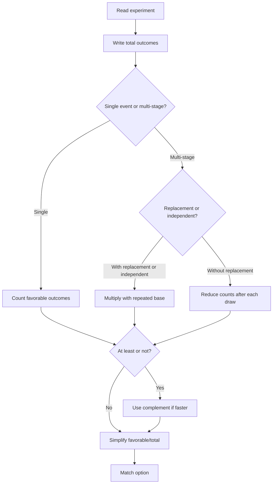

## Concept Ladder

Probability in SSC CGL Tier-I is usually a direct counting topic, not an advanced mathematics topic. The core formula is:

### Corpus Pressure

The uploaded book-PYQ corpus marks `probability` as a Quant coverage-gap topic with **64 promoted questions**. The dominant source block is `ssc-maths-6800-mcq-p0621-p0640`, which contributes **61 promoted questions**. The remaining questions are small spillovers from `Mensuration` and `ssc-maths-6800-mcq-p0021-p0040`, so the main training route is clearly dice, coins, cards, balls, replacement, complement, and range-counting probability.

| Corpus Source | Promoted Load | What It Trains |
|----------------|---------------|----------------|
| `ssc-maths-6800-mcq-p0621-p0640` | 61 promoted questions | Dice, coins, cards, balls, replacement, complement, exact/at-least wording, and sample-space discipline |
| `Mensuration` | 2 promoted questions | Mixed Quant transfer and ratio-style probability wording |
| `ssc-maths-6800-mcq-p0021-p0040` | 1 promoted question | Basic number-selection carryover |

For 50/50 in Quant, probability should be a banked mark. The formula is simple, but the 36-second pressure comes from denominator selection: ordered pair or combination, with replacement or without replacement, direct count or complement. Most one-draw questions should close under 20 seconds; card/coin/dice questions under 35 seconds; dependent draws under 50 seconds with no denominator error.

Probability = favorable outcomes / total outcomes.

The entire chapter is about counting the numerator and denominator correctly. The trap is not the formula; the trap is reading whether order matters, whether replacement happens, whether the draw is single or multiple, and whether the question asks "at least", "exactly", or "not".

The first rule is sample space. Total outcomes mean all equally likely outcomes under the experiment. For a fair die, total outcomes are 6. For two dice, total ordered outcomes are 36 because first die and second die are separate. For a coin tossed three times, total outcomes are 2 x 2 x 2 = 8. For a card drawn from a standard deck, total outcomes are 52.

The second rule is favorable outcomes. If the question asks probability of an even number on a die, favorable outcomes are 2, 4, 6, so 3 outcomes. Probability = 3/6 = 1/2. If the question asks a prime number on a die, favorable outcomes are 2, 3, 5, so probability = 3/6 = 1/2.

The third rule is complement. Probability of "not A" = 1 - probability of A. For at least one head in two coin tosses, it is faster to do 1 - probability of no head = 1 - 1/4 = 3/4. Complement is a 36-second method for at least one, none, not selected, no defective, no red, and not a face card.

The fourth rule is replacement. With replacement means the total resets after each draw. Without replacement means the total reduces. Drawing two red balls from a bag with 5 red and 3 blue without replacement gives 5/8 x 4/7. With replacement gives 5/8 x 5/8.

The fifth rule is order. If the sequence matters, count ordered outcomes. If only selection matters, count combinations. In most SSC Tier-I probability questions, ordered multiplication is enough because draws happen first, second, third. If the question says "two cards are selected together", order does not matter, so combinations are cleaner.

The sixth rule is mutually exclusive versus independent. Mutually exclusive events cannot happen together in one trial, such as getting 2 and 3 on one die. Independent events do not affect each other, such as tossing a coin and rolling a die. SSC mostly tests this through "or" and "and".

The seventh rule is "or" and "and". For mutually exclusive events, P(A or B) = P(A) + P(B). For independent events, P(A and B) = P(A) x P(B). If events overlap, subtract overlap in "or" questions.

For the exam route, probability should be solved like this:

1. Identify experiment: die, coins, cards, balls, numbers, selection.
2. Write total outcomes.
3. Write favorable outcomes.
4. Check replacement/order/complement.
5. Simplify fraction.

## Type System

| Type | Recognition cue | 36-second method | Common trap |
|---|---|---|---|
| Single die | "one die is thrown" | Favorable numbers out of 6 | Forgetting 1 is not prime |
| Two dice | "two dice are thrown" | Total 36 ordered pairs | Counting sums without pair count |
| Coin toss | "coin tossed n times" | Total 2^n | Treating HHT and HTH as same when order matters |
| Cards | "standard deck" | Total 52, suits 13 each | Face cards vs red cards vs honors |
| Balls single draw | "one ball is drawn" | Favorable color/total balls | Ignoring total balls |
| Balls multiple draw with replacement | "with replacement" | Denominator repeats | Reducing total after replacement |
| Balls multiple draw without replacement | "without replacement" | Denominator reduces | Keeping same denominator |
| At least one | "at least one" | Use complement none | Listing many cases slowly |
| Exactly one | "exactly one" | Count positions/cases | Confusing with at least one |
| Not event | "not red", "not prime" | Total - unfavorable | Counting desired event directly under pressure |
| Or event | "A or B" | Add if exclusive, subtract overlap if needed | Double-counting overlap |
| And event | "A and B" | Multiply independent stages | Adding probabilities |
| Selection from group | "selected together" | Use combinations if needed | Treating together as ordered |

### First 5-Second Classification

Use the stem object to choose the denominator before doing any arithmetic.

| First Cue | Frame to Use | Instant Rule |
|-----------|--------------|--------------|
| "one die" | Single die | Total = 6; primes are 2, 3, 5 |
| "two dice" | Ordered pair dice | Total = 36 unless stated otherwise |
| "coin tossed n times" | Coin sequence | Total = 2^n; order usually matters |
| "standard deck" | Card fact table | Total = 52; suits 13; red/black 26; face cards 12 |
| "with replacement" | Reset draw | Repeat the same denominator and favorable count if event repeats |
| "without replacement" | Dependent draw | Reduce total and affected favorable counts |
| "drawn together" | Combination/without replacement | Treat as simultaneous selection |
| "at least one" | Complement candidate | Usually solve as 1 - none |
| "exactly one" | Position/case count | Count the possible positions of the single success |
| "A or B" | Union | Add counts and subtract overlap if one outcome can satisfy both |
| "A and B" | Product/intersection | Multiply stages when independent; adjust if dependent |
| "number from 1 to n" | Integer range count | Count inclusive range, then favorable multiples/factors/primes |

### Dice

One die has outcomes {1,2,3,4,5,6}. Prime numbers are 2,3,5. Even numbers are 2,4,6. Numbers greater than 4 are 5,6. For two dice, total is 36. Sum questions require pair counts: sum 7 has 6 pairs; sum 8 has 5 pairs; doublet has 6 pairs.

### Coins

One coin has 2 outcomes. Two coins have 4 ordered outcomes: HH, HT, TH, TT. Three coins have 8 outcomes. For at least one head, use complement: 1 - all tails. For exactly one head in three tosses, favorable outcomes are HTT, THT, TTH = 3.

### Cards

A standard deck has 52 cards, 4 suits, 13 cards in each suit. Red cards are hearts and diamonds = 26. Black cards are spades and clubs = 26. Face cards are J, Q, K in each suit = 12. Aces are 4. Kings are 4. Red face cards are 6.

### Balls

For one draw, probability is direct favorable/total. For two draws, decide replacement. Without replacement, reduce both favorable count and total count after the first draw if the first draw affects the second event.

### Number Selection

For selecting a number from 1 to n, total outcomes are n unless exclusions are given. Favorable counts may be multiples, factors, primes, even, odd, or perfect squares. The fastest route is often counting by division: multiples of 3 up to 60 = floor(60/3) = 20.

## Speed Methods

**Method 1: Total first**  
Always write total outcomes before favorable outcomes. This avoids numerator-denominator reversal. For a die, total = 6. For two dice, total = 36. For a deck, total = 52.

**Method 2: Complement**  
Use when the question says at least one, not, none, no defective, no red, no head. Example: at least one head in three tosses = 1 - no head = 1 - 1/8 = 7/8.

**Method 3: Stage multiplication**  
Use for multiple draws or multiple independent actions. If events happen in stages and all are required, multiply stage probabilities. With replacement, denominators repeat; without replacement, denominators reduce.

**Method 4: Case counting**  
Use for exactly one, exactly two, and either-or questions. For exactly one head in three tosses, count positions of the head = 3, total = 8, probability = 3/8.

**Method 5: Pair table for dice sums**  
Memorize two-dice sum counts: 2->1, 3->2, 4->3, 5->4, 6->5, 7->6, 8->5, 9->4, 10->3, 11->2, 12->1. This turns dice sum questions into 5-second problems.

**Method 6: Card fact table**  
Memorize deck counts: total 52, red 26, black 26, each suit 13, aces 4, kings 4, queens 4, jacks 4, face cards 12, red face cards 6. Most SSC card probability questions are direct if these are automatic.

**Method 7: Fraction simplification**  
Simplify before comparing options. 12/52 = 3/13; 26/52 = 1/2; 4/52 = 1/13; 6/36 = 1/6.

**Method 8: Translate words**  
"At least one" means one or more. "At most one" means zero or one. "Exactly one" means one only. "Not" means complement. These words decide the method.

## Trap Table

| Trap | Wrong instinct | Correct fix |
|---|---|---|
| Two dice total | Use 12 as total | Use 36 ordered pairs |
| Prime on die | Count 1 as prime | Prime outcomes are 2,3,5 |
| Replacement | Reduce denominator with replacement | Denominator resets |
| Without replacement | Keep denominator same | Denominator reduces |
| At least one | Count all positive cases manually | Use complement none |
| Exactly one | Use complement | Count exact positions/cases |
| Face cards | Count aces as face cards | Face cards are J, Q, K only |
| Red king | Count all red face cards | Red kings are 2 |
| Or event overlap | Add directly | Subtract overlap if both can occur |
| Cards together | Treat as ordered draw | Use selection logic |
| Number range | Include 0 when range starts at 1 | Read range exactly |
| Probability value | Give favorable count | Divide by total and simplify |

## Flowchart

## Solved Examples

**Example 1: Single Die Even Number**  
A die is thrown once. Find the probability of getting an even number.  
Options: (a) 1/2 (b) 1/3 (c) 2/3 (d) 1/6  
**Solution**: Total outcomes = 6. Even outcomes = 2,4,6 = 3. Probability = 3/6 = 1/2. **Answer: (a) 1/2**

**Example 2: Prime on Die**  
A die is thrown once. Find the probability of getting a prime number.  
Options: (a) 1/6 (b) 1/3 (c) 1/2 (d) 2/3  
**Solution**: Prime outcomes are 2,3,5. Favorable = 3. Probability = 3/6 = 1/2. **Answer: (c) 1/2**

**Example 3: Two Dice Sum 7**  
Two dice are thrown. Find the probability that sum is 7.  
Options: (a) 1/6 (b) 1/9 (c) 1/12 (d) 1/18  
**Solution**: Total ordered pairs = 36. Sum 7 pairs are (1,6),(2,5),(3,4),(4,3),(5,2),(6,1), so 6. Probability = 6/36 = 1/6. **Answer: (a) 1/6**

**Example 4: Coin At Least One Head**  
Two coins are tossed. Find probability of at least one head.  
Options: (a) 1/4 (b) 1/2 (c) 3/4 (d) 1  
**Solution**: Use complement. Probability of no head = TT = 1/4. At least one head = 1 - 1/4 = 3/4. **Answer: (c) 3/4**

**Example 5: Exactly One Head**  
Three coins are tossed. Find probability of exactly one head.  
Options: (a) 1/8 (b) 3/8 (c) 1/2 (d) 5/8  
**Solution**: Total outcomes = 8. Exactly one head outcomes are HTT, THT, TTH = 3. Probability = 3/8. **Answer: (b) 3/8**

**Example 6: Card Red Card**  
One card is drawn from a standard deck. Find probability of a red card.  
Options: (a) 1/4 (b) 1/2 (c) 3/4 (d) 1/13  
**Solution**: Red cards = 26 out of 52. Probability = 26/52 = 1/2. **Answer: (b) 1/2**

**Example 7: Card Face Card**  
One card is drawn from a standard deck. Find probability of a face card.  
Options: (a) 1/13 (b) 2/13 (c) 3/13 (d) 4/13  
**Solution**: Face cards are J, Q, K in 4 suits = 12. Probability = 12/52 = 3/13. **Answer: (c) 3/13**

**Example 8: Ball Without Replacement**  
A bag has 5 red and 3 blue balls. Two balls are drawn without replacement. Find probability both are red.  
Options: (a) 5/14 (b) 25/64 (c) 1/2 (d) 3/8  
**Solution**: First red probability = 5/8. Without replacement, second red probability = 4/7. Product = 20/56 = 5/14. **Answer: (a) 5/14**

**Example 9: Ball With Replacement**  
A bag has 5 red and 3 blue balls. Two balls are drawn with replacement. Find probability both are red.  
Options: (a) 5/14 (b) 25/64 (c) 1/2 (d) 3/8  
**Solution**: With replacement, total and favorable reset. Probability = 5/8 x 5/8 = 25/64. **Answer: (b) 25/64**

**Example 10: Not Event**  
A number is selected from 1 to 20. Find probability it is not divisible by 5.  
Options: (a) 1/5 (b) 2/5 (c) 3/5 (d) 4/5  
**Solution**: Multiples of 5 are 5,10,15,20 = 4. Not divisible by 5 = 20 - 4 = 16. Probability = 16/20 = 4/5. **Answer: (d) 4/5**

**Example 11: At Least One Defective**  
In a lot, probability an item is defective is 1/10. Two independent items are checked. Find probability of at least one defective.  
Options: (a) 1/100 (b) 9/100 (c) 19/100 (d) 81/100  
**Solution**: Use complement. Probability no defective in one item = 9/10. For two items = 9/10 x 9/10 = 81/100. At least one defective = 1 - 81/100 = 19/100. **Answer: (c) 19/100**

**Example 12: Or Event with Overlap**  
A number is selected from 1 to 30. Find probability it is divisible by 2 or 3.  
Options: (a) 1/2 (b) 2/3 (c) 7/10 (d) 11/15  
**Solution**: Multiples of 2 = 15. Multiples of 3 = 10. Multiples of both 2 and 3 means multiples of 6 = 5. Favorable = 15 + 10 - 5 = 20. Probability = 20/30 = 2/3. **Answer: (b) 2/3**

**Example 13: Card Ace or King**  
One card is drawn. Find probability of ace or king.  
Options: (a) 1/13 (b) 2/13 (c) 3/13 (d) 4/13  
**Solution**: Aces = 4 and kings = 4. No overlap in one card. Favorable = 8. Probability = 8/52 = 2/13. **Answer: (b) 2/13**

**Example 14: Queen or Heart**  
One card is drawn from a standard deck. Find the probability that it is a queen or a heart.  
Options: (a) 4/13 (b) 3/13 (c) 1/4 (d) 1/13  
**Solution**: Queens = 4. Hearts = 13. Queen of hearts is counted twice, so subtract 1. Favorable = 4 + 13 - 1 = 16. Probability = 16/52 = 4/13. **Answer: (a) 4/13**

**Example 15: Red Face Card**  
One card is drawn. Find the probability of getting a red face card.  
Options: (a) 3/26 (b) 3/13 (c) 1/13 (d) 1/2  
**Solution**: Face cards are J, Q, K. Red suits are hearts and diamonds, so red face cards = 3 x 2 = 6. Probability = 6/52 = 3/26. **Answer: (a) 3/26**

**Example 16: Sum Greater Than 8**  
Two dice are thrown. Find the probability that the sum is greater than 8.  
Options: (a) 5/18 (b) 1/3 (c) 7/18 (d) 1/6  
**Solution**: Sums greater than 8 are 9, 10, 11, 12. Counts are 4, 3, 2, 1. Favorable = 10. Probability = 10/36 = 5/18. **Answer: (a) 5/18**

**Example 17: At Most One Head**  
Three coins are tossed. Find the probability of getting at most one head.  
Options: (a) 1/2 (b) 3/8 (c) 5/8 (d) 7/8  
**Solution**: At most one head means zero head or exactly one head. Outcomes: TTT, HTT, THT, TTH = 4. Total = 8. Probability = 4/8 = 1/2. **Answer: (a) 1/2**

**Example 18: No Head Complement**  
Four coins are tossed. Find probability of at least one head.  
Options: (a) 1/16 (b) 7/16 (c) 15/16 (d) 1/2  
**Solution**: Use complement. No head means TTTT = 1 outcome out of 16. At least one head = 1 - 1/16 = 15/16. **Answer: (c) 15/16**

**Example 19: Two Cards Without Replacement**  
Two cards are drawn one after another without replacement. Find probability both are aces.  
Options: (a) 1/221 (b) 1/169 (c) 1/13 (d) 2/13  
**Solution**: First ace = 4/52. Second ace after one ace removed = 3/51. Product = 12/2652 = 1/221. **Answer: (a) 1/221**

**Example 20: Number Multiple of 4**  
A number is selected from 1 to 80. Find probability it is divisible by 4.  
Options: (a) 1/4 (b) 1/5 (c) 1/8 (d) 3/10  
**Solution**: Multiples of 4 up to 80 = floor(80/4) = 20. Total = 80. Probability = 20/80 = 1/4. **Answer: (a) 1/4**

**Example 21: Number Prime From 1 to 10**  
A number is selected from 1 to 10. Find probability it is prime.  
Options: (a) 2/5 (b) 1/2 (c) 3/10 (d) 1/5  
**Solution**: Primes from 1 to 10 are 2, 3, 5, 7. Favorable = 4, total = 10. Probability = 4/10 = 2/5. **Answer: (a) 2/5**

**Example 22: Odds in Favour**  
Odds in favour of an event are 3:5. Find the probability of the event.  
Options: (a) 3/5 (b) 5/8 (c) 3/8 (d) 2/5  
**Solution**: Odds in favour a:b means favorable:unfavorable = a:b, so probability = a/(a+b). Here probability = 3/(3+5) = 3/8. **Answer: (c) 3/8**

**Example 23: Independent Events**  
A coin is tossed and a die is thrown. Find probability of getting a head and an even number.  
Options: (a) 1/4 (b) 1/2 (c) 3/4 (d) 1/6  
**Solution**: Head probability = 1/2. Even number on die = 3/6 = 1/2. Independent events, so multiply: 1/2 x 1/2 = 1/4. **Answer: (a) 1/4**

**Example 24: Mixed Balls Exactly One Red**  
A bag has 4 red and 5 blue balls. Two balls are drawn without replacement. Find probability of exactly one red ball.  
Options: (a) 5/9 (b) 4/9 (c) 1/2 (d) 2/9  
**Solution**: Exactly one red can be red then blue or blue then red. Probability = (4/9 x 5/8) + (5/9 x 4/8) = 20/72 + 20/72 = 40/72 = 5/9. **Answer: (a) 5/9**

**Example 25: Drawn Together Combination**  
A box has 6 white and 4 black balls. Two balls are drawn together. Find probability both are white.  
Options: (a) 1/3 (b) 2/5 (c) 3/10 (d) 5/12  
**Solution**: Drawn together means without replacement. Probability both white = 6/10 x 5/9 = 30/90 = 1/3. **Answer: (a) 1/3**

## PYQ Mapping

Use this note with `/exams/ssc-cgl/topics/probability`. The current promoted corpus gives this topic **64 promoted questions**, dominated by `ssc-maths-6800-mcq-p0621-p0640`, which contributes **61 promoted questions**. Every reviewed question should be tagged after attempt by experiment type:

| Bucket | Tag | Repair |
|---|---|---|
| Die | die-total or dice-sum | Memorize one-die facts and two-dice sum counts |
| Coin | coin-exact or coin-at-least | Decide exact versus complement |
| Cards | deck-fact | Rewrite deck fact table |
| Balls | replacement-error | Mark with or without replacement |
| Number selection | counting-range | Count favorable by multiples/factors |
| Or/and | union-product | State add, subtract overlap, or multiply |

Probability is a scoring topic because the formula is simple. A miss usually means the stem was read too fast. Treat every mistake as a reading-category mistake first, arithmetic mistake second.

## 200/200 Drill

**Daily 18-minute probability block**

1. 3 minutes: write deck counts, die facts, and coin totals.
2. 4 minutes: solve 8 one-step probability questions under 25 seconds each.
3. 4 minutes: solve 6 dice/coin questions under 35 seconds each.
4. 4 minutes: solve 5 card/ball questions under 45 seconds each.
5. 3 minutes: redo every wrong question and tag replacement, complement, or total-outcome error.

**36-second checkpoint**

- What is the total sample space?
- Are all outcomes equally likely?
- Does order matter?
- Is replacement mentioned?
- Is the phrase at least, exactly, at most, or not?
- Can complement solve it faster?

**Mastery standard**

You are ready when single-draw probability questions take under 20 seconds, standard dice/coin/card questions take under 35 seconds, and without-replacement questions take under 50 seconds with no denominator mistakes. Probability should be a guaranteed mark source, not a skipped Quant subtopic.

## 36-Second Probability Decision Tree

Probability is a high-return topic because most SSC questions are not conceptually deep; they are reading traps. The first job is to identify the experiment correctly. The second job is to choose the fastest denominator. The third job is to stop simplifying once the option is uniquely matched.

### Step 1: Name The Experiment

| Stem signal | Experiment name | Denominator habit |
|---|---|---|
| One die | Single die | 6 |
| Two dice | Ordered pair dice | 36 unless stated otherwise |
| One coin | Single coin | 2 |
| Two or three coins | Coin sequence | 4 or 8 |
| One card | Deck draw | 52 |
| Balls from bag | Selection draw | Total balls, then reduce if no replacement |
| Number from 1 to n | Integer range | n unless range excludes endpoints |
| At least / not / at most | Complement candidate | Often faster as 1 - opposite |
| Or | Union | Add, then subtract overlap |
| And | Product/intersection | Multiply if independent; adjust if dependent |

Write the denominator mentally before counting favorable cases. Most wrong probability answers come from changing the denominator halfway through the question.

### Step 2: Replacement Discipline

The entire balls/cards lane depends on one phrase.

| Phrase | Meaning | Fast move |
|---|---|---|
| With replacement | Total resets after each draw | Multiply same denominator again |
| Without replacement | Total decreases after each draw | Reduce total and favorable count |
| Drawn simultaneously | Same as without replacement | Use combination thinking or sequential without replacement |
| One after another | Usually sequential | Check whether replacement is mentioned |
| At random | Equal chance, not automatically independent | Still inspect replacement |

Example: Bag has 4 red and 5 blue. Two balls are drawn. If replacement is not mentioned, SSC often expects without replacement when the wording says two balls are drawn together. If the question says one ball is drawn, replaced, and another is drawn, the denominator stays 9 both times.

### Step 3: Complement Triggers

Use complement when the direct count has more cases than the opposite:

| Asked phrase | Complement |
|---|---|
| At least one head | No head |
| At least one defective | No defective |
| Not divisible by 5 | Divisible by 5 |
| At most one success | Two or more successes, only if easier |
| No two selected are same type | At least two same type, only if easier |

Do not use complement automatically. Use it only when the opposite is one clean case or a smaller count.

### Dice Sum Mini-Table

Two-dice sum counts should be memorized:

| Sum | Count |
|---:|---:|
| 2 | 1 |
| 3 | 2 |
| 4 | 3 |
| 5 | 4 |
| 6 | 5 |
| 7 | 6 |
| 8 | 5 |
| 9 | 4 |
| 10 | 3 |
| 11 | 2 |
| 12 | 1 |

This table alone turns many dice questions into 10-second marks. If the question asks sum greater than 8, count 9, 10, 11, 12 as 4+3+2+1 = 10, so probability is 10/36 = 5/18.

### Card Facts That Must Be Instant

| Category | Count | Probability in one draw |
|---|---:|---:|
| Red cards | 26 | 1/2 |
| Black cards | 26 | 1/2 |
| One suit | 13 | 1/4 |
| Aces | 4 | 1/13 |
| Kings | 4 | 1/13 |
| Face cards | 12 | 3/13 |
| Number cards 2-10 | 36 | 9/13 |
| Red face cards | 6 | 3/26 |

If the stem says "queen or heart", remember overlap: queen count 4, hearts count 13, queen of hearts overlap 1, favorable = 4 + 13 - 1 = 16.

### Compound And Conditional Probability

The imported corpus contains a separate compound and conditional probability lane. Treat it as a decision about dependency, not as a new formula set.

| Stem signal | Type | 36-second move |
|---|---|---|
| "A and B are independent" | Compound independent event | Multiply P(A) and P(B) directly |
| "without replacement" | Compound dependent event | Reduce the denominator and affected favorable count after each draw |
| "given that" or hidden condition | Conditional probability | Restrict the sample space first, then count favorable cases inside it |
| defective items from machines | Weighted conditional mix | Multiply source share by defect rate, then add lanes |
| truth-teller / reported die face | Conditional reliability | Split into true-report and false-report cases before dividing |

The fast check is: can the first event change the second event's denominator? If no, multiply independent probabilities. If yes, rewrite the second probability after the first event has happened. For replacement questions, the denominator resets; for no-replacement questions, it shrinks. For interview-selection and machine-defect questions, the trap is usually mixing ordinary multiplication with weighted cases.

### 200/200 Trap Table

| Trap | Wrong move | Correct move |
|---|---|---|
| Two dice | Treat total as 12 | Total ordered outcomes are 36 |
| Cards or balls without replacement | Keep denominator same | Reduce total after each draw |
| "Or" with overlap | Add both counts directly | Subtract common cases |
| "At least" | Count many cases directly | Check complement first |
| Range 1 to 50 | Forget endpoints | Count inclusive range |
| Prime on die | Include 1 | Primes are 2, 3, 5 |
| Face card | Include ace | Face cards are J, Q, K only |
| Odds in favour | Read as probability directly | Odds in favour a:b means probability a/(a+b) |

### App Drill Order

1. Open `/exams/ssc-cgl/topics/probability`.
2. Solve 25 probability-tagged questions without looking at notes.
3. Sort mistakes into denominator, replacement, complement, overlap, or fact-memory.
4. Redo only the missed category until it is clean.
5. Put probability into a Quant 50/50 set and check whether it remains fast under mixed-topic pressure.

Probability should never be a guess lane. If a probability question is taking more than 50 seconds, the issue is usually not formula knowledge; it is that the experiment was not named clearly at the start.
<!-- SSC-FINAL-PRACTICE-QUEUE:START -->
## Final Practice Queue

1. Start one-by-one practice: [Probability practice](/exams/ssc-cgl/practice/probability). Finish every question in this topic bank, not just the samples in the note.
2. Move to timed sets: [SSC CGL tests](/exams/ssc-cgl/tests?topic=probability). Use topic drills first, then section mocks once accuracy is stable.
3. Repair every miss immediately: record the error label, redo 20 mixed questions from the same topic, then retest after 24 hours.
4. 200/200 rule: do not mark this topic exam-ready until correct answers come within 36 seconds and wrong answers are explained without looking at the solution.

<!-- SSC-FINAL-PRACTICE-QUEUE:END -->
