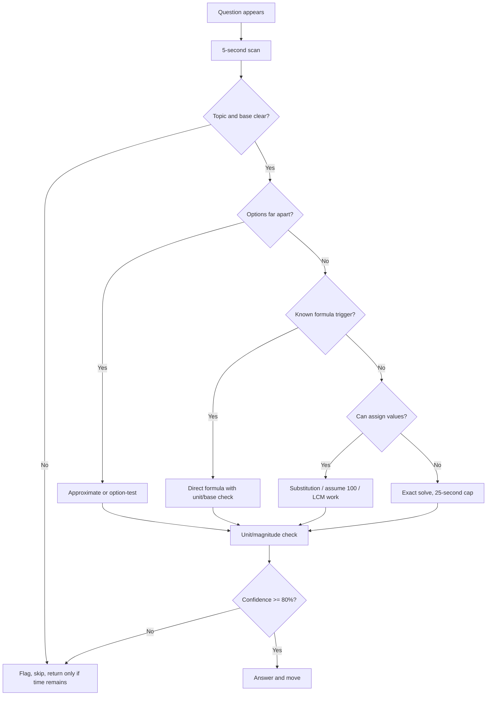
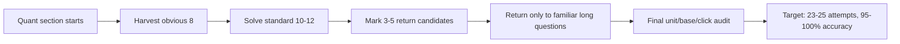

# Quant 50/50 36-Second System

This is the operating manual for the Quant section, not another formula list. The target is 25 questions, 50 marks, 15 minutes, and no avoidable negative marking. That gives 36 seconds per question on paper, but the real plan is uneven: harvest easy questions in 12-20 seconds, spend 35-45 seconds only on reliable high-value questions, and leave genuinely messy traps for a controlled return pass.

The uploaded book corpus now gives enough practice across every Quant topic. This note tells you how to use that corpus like a scoring machine.

## Section Doctrine

| Rule | Meaning | Why it matters |
|---|---|---|
| First pass must finish in 11-12 minutes | Attempt all instant and medium questions, skip long setups | You need a return window for 2-4 flagged questions |
| Every question gets a method decision before calculation | Formula, option test, approximation, substitution, or skip | Method choice saves more time than faster writing |
| Never start blind arithmetic | Scan options first | Option gaps tell you whether exact work is needed |
| Mark only two types for return | Long but familiar, or almost solved | Unknown traps do not deserve second-pass time |
| Stop a calculation at 25 seconds if no path is visible | Switch method or skip | One stubborn question can destroy the section |
| Wrong base is a bigger enemy than slow speed | CP vs SP, original vs changed, total work vs daily work | Most SSC Quant traps are base traps |

## 15-Minute Timing Model

| Phase | Time | Target | Action |
|---|---:|---:|---|
| Scan + first harvest | 0:00-4:00 | 7-9 questions | Direct formula, table recall, obvious option tests |
| Controlled solve | 4:00-10:30 | 10-13 questions | Arithmetic, algebra, geometry, DI with clean data |
| Return pass | 10:30-13:30 | 2-4 questions | Re-open only marked familiar problems |
| Final audit | 13:30-15:00 | 25 answer states | Check unattempted/wrongly clicked, no ego guesses |

Do not divide the section equally as 36 seconds x 25. That produces panic. Instead, aim for this distribution:

| Question class | Count | Time each | Total |
|---|---:|---:|---:|
| Instant recall | 6 | 10-15 sec | 1.5 min |
| Standard one-step | 8 | 20-30 sec | 3.5 min |
| Standard two-step | 7 | 35-45 sec | 5 min |
| DI/geometry/algebra longer | 3 | 50-70 sec | 3 min |
| Skip or final check buffer | 1 | variable | 2 min |

This is how 36 seconds average becomes realistic.

## First Five Seconds

Every Quant question starts with this exact five-second scan:

1. Identify topic: arithmetic, algebra, geometry, trigonometry, DI, or miscellaneous.
2. Identify base: original value, changed value, CP, SP, total work, total distance, or total population.
3. Scan options: close, far, integer, decimal, ratio, percentage, unit.
4. Choose method: formula, option test, approximation, substitution, or skip.
5. Write only the first useful number, not the full question.

If you cannot name the topic and base within five seconds, mark it and move. You can return with a calmer brain.

## Attempt Order By Topic

This order is not fixed by the paper; it is your internal priority when you scan questions.

| Priority | Topic types | First-pass policy |
|---:|---|---|
| 1 | Percentages, ratio, average, SI/CI basics, profit/loss direct | Attempt immediately if base is clear |
| 2 | Number system, simplification, algebra identities, trigonometric values | Attempt if formula/identity is visible |
| 3 | Time-work, pipes, time-speed-distance, mixture | Attempt if LCM/base setup is simple |
| 4 | Geometry/mensuration | Attempt if figure/formula is familiar and data is clean |
| 5 | DI | Attempt if table is short or options allow approximation |
| 6 | Long coordinate/probability/compound multi-condition | Mark for return unless it is a known template |

For 50/50, you do not need to love every topic equally. You need the ability to identify when a question is standard and punish it quickly.

## Formula Trigger Table

| Trigger phrase | Immediate setup | Common trap |
|---|---|---|
| "x% more than" | Base is the value after "than" | Taking increased value as base |
| "successive discount" | Net multiplier: `(100-d1)(100-d2)/100` | Adding discounts directly |
| "profit/loss %" | Profit and loss are on CP | Using SP as base |
| "marked price" | Discount is on MP | Mixing CP and MP |
| "average of groups" | Weighted average | Simple average of averages |
| "replaced by" in average | Net deviation | Recomputing full sum slowly |
| "A can do work in x days" | Total work = LCM | Adding days |
| "pipe fills/empties" | Filling positive, emptying negative | Treating emptying as positive |
| "downstream/upstream" | D = b+s, U = b-s | Forgetting still-water speed |
| "train crosses pole/platform" | Distance = train length or train+platform | Using only platform length |
| "CI - SI for 2 years" | `P(R/100)^2` | Full CI expansion |
| "mean proportional" | `sqrt(ab)` | Arithmetic mean |
| "third proportional" | if a:b = b:x, x=b^2/a | Confusing with fourth proportional |
| "similar triangles" | Side ratio squared for area | Using side ratio as area ratio |
| "sphere/cylinder/cone" | Volume/CSA/TSA formulas | Mixing curved and total surface area |
| "sin, cos at standard angles" | Use exact table | Decimal approximation too early |
| "a + 1/a" | Square/cube identity family | Solving for a unnecessarily |
| "remainder/unit digit" | Cyclicity/modular arithmetic | Long expansion |
| "bar graph/table" | Read labels and units first | Calculating from wrong axis |

## 36-Second Methods By Chapter

### Number System

Use divisibility, prime factorisation, cyclicity, and remainder logic. Never expand large powers.

| Type | Fast method | Time target |
|---|---|---:|
| Unit digit | Cycle of last digit | 5-8 sec |
| Remainder | Reduce base modulo divisor | 10-20 sec |
| LCM/HCF | Prime factor table | 20-35 sec |
| Divisibility | Rule filter, then option test | 10-25 sec |
| Surds/indices | Convert to prime powers | 20-40 sec |

**Example:** Unit digit of `7^83`. Cycle: 7, 9, 3, 1. `83 mod 4 = 3`, so unit digit is 3. This is a 7-second question.

**Trap:** If exponent is exactly divisible by cycle length, use the last item in the cycle, not the first.

Practice route: `/exams/ssc-cgl/topics/number-system`

### Percentages, Ratio, and Proportion

Use 100 as base unless the question gives a better total. Convert standard percentages to fractions.

| Percent | Fraction | Use |
|---:|---:|---|
| 6.25% | 1/16 | CI, discount, population |
| 8.33% | 1/12 | increase/decrease |
| 12.5% | 1/8 | salary, price, DI |
| 16.66% | 1/6 | average, ratio |
| 20% | 1/5 | profit/loss |
| 25% | 1/4 | discount |
| 33.33% | 1/3 | ratio, DI |
| 37.5% | 3/8 | mixed percentage |
| 62.5% | 5/8 | DI |
| 66.66% | 2/3 | ratio |
| 75% | 3/4 | population |

**Example:** A is 25% more than B. B is what percent less than A?  
Take B = 100, A = 125. Difference = 25. Percent less from A = `25/125 = 20%`.  
This is a base trap. Do not answer 25%.

Practice route: `/exams/ssc-cgl/topics/ratio-proportion`

### Profit, Loss, and Discount

The fastest setup is usually CP = 100, unless SP or MP is given.

| Situation | Base | Formula |
|---|---|---|
| Profit/loss | CP | `SP = CP x (100 +/- p)/100` |
| Discount | MP | `SP = MP x (100 - d)/100` |
| Successive discounts | MP | multiply discount factors |
| False weight | Actual received vs paid quantity | profit percent from quantity gap |

**Example:** A shopkeeper gives 20% discount and still gains 25%. Find MP if CP is 800.  
SP = 800 x 1.25 = 1000. Discount 20% means SP = 80% of MP. MP = 1000 / 0.8 = 1250.

**36-second decision:** If CP and gain are given, get SP first. If discount is also given, connect SP to MP.

Practice route: `/exams/ssc-cgl/topics/profit-loss-discount`

### Average, Mixture, and Alligation

Do not add averages blindly. Use deviation or weighted mean.

| Type | Fast method |
|---|---|
| Replacement average | Net deviation divided by count |
| Combined average | Weighted average |
| New member joins | New value = old average + total deviation |
| Mixture price | Alligation cross-difference |
| Repeated replacement | Remaining fraction method |

**Example:** Average of 30 students is 45. A student of 60 joins. New average?  
Deviation = 60 - 45 = 15. Distributed over 31 students: `15/31`. New average = `45 + 15/31`.  
If options are decimals, approximate `45.48`.

**Trap:** When someone leaves, divide deviation by the new count, not the old count.

Practice route: `/exams/ssc-cgl/topics/averages-mixtures-alligation`

### Time and Work / Pipes

Every work question should become total work and efficiency.

| Cue | Setup |
|---|---|
| A in 12 days, B in 18 days | Total work = LCM 36; A=3/day, B=2/day |
| A is twice as efficient as B | Efficiency ratio 2:1, time ratio 1:2 |
| Pipe fills and leak empties | Fill positive, leak negative |
| Wages divided by work | Wages proportional to efficiency x days |

**Example:** A completes work in 15 days, B in 20 days. Together?  
LCM = 60. A = 4, B = 3, total = 7. Days = `60/7 = 8 4/7`.

**Skip rule:** If the work question contains three workers, alternating days, and a partial completion clause, mark it for return unless the pattern is immediately familiar.

Practice route: `/exams/ssc-cgl/topics/time-work-pipes`

### Time, Speed, and Distance

Use relative speed and unit consistency. Convert km/h to m/s only when distance is in metres and time in seconds.

| Type | Fast method |
|---|---|
| Average speed equal distances | `2xy/(x+y)` |
| Train crosses pole | train length / speed |
| Train crosses platform | train + platform length |
| Opposite direction | speeds add |
| Same direction | speeds subtract |
| Boat stream | downstream = boat + stream; upstream = boat - stream |

**Example:** A train 180 m long crosses a platform 220 m long in 20 sec. Speed?  
Distance = 400 m. Speed = 20 m/s = `20 x 18/5 = 72 km/h`.

Practice route: `/exams/ssc-cgl/topics/time-speed-distance`

### Algebra

Most SSC algebra is identity recall, not full algebra.

| Cue | Formula |
|---|---|
| `a + b`, `ab` | `a^2 + b^2 = (a+b)^2 - 2ab` |
| `a - b`, `ab` | `a^2 + b^2 = (a-b)^2 + 2ab` |
| `x + 1/x` | square/cube identity family |
| quadratic roots | sum/product of roots |
| factorisation | split middle term |

**Example:** If `x + 1/x = 5`, find `x^2 + 1/x^2`.  
Square both sides: `x^2 + 2 + 1/x^2 = 25`, so answer = 23.

**Trap:** Do not solve for x unless the question asks x. Identity questions punish unnecessary solving.

Practice route: `/exams/ssc-cgl/topics/algebra`

### Geometry and Mensuration

Geometry is fast only when the diagram triggers a known theorem. If you have to discover the theorem from scratch, mark it for return.

| Figure/cue | Trigger |
|---|---|
| Circle with tangent | radius perpendicular to tangent |
| Chord and centre | perpendicular from centre bisects chord |
| Similar triangles | equal angles, parallel lines |
| Right triangle | Pythagoras, altitude-on-hypotenuse relations |
| Polygon interior angle | `(n-2)180` |
| Sector | angle/360 x circle formula |
| Cylinder/cone/sphere | identify CSA/TSA/volume first |

**Example:** Radius of sphere is 7 cm. Volume?  
`4/3 pi r^3 = 4/3 x 22/7 x 343 = 1437.33`. If options are fractional/mixed, match exact form.

**36-second rule:** Write formula before substituting numbers. Many mistakes come from mixing area and volume formulas.

Practice route: `/exams/ssc-cgl/topics/geometry-mensuration`

### Trigonometry

SSC trigonometry is mostly exact values and identities.

| Angle | sin | cos | tan |
|---:|---:|---:|---:|
| 0 | 0 | 1 | 0 |
| 30 | 1/2 | sqrt(3)/2 | 1/sqrt(3) |
| 45 | 1/sqrt(2) | 1/sqrt(2) | 1 |
| 60 | sqrt(3)/2 | 1/2 | sqrt(3) |
| 90 | 1 | 0 | undefined |

Core identities:
- `sin^2 x + cos^2 x = 1`
- `1 + tan^2 x = sec^2 x`
- `1 + cot^2 x = cosec^2 x`
- `tan x = sin x / cos x`
- `cot x = cos x / sin x`

**Example:** If `sin x = 3/5`, find `cos x` for acute x.  
Use 3-4-5 triangle. `cos x = 4/5`.

Practice route: `/exams/ssc-cgl/topics/trigonometry`

### Data Interpretation

DI is not hard if you read labels first. Most errors come before calculation.

DI scan order:
1. Title: what data is shown?
2. Units: rupees, thousands, percentage, number of people?
3. Axis/row labels: year, company, product?
4. Question keyword: total, average, ratio, percentage change?
5. Options: exact or approximate?

**Example:** If a table gives values in thousands and asks total number, multiply only at the end if options require it.

**Skip rule:** A DI set with dense table and close decimal options is second-pass material unless the arithmetic is obvious.

Practice route: `/exams/ssc-cgl/topics/data-interpretation`

## Error Prevention Checklist

Before clicking an answer, run this 3-second audit:

| Check | Question |
|---|---|
| Unit | Did the answer ask for percent, rupees, days, km/h, or ratio? |
| Base | Is percentage based on original/CP/MP/total? |
| Magnitude | Is the option too large or too small? |
| Sign | Profit/loss, upstream/downstream, filling/emptying correct? |
| Option | Did I click the option matching my computed value? |

This audit is what protects 50/50. You do not need long rechecking; you need the right micro-check.

## Topic Triage For 200/200

Use this weekly priority order:

| Tier | Topics | Why |
|---|---|---|
| A | Geometry/mensuration, number system, percentages, algebra | Highest repeated corpus density and high scoring value |
| B | Trigonometry, TSD, averages/mixtures, profit/loss, SI/CI | Frequent, formula-driven, speed improvable |
| C | Ratio, time-work, DI, probability, calculation speed | Smaller but dangerous if ignored |

Daily Quant block:
- 15 minutes: calculation-speed warm-up.
- 30 minutes: one Tier A topic drill.
- 20 minutes: one Tier B/C repair drill.
- 15 minutes: timed 25-question Quant section.
- 10 minutes: error log, not rereading.

## Drill Blocks

### Drill 1: 100-Base Reflex

Solve 20 questions taking base 100:
- A is 20% more than B.
- A is 25% less than B.
- Price increases 10% then decreases 10%.
- Salary increases 25% then becomes 5000.
- Population decreases 20% then increases 25%.

Goal: identify original base instantly.

### Drill 2: LCM Work Reflex

Solve 20 work questions using total work:
- Two workers.
- Three workers.
- One worker leaves.
- Pipe plus leak.
- Alternating days.

Goal: never add days directly.

### Drill 3: Geometry Formula Gate

For each geometry/mensuration question, write the formula name first:
- Circle tangent.
- Similar triangle.
- Cylinder CSA.
- Cone volume.
- Sphere surface area.
- Sector area.

Goal: stop mixing formula families.

### Drill 4: DI Label Reading

Before calculating, say aloud:
- "The unit is..."
- "The row is..."
- "The column is..."
- "The question asks..."

Goal: eliminate table-reading mistakes.

## PYQ-Linked Practice Queue

Use these routes in order:

1. `/exams/ssc-cgl/tests/ssc-cgl-quantitative-aptitude-speed-sprint`
2. `/exams/ssc-cgl/tests/ssc-cgl-topic-calculation-speed-36-second-drill`
3. `/exams/ssc-cgl/tests/ssc-cgl-topic-averages-mixtures-alligation-36-second-drill`
4. `/exams/ssc-cgl/topics/geometry-mensuration`
5. `/exams/ssc-cgl/topics/number-system`
6. `/exams/ssc-cgl/topics/percentages`
7. `/exams/ssc-cgl/topics/algebra`
8. `/exams/ssc-cgl/topics/data-interpretation`

For each topic route, do this:

| Pass | Rule |
|---|---|
| Pass 1 | Untimed, classify every question by type |
| Pass 2 | Timed at 45 seconds/question |
| Pass 3 | Timed at 36 seconds/question |
| Pass 4 | Only wrong/slow questions |

## 50/50 Score Protocol

After every Quant mock, classify errors:

| Error tag | Meaning | Repair |
|---|---|---|
| Concept miss | Did not know formula/type | Read topic note, solve 20 same-type questions |
| Base miss | Used wrong denominator/base | Write base sentence before solving next 20 |
| Arithmetic miss | Method right, calculation wrong | Calculation-speed drill |
| Time miss | Solved but too slow | Learn option test/approx method |
| Selection miss | Computed right, clicked wrong | Final 3-second audit |
| Ego miss | Guessed low-confidence | Add to skip discipline log |

The 200/200 candidate does not merely count wrong answers. They classify why each wrong answer happened and remove the cause.

## Final Section Flow

## Non-Negotiables

- Memorise squares 1-30, cubes 1-15, and fraction-percent table.
- Use option scanning before calculation.
- Use 100, LCM, or convenient substitution whenever possible.
- Flag at 25 seconds if no clean route is visible.
- Never guess because the section "should be attempted fully."
- Review every wrong question by error tag.
- Repeat the same topic until speed and accuracy both cross the target.

The Quant section becomes 50/50 when your first reaction is not "how do I calculate this?" but "which template is this, what is the base, and what is the fastest reliable route?"
