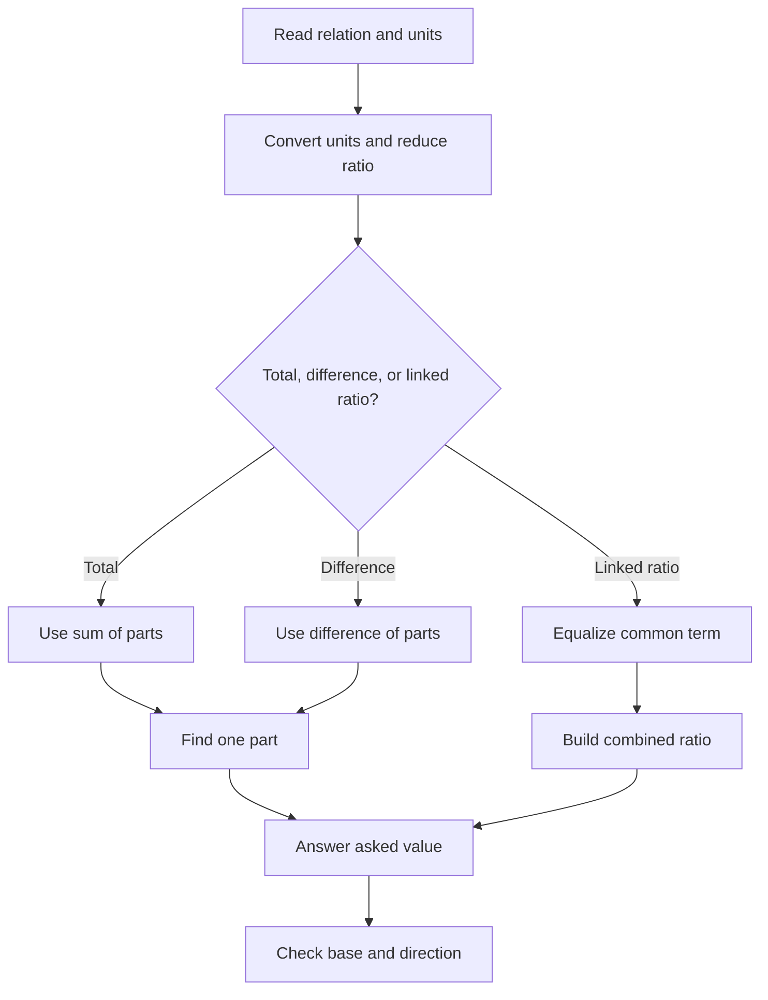

## Concept Ladder

Ratio and proportion are the fastest way to avoid long equations in SSC CGL Quant. A ratio is a comparison by division. If A:B = 3:5, A and B are not necessarily 3 and 5; they are 3x and 5x. That single multiplier x is the engine of ratio questions.

For 50/50 Quant, ratio must be connected to percentages, partnership, mixtures, time-speed-distance, work, ages, income-expenditure, and data interpretation. Many questions look different but ask the same thing: if parts are in a fixed relation, what multiplier converts relation to actual value?

### Corpus Pressure

The uploaded book-PYQ corpus marks `ratio-proportion` as a 50/50 Quant topic with 287 promoted questions. This is a connector chapter: it appears directly as ratio/proportion, and indirectly inside number system, partnership, mixture, ages, time-work, time-speed-distance, average, percentage, and DI questions. The 36-second target is not optional here; if the cue is clear, the solution should usually be a one-part line, an equalized common term, or a direct/inverse product.

| Corpus bucket | Promoted questions | What it usually tests | 36-second implication |
|---|---:|---|---|
| `ssc-maths-6800-mcq-p0301-p0320` | 124 promoted questions | Direct ratio, proportion, compound ratio, partnership, ages, unit conversion | Main practice block; classify before calculating |
| `Ratio and Proportion` | 77 promoted questions | Canonical ratio/proportion rows from the book corpus | Use this for daily accuracy and speed repair |
| `Number System` | 37 promoted questions | Ratio embedded in divisibility, fractions, HCF/LCM and value comparison | Convert relation to reduced parts immediately |
| `ssc-maths-6800-mcq-p0321-p0340` | 20 promoted questions | Continuation of ratio and adjacent arithmetic types | Watch mixed percentage and partnership traps |
| `ssc-maths-6800-mcq-p0021-p0040` | 13 promoted questions | Early arithmetic overlap and fraction-ratio conversions | Keep units and bases clean |
| Smaller mixed buckets | 16 promoted questions | Work, speed, geometry, DI, mixed arithmetic | Treat ratio as the compression tool inside another topic |

### First 5-Second Classification

| First cue in question | Bucket | First move |
|---|---|---|
| "A:B", "ratio of", "total is" | Simple parts | Sum of parts if total is given |
| "exceeds", "difference", "more than" | Difference parts | Difference of parts, not total parts |
| "a:b = c:d", "fourth proportional" | Proportion | Scale cleanly or cross multiply |
| "A:B and B:C" | Compound ratio | Equalize the common term before joining |
| "directly", "varies as" | Direct proportion | Same direction; multiply by same factor |
| "inversely", "same work", "same distance" | Inverse proportion | Product constant or reverse ratio |
| "capital", "months", "profit" | Partnership | Capital x time decides share |
| "age after/before", "mixture after adding" | Change equation | Write ax and bx, then apply actual change |

### Full Type Tree for 50/50

| Type code | Shape | Fast model | Fail trigger |
|---|---|---|---|
| RP-1 | Total given | One part = total / sum of parts | Dividing by difference |
| RP-2 | Difference given | One part = difference / difference of parts | Dividing by sum |
| RP-3 | One value given | One part = value / its ratio term | Calculating unnecessary totals |
| RP-4 | Unit ratio | Convert units before reducing | Comparing raw mixed units |
| RP-5 | Proportion | a:b = c:x or scale | Setting wrong order |
| RP-6 | Third/fourth/mean proportional | Know exact definition | Mixing mean with arithmetic average |
| RP-7 | Compound ratio | Equalize common term | Writing A:B:C directly |
| RP-8 | Direct proportion | Same direction | Using inverse because words feel complex |
| RP-9 | Inverse proportion | Product constant | Keeping both quantities same direction |
| RP-10 | Partnership | Capital x months | Comparing only money |
| RP-11 | Income-expenditure-saving | Separate three columns | Treating saving as income |
| RP-12 | Ages/mixture change | Actual values plus change | Adding years/litres to ratio terms |

The first rule is simplification. Always reduce a ratio by HCF before using it. 36:60 becomes 3:5. If units differ, convert units first. 2 hours : 45 minutes is 120:45 = 8:3, not 2:45.

The second rule is assign a common multiplier. If boys:girls = 5:4 and total is 72, total parts = 9. One part = 72/9 = 8. Boys = 5 x 8 = 40 and girls = 4 x 8 = 32. This route is faster than algebra.

The third rule is proportional scaling. If a:b = c:d, then ad = bc. But in SSC timing, cross-multiply only when the multiplier is not obvious. For 6:9 = x:30, first reduce 6:9 to 2:3. If 3 parts = 30, 2 parts = 20. So x = 20.

The fourth rule is compound ratio. If A:B = 2:3 and B:C = 4:5, make B equal. A:B = 8:12 and B:C = 12:15, so A:B:C = 8:12:15. This appears in salaries, ages, speeds, and distribution questions.

The fifth rule is inverse proportion. If work is constant, men and days are inversely proportional. If speed increases, time decreases. If price per kg increases with fixed money, quantity decreases. Direct proportion means both move same direction; inverse means one rises while other falls.

The sixth rule is partnership. Profit share is proportional to capital x time. If A invests 5000 for 12 months and B invests 8000 for 9 months, ratio = 5000 x 12 : 8000 x 9 = 60000:72000 = 5:6. Do not compare only capital.

The seventh rule is ratio change. If a ratio changes after adding/removing equal or different quantities, write actual values using the multiplier, then apply the change. Example: milk:water = 3:2. Add 10 litres water and ratio becomes 3:4. Let milk = 3x and water = 2x. After adding water, 3x/(2x+10) = 3/4. Solve x.

For the exam route, ratio questions should be handled like this:

1. Convert units.
2. Reduce ratio.
3. Decide direct or inverse.
4. Assign multiplier or equalize common term.
5. Use total, difference, or condition to find actual values.

## Type System

| Type | Recognition cue | 36-second method | Common trap |
|---|---|---|---|
| Simple ratio | "A:B = m:n, total/difference given" | Use parts and multiplier | Treat ratio terms as actual values |
| Ratio from values | "Find ratio of x and y" | Convert units, divide by HCF | Ignoring unit conversion |
| Proportion | "a:b = c:d" | Cross multiply or scale | Cross-multiplying when direct scaling is faster |
| Fourth proportional | "Find fourth proportional to a,b,c" | a:b = c:x | Using b:c = a:x |
| Third proportional | "Find third proportional to a,b" | a:b = b:x | Confusing with mean proportional |
| Mean proportional | "Mean proportional between a and b" | sqrt(ab) | Taking arithmetic mean |
| Compound ratio | Multiple ratios sharing terms | Equalize common term | Joining without matching common term |
| Direct proportion | Both quantities move same way | Multiply by same factor | Applying inverse rule |
| Inverse proportion | One quantity rises, other falls | Product constant | Applying direct rule |
| Partnership | Capital and time | Ratio = capital x months | Comparing only investment |
| Income-expenditure | Income ratio and saving/expenditure condition | Write actual income/expenditure | Mixing saving base |
| Mixture ratio | Two ingredients | Use part values or alligation | Reversing numerator and denominator |
| Ages ratio | Present/future/past ratio | Convert each age with time shift | Adding time to ratio terms only |

### Simple Ratio

If A:B = 7:5 and total is 96, total parts = 12. One part = 8. A = 56 and B = 40. If difference is 16, difference parts = 2, one part = 8. Same final values. The clue "total" uses sum of parts; clue "difference" uses difference of parts.

### Proportion

Proportion says two ratios are equal. In a:b = c:d, product of extremes equals product of means: ad = bc. SSC often asks missing value in a proportion. Prefer scaling when clean; use cross multiplication when not.

### Compound Ratio

For A:B = 3:4 and B:C = 6:7, equalize B. First ratio becomes 9:12, second becomes 12:14. So A:B:C = 9:12:14. The trap is writing 3:4:7 directly.

### Direct and Inverse

Direct: more price per item gives more total cost if quantity fixed. Inverse: more speed gives less time if distance fixed. In work questions, more workers means fewer days, so inverse. In production with same rate per machine, more machines means more output, so direct.

### Partnership

Investment x time decides profit share. If one partner invests later or withdraws early, months matter. If profit is shared equally despite different time, then capital must compensate inversely.

## Speed Methods

**Method 1: Parts method**  
Use for total and difference. If total is given, divide by sum of ratio parts. If difference is given, divide by difference of ratio parts. This solves most direct ratio questions.

**Method 2: Equal common term**  
Use for A:B and B:C or A:B and C:A. Multiply ratios so the common letter has same value, then combine.

**Method 3: Fraction to ratio**  
If A is 3/5 of B, A:B = 3:5. If A is 40 percent of B, A:B = 40:100 = 2:5. This prevents percentage-ratio confusion.

**Method 4: Ratio to percent**  
If A:B = 3:5, A is 3/5 of B = 60 percent of B. A is 3/(3+5) = 37.5 percent of total. Ask which base is used.

**Method 5: Inverse proportion product**  
For fixed work, men x days x hours x efficiency is constant. If workers double, days halve. Set only changing factors, not the whole story.

**Method 6: Partnership product**  
Write capital x months in one line. Cancel zeros immediately. Use the final ratio to split profit.

**Method 7: Change equation**  
For adding/removing quantity, write parts as ax and bx. Apply the change to actual parts, then match new ratio. This is safer than mental adjustment.

**Method 8: Option substitution**  
When a ratio word problem gives awkward algebra and options are simple, test the option by parts. This is useful in ages and mixture-ratio problems.

### SSC Route Library

**Route A: Total is given**  
If A:B:C = 2:3:5 and total is 200, total parts = 10 and one part = 20. The values are 40, 60, and 100. In a 36-second attempt, write only `10 parts = 200`, then one part. Do not expand into three equations.

**Route B: Difference is given**  
If A:B = 11:7 and A exceeds B by 48, difference parts = 4. One part = 12. A = 132 and B = 84. SSC frequently gives difference rather than total because it catches candidates who always divide by sum.

**Route C: One actual part is given**  
If A:B:C = 4:5:9 and B = 75, then 5 parts = 75, so one part = 15. A = 60 and C = 135. This is faster than adding all parts when the total is not asked.

**Route D: Ratio after increase**  
If A:B = 3:4 and A increases by 20 while B stays same, new ratio becomes 5:4. Let A = 3x and B = 4x. Then (3x + 20)/(4x) = 5/4. Cross multiply: 12x + 80 = 20x, so x = 10. Original A = 30 and B = 40.

**Route E: Ages with time shift**  
If present ages are in ratio 4:5 and after 6 years ratio is 5:6, write present ages as 4x and 5x. Then (4x + 6)/(5x + 6) = 5/6. This gives 24x + 36 = 25x + 30, so x = 6. Present ages are 24 and 30. The time shift is added to actual ages, not to the ratio 4 and 5.

**Route F: Income, expenditure, saving**  
If income ratio is 7:8 and expenditure ratio is 5:6, write income as 7x and 8x, expenditure as 5y and 6y. Saving is income minus expenditure. If equal saving is given, set 7x - 5y = 8x - 6y. If saving ratio is given, make a second ratio equation. Keep three columns: income, expenditure, saving.

**Route G: Compound ratio with two common terms**  
If A:B = 2:3, B:C = 4:5, and C:D = 6:7, combine step by step. A:B becomes 8:12 to match B in B:C as 12:15. Now C is 15, but C:D is 6:7. Equalize C by multiplying A:B:C by 2 to get 16:24:30 and C:D by 5 to get 30:35. Final A:B:C:D = 16:24:30:35.

**Route H: Duplicate-looking options**  
If options include 3:2 and 2:3, read the asked order again. Boys:girls differs from girls:boys. Profit:loss differs from loss:profit. Cost:quantity differs from quantity:cost. The fastest fix is to underline the order in the final question before looking at options.

**Route I: Fractional ratios**  
If A:B = 1/2 : 1/3, multiply both terms by LCM 6 to get 3:2. If A:B:C = 1/2 : 1/3 : 1/4, multiply by 12 to get 6:4:3. Never compare denominators directly.

**Route J: Ratio and percentage bridge**  
If A:B = 7:5, then A is 7/5 of B = 140 percent of B, so A is 40 percent more than B. B is 5/7 of A, so B is 2/7 less than A = 28.57 percent less than A. SSC uses this bridge in both Quant and DI.

**Route K: Ratio and average bridge**  
If two groups have sizes in ratio 2:3 and averages 40 and 50, combined average = (2 x 40 + 3 x 50)/(2 + 3) = 230/5 = 46. The group-size ratio is the weight. Do not average 40 and 50 unless group sizes are equal.

**Route L: Ratio and speed bridge**  
For same distance, speed ratio is inverse of time ratio. If speeds are 3:4, times are 4:3. If times are 5:6, speeds are 6:5. This bridge saves time in train, race, and average-speed questions.

## Trap Table

| Trap | Wrong instinct | Correct fix |
|---|---|---|
| Units differ | Compare raw numbers | Convert first |
| Total vs difference | Divide by sum every time | Use sum for total, difference for difference |
| A is 40 percent of B | Say A:B = 5:2 | Convert 40:100 = 2:5 |
| A is 40 percent more than B | Say A:B = 2:5 | Convert 140:100 = 7:5 |
| Compound ratio | Join ratios directly | Equalize common term |
| Partnership | Compare only capital | Use capital x time |
| Inverse proportion | Multiply both directly | Keep product constant |
| Ages ratio | Add years to ratio parts only | Convert to actual ages ax, bx |
| Mixture addition | Add to ratio term | Add to actual quantity |
| Saving relation | Use income as saving | Define income, expense, saving separately |

## Flowchart

## Solved Examples

**Example 1: Total Parts**  
A:B = 5:7 and A + B = 96. Find A.  
Options: (a) 35 (b) 40 (c) 45 (d) 56  
**Solution**: Total parts = 12. One part = 96/12 = 8. A = 5 x 8 = 40. **Answer: (b) 40**

**Example 2: Difference Parts**  
A:B = 9:5 and A - B = 32. Find B.  
Options: (a) 32 (b) 36 (c) 40 (d) 45  
**Solution**: Difference parts = 4. One part = 32/4 = 8. B = 5 x 8 = 40. **Answer: (c) 40**

**Example 3: Unit Conversion**  
Find the ratio of 2 hours to 45 minutes.  
Options: (a) 2:45 (b) 4:3 (c) 8:3 (d) 3:8  
**Solution**: 2 hours = 120 minutes. Ratio = 120:45 = 8:3. **Answer: (c) 8:3**

**Example 4: Proportion**  
If 6:9 = x:30, find x.  
Options: (a) 15 (b) 18 (c) 20 (d) 24  
**Solution**: 6:9 = 2:3. If 3 parts = 30, 2 parts = 20. **Answer: (c) 20**

**Example 5: Fourth Proportional**  
Find the fourth proportional to 8, 12, and 10.  
Options: (a) 12 (b) 15 (c) 18 (d) 20  
**Solution**: 8:12 = 10:x. So 8x = 120 and x = 15. **Answer: (b) 15**

**Example 6: Mean Proportional**  
Find the mean proportional between 9 and 16.  
Options: (a) 10 (b) 11 (c) 12 (d) 13  
**Solution**: Mean proportional = sqrt(9 x 16) = sqrt(144) = 12. **Answer: (c) 12**

**Example 7: Compound Ratio**  
A:B = 2:3 and B:C = 4:5. Find A:B:C.  
Options: (a) 2:3:5 (b) 8:12:15 (c) 6:8:10 (d) 4:5:6  
**Solution**: Equalize B. First ratio x4 gives 8:12. Second ratio x3 gives 12:15. A:B:C = 8:12:15. **Answer: (b) 8:12:15**

**Example 8: Partnership**  
A invests Rs 5000 for 12 months and B invests Rs 8000 for 9 months. Find profit ratio.  
Options: (a) 5:6 (b) 6:5 (c) 25:36 (d) 12:9  
**Solution**: Profit ratio = 5000 x 12 : 8000 x 9 = 60000:72000 = 5:6. **Answer: (a) 5:6**

**Example 9: Direct Proportion**  
If 5 pens cost Rs 60, what is the cost of 8 pens?  
Options: (a) Rs 84 (b) Rs 90 (c) Rs 96 (d) Rs 100  
**Solution**: Cost per pen = 60/5 = 12. Cost for 8 pens = 96. **Answer: (c) Rs 96**

**Example 10: Inverse Proportion**  
12 men finish a work in 15 days. How many days will 18 men take at same efficiency?  
Options: (a) 8 (b) 10 (c) 12 (d) 18  
**Solution**: Men x days constant. 12 x 15 = 18 x d. d = 10. **Answer: (b) 10**

**Example 11: Ratio Change**  
Milk and water are in ratio 3:2. If 10 litres water is added, ratio becomes 3:4. Find initial milk.  
Options: (a) 10 litres (b) 15 litres (c) 20 litres (d) 30 litres  
**Solution**: Let milk = 3x and water = 2x. New ratio: 3x:(2x+10) = 3:4. So 12x = 6x + 30, x = 5. Milk = 15 litres. **Answer: (b) 15 litres**

**Example 12: Income and Saving**  
Income of A and B is 5:6. Their expenditure is 3:4. If each saves Rs 2000, find A's income.  
Options: (a) Rs 5000 (b) Rs 6000 (c) Rs 7000 (d) Rs 8000  
**Solution**: Let incomes be 5x and 6x; expenditures be 3y and 4y. Savings: 5x - 3y = 2000 and 6x - 4y = 2000. Subtract: x - y = 0, so x = y. Then 5x - 3x = 2000, x = 1000. A income = 5x = Rs 5000. **Answer: (a) Rs 5000**

**Example 13: Percentage to Ratio**  
A is 60 percent of B. Find A:B.  
Options: (a) 3:5 (b) 5:3 (c) 2:3 (d) 5:8  
**Solution**: A:B = 60:100 = 3:5. **Answer: (a) 3:5**

**Example 14: Ratio to Percentage More**  
A:B = 7:5. A is what percent more than B?  
Options: (a) 20 percent (b) 30 percent (c) 40 percent (d) 50 percent  
**Solution**: Difference = 2 parts on B's base of 5 parts. Percent more = 2/5 x 100 = 40 percent. **Answer: (c) 40 percent**

**Example 15: One Actual Value Given**  
A:B:C = 4:7:9 and B = 84. Find C.  
Options: (a) 96 (b) 100 (c) 108 (d) 112  
**Solution**: 7 parts = 84, so one part = 12. C = 9 x 12 = 108. **Answer: (c) 108**

**Example 16: Third Proportional**  
Find the third proportional to 6 and 18.  
Options: (a) 36 (b) 48 (c) 54 (d) 60  
**Solution**: Third proportional x means 6:18 = 18:x. So 6x = 324 and x = 54. **Answer: (c) 54**

**Example 17: Fractional Ratio**  
Simplify the ratio 1/2 : 1/3 : 1/4.  
Options: (a) 2:3:4 (b) 6:4:3 (c) 3:4:6 (d) 4:3:2  
**Solution**: LCM of denominators 2, 3, 4 is 12. Multiply each term by 12: 6:4:3. **Answer: (b) 6:4:3**

**Example 18: Compound Ratio with Three Links**  
A:B = 2:3, B:C = 4:5, and C:D = 6:7. Find A:B:C:D.  
Options: (a) 16:24:30:35 (b) 8:12:15:21 (c) 12:18:20:25 (d) 4:6:10:14  
**Solution**: Equalize B first: A:B = 8:12 and B:C = 12:15. Now equalize C with 6:7 by multiplying A:B:C by 2 to get 16:24:30, and C:D by 5 to get 30:35. Final = 16:24:30:35. **Answer: (a)**

**Example 19: Direct Proportion**  
If 8 machines make 240 items in a day, how many items will 11 machines make in a day at the same rate?  
Options: (a) 300 (b) 320 (c) 330 (d) 360  
**Solution**: More machines means more output. One machine makes 240/8 = 30 items. 11 machines make 330 items. **Answer: (c) 330**

**Example 20: Inverse Speed-Time Ratio**  
For the same distance, speeds of A and B are in ratio 5:6. Find the ratio of their times.  
Options: (a) 5:6 (b) 6:5 (c) 25:36 (d) 11:30  
**Solution**: For fixed distance, time is inverse of speed. Time ratio = 6:5. **Answer: (b) 6:5**

**Example 21: Partnership with Delayed Entry**  
A invests Rs 6000 for 12 months. B invests Rs 9000 for 8 months. Find their profit ratio.  
Options: (a) 1:1 (b) 2:3 (c) 3:4 (d) 4:3  
**Solution**: Profit ratio = 6000 x 12 : 9000 x 8 = 72000:72000 = 1:1. **Answer: (a) 1:1**

**Example 22: Equal Profit Partnership**  
A invests Rs 8000 for 9 months. B invests for 12 months. If profits are equal, how much did B invest?  
Options: (a) Rs 5000 (b) Rs 6000 (c) Rs 6500 (d) Rs 7000  
**Solution**: Equal profit means 8000 x 9 = B x 12. B = 72000/12 = Rs 6000. **Answer: (b) Rs 6000**

**Example 23: Ages Ratio**  
Present ages of A and B are in ratio 4:5. After 6 years, the ratio becomes 5:6. Find A's present age.  
Options: (a) 18 (b) 20 (c) 24 (d) 30  
**Solution**: Present ages are 4x and 5x. After 6 years: (4x + 6):(5x + 6) = 5:6. So 24x + 36 = 25x + 30, x = 6. A = 24. **Answer: (c) 24**

**Example 24: Mixture Ratio Change**  
Milk and water are in ratio 5:3. If 16 litres of water is added, the ratio becomes 5:5. Find the initial quantity of milk.  
Options: (a) 20 litres (b) 30 litres (c) 40 litres (d) 50 litres  
**Solution**: Milk = 5x, water = 3x. After adding water, 5x:(3x + 16) = 5:5 = 1:1. So 5x = 3x + 16, x = 8. Milk = 40 litres. **Answer: (c) 40 litres**

**Example 25: Income, Expenditure, Saving Ratio**  
Income of A and B is 7:8. Their expenditure is 5:6. If both save Rs 2000, find B's income.  
Options: (a) Rs 7000 (b) Rs 8000 (c) Rs 9000 (d) Rs 10000  
**Solution**: Let incomes be 7x and 8x, expenditures be 5y and 6y. Equal saving gives 7x - 5y = 2000 and 8x - 6y = 2000. Subtract: x - y = 0, so x = y. Then B's saving = 8x - 6x = 2x = 2000, so x = 1000. B income = 8x = Rs 8000. **Answer: (b) Rs 8000**

## PYQ Mapping

Use this note with `/exams/ssc-cgl/topics/ratio-proportion`. After every PYQ-style attempt, tag the question by method:

| Bucket | Tag | Repair |
|---|---|---|
| Simple parts | total-parts or difference-parts | Redo with one-part line |
| Proportion | scale or cross-multiply | Solve once by both methods |
| Compound ratio | common-term | Rewrite ratios with equal common term |
| Direct/inverse | direction-error | State whether both values move same way |
| Partnership | capital-time | Write investment x months |
| Ages/mixture | change-equation | Use ax, bx and apply change |

The question bank now gives deep enough route practice, but ratio mastery depends on classification. A wrong answer from ratio is usually not calculation; it is choosing sum instead of difference, direct instead of inverse, or capital instead of capital-time.

## 200/200 Drill

**Daily 25-question ratio block**

1. 5 simple total/difference ratio questions under 25 seconds each.
2. 5 proportion questions under 30 seconds each.
3. 5 compound ratio questions under 40 seconds each.
4. 5 direct/inverse proportion questions under 40 seconds each.
5. 5 partnership, ages, or mixture-change questions under 55 seconds each.

**36-second checkpoint**

- Are all units same?
- Is this total, difference, or linked ratio?
- Is the relation direct or inverse?
- Did I use actual values for addition/removal?
- In partnership, did I multiply capital by time?

**Mastery standard**

For SSC CGL 50/50, ratio and proportion should feel like a compression tool. If a problem can be converted into parts, it should not become a long equation. You are ready when mixed ratio questions average under 40 seconds with no unit-conversion mistakes.
<!-- SSC-FINAL-PRACTICE-QUEUE:START -->
## Final Practice Queue

1. Start one-by-one practice: [Ratio and Proportion practice](/exams/ssc-cgl/practice/ratio-proportion). Finish every question in this topic bank, not just the samples in the note.
2. Move to timed sets: [SSC CGL tests](/exams/ssc-cgl/tests?topic=ratio-proportion). Use topic drills first, then section mocks once accuracy is stable.
3. Repair every miss immediately: record the error label, redo 20 mixed questions from the same topic, then retest after 24 hours.
4. 200/200 rule: do not mark this topic exam-ready until correct answers come within 36 seconds and wrong answers are explained without looking at the solution.

<!-- SSC-FINAL-PRACTICE-QUEUE:END -->
