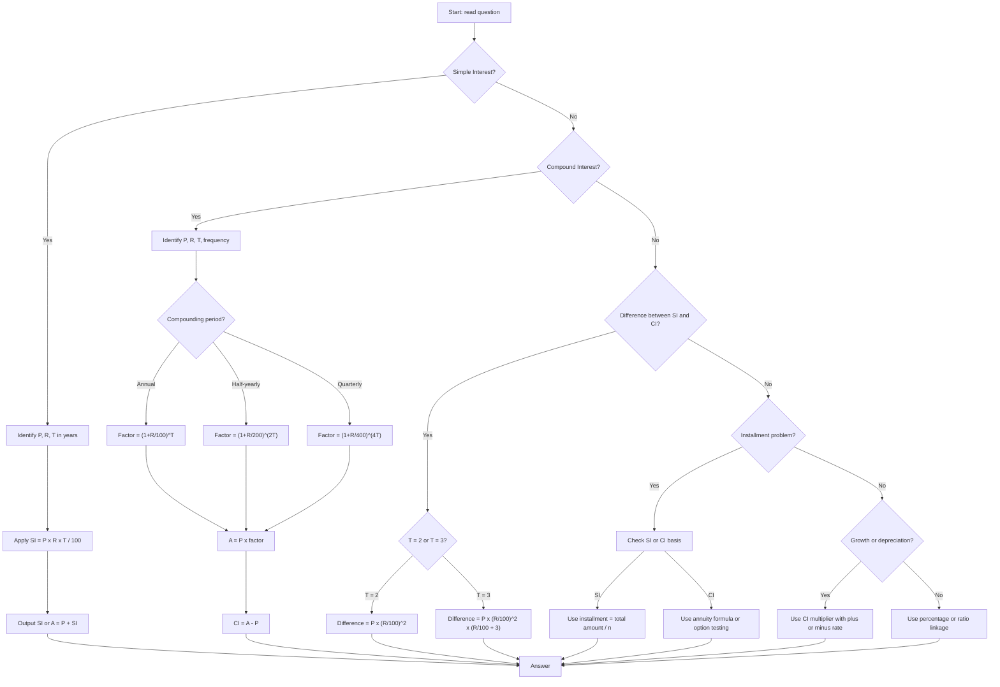

## Concept Ladder

**Step 1 - Definition of Interest**  
Interest is the cost of borrowing money. It is calculated on a principal (P) at a rate (R% per annum) for a time (T years).

### Corpus Pressure

The uploaded book-PYQ corpus marks `simple-compound-interest` as a 200/200 high-yield Quant topic with 363 promoted questions. The pressure is unusually concentrated: almost the entire topic comes from two dense book-PYQ page buckets, so this note must train fast formula selection, not broad theory.

| Corpus bucket | Promoted questions | What it usually tests | 36-second implication |
|---|---:|---|---|
| `ssc-maths-6800-mcq-p0541-p0560` | 184 promoted questions | SI direct, CI direct, difference between SI and CI, reverse principal/rate | Formula and multiplier choice must be instant |
| `ssc-maths-6800-mcq-p0561-p0580` | 177 promoted questions | Installments, effective rate, population growth, depreciation, mixed rates | Use option testing and skip rules aggressively |
| `ssc-maths-6800-mcq-p0301-p0320` | 1 promoted question | Percentage bridge | Repair with percentage multipliers |
| `Ratio and Proportion` | 1 promoted question | Ratio-rate linkage | Use proportion only after identifying interest model |

The target is not to memorise every possible finance formula. The target is to classify the problem in 5 seconds, choose SI/CI/difference/reverse/installment, and finish common cases in 20-30 seconds. For 50/50 Quant, direct SI, annual CI, 2-year difference, reverse principal, growth, and depreciation should be guaranteed marks.

### First 5-Second Classification

| First cue in question | Bucket | First move |
|---|---|---|
| "simple interest", "SI" | SI direct or reverse | Use SI = P x R x T / 100 |
| "compound interest", "amounts to" | CI amount or reverse | Build multiplier `(1+R/100)^T` |
| "difference between SI and CI" | Difference formula | Check whether T=2 or T=3 |
| "compounded half-yearly/quarterly" | Frequency adjustment | Divide rate and multiply periods |
| "population increases", "value depreciates" | Growth/depreciation | Use CI multiplier with plus or minus sign |
| "equal annual installment" | Installment | Prefer option testing unless numbers are clean |
| "doubles/trebles" | Time/rate relation | Decide SI linear or CI multiplier |

**Step 2 - Simple Interest (SI)**  
SI = (P x R x T)/100. The principal remains constant. Amount A = P + SI.

**Step 3 - Compound Interest (CI)**  
Interest is added to principal at each compounding period.  
Amount A = P(1 + R/100)^T.  
CI = A - P.  
For half-yearly: R/2, Tx2 -> A = P(1 + R/200)^(2T).  
For quarterly: R/4, Tx4 -> A = P(1 + R/400)^(4T).

**Step 4 - Difference Between SI and CI**  
For 2 years: Difference = P(R/100)^2.  
For 3 years: Difference = P(R/100)^2((R/100) + 3).

**Step 5 - Effective Rate for Two Years**  
Approx effective rate for CI over 2 years = 2R + R^2/100.  
For SI, effective rate = 2R exactly.

**Step 6 - Installments**  
Equal annual payment to clear a loan. For SI: use simple interest on reducing balance. For CI: use annuity formula or reverse calculation.  
Shortcut for CI: annual payment = (P x R/100) / (1 - (100/(100+R))^T).

**Step 7 - Link to Population/Depreciation**  
Growth: A = P(1 + r/100)^t. Depreciation: A = P(1 - r/100)^t. Same as CI formula.

**Step 8 - Reverse Questions**  
Given A, R, T, find P: P = A / (1 + R/100)^T.  
Given difference between SI and CI, find P or R.  
Given installments, find rate or time.

**Step 9 - 36-Second Attempt Plan**  
**36-second Quant scoring bar**: Classify: Direct formula (SI/CI) -> 15 sec. Difference of SI/CI -> formula recall -> 20 sec. Reverse (finding P) -> use multiplier or option test -> 25 sec. Installment -> if complex, skip after 30 sec or use approximate option elimination. Do not spend more than 45 sec on any question. Use option substitution for unknowns.

**Step 10 - Integration**  
Interest ties with percentages, ratio, and algebra. In SSC CGL, often mixed with profit-loss, growth, or data interpretation. Master the multiplier concept: for a 10% increase, multiply by 1.1; for 20% increase, 1.2; for two years compound, multiply by 1.21, etc.

## Type System

| Type | Recognition Cue | Method | Speed Target | Trap |
|------|-----------------|--------|--------------|------|
| SI direct | "simple interest", "SI", "principal 5000, rate 8%, time 3 years" | Formula: SI = PxRxT/100 | 12 sec | Forgetting time in years; converting months incorrectly |
| CI amount | "compound interest", "compounded annually", "sum amounts to" | A = P(1+R/100)^T | 15 sec | Using SI formula; missing compounding frequency |
| CI half-yearly | "compounded half-yearly", "six-monthly" | A = P(1+R/200)^(2T) | 18 sec | Forgetting to halve rate and double time |
| Difference SI-CI 2 years | "difference between SI and CI for 2 years" | Diff = P(R/100)^2 | 10 sec | Confusing with 3-year formula |
| Difference SI-CI 3 years | "difference for 3 years" | Diff = P(R/100)^2((R/100)+3) | 12 sec | Applying 2-year formula |
| Installment equal annual | "equal annual installment", "annual payment" | Use annuity formula or reverse using options | 30 sec | Treating as SI installments when CI mentioned |
| Principal reverse | "becomes", "amounts to", "find the sum" | P = A / (1+R/100)^T | 15 sec | Not checking compounding frequency |
| Rate reverse | "find rate", "at what rate per cent" | Use formula rearrangement; test options | 20 sec | Ignoring time factor |
| Time reverse | "in how many years" | Use log or multiplier matching | 25 sec | If log not allowed, approximate with multiplier table |
| Population growth | "population increases", "growth rate" | A = P(1+r/100)^t | 15 sec | Assuming linear growth instead of compound |
| Depreciation | "value depreciates", "machine loses value" | A = P(1 - r/100)^t | 15 sec | Using addition instead of subtraction |
| Money doubles | "doubles itself", "becomes twice" | Use rule of 72 or formula 2 = (1+R/100)^T | 20 sec | Applying SI logic to CI |
| Effective rate | "effective annual rate", "equivalent rate" | For half-yearly: (1+R/200)^2 - 1 | 20 sec | Confusing nominal rate with effective |
| Mixed rate | "first year at 5%, second at 6%" | Use successive percentage: multiply factors | 18 sec | Adding rates directly |

### Full Type Tree for 50/50

| Type code | Shape | Fast model | Fail trigger |
|---|---|---|---|
| INT-1 | Direct SI | SI = P x R x T / 100 | Time not converted to years |
| INT-2 | SI amount | A = P + SI | Answering interest when amount asked |
| INT-3 | Direct CI annual | A = P(1+R/100)^T | SI formula used |
| INT-4 | CI half-yearly/quarterly | Rate divided, periods multiplied | Frequency ignored |
| INT-5 | Difference SI-CI for 2 years | P(R/100)^2 | 3-year formula confused |
| INT-6 | Difference SI-CI for 3 years | P(R/100)^2(R/100 + 3) | Missing the +3 term |
| INT-7 | Reverse principal | P = A / multiplier | Multiplier inverted wrongly |
| INT-8 | Reverse rate | Test options or match multiplier | Algebra overdone |
| INT-9 | Reverse time | Match multiplier sequence | Spending too long on logs |
| INT-10 | Growth/population | P(1+r/100)^t | Linear increase used |
| INT-11 | Depreciation | P(1-r/100)^t | Minus sign forgotten |
| INT-12 | Effective rate | Successive percentage | Nominal rate used |
| INT-13 | Equal installments | Present value / option testing | Treating CI loan as simple division |
| INT-14 | Mixed yearly rates | Multiply year-wise factors | Rates added directly |

## Speed Methods

**Decision Rules**  
- If the question gives exact numbers and asks for SI or CI directly: use formula, no need for options.  
- If the question asks for principal or rate and has options: substitute each option quickly, do the reverse calculation.  
- If the difference between SI and CI for 2 years is asked: recall Diff = P(R/100)^2, compute mentally.  
- If the question is installment-based under CI and numbers are large: skip and return only if you have a clear method; else mark elimination.  
- For population growth: treat as CI; for depreciation: treat as CI with negative sign.

**Multiplier Table (for quick CI calculation)**  

| Rate% | 1 year | 2 years | 3 years |
|-------|--------|---------|---------|
| 5%    | 1.05   | 1.1025  | 1.157625 |
| 8%    | 1.08   | 1.1664  | 1.259712 |
| 10%   | 1.1    | 1.21    | 1.331   |
| 12%   | 1.12   | 1.2544  | 1.404928 |
| 15%   | 1.15   | 1.3225  | 1.520875 |
| 20%   | 1.2    | 1.44    | 1.728   |

Use for CI amount: multiply principal by the factor for (T years). For half-yearly: adjust rate and time.

**Step-by-Step Algorithm for SI**  
1. Identify P, R, T. Ensure T is in years (if months, divide by 12; if days, divide by 365 for SI but in SSC assume year = 365 days, but standard problems give years).  
2. Apply SI = PxRxT/100.  
3. Compute in two steps: (PxRxT)/100. Use cancellation (e.g., cancel factors of 100, cancel common factors).  
4. Add to P to get amount if needed.

**Step-by-Step Algorithm for CI**  
1. Identify P, R, T, compounding period.  
2. If annual: find multiplier factor = 1 + R/100. Raise to power T (use known squares/cubes, e.g., 1.1^2 = 1.21).  
3. Multiply P by factor.  
4. CI = amount - P.  
5. If half-yearly: rate/2, timex2, factor = 1 + R/200.  
6. For quarterly: rate/4, timex4.

**Approximation when numbers are tricky**  
- For R=6%, T=2: factor (1.06)^2 ~= 1.1236. If P=15000, amount~=16854, CI~=1854.  
- Use fraction equivalents: R=12.5% = 1/8 -> factor = 1+1/8=9/8. For 2 years: (9/8)^2=81/64. Multiply: Px81/64.  
- If options are far apart, approximate quickly.

**Option Testing for Principal Reverse under CI**  
Given A, R, T. Options are possible principals. Take each option, apply multiplier (1+R/100)^T, check if result matches A. Pick the one that matches.  
Example: A=1210, R=10%, T=2. Options: 1000, 1100, 1200, 1050. For 1000: 1000x1.21=1210 matches -> answer 1000.

**Skip-and-Return Guidelines**  
- If installment question with non-integer rates and more than 3 installments: skip, mark for review.  
- If time is given in improper fraction (5.5 years) and CI is asked: approximate or skip.  
- If question has multiple rates (different for each year) and no option test possible: skip unless clear successive multiplication.

## Trap Table

| Trap | Trigger Wording | Wrong Move | Correct Move | Repair Drill |
|------|-----------------|------------|--------------|--------------|
| Time unit confusion | "8 months", "146 days", "2 years 6 months" | Directly using given numbers in formula; not converting to years | Convert to years: months/12, days/365, and months+year as fraction | Practice conversion: 8 months = 2/3 year; 146 days = 146/365 = 0.4 year |
| CI annual vs half-yearly | "compounded half-yearly" | Forgetting to halve rate and double time | Apply R/2, 2T | Do 5 drills: e.g., 1000 at 10% half-yearly for 1 year => rate=5%, period=2 => factor=1.05^2=1.1025, amount=1102.5 |
| SI vs CI confusion | "interest on interest", "compound interest" | Using SI formula for compound problems | Recognize "compound", "compounded", "CI" | Remember keyword "CI" or "compounded" |
| Difference formula mix-up | "difference between SI and CI for 3 years" | Using 2-year formula | Use P(R/100)^2((R/100)+3) | Memorize: diff 2yr = P*(r/100)^2; diff 3yr = P*(r/100)^2*(r/100 + 3) |
| Installment under SI vs CI | "equal annual installment" without specifying | Assuming SI method for CI loans | Check if problem mentions "simple interest" or "compound interest" explicitly | For SI installments: use installment = (P + total SI)/(number of years). For CI: use formula or options. |
| Principal reverse - wrong exponent | "amounts to 1331 in 3 years at 10% CI" | P = A/(1+R/100)^T incorrectly | Use A/(1.331) = 1000 | Memorize common exponents: 1.1^3=1.331, 1.2^3=1.728 |
| Rate confusion when compounded more than once | "rate 20% per annum compounded half-yearly" | Using 20% in half-yearly factor | Use 10% per half-year | Always adjust rate by dividing by number of periods per year |
| Population depreciation vs growth | "value decreases", "depreciation" | Using (1+r/100) for depreciation | Use (1 - r/100) | Memorize: appreciation -> plus, depreciation -> minus |
| Doubling period - SI vs CI | "doubles itself in 8 years" (SI) | Using same logic for CI | For SI doubling, interest equals principal, so T = 100/R. For CI, use 2 = (1+R/100)^T | Distinguish: SI doubling gives linear T; CI doubling gives exponential. |
| Effective annual rate for half-yearly | "effective rate", "effective annual rate" | Taking nominal rate (20%) as effective | Effective rate = (1+0.20/2)^2 - 1 = 21% | Practice conversion: half-yearly: (1+R/200)^2-1 |
| Missing term in difference when rate is fractional | 8.5% rate, difference for 2 years | Direct formula gives weird decimal; pick nearest option | Use fraction: R=17/2, then (R/100)^2 = (17/200)^2 = 289/40000 | Trust formula; compute exactly as fraction then decimal |
| Installment with no interest mention | "borrowed Rs 1200 to be paid in 3 equal annual installments" | Assume no interest | Usually interest is given; if not, assume SI at given rate | Always check if rate is stated; if not, assume simple interest at 0%? NOT - in SSC, rate will be given. |
| Using SI when CI asked for difference | "find the difference between SI and CI" | Computing both using same formula | Compute CI specially; use CI amount formula | Practice difference questions separately |
| Forgetting that CI includes principal | "CI for 2 years is 420" | Taking CI as amount | CI is interest only; Amount = P + CI | Carefully read: "CI" or "amount" |
| Negative sign in depreciation exponent | "value after 3 years" | (1-r/100)^3 = 1 - 3r/100 | It is (1-r/100)^3, not linear | Do expansion: (0.9)^3 = 0.729, not 0.7 |
| Multiple rate years: first at 5%, second at 10% | Adding rates: total 15% | Multiply factors: 1.05 x 1.10 = 1.155, so 15.5% | Use successive percentage formula: effective = a + b + ab/100 | Practice two successive changes |
| Skip threshold misjudgment | Looks long - spend more time | Overinvest 1 minute | Skip after 40 sec | Use a watch; aim 36 sec average |

## Flowchart

## Solved Examples

**Example 1**  
Find simple interest on Rs 5000 at 8% per annum for 3 years.  
Options: A) 1000  B) 1200  C) 1500  D) 800  
**Explanation**  
SI = (5000 x 8 x 3)/100 = (5000 x 24)/100 = 1200.  
Answer: B) 1200

**Example 2**  
What is the compound interest on Rs 10000 at 10% per annum for 2 years, compounded annually?  
Options: A) 2000  B) 2100  C) 2200  D) 12100  
**Explanation**  
Amount = 10000 x (1.1)^2 = 10000 x 1.21 = 12100. CI = 12100 - 10000 = 2100.  
Answer: B) 2100

**Example 3**  
The difference between SI and CI on a sum for 2 years at 5% is Rs 25. Find the sum.  
Options: A) 5000  B) 10000  C) 2500  D) 8000  
**Explanation**  
Diff = P x (R/100)^2 = P x (5/100)^2 = P x 0.0025 = 25 -> P = 25/0.0025 = 10000.  
Answer: B) 10000

**Example 4**  
A sum amounts to Rs 1331 in 3 years at 10% CI annually. Find the sum.  
Options: A) 800  B) 900  C) 1000  D) 1100  
**Explanation**  
Factor = (1.1)^3 = 1.331. P = 1331/1.331 = 1000.  
Answer: C) 1000

**Example 5**  
The population of a town is 20000. It increases at 10% per annum. What will be the population after 2 years?  
Options: A) 22000  B) 24000  C) 24200  D) 21000  
**Explanation**  
A = 20000 x (1.1)^2 = 20000 x 1.21 = 24200.  
Answer: C) 24200

**Example 6**  
A machine worth Rs 5000 depreciates at 20% per annum. Find its value after 3 years.  
Options: A) 2560  B) 2500  C) 2400  D) 2600  
**Explanation**  
Value = 5000 x (0.8)^3 = 5000 x 0.512 = 2560.  
Answer: A) 2560

**Example 7**  
Find the effective annual rate equivalent to 20% per annum compounded half-yearly.  
Options: A) 20%  B) 21%  C) 22%  D) 19%  
**Explanation**  
Half-yearly rate = 10%. Effective annual rate = (1+0.10)^2 - 1 = 1.21 - 1 = 0.21 = 21%.  
Answer: B) 21%

**Example 8**  
A loan of Rs 10000 is to be repaid in two equal annual installments at 10% CI annually. Find the installment amount.  
Options: A) 5762  B) 5500  C) 6000  D) 5250  
**Explanation**  
Let installment = x.  
Amount with CI: x/(1.1) + x/(1.1)^2 = 10000.  
x*(0.90909 + 0.82645) = 10000 -> x*1.73554 ~= 10000 -> x ~= 5762.  
Answer: A) 5762

**Example 9**  
At what rate per annum CI will Rs 1000 amount to Rs 1331 in 3 years?  
Options: A) 5%  B) 8%  C) 10%  D) 12%  
**Explanation**  
Let rate = r. 1000(1+r/100)^3 = 1331 -> (1+r/100)^3 = 1.331 -> 1+r/100 = 1.1 (since 1.1^3=1.331) -> r/100=0.1 -> r=10%.  
Answer: C) 10%

**Example 10**  
The difference between CI and SI for 3 years on Rs 20000 at 5% is:  
Options: A) 152.5  B) 150  C) 160  D) 155  
**Explanation**  
Diff = P*(R/100)^2*((R/100)+3) = 20000*(0.05)^2*(0.05+3) = 20000*0.0025*3.05 = 20000*0.007625 = 152.5.  
Answer: A) 152.5

**Example 11**  
Find SI on Rs 7200 at 12.5% per annum for 2 years.  
Options: A) 1600  B) 1700  C) 1800  D) 1900  
**Explanation**  
12.5% = 1/8. Interest for 1 year = 7200/8 = 900. For 2 years, SI = 1800.  
Answer: C) 1800

**Example 12**  
A sum becomes Rs 9680 in 2 years at 10% CI. Find the principal.  
Options: A) 7000  B) 7500  C) 8000  D) 8500  
**Explanation**  
2-year 10% CI multiplier = 1.21. Principal = 9680/1.21 = 8000.  
Answer: C) 8000

**Example 13**  
Find the amount on Rs 16000 at 20% per annum CI for 2 years.  
Options: A) 21040  B) 22040  C) 23040  D) 24040  
**Explanation**  
20% for 2 years gives multiplier 1.44. Amount = 16000 x 1.44 = 23040.  
Answer: C) 23040

**Example 14**  
Find CI on Rs 8000 at 10% per annum for 1 year compounded half-yearly.  
Options: A) 800  B) 810  C) 820  D) 840  
**Explanation**  
Half-yearly rate = 5%, periods = 2. Amount = 8000 x 1.05 x 1.05 = 8820. CI = 820.  
Answer: C) 820

**Example 15**  
The difference between SI and CI for 2 years at 8% is Rs 128. Find the principal.  
Options: A) 16000  B) 18000  C) 20000  D) 22000  
**Explanation**  
Difference = P x (8/100)^2 = P x 0.0064. So P = 128/0.0064 = 20000.  
Answer: C) 20000

**Example 16**  
A value decreases by 10% every year. If the present value is Rs 50000, find value after 2 years.  
Options: A) 40000  B) 40500  C) 41000  D) 45000  
**Explanation**  
Depreciation multiplier = 0.9 x 0.9 = 0.81. Value = 50000 x 0.81 = 40500.  
Answer: B) 40500

**Example 17**  
A population increases from 50000 to 60500 in 2 years at the same annual compound rate. Find the rate.  
Options: A) 8%  B) 10%  C) 12%  D) 15%  
**Explanation**  
60500/50000 = 1.21. Since 1.1^2 = 1.21, the rate is 10%.  
Answer: B) 10%

**Example 18**  
At SI, a sum doubles in 8 years. Find the annual rate.  
Options: A) 10%  B) 12.5%  C) 15%  D) 20%  
**Explanation**  
If a sum doubles under SI, interest equals principal. T = 100/R. So 8 = 100/R, R = 12.5%.  
Answer: B) 12.5%

**Example 19**  
At what annual CI rate will Rs 4000 become Rs 4840 in 2 years?  
Options: A) 8%  B) 9%  C) 10%  D) 12%  
**Explanation**  
4840/4000 = 1.21. Since 1.1^2 = 1.21, rate = 10%.  
Answer: C) 10%

**Example 20**  
Find the effective annual rate for 12% per annum compounded half-yearly.  
Options: A) 12%  B) 12.24%  C) 12.36%  D) 12.5%  
**Explanation**  
Half-yearly rate = 6%. Effective annual rate = 1.06^2 - 1 = 1.1236 - 1 = 12.36%.  
Answer: C) 12.36%

**Example 21**  
A sum is lent at 5% for the first year and 10% for the second year, compounded annually. Find the effective two-year increase.  
Options: A) 15%  B) 15.5%  C) 16%  D) 16.5%  
**Explanation**  
Successive multiplier = 1.05 x 1.10 = 1.155. Effective increase = 15.5%.  
Answer: B) 15.5%

**Example 22**  
A principal of Rs 12000 earns Rs 1800 SI in 18 months. Find the rate per annum.  
Options: A) 8%  B) 9%  C) 10%  D) 12%  
**Explanation**  
18 months = 1.5 years. SI = PRT/100, so 1800 = 12000 x R x 1.5 / 100 = 180R. Hence R = 10%.  
Answer: C) 10%

**Example 23**  
The CI on a sum for 2 years at 10% is Rs 420. Find the principal.  
Options: A) 1800  B) 1900  C) 2000  D) 2100  
**Explanation**  
For 2 years at 10%, CI rate over principal is 21%. So 0.21P = 420, P = 2000.  
Answer: C) 2000

**Example 24**  
A loan is to be repaid by two equal annual installments of Rs 1210 each at 10% CI. Find the borrowed sum.  
Options: A) 2000  B) 2100  C) 2200  D) 2300  
**Explanation**  
Present value = 1210/1.1 + 1210/1.21 = 1100 + 1000 = 2100.  
Answer: B) 2100

**Example 25**  
If the difference between CI and SI on a sum for 2 years at 12.5% is Rs 125, find the sum.  
Options: A) 6400  B) 7200  C) 8000  D) 9600  
**Explanation**  
12.5% = 1/8. Difference for 2 years = P x (1/8)^2 = P/64. So P/64 = 125, P = 8000.  
Answer: C) 8000

## PYQ Mapping

This section maps topic types found in the book-PYQ corpus to local practice routes for efficient preparation. The current corpus gives 363 promoted questions for this topic, dominated by two dense page buckets.

| Topic Type | Frequency | Source | Practice Route |
|------------|-----------|--------|----------------|
| SI direct substitution | Very high | `ssc-maths-6800-mcq-p0541-p0560`, which contributes **184 promoted questions** | Solve 30 SI problems from /exams/ssc-cgl/topics/simple-compound-interest |
| CI amount annual | Very high | `ssc-maths-6800-mcq-p0541-p0560` and `ssc-maths-6800-mcq-p0561-p0580` | Practice multiplier table; use /exams/ssc-cgl/topics/simple-compound-interest |
| Difference SI-CI for 2/3 years | High | `ssc-maths-6800-mcq-p0541-p0560` | Memorise formulae; attempt 20 mixed difference problems |
| Half-yearly compounding | Moderate | `ssc-maths-6800-mcq-p0561-p0580`, which contributes **177 promoted questions** | Solve 15 problems adapting rate and time; from same topic page |
| Installments (CI) | Low but tricky | `ssc-maths-6800-mcq-p0561-p0580` | Practice equal installment problems using present value or option testing |
| Principal reverse | High | Both major corpus buckets | Use option testing; 25 problems from topic page |
| Population/depreciation | Moderate | `ssc-maths-6800-mcq-p0561-p0580` | Link to percentages; practice 15 problems from /exams/ssc-cgl/topics/percentages |
| Effective rate | Low but repeated | `ssc-maths-6800-mcq-p0561-p0580` | Understand conversion; solve 10 problems from same topic |
| Mixed rate years | Moderate | `ssc-maths-6800-mcq-p0561-p0580` | Use successive percentage; refer to topic page for combined drills |
| Doubling/trebling under CI | Low | Topic speed sprint | Apply multiplier matching; use /exams/ssc-cgl/tests/ssc-cgl-quantitative-aptitude-speed-sprint |

Recommended practice: After learning concepts, solve the topic-specific test "Simple-Compound Interest" from the speed sprint link above. Revise percentages first for growth/depreciation linkages.

## 200/200 Drill

**Timed Micro-Drills (10 minutes total)**  

1. **SI Speed** (2 min): Compute SI for 5 problems with random P (2000-15000), R (5-15%), T (1-5 years). Use formula without pen? Use mental arithmetic: divide 100 first.  
   Example: P=12000, R=8%, T=4 -> (12000/100)*8*4 = 120*32 = 3840.  
   Check: 5 problems in 2 minutes.

2. **CI Multiplier** (2 min): For given P and R (common rates 5%,10%,12%,15%,20%), compute amount after 2 years annual CI using multiplier table. 5 problems.  
   Example: P=8000, R=12% -> factor 1.2544 -> amount 8000*1.2544 = 10035.2.

3. **Difference SI-CI** (1 min): Three problems - two for 2-year, one for 3-year. Use formula directly.

4. **Reverse Principal** (2 min): Four problems with options. Use option substitution.

5. **Compounding Frequency** (1 min): Two problems - half-yearly and quarterly.

6. **Growth/Depreciation** (1 min): One growth, one depreciation.

7. **Effective Rate** (1 min): One problem.

**Repair Rules for Wrong Answers**  
- If SI wrong: check time conversion.  
- If CI wrong: check multiplier exponent.  
- If difference wrong: verify formula (2-year vs 3-year).  
- If installment wrong: confirm annuity vs simple; use option checking.  
- If growth/depreciation wrong: sign of rate.  
- If reverse wrong: use inverse multiplier directly.

**Final 200/200 Strategy**  
- Target 8-10 interest questions in the exam.  
- Solve SI direct, CI direct, difference, principal reverse and growth/depreciation quickly.  
- Leave installment and complicated effective rate if not clear within 30 sec.  
- Use option testing for 50% of tricky ones.  
- Maintain 36-second average by using multipliers and not expanding manually.  
- After drill, reattempt mistakes from topic page.
<!-- SSC-FINAL-PRACTICE-QUEUE:START -->
## Final Practice Queue

1. Start one-by-one practice: [Simple and Compound Interest practice](/exams/ssc-cgl/practice/simple-compound-interest). Finish every question in this topic bank, not just the samples in the note.
2. Move to timed sets: [SSC CGL tests](/exams/ssc-cgl/tests?topic=simple-compound-interest). Use topic drills first, then section mocks once accuracy is stable.
3. Repair every miss immediately: record the error label, redo 20 mixed questions from the same topic, then retest after 24 hours.
4. 200/200 rule: do not mark this topic exam-ready until correct answers come within 36 seconds and wrong answers are explained without looking at the solution.

<!-- SSC-FINAL-PRACTICE-QUEUE:END -->
