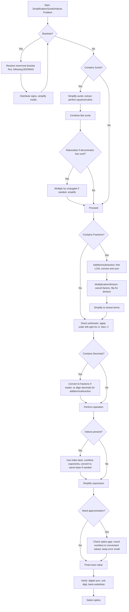

## Concept Ladder

### First principles: order of operations
In arithmetic, operations must follow a hierarchy to produce a unique, unambiguous result. The convention is **BODMAS**:

- **B**racket ( ) { } [ ] - resolve innermost first.
- **O**f - of means multiplication (e.g., 1/2 of 6 = 3) and has the same priority as multiplication.
- **D**ivision - left to right.
- **M**ultiplication - left to right.
- **A**ddition - left to right.
- **S**ubtraction - left to right.

**Equal-priority rule**: Division and multiplication are of equal priority; addition and subtraction are of equal priority. When only these remain, work from left to right. A classic error is to believe multiplication always precedes division because of the order of letters; BODMAS merely places them in the same tier.

A 200/200 aspirant must internalise this order to the point of reflex. Any hesitation over sequence will cost time. Directly apply the rule: scan for brackets, then powers/surds, then division/multiplication left-right, then addition/subtraction left-right. This sequence is the backbone of every simplification, surd, and index problem.

### Surds and indices
**Surds** are irrational roots like sqrt(2), cbrt(3). They are simplified by extracting square factors (e.g., sqrt(72) = 6sqrt(2)). Like surds (same radicand) can be added/subtracted via coefficients. Rationalising the denominator involves multiplying numerator and denominator by the conjugate (for binomial surds) or the same root (for monomial surds).

**Indices (exponents)** are governed by laws:
- a^m * a^n = a^(m+n)
- a^m / a^n = a^(m-n)
- (a^m)^n = a^(mn)
- a^0 = 1 (a != 0)
- a^(-n) = 1/a^n
- a^(1/n) = nth root of a
- a^(m/n) = (nth root of a)^m

These allow combining powers when bases match, and handling fractional and negative powers smoothly.

### Fraction and decimal mastery
Fraction operations-addition, subtraction, multiplication, division-require LCM, cancellation, and reciprocal flipping. For time-efficiency, students must memorise fraction-to-percentage and decimal-to-fraction conversions (e.g., 12.5% = 1/8, 37.5% = 3/8, 0.125 = 1/8). These conversions are repeatedly used to bypass long multiplication. Cancellation before multiplication is the single greatest speed-saver: reduce numerator/denominator factors across the entire product before doing any multiplication.

### Integration into the 200/200 attempt
In the SSC CGL Tier-I Quant section, simplification problems often appear as standalone 2-mark questions, and also underlie Data Interpretation, algebra, trigonometry, and mensuration. Thus, every other question relies on bulletproof simplification and swift arithmetic. A candidate targeting a perfect score must treat simplification as the foundational operating system: it must be automatic, error-free, and never the cause of a question being skipped or revisited.

## Type System

| Type | Recognition Cue | Method | Speed Target | Trap |
|------|----------------|--------|--------------|------|
| Pure BODMAS with brackets | Expression with nested brackets; often includes negatives or 'of' | Use innermost-first rule; handle sign distribution meticulously. Resolve brackets completely before proceeding. | 20 sec | Negative sign forgotten while opening bracket; treating '-' as inside a bracket term. |
| Same-priority left-to-right | Multiple division/multiplication or addition/subtraction without brackets | Follow left-to-right strictly; division then multiplication in order of appearance. | 15 sec | Incorrect precedence (e.g., doing multiplication before division when division appears first). |
| Fraction series addition/subtraction | Sum/difference of proper/improper fractions, often with unlike denominators | Find LCM of denominators; convert each; simplify final numerator; prefer cancellation over full multiplication. | 25 sec | Using a common denominator that is not the LCM, leading to large numbers and cancellation errors. |
| Mixed fraction operations | Fractions multiplied, divided, or squared; compound fractions | For division: flip the divisor fraction and multiply. Cancel before multiplying. For mixed numbers, convert to improper. | 25 sec | Mixing addition/subtraction with multiplication without converting to improper. |
| Decimal simplification | Long decimal addition/subtraction/multiplication; mixed with fractions | Convert decimals to fractions where possible (e.g., 0.25 = 1/4). For mixed: decide whether to use all decimals or all fractions based on the numbers. | 30 sec | Alignment errors in decimal addition; premature rounding when options are close. |
| Fraction-percent conversions | Phrases like "12.5% of", "37.5% of", "6.25% of" | Instantly recall percentage-to-fraction table (1/8, 3/8, 1/16, etc.). Do not multiply by the percentage and divide by 100 blindly. | 10 sec | Forgetting that 'of' means multiplication; converting to decimals and multiplying, wasting time. |
| Index law combination | Single base with multiple powers multiplied/divided; powers of powers | Combine exponents by addition/subtraction/multiplication. If bases differ, express them as powers of a common base (e.g., 4 = 2^2, 9 = 3^2). | 25 sec | Adding exponents when dividing instead of subtracting; mishandling negative exponents. |
| Surd simplification | Single surd with composite radicand; sum/difference of surds | Factor out largest perfect square/cube; combine like surds by adding coefficients. For rationalisation, multiply by conjugate. | 30 sec | Leaving surd in denominator; failing to identify perfect-square factors fully. |
| Rationalisation with binomial surds | Denominator of form sqrt(a) +/- sqrt(b) | Multiply numerator and denominator by the conjugate sqrt(a)  sqrt(b); use (a-b) difference of squares. | 35 sec | Multiplying top but not bottom, or vice versa; sign error in conjugate. |
| Approximation when options widely spaced | Question asks "approx value" or options are far apart (difference > 10% of value) | Round numbers to nearest convenient figure (e.g., 198 -> 200, 52 -> 50). Use approximate fractional equivalents (0.49 -> ~0.5). Do not over-approximate if options are close. | 20 sec | Over-approximating when options are close (e.g., 0.5 vs 0.48); not checking the final percentage deviation. |
| Nested 'of' and fraction-of-fraction | "1/2 of 3/4 of 600" or similar | Replace 'of' with multiplication; cancel stepwise. Solve from left to right. | 15 sec | Adding fractions instead of multiplying because 'of' resembles addition. |
| Simplification using algebraic identities | Expressions like a^2 - b^2, (a+b)^2 - 4ab, etc. hidden in arithmetic | Recognise factorisable patterns; apply identity in reverse to simplify. | 30 sec | Expanding blindly without noticing identity; missing difference-of-squares pattern in large numbers. |
| Base-method multiplication (near 100/1000) | Two numbers close to 100, 1000, etc. | Use (100-x)(100-y) expansion or surpluses/deficits; e.g., 98x97 = (100-2)(100-3) = 10000 -500 +6 = 9506. | 20 sec | Cross-term sign error; misapplying when numbers are not sufficiently close. |
| Digital sum / unit digit verification | Checking simplified result quickly | Use digital sum of each side to validate arithmetic without re-doing full calculation. Unit digit check for multiplication/division. | 5 sec | Assuming verification is foolproof; some errors (transposition) produce same digital sum. |

## Speed Methods

### The 36-second attempt plan
SSC CGL Tier-I gives you 25 Quant questions in 15 minutes-36 seconds per question. Simplification is one of the heaviest time-load areas because it is embedded everywhere. Your "36-second attempt plan" for any simplification question (pure or embedded) is a decision tree executed in seconds:

1. **Scan and classify** (5 sec): Is this a pure order-of-operations problem, fraction-heavy, surds/index, or a percent-of question?
2. **Choose method** (5 sec):
   - If pure BODMAS with brackets: strict stepwise resolve.
   - If fraction series: LCM method, or convert to decimals if terminating.
   - If percent-of: instant fraction conversion.
   - If surds/index: apply laws.
   - If approximation: check option gap.
   - If embedded inside DI: use the simplest representation (e.g., 25% = 1/4) and proceed.
3. **Execute with cancellation** (20 sec maximum): Cancel every possible step before multiplying. Write intermediate values directly on rough sheet as single numbers-no full recopying.
4. **Validate** (6 sec): Use digital sum or unit digit for quick sanity. If mismatched, recheck with fresh eyes but only if time permits; otherwise, mark for review if answer seems off.

When to use direct formula: percent conversions, index laws, algebraic identities.
When to option test: If the expression contains a variable and the question asks "what is the value of x", and options are small whole numbers, plug them in.
When to approximate: Only when options are far apart (say, >10% difference) AND the question asks "approx" or when you see messy decimals with final answer likely integer.
When to substitute: When the expression is symmetric in some variable (e.g., x + 1/x) and you have an identity, use the substitution to avoid solving quadratic.
When to skip-and-return: If the simplification involves an unrecognisable nested structure that will take >45 seconds, flag and come back. Do not waste time on a 2-mark item that could ruin the tempo.

### Instant recall tables
**Fraction-to-percent (and vice versa)**
| Fraction | Decimal | Percent |
|----------|---------|---------|
| 1/2 | 0.5 | 50% |
| 1/3 | 0.333 | 33.33% |
| 1/4 | 0.25 | 25% |
| 1/5 | 0.2 | 20% |
| 1/6 | 0.1667 | 16.67% |
| 1/7 | 0.142857 | 14.2857% |
| 1/8 | 0.125 | 12.5% |
| 1/9 | 0.111 | 11.11% |
| 1/10 | 0.1 | 10% |
| 1/12 | 0.08333 | 8.33% |
| 1/16 | 0.0625 | 6.25% |
| 1/20 | 0.05 | 5% |
| 1/25 | 0.04 | 4% |
| 3/8 | 0.375 | 37.5% |
| 5/8 | 0.625 | 62.5% |
| 7/8 | 0.875 | 87.5% |
| 2/3 | 0.6667 | 66.67% |
| 3/4 | 0.75 | 75% |

These must be on your fingertips. When you see "6.25% of 800", you instantly see 1/16 of 800 = 50.

**Square roots of common numbers**
| Number | sqrt |
|--------|------|
| 4 | 2 |
| 9 | 3 |
| 16 | 4 |
| 25 | 5 |
| 36 | 6 |
| 49 | 7 |
| 64 | 8 |
| 81 | 9 |
| 121 | 11 |
| 144 | 12 |
| 169 | 13 |
| 196 | 14 |
| 225 | 15 |
| 256 | 16 |
| 289 | 17 |
| 324 | 18 |
| 361 | 19 |
| 400 | 20 |

**Perfect cubes**
| Number | cbrt |
|--------|------|
| 8 | 2 |
| 27 | 3 |
| 64 | 4 |
| 125 | 5 |
| 216 | 6 |
| 343 | 7 |
| 512 | 8 |
| 729 | 9 |
| 1000 | 10 |
| 1331 | 11 |
| 1728 | 12 |

For surds, factorise large numbers into these perfect squares/cubes to simplify.

### Decision algorithms for critical types
#### Algorithm: Fraction series addition/subtraction
1. List denominators.
2. Find LCM via prime factorisation or inspection.
3. For each fraction, compute multiplier = LCM / denominator.
4. Multiply numerator by multiplier. Write new numerator above denominator (LCM) but do not fully write if you can mentally keep.
5. Sum numerators.
6. Simplify the resulting fraction: check if numerator and LCM share a factor. Cancel to lowest terms.
7. If the sum is an improper fraction, express as mixed number if required.

#### Algorithm: Cancellation in multiplication of fractions
Given (a/b) * (c/d) * (e/f) ...
1. Write all numerators in a row: a c e ...
2. Write all denominators in a row: b d f ...
3. Scan for common factors between any numerator and any denominator. Cancel them by dividing both by that factor.
4. After all cancellations, multiply remaining numerators to get numerator; multiply remaining denominators to get denominator.
5. Simplify to lowest terms.

#### Algorithm: Rationalising a monomial surd denominator
For a / sqrt(b)
1. Multiply numerator and denominator by sqrt(b).
2. Result: a*sqrt(b) / b.

For a / (sqrt(b) + sqrt(c))
1. Multiply numerator and denominator by (sqrt(b) - sqrt(c)).
2. Denominator becomes b - c (no square roots). Numerator becomes a*(sqrt(b) - sqrt(c)).
3. Simplify.

### Rough-sheet layout for fast exactness
- Draw a clear vertical partition: left side for step-by-step simplification, right side for option-elimination notes and digital sum/unit digit verification.
- Record intermediate values as a single number, never as an expression. For example, after 24/6 write 4, not "24/6 = 4". This reduces clutter.
- For fraction LCMS, write the LCM at the top and then the sequence of multipliers row-wise. Cancel mentally but visually mark.
- Use coloured pens: one for the main working, another for quick checks. (Permitted in exam.)
- At the end, underline or box the final answer before transferring to OMR.

## Trap Table

| Trap | Trigger Wording | Wrong Move | Correct Move | Repair Drill |
|------|----------------|------------|--------------|--------------|
| 1. Division-multiplication order | "24 / 6 x 2" or similar no brackets | Do 6 x 2 = 12, then 24/12 = 2 | Perform left-to-right: 24/6 = 4, then 4x2 = 8 | Drill 20 mixed-division-multiplication expressions daily until left-to-right becomes automatic. |
| 2. Missing negative sign distribution | Expression with a minus before a bracket, e.g., "10 - (2 + 3)" | Treat as 10 - 2 + 3 = 11 | Bracket first: 2+3 = 5, then 10-5 = 5. Or distribute minus: 10 - 2 - 3 = 5. | Practice rewriting "minus bracket" as adding the negative of each term inside. Drill with nested brackets. |
| 3. 'Of' misinterpretation | "1/2 of 3/4" or "25% of 200" | Adding fractions or treating as separate operations | 'Of' means multiply. So 1/2 * 3/4 = 3/8. | Create a flashcard set of 'of' phrases; convert to multiplication symbols mentally every time. |
| 4. Addition of unlike fractions without LCM | Sum of fractions with denominators like 12 and 18, but student multiplies denominators directly | 7/12 + 5/18 calculated as (7*18 + 5*12)/(12*18) = (126+60)/216 = 186/216 = 31/36 (correct but slow and error-prone) | Find LCM (36). So 21/36 + 10/36 = 31/36. Faster, less error. | Master LCM finding with prime factorisation; drill 10 fraction sums per day. |
| 5. Forgetting to flip the second fraction in division | "3/4 / 5/6" or similar | Multiply 3/4 * 5/6 = 15/24 = 5/8 (wrong) | Flip the divisor: 3/4 * 6/5 = 18/20 = 9/10. | Mantra: "Keep, Change, Flip". Keep first fraction, change  to x, flip the second. Drill 15 such problems. |
| 6. Cancellation errors by overshooting | "Simplify 36/48 x 64" | 36/48 = 3/4 (correct) but then multiply 3/4 x 64 = 48. But if cancel 48 and 64 with 16 incorrectly: 36/48 reduced to 9/12, then 9/12 x 64 = 9/12 x 16 = 12 (wrong). | Cancel correctly: 36/48 = 3/4. 4 into 64 goes 16. 3x16=48. Or cancel 36 and 48 by 12, then 3/4 x 64 = 48. | For every cancellation, note the numbers cancelled and their reduced values. Practice with cross-check using different cancellation paths. |
| 7. Surd addition: treating unlike surds as like | "sqrt(5) + sqrt(20)" | Combining as (1+1)sqrt(5) = 2sqrt(5) but sqrt(20) = 2sqrt(5), so it's actually 1sqrt(5) + 2sqrt(5) = 3sqrt(5). But if student thinks sqrt(20) = 4.47 and adds to sqrt(5)=2.236, error. | Simplify sqrt(20) to 2sqrt(5) first, then add like terms. | Always simplify surds to simplest form before any addition. Drill: list surds and their simplified forms. |
| 8. Rationalisation sign mistake | Denominator sqrt(3) - sqrt(2) | Multiply by sqrt(3) - sqrt(2) (instead of conjugate) making denominator (3 - 2sqrt(6) + 2) = 5 - 2sqrt(6), not rational. | Multiply by conjugate sqrt(3) + sqrt(2); denominator becomes 3-2=1. | Drill conjugates: (a+b)(a-b)=a^2-b^2. For each surd pair, write the conjugate next to it. |
| 9. Index law misapplication: a^m / a^n = a^(m/n) | "3^6 / 3^2" | Sometimes students divide exponents: 6/2=3 so 3^3=27, but correct is 3^(6-2)=3^4=81. | Subtract exponents when dividing same base. | Flashcard: "division -> subtract exponents". Do 10 exponent problems per day. |
| 10. Zero exponent confusion | "5^0" or expression yielding 0 power | Thinking it's 0 or 5. | a^0 = 1 (as long as a!=0). | Memorise and test with different bases. |
| 11. Negative exponent mishandling | "2^{-3}" | Writing -8 or -6. | 2^{-3} = 1/2^3 = 1/8. Negative exponent means reciprocal of positive exponent. | Worksheet: convert negative exponents to fractions until automatic. |
| 12. Fractional exponent misinterpretation | "8^{2/3}" | Multiply 8 * 2/3 = 16/3 (wrong) | 8^{2/3} = (8^{1/3})^2 = 2^2 = 4. Or cube root of 8 squared. | Decompose: denominator of exponent gives root, numerator gives power. |
| 13. Option gap misjudgement for approximation | "Find approximate value of 0.48 x 0.48 + 0.52 x 0.52" with close options | Approximating 0.48->0.5 and computing 0.5^2+0.5^2=0.5, but actual is closer to 0.48^2+0.52^2=0.2304+0.2704=0.5008; options may include 0.5 and 0.5008. Wrong if approximated to 0.5 exactly but answer might be 0.5008. | Check the gap. If options are very close, use exact calculation or algebraic identity (a^2+b^2 when a+b=1 gives 1-2ab etc.) | Drill: determine option gap percentage before choosing approximation. |
| 14. Digital sum over-reliance | Simplification result double-checked with digital sum only | If the answer from digital sum matches, assume correct, but transposition errors may give same digital sum. Example: 24+36=60 (dig sum 6) vs 42+18=60 (dig sum 6) both sum to 60, but the original expression might be different. | Use digital sum as a quick filter, but also verify with unit digit or another method if time. | For critical steps, after digital sum check, quickly re-add the original numbers without carrying to see digit patterns. |
| 15. Misreading 'simplify' as 'evaluate' for large expressions with variables | Problem has variables but says "simplify" | Plugging arbitrary values instead of combining like terms or using identities. | Simplify means reduce to simplest form, not necessarily find numeric value. If variables, combine like terms using algebra. | Practice: distinguish between "simplify" and "find the value". |
| 16. Nested bracket with negative outside double-distribution | " - [ ... ]" with a minus before the bracket and a minus inside | Forgetting to flip all signs when opening a negative bracket. | Treat minus as multiplying by -1. Open brackets stepwise, watching signs. | Drill: 30 nested-bracket problems with mixed signs. |
| 17. Decimal point alignment in addition | "0.004 + 0.0005 + 0.5" | Aligning decimals by left side instead of decimal point: 0.004\n0.0005\n0.5 -> adding as .0095 but misread as 0.954 | Line up decimal points: 0.0040, 0.0005, 0.5000 = 0.5045. | Use grid boxes on rough sheet; write each decimal in same column. |
| 18. Converting recurring decimals to fractions incorrectly | "0.333... + 0.666..." | Thinking 0.333 = 1/3, 0.666 = 2/3, sum = 1, but if the recurring part is misread. Actually 0.333... = 1/3, 0.666... = 2/3, sum = 3/3 = 1. But if student approximates 0.33+0.66=0.99, error. | Recognise recurring pattern and use fraction conversion. | Memorise common repeating decimal fractions. |

## Flowchart

## Solved Examples

**Example 1**
Simplify: 24 / 6 x 2
Options: (a) 2 (b) 8 (c) 12 (d) 16
**Solution**: Division and multiplication have equal priority, so move left to right. 24 / 6 = 4, and 4 x 2 = 8. **Answer: (b) 8**

**Example 2**
Simplify: 18 + 6 x 4
Options: (a) 42 (b) 96 (c) 72 (d) 30
**Solution**: Multiplication comes before addition. 6 x 4 = 24, so 18 + 24 = 42. **Answer: (a) 42**

**Example 3**
Simplify: (15 + 9) / 6 x 5
Options: (a) 12 (b) 16 (c) 20 (d) 24
**Solution**: First resolve the bracket: 15 + 9 = 24. Then 24 / 6 x 5 = 4 x 5 = 20. **Answer: (c) 20**

**Example 4**
Simplify: 36/48 x 64
Options: (a) 36 (b) 48 (c) 54 (d) 64
**Solution**: Cancel before multiplying. 36/48 = 3/4. Then 3/4 x 64 = 48. **Answer: (b) 48**

**Example 5**
Simplify: 7/12 + 5/18
Options: (a) 17/36 (b) 29/36 (c) 31/36 (d) 35/36
**Solution**: LCM of 12 and 18 is 36. 7/12 = 21/36 and 5/18 = 10/36. Sum = 31/36. **Answer: (c) 31/36**

**Example 6**
Simplify: 2^8 x 2^5 / 2^10
Options: (a) 4 (b) 8 (c) 16 (d) 32
**Solution**: Same base powers combine by adding and subtracting exponents. 2^(8+5-10) = 2^3 = 8. **Answer: (b) 8**

**Example 7**
Simplify: (3^4)^2 / 3^5
Options: (a) 9 (b) 18 (c) 27 (d) 81
**Solution**: Power of power gives 3^8. Then 3^8 / 3^5 = 3^3 = 27. **Answer: (c) 27**

**Example 8**
Simplify: sqrt(72)
Options: (a) 3sqrt(8) (b) 6sqrt(2) (c) 8sqrt(3) (d) 12sqrt(2)
**Solution**: 72 = 36 x 2. Therefore sqrt(72) = sqrt(36) x sqrt(2) = 6sqrt(2). **Answer: (b) 6sqrt(2)**

**Example 9**
Simplify: 3sqrt(5) + 7sqrt(5) - 2sqrt(5)
Options: (a) 5sqrt(5) (b) 6sqrt(5) (c) 8sqrt(5) (d) 12sqrt(5)
**Solution**: Like surds combine by adding coefficients. (3 + 7 - 2)sqrt(5) = 8sqrt(5). **Answer: (c) 8sqrt(5)**

**Example 10**
Rationalize: 5/sqrt(3)
Options: (a) 5sqrt(3)/3 (b) sqrt(3)/5 (c) 15sqrt(3) (d) 5/3
**Solution**: Multiply numerator and denominator by sqrt(3). 5/sqrt(3) = 5sqrt(3)/3. **Answer: (a) 5sqrt(3)/3**

**Example 11**
Find 12.5% of 640.
Options: (a) 64 (b) 72 (c) 80 (d) 96
**Solution**: 12.5% = 1/8. So 12.5% of 640 = 640/8 = 80. **Answer: (c) 80**

**Example 12**
Find 37.5% of 480.
Options: (a) 160 (b) 180 (c) 200 (d) 220
**Solution**: 37.5% = 3/8. So 480 x 3/8 = 60 x 3 = 180. **Answer: (b) 180**

**Example 13**
Simplify: 45 x 98
Options: (a) 4210 (b) 4310 (c) 4410 (d) 4510
**Solution**: Use 98 = 100 - 2. 45 x 98 = 45 x 100 - 45 x 2 = 4500 - 90 = 4410. **Answer: (c) 4410**

**Example 14**
Simplify: 5 - [3 - {2 - (6 - 4)}]
Options: (a) 0 (b) 2 (c) 3 (d) 5
**Solution**: Innermost bracket: 6 - 4 = 2. Then 2 - 2 = 0. Then 3 - 0 = 3. Finally 5 - 3 = 2. **Answer: (b) 2**

**Example 15**
Simplify: 0.25 x 360 + 0.75 x 120
Options: (a) 150 (b) 165 (c) 180 (d) 210
**Solution**: Convert decimals to fractions. 0.25 = 1/4 and 0.75 = 3/4. Value = 360/4 + 3 x 120/4 = 90 + 90 = 180. **Answer: (c) 180**

**Example 16**
Simplify: 81^(3/4)
Options: (a) 9 (b) 18 (c) 27 (d) 36
**Solution**: 81 = 3^4. So 81^(3/4) = (3^4)^(3/4) = 3^3 = 27. **Answer: (c) 27**

**Example 17**
Simplify: 16^(-1) + 4^(-1)
Options: (a) 1/8 (b) 3/16 (c) 5/16 (d) 1/2
**Solution**: 16^(-1) = 1/16 and 4^(-1) = 1/4. Sum = 1/16 + 4/16 = 5/16. **Answer: (c) 5/16**

**Example 18**
Simplify: sqrt(98) + sqrt(50)
Options: (a) 8sqrt(2) (b) 10sqrt(2) (c) 12sqrt(2) (d) 14sqrt(2)
**Solution**: sqrt(98) = 7sqrt(2), and sqrt(50) = 5sqrt(2). Sum = 12sqrt(2). **Answer: (c) 12sqrt(2)**

**Example 19**
Approximate: 49.8% of 602
Options: (a) 260 (b) 285 (c) 300 (d) 340
**Solution**: 49.8% is almost 50%. Half of 602 is 301, so the closest option is 300. **Answer: (c) 300**

**Example 20**
Simplify: 7/8 of 64 - 3/5 of 50
Options: (a) 22 (b) 24 (c) 26 (d) 28
**Solution**: 7/8 of 64 = 56. 3/5 of 50 = 30. Difference = 56 - 30 = 26. **Answer: (c) 26**

## PYQ Mapping

The SSC CGL Tier-I pattern draws simplification concepts both as direct questions and as embedded calculations in other topics. Based on the book-PYQ corpus (nearly 6700 quant questions mapped), the distribution suggests the following practice routes:

- **Direct BODMAS and order-of-operations**: Look for standalone simplification questions in full-length mock tests; also found within algebra and number system chapters. Practice route: /exams/ssc-cgl/topics/simplification
- **Fraction and decimal operations**: These frequently appear within DI (data interpretation) where you must sum percentages, divide values, or compute ratios. They also show up in profit and loss, percentage, and mixture problems. Reinforce via rapid fraction-percent drill at /exams/ssc-cgl/topics/calculation-speed
- **Surds and indices**: Prominent in algebra (identities), trigonometry (exact values), and number system. Many surds appear in simplification under square-root signs, nested expressions. Practice the 36-second drill exclusively for calculation speed: /exams/ssc-cgl/tests/ssc-cgl-topic-calculation-speed-36-second-drill
- **Approximation and option-gap analysis**: Crucial for data-heavy DI sets and for number system questions where rough approximations are accepted. Test your full quant accuracy with 50-mark sets at /exams/ssc-cgl/tests/ssc-cgl-quant-50-50-set-01
- **Traps**: The types listed in the Trap Table are all derived from recurring mistakes seen in the corpus. For repair, every trap has a specific drill; incorporate those into daily practice.

Your personal goal: From the 25 Quant questions, ensure that no simplification-related step causes a time overrun or a careless error. This requires integrated practice, not isolated topic drills alone. Use the linked practice routes to develop layered proficiency.

## 200/200 Drill

### Micro-drill 1: Left-to-right discipline (5 minutes)
Solve these rapidly without writing intermediate steps beyond the result.
1. 18 / 3 x 2
2. 40 / 5 x 4 / 2
3. 96 / 12 x 3 x 2
4. 100 / 10 x 5
5. 120 / 8 x 2 / 3
(Aim: each in under 10 sec, all correct.)

### Micro-drill 2: Fraction-percent instant conversion (4 minutes)
Convert each percentage to lowest fraction and then find the value of the percentage of 800.
1. 6.25%
2. 12.5%
3. 33.33%
4. 62.5%
5. 75%
6. 37.5%
7. 83.33%
8. 16.67%
(Aim: 5 seconds per conversion, no paper for the percentage-to-fraction step.)

### Micro-drill 3: Surd simplification and rationalisation (5 minutes)
Simplify:
1. sqrt(108)
2. sqrt(243)
3. 2/(sqrt(5)-sqrt(3))
4. sqrt(48) + sqrt(75)
5. (sqrt(6)+sqrt(2))^2
(Answers: 6sqrt(3), 9sqrt(3), sqrt(5)+sqrt(3) after rationalisation, 4sqrt(3)+5sqrt(3)=9sqrt(3), 8+4sqrt(3).)

### Micro-drill 4: Index laws (5 minutes)
Simplify:
1. 5^3 * 5^(-2)
2. (7^4)^(1/2)
3. 2^10 / 2^4
4. (81)^(3/4)
5. (2^3 * 4^2) / 8^2
(Answers: 5, 7^2=49, 2^6=64, (3^4)^(3/4)=3^3=27, 8*16/64=128/64=2.)

### Micro-drill 5: Option-gap approximation (5 minutes)
Given the expression, choose the best approximation from the options. Check if gap is wide enough; then approximate.
1. 198 x 52 (Options: 10000, 10296, 11000, 12000)
2. 503 / 14.8 (Options: 33.9, 34.1, 35.2, 36.4)
3. 0.49 x 0.49 + 0.51 x 0.51 (Options: 0.48, 0.5, 0.5002, 0.52)
4. sqrt(624) (Options: 24.5, 25.0, 25.2, 25.5)
5. 37.5% of 479 (Options: 175, 180, 185, 190)
(Answers: 10296, 34.0 approx, 0.5002, 25.0, 179.625 ~= 180 so 180)

### Micro-drill 6: Nested bracket menace (5 minutes)
Simplify:
1. 24 - [12 - {5 - (3 - 1)}]
2. 2[3{4(5 - 2) - 1} + 7]
3. -[4 - {6 + (2 - 5) }]
(Answers: 24 - [12 - {5 - 2}] = 24 - [12 - 3] = 24 - 9 = 15; 2[3{12 - 1} + 7] = 2[3*11+7]=2[40]=80; -[4 - {6 + (-3)}] = -[4 - {3}] = -[1] = -1.)

### Repair rules for common mistakes
- If you encounter a 'division before multiplication' error, go back to Example 1 type problems and repeat left-to-right with verbal chanting: "left to right, left to right."
- If your fraction addition is slow, master prime factorisation for LCM, and spend 10 minutes daily adding random fractions.
- For surds, always start with square-factor extraction. Create a table of numbers from 1 to 200 with their largest square factor noted.
- For decimal errors, use a printed decimal grid for addition/subtraction alignment. Practice with 0.000x numbers.
- When you misapply index laws, rewrite each step in expanded form (e.g., 2^5 = 2*2*2*2*2) for the first few drills until the logic is inherent.
- Every time you get a sign error in nested brackets, write a large "+" or "-" above each bracket as you open it, highlighting what you distribute.

### Full 15-minute simulation
Use /exams/ssc-cgl/tests/ssc-cgl-quant-50-50-set-01 and attempt only the Quant section under strict time control. Analyse: How many simplification-related errors or time overruns occurred? Target zero. If any, isolate the specific type and repeat its micro-drill until flawless.

The 200/200 aspirant treats simplification as the kinetic chain of all Quant-weakness here cascades into every topic. Master these routines and every arithmetic step in your exam becomes a swift, correct, and unconscious action.
<!-- SSC-FINAL-PRACTICE-QUEUE:START -->
## Final Practice Queue

1. Start one-by-one practice: [Simplification and Surds/Indices practice](/exams/ssc-cgl/practice/simplification). Finish every question in this topic bank, not just the samples in the note.
2. Move to timed sets: [SSC CGL tests](/exams/ssc-cgl/tests?topic=simplification). Use topic drills first, then section mocks once accuracy is stable.
3. Repair every miss immediately: record the error label, redo 20 mixed questions from the same topic, then retest after 24 hours.
4. 200/200 rule: do not mark this topic exam-ready until correct answers come within 36 seconds and wrong answers are explained without looking at the solution.

<!-- SSC-FINAL-PRACTICE-QUEUE:END -->
