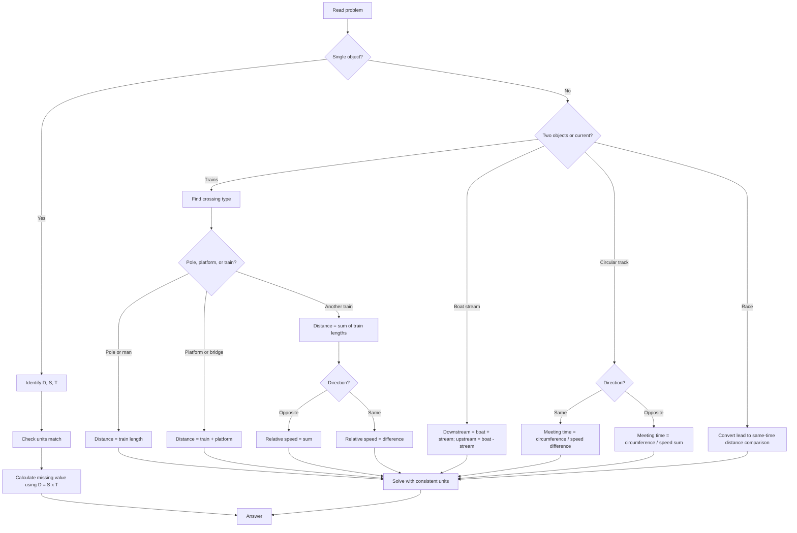

## Concept Ladder

**36-second Quant scoring bar**  
Time-Speed-Distance questions must be decided in the first 5 seconds: direct formula, relative speed, train length, boat-stream, race, or ratio. Use 20-25 seconds for calculation and the final seconds for unit conversion. If units are mixed, convert before touching options.

### Corpus Pressure

The uploaded book-PYQ corpus marks `time-speed-distance` as a 200/200 high-yield Quant topic with 415 promoted questions. It is not only a formula chapter. The book corpus mixes direct time-speed-distance rows with trains, boats, circular tracks, races, geometry-linked movement, and ratio-based speed comparisons.

| Corpus bucket | Promoted questions | What it usually tests | 36-second implication |
|---|---:|---|---|
| `Time, Speed and Distance` | 138 promoted questions | Direct D/S/T, average speed, relative speed, races, circular tracks | Type must be identified in the first 5 seconds |
| `ssc-maths-6800-mcq-p0421-p0440` | 109 promoted questions | Dense book-PYQ sprint set for trains, boats, and average speed | Use as the main repair set after every mock miss |
| `Geometry` | 61 promoted questions | Movement through diagonals, path length, circumference, and right-triangle links | Draw route before calculating |
| `ssc-maths-6800-mcq-p0381-p0400` | 49 promoted questions | Speed-ratio and staged journey problems | Convert everything to one unit before option work |
| `ssc-maths-6800-mcq-p0101-p0120` | 23 promoted questions | Mixed arithmetic bridge problems | Decide if this is really TSD or ratio/proportion first |
| `ssc-maths-6800-mcq-p0401-p0420` | 16 promoted questions | Follow-up practice for trains, streams, and circular motion | Drill same-direction vs opposite-direction relative speed |

For 50/50 Quant, TSD has to become a controlled decision tree. The calculation itself is usually small; the mark is lost when the wrong model is chosen: arithmetic mean instead of harmonic mean, sum instead of difference, train length omitted, or km/h used with seconds.

### First 5-Second Classification

| First cue in question | Bucket | First move |
|---|---|---|
| "covers distance", "takes time", "speed is" | Basic D/S/T | Write D = S x T and check units |
| "average speed", "goes and returns" | Average speed | Ask: equal distances or equal times? |
| "towards each other", "meet" | Relative speed opposite | Add speeds |
| "same direction", "overtakes", "catches" | Relative speed same | Subtract speeds |
| "crosses pole/man/platform/bridge/train" | Train crossing | Distance is train length, train+platform, or sum of train lengths |
| "downstream/upstream/still water" | Boat-stream | Use D = B + S, U = B - S |
| "race", "beats by", "head start" | Race | Convert lead to distance/time and compare same-time distances |
| "circular track" | Circular motion | Meeting time = circumference / relative speed |

**First Principle**  
Speed = Distance / Time (S = D/T). This is a direct proportion: if speed constant, distance varies directly with time; if distance constant, speed varies inversely with time.

**Second Principle: Units**  
- km/h to m/s: multiply by 5/18 (or 1000/3600).  
- m/s to km/h: multiply by 18/5.  
- Always check unit match: distance in km, time in h -> speed km/h; distance in m, time in s -> speed m/s.

**Third Principle: Average Speed**  
- When distances are equal (e.g., half distance at u, half at v): Avg Speed = 2uv/(u+v).  
- When times are equal (e.g., half time at u, half at v): Avg Speed = (u+v)/2.  
- General: Total Distance / Total Time.

**Fourth Principle: Inverse Proportionality**  
- For fixed distance, speed ratio S1:S2 = inverse of time ratio T2:T1.  
- For fixed time, distance ratio = speed ratio.

**Fifth Principle: Relative Speed**  
- Same direction: Relative speed = |S1 - S2|.  
- Opposite direction: Relative speed = S1 + S2.  
- Used for trains crossing, boat/stream, meeting problems.

**Sixth Principle: Train Crossing**  
- Crossing a stationary object (pole, man): distance = length of train, time = length / speed.  
- Crossing a platform/bridge: distance = train length + platform length.  
- Crossing another train moving same/opposite: relative speed, distance = sum of lengths.

**Seventh Principle: Boats and Streams**  
- Speed in still water = (downstream + upstream)/2.  
- Stream speed = (downstream - upstream)/2.  
- Downstream speed = boat speed + stream speed.  
- Upstream speed = boat speed - stream speed.

**Eighth Principle: Races and Circular Tracks**  
- In a linear race: time to meet = (head start)/(speed difference) if both start together.  
- In a circular track: first meeting time = circumference / relative speed (same direction) or circumference / sum (opposite). Number of meetings in time T = T / meeting time.

**Ninth Principle: Ratio Approach**  
- For questions comparing two trips with constant distance: time is inversely proportional to speed.  
- For questions with constant time: distance is directly proportional to speed.

**Integration for SSC CGL**  
All problems reduce to one of these patterns. Master unit conversion, relative speed logic, and train-length handling. Watch for traps: same/direction confusion, object length forgotten, average speed formula misapplication, unit mismatch.

## Type System

| Type | Recognition Cue | Method | Speed Target | Trap |
|------|-----------------|--------|--------------|------|
| Basic D/S/T | "How long to cover 240 km at 60 km/h?" | D = SxT | 10s | Unit mismatch (e.g., answer in minutes but given in hours) |
| Average Speed equal distances | Half distance at 40 km/h, half at 60 km/h | 2uv/(u+v) | 15s | Using arithmetic mean instead of harmonic |
| Average Speed equal times | Half time at 40, half at 60 | (u+v)/2 | 10s | Using harmonic mean |
| Relative Speed same direction | Two trains moving in same direction | Relative speed = difference of speeds | 20s | Adding instead of subtracting |
| Relative Speed opposite direction | Two trains moving towards each other | Relative speed = sum of speeds | 15s | Subtracting instead of adding |
| Train crossing pole | "Train crosses a pole/ man" | Time = Length / Speed | 10s | Forgetting to convert length units |
| Train crossing platform | "Train crosses a platform of length ..." | Time = (Train length + Platform)/Speed | 20s | Using only train length |
| Train crossing another train opposite | "Two trains cross each other" | Add lengths; use relative speed = sum of speeds | 25s | Using difference of speeds |
| Train crossing another train same direction | "Overtakes" | Add lengths; use relative speed = difference | 25s | Using sum of speeds |
| Boat downstream | "Downstream speed" | Boat speed + stream speed | 10s | Swapping terms |
| Boat upstream | "Upstream speed" | Boat speed - stream speed | 10s | Swapping terms |
| Still water speed | Find boat speed in still water when downstream and upstream given | (Down+Up)/2 | 15s | Using average of downstream and upstream incorrectly |
| Stream speed | Find stream speed when downstream and upstream given | (Down-Up)/2 | 15s | Using sum instead of difference |
| Race with head start | "A gives B a head start of ..." | Time = head start / (speed difference) | 30s | Forgetting to multiply by the distance units |
| Circular track meeting | "Two persons start from same point..." | Meeting time = Circumference / relative speed (same/opposite) | 30s | Forgetting direction; using absolute speeds |
| Speed ratio given, find time ratio | "Ratio of speeds 3:4, same distance" | Time ratio = inverse of speed ratio = 4:3 | 15s | Using same order without inverting |
| Constant time, find distance ratio | "Time same, speeds in ratio 2:3" | Distance ratio = speed ratio = 2:3 | 10s | Inverting |

### Full Type Tree for 50/50

| Type code | Shape | Fast model | Fail trigger |
|---|---|---|---|
| TSD-1 | Direct speed, distance, time | D = S x T | Units not aligned |
| TSD-2 | Fixed distance, changed speed | Distance constant | Time not inverted |
| TSD-3 | Average speed, equal distance | 2uv/(u+v) | Arithmetic mean used |
| TSD-4 | Average speed, equal time | (u+v)/2 | Harmonic mean used |
| TSD-5 | Staged unequal journey | Total distance / total time | Shortcut applied blindly |
| TSD-6 | Relative speed, opposite direction | Add speeds | Difference used |
| TSD-7 | Relative speed, same direction | Difference of speeds | Sum used |
| TSD-8 | Train crosses pole/man | Train length only | Platform added wrongly |
| TSD-9 | Train crosses platform/bridge | Train length + platform | Train length omitted |
| TSD-10 | Two trains cross | Sum of train lengths + relative speed | Only one length used |
| TSD-11 | Boat downstream/upstream | B+S and B-S | Stream direction swapped |
| TSD-12 | Given downstream/upstream speeds | B=(D+U)/2, S=(D-U)/2 | Stream taken as average |
| TSD-13 | Race beats by distance | Same time comparison | Lead interpreted as extra time |
| TSD-14 | Circular same direction | Circumference / speed difference | Sum used |
| TSD-15 | Circular opposite direction | Circumference / speed sum | Difference used |
| TSD-16 | Geometry path movement | Find actual route length first | Straight-line distance assumed |

## Speed Methods

**Recall Table: Common Conversions**

| From | To | Factor |
|------|----|--------|
| km/h | m/s | x 5/18 |
| m/s | km/h | x 18/5 |
| km/h | km/min | divide by 60 |
| m/s | km/min | x 0.06 |

**Decision Rules for Selecting Relative Speed Direction**
1. Read "towards each other" or "meet" -> opposite direction -> relative speed = sum.
2. Read "same direction", "overtakes", "catches up" -> same direction -> relative speed = difference.
3. Read "crossing" with two trains moving -> determine their directions from context.

**Step-by-Step Algorithm: Train Crossing a Platform**
1. Note train length (L) in meters, platform length (P) in meters.
2. Note speed of train (S) - if in km/h, convert to m/s (x5/18).
3. Total distance = L + P (meters).
4. Time = (L+P) / (S in m/s). Answer in seconds.
5. If time given, find speed: S = (L+P)/time, then convert to km/h (x18/5).

**Step-by-Step Algorithm: Two Trains Crossing Each Other (Opposite)**
1. Find relative speed = sum of speeds (if speeds in km/h, convert to m/s for time in seconds).
2. Total distance = sum of lengths.
3. Time = total distance / relative speed.
4. For time in seconds, keep units consistent.

**Step-by-Step Algorithm: Boat/Stream**
1. Downstream speed D = boat speed B + stream speed C.
2. Upstream speed U = B - C.
3. Given D and U, solve: B = (D+U)/2, C = (D-U)/2.
4. For distance problems: time downstream = distance/D; time upstream = distance/U.

**Shortcut List**
- For distance constant: time ratio = inverse of speed ratio.
- For time constant: distance ratio = speed ratio.
- When a train crosses a pole and a platform in given times, length found by difference: (time_platform - time_pole) x speed = platform length.
- In races: if A beats B by X m in a Y m race, then A's speed : B's speed = Y : (Y-X) (if race time same).
- For average speed of entire journey with two equal distances: use harmonic mean formula; never arithmetic.

## Trap Table

| Trap | Trigger Wording | Wrong Move | Correct Move | Repair Drill |
|------|-----------------|------------|--------------|--------------|
| Unit mismatch | "Time in minutes" but speed in km/h | Use directly | Convert time to hours or distance to km/h consistent | Practice unit conversion flash cards |
| Average speed formula misapplication | "Half distance at 30, half at 50" | Use (30+50)/2 = 40 | Use 2*30*50/(30+50) = 37.5 | Drill harmonic mean for equal distances |
| Forgetting train length in platform crossing | "Train 200m crosses 300m platform" | Use only 300m distance | Use 200+300 = 500m | Write "length of train + platform" on rough sheet |
| Wrong relative speed direction | "Two trains moving in opposite directions" | Use difference | Use sum | Draw arrows; always confirm 'towards each other' = sum, 'same direction overtaking' = difference |
| Adding when subtracting required in boat/stream | "Upstream speed" | B + C | B - C | Memorize: upstream opposite flow, so slower |
| Head start distance vs time confusion | "A gives B a head start of 100m in 1km race" | Assume time for B to cover 100m separately | Use relative speed: B's extra distance / relative speed = time A takes to catch, then find distance | Practice race head start problems |
| Circular track first meeting time | Both start from same point in same direction on 400m track at 5m/s and 3m/s | Use sum of speeds | Use difference of speeds (relative) | Always check direction: same dir = difference |
| Time ratio not inverted when speed ratio given | "Speeds ratio 2:3, same distance" | Time ratio 2:3 | Time ratio 3:2 (inverse) | Write: more speed -> less time |
| Two trains crossing each other - length sum omitted | "Trains of lengths 100m and 150m, speeds 40 and 50 km/h" | Total distance = 0 or just train length | Sum of lengths = 250m | Always add lengths for crossing problems |
| Average speed when only parts given | "First 1/3 distance at 20, rest at 30" | Use simple harmonic mean | Compute total distance/total time | Derive total time formula specifically |
| Using arithmetic mean for equal times but thinking equal distances | "Half time at 40, half at 60" | Use 2*40*60/(40+60) | Use (40+60)/2 = 50 | Label clearly: if times equal -> arithmetic mean; distances equal -> harmonic |
| Unit conversion factor error | Convert 72 km/h to m/s | Multiply by 18/5 = 259.2 | Multiply by 5/18 = 20 m/s | Remember: km->m down -> ; h->s down -> ; overall x5/18. Memory aid: "5/18 for km to m/s" |
| Overtaking problem with stationary objects | "Train overtakes a man walking" | Use train speed alone | Use relative speed = train speed - man speed if same direction | Identify man's motion direction |
| Starting point offset in races | "A starts 2 seconds after B" | Ignore the time difference | Convert time difference into equivalent distance (speed of A * offset) or use simultaneous start with a head start | Model as "B has a time lead of 2 sec" |
| Boat crossing with no stream | "Boat goes 10 km in still water" | Still using stream formulas | Simple D/S/T applies | Check if stream speed given as zero |

## Flowchart

## Solved Examples

**Example 1**  
A car covers a distance of 120 km in 2.5 hours. What is its speed in m/s?  
Options: (a) 10 m/s (b) 13.33 m/s (c) 14.67 m/s (d) 16.67 m/s  
Solution: Speed = 120/2.5 = 48 km/h. Convert to m/s: 48 x 5/18 = 13.33 m/s. Answer: (b)

**Example 2**  
A train 200 m long crosses a pole in 10 seconds. What is the speed of the train in km/h?  
Options: (a) 54 km/h (b) 72 km/h (c) 80 km/h (d) 60 km/h  
Solution: Speed = 200/10 = 20 m/s. Convert: 20 x 18/5 = 72 km/h. Answer: (b)

**Example 3**  
A train 300 m long crosses a platform 200 m long in 25 seconds. The speed of the train is:  
Options: (a) 36 km/h (b) 54 km/h (c) 72 km/h (d) 90 km/h  
Solution: Total distance = 300+200 = 500 m, time = 25 s, speed = 500/25 = 20 m/s = 72 km/h. Answer: (c)

**Example 4**  
Two trains 150 m and 250 m long are running towards each other at 40 km/h and 20 km/h respectively. Time taken to cross each other:  
Options: (a) 12 s (b) 24 s (c) 36 s (d) 48 s  
Solution: Relative speed = 40+20 = 60 km/h = 60x5/18 = 50/3 m/s. Total length = 150+250 = 400 m. Time = 400 / (50/3) = 400 x 3/50 = 24 s. Answer: (b)

**Example 5**  
A man rows downstream 12 km in 2 hours and upstream 8 km in 2 hours. Speed of the stream:  
Options: (a) 1 km/h (b) 2 km/h (c) 3 km/h (d) 4 km/h  
Solution: Downstream speed = 12/2 = 6 km/h. Upstream speed = 8/2 = 4 km/h. Stream speed = (6-4)/2 = 1 km/h. Answer: (a)

**Example 6**  
With a speed of 60 km/h, a train reaches its destination in 5 hours. If the speed is increased by 20 km/h, the time taken is:  
Options: (a) 3.5 h (b) 3.75 h (c) 4 h (d) 4.5 h  
Solution: Distance = 60x5 = 300 km. New speed = 80 km/h. Time = 300/80 = 3.75 h. Answer: (b)

**Example 7**  
A goes from P to Q at 30 km/h and returns at 50 km/h. Average speed for the whole journey:  
Options: (a) 37.5 km/h (b) 40 km/h (c) 42.5 km/h (d) 45 km/h  
Solution: Equal distances, average speed = 2x30x50/(30+50) = 3000/80 = 37.5 km/h. Answer: (a)

**Example 8**  
In a 1 km race, A beats B by 100 m. If A runs at 9 m/s, what is B's speed?  
Options: (a) 8 m/s (b) 8.1 m/s (c) 8.5 m/s (d) 8.9 m/s  
Solution: A covers 1000 m at 9 m/s -> time = 1000/9 s. In same time, B covers 900 m. B's speed = 900 / (1000/9) = 900 x 9/1000 = 8.1 m/s. Answer: (b)

**Example 9**  
Two persons start from the same point on a circular track of 400 m in the same direction at 5 m/s and 3 m/s. When will they meet again?  
Options: (a) 100 s (b) 200 s (c) 300 s (d) 400 s  
Solution: Relative speed = 5-3 = 2 m/s. Meeting time = 400/2 = 200 s. Answer: (b)

**Example 10**  
A man can row 6 km/h in still water. If the stream flows at 2 km/h, the time taken to go 12 km downstream and return:  
Options: (a) 4 h (b) 4.5 h (c) 5 h (d) 5.5 h  
Solution: Downstream speed = 6+2 = 8 km/h, time = 12/8 = 1.5 h. Upstream speed = 6-2 = 4 km/h, time = 12/4 = 3 h. Total = 4.5 h. Answer: (b)

**Example 11**  
A train 150 m long passes a man running at 6 km/h in the same direction in 10 seconds. The train's speed is:  
Options: (a) 30 km/h (b) 36 km/h (c) 48 km/h (d) 60 km/h  
Solution: Relative speed = train speed - man speed (same direction). Let train speed = x m/s. Man speed = 6x5/18 = 5/3 m/s. Relative speed = (x - 5/3) m/s. Time = 150 / (x - 5/3) = 10 -> 150 = 10(x - 5/3) -> 15 = x - 5/3 -> x = 15 + 5/3 = 50/3 m/s = (50/3)x(18/5) = 60 km/h. Answer: (d)

**Example 12**  
The ratio of speeds of two trains is 3:4. If both cover equal distances, the ratio of times taken is:  
Options: (a) 3:4 (b) 4:3 (c) 9:16 (d) 16:9  
Solution: For equal distance, time is inversely proportional to speed. Ratio of times = 1/3 : 1/4 = 4:3. Answer: (b)

**Example 13**  
A train 180 m long crosses a bridge 270 m long in 18 seconds. Find its speed in km/h.  
Options: (a) 72 km/h (b) 80 km/h (c) 90 km/h (d) 100 km/h  
Solution: Total distance = 180 + 270 = 450 m. Speed = 450/18 = 25 m/s. Convert to km/h: 25 x 18/5 = 90 km/h. Answer: (c)

**Example 14**  
Two trains of lengths 120 m and 180 m run in the same direction at 54 km/h and 36 km/h. How long will the faster train take to overtake the slower train?  
Options: (a) 45 s (b) 60 s (c) 75 s (d) 90 s  
Solution: Total distance to cross = 120 + 180 = 300 m. Relative speed = 54 - 36 = 18 km/h = 5 m/s. Time = 300/5 = 60 s. Answer: (b)

**Example 15**  
A boat goes 30 km downstream in 2 hours and 20 km upstream in 2 hours. Find the speed of the boat in still water.  
Options: (a) 10 km/h (b) 11 km/h (c) 12.5 km/h (d) 15 km/h  
Solution: Downstream speed = 30/2 = 15 km/h. Upstream speed = 20/2 = 10 km/h. Still water speed = (15+10)/2 = 12.5 km/h. Answer: (c)

**Example 16**  
A person travels 1/3 of a distance at 20 km/h and the remaining 2/3 at 40 km/h. Find the average speed.  
Options: (a) 24 km/h (b) 28 km/h (c) 30 km/h (d) 32 km/h  
Solution: Take total distance = 120 km. First 40 km at 20 km/h takes 2 h. Remaining 80 km at 40 km/h takes 2 h. Total distance = 120 km, total time = 4 h, average speed = 30 km/h. Answer: (c)

**Example 17**  
A starts 5 seconds after B. A runs at 10 m/s and B runs at 8 m/s. How long after A starts will A catch B?  
Options: (a) 10 s (b) 15 s (c) 20 s (d) 25 s  
Solution: In 5 seconds, B covers 8 x 5 = 40 m. Relative speed after A starts = 10 - 8 = 2 m/s. Catch time = 40/2 = 20 s. Answer: (c)

**Example 18**  
Two runners start from the same point on a 500 m circular track in opposite directions with speeds 6 m/s and 4 m/s. When will they meet first?  
Options: (a) 25 s (b) 40 s (c) 50 s (d) 100 s  
Solution: Opposite direction relative speed = 6 + 4 = 10 m/s. Meeting time = 500/10 = 50 s. Answer: (c)

**Example 19**  
A train crosses a pole in 8 seconds and a 120 m platform in 14 seconds. Find the speed of the train.  
Options: (a) 54 km/h (b) 60 km/h (c) 72 km/h (d) 90 km/h  
Solution: Extra time for platform = 14 - 8 = 6 s. Extra distance = platform length = 120 m. Speed = 120/6 = 20 m/s = 72 km/h. Answer: (c)

**Example 20**  
The speeds of A and B are in the ratio 5:4. In the same time, A covers 60 km. How far does B cover?  
Options: (a) 42 km (b) 45 km (c) 48 km (d) 50 km  
Solution: For same time, distances are in the same ratio as speeds. B distance = 60 x 4/5 = 48 km. Answer: (c)

**Example 21**  
A car covers a distance in 6 hours at 50 km/h. What speed is needed to cover the same distance in 5 hours?  
Options: (a) 55 km/h (b) 60 km/h (c) 65 km/h (d) 70 km/h  
Solution: Distance = 50 x 6 = 300 km. Required speed = 300/5 = 60 km/h. Answer: (b)

**Example 22**  
A man rows at 9 km/h in still water. If the stream is 3 km/h, how much time will he take to go 24 km upstream?  
Options: (a) 2 h (b) 3 h (c) 4 h (d) 6 h  
Solution: Upstream speed = 9 - 3 = 6 km/h. Time = 24/6 = 4 h. Answer: (c)

**Example 23**  
Two trains of lengths 100 m and 200 m move in opposite directions at 72 km/h and 36 km/h. Find crossing time.  
Options: (a) 5 s (b) 10 s (c) 15 s (d) 20 s  
Solution: Total distance = 100 + 200 = 300 m. Relative speed = 72 + 36 = 108 km/h = 30 m/s. Time = 300/30 = 10 s. Answer: (b)

**Example 24**  
In a 400 m race, A beats B by 40 m. If B's speed is 9 m/s, find A's speed.  
Options: (a) 9.5 m/s (b) 10 m/s (c) 11 m/s (d) 12 m/s  
Solution: When A covers 400 m, B covers 360 m. Same time means speed ratio A:B = 400:360 = 10:9. If B = 9 m/s, A = 10 m/s. Answer: (b)

**Example 25**  
A wheel of circumference 2 m makes 150 revolutions in 1 minute. Find the speed in km/h.  
Options: (a) 12 km/h (b) 15 km/h (c) 18 km/h (d) 20 km/h  
Solution: Distance per minute = 2 x 150 = 300 m. Speed = 300 m/min = 18 km/h because 1 m/min = 0.06 km/h. Answer: (c)

## PYQ Mapping

| Topic Type | Frequency in SSC CGL | Practice Source | Problem ID pattern (use for drill) |
|------------|----------------------|-----------------|--------------------------------------|
| Basic D/S/T with conversion | Very High; part of 415 promoted questions | /exams/ssc-cgl/topics/time-speed-distance | TSD-B1 to TSD-B10 |
| Average speed (equal distances) | High; use `Time, Speed and Distance` direct bucket with 138 promoted questions | /exams/ssc-cgl/topics/time-speed-distance | TSD-AVG1 to AVG5 |
| Train crossing pole/platform | High; reinforced by `ssc-maths-6800-mcq-p0421-p0440` with 109 promoted questions | /exams/ssc-cgl/topics/time-speed-distance | TSD-TR1 to TR8 |
| Two trains crossing (opposite/same) | High | /exams/ssc-cgl/topics/time-speed-distance | TSD-TR9 to TR15 |
| Boats and streams | Moderate but repeated | /exams/ssc-cgl/topics/time-speed-distance | TSD-BS1 to BS8 |
| Races (linear) | Moderate | /exams/ssc-cgl/topics/time-speed-distance | TSD-RC1 to RC5 |
| Circular tracks | Low but repeated | /exams/ssc-cgl/topics/time-speed-distance | TSD-CT1 to CT3 |
| Ratio of speeds/times | Moderate | /exams/ssc-cgl/topics/ratio-proportion | RP-SD1 to SD4 |
| Combined problems (multiple stages) | Moderate | /exams/ssc-cgl/tests/ssc-cgl-quantitative-aptitude-speed-sprint | Sprint-Comp1 to Comp6 |

**Practice Route**: Start with Basic D/S/T and conversion (10 problems) -> Train crossing (10) -> Boats and streams (5) -> Average speed (5) -> Races and circular (5) -> Mixed drill from the Speed Sprint test (10 problems). Use ratio problems from Ratio & Proportion topic to strengthen speed-ratio concept.

## 200/200 Drill

**Timed Micro-Drills (each drill 2 minutes, 3 problems)**  

**Drill 1: Unit Conversion & Basic**  
1. 90 km/h = ? m/s  (Answer: 25 m/s)  
2. 25 m/s = ? km/h (Answer: 90 km/h)  
3. A person walks 2 km in 20 minutes. Speed in km/h? (Answer: 6 km/h)  

**Drill 2: Average Speed**  
1. Half distance at 20 km/h, half at 30 km/h -> avg? (Answer: 24 km/h)  
2. Half time at 20, half at 30 -> avg? (Answer: 25 km/h)  
3. Total distance 100 km, first 40 km at 20 km/h, rest at 40 km/h -> avg? (Answer: 30 km/h)  

**Drill 3: Train Crossing**  
1. Train 180m, pole in 9s -> speed? (20 m/s = 72 km/h)  
2. Train 250m, platform 150m, 20s -> speed? (20 m/s = 72 km/h)  
3. Two trains 200m and 300m, opposite, 40 km/h and 20 km/h -> crossing time? (30 s)  

**Drill 4: Boats and Streams**  
1. Downstream 10 km/h, upstream 6 km/h -> still water? (8 km/h), stream? (2 km/h)  
2. Boat 12 km/h still, stream 4 km/h -> downstream time for 24 km? (1.5 h)  
3. Upstream 24 km in 6 h, downstream 24 in 3 h -> stream speed? (2 km/h)  

**Drill 5: Races & Circular**  
1. 800m race, A beats B by 80m; A's speed 8 m/s -> B's speed? (7.2 m/s)  
2. Circular 600m, same direction, 6 m/s and 4 m/s -> first meeting? (300 s)  
3. Head start 50m in 200m race, speeds 10 m/s and 9 m/s -> winner? (First wins)  

**Repair Rules**  
- If you misapplied average speed formula: Immediately write "equal distances -> harmonic, equal times -> arithmetic". Redo.  
- If you forgot train length: Always underline "length of train" and "platform" in the question. Total = sum.  
- If you used wrong relative speed: On rough sheet, draw two arrows showing directions. If arrows meet head-on -> sum; if same direction -> one behind other, subtract smaller from larger.  
- If you made a unit error: Write the conversion factor directly on page before solving: "km/h -> m/s: x5/18".  
- If time runs out in drill: Move to next drill anyway. Review mistakes after full set.  

For full sprint, combine all drills in one 15-minute session with 10 problems from the Speed Sprint test at /exams/ssc-cgl/tests/ssc-cgl-quantitative-aptitude-speed-sprint. Aim for 10/10 correct in less than 10 minutes for 200/200 readiness.
<!-- SSC-FINAL-PRACTICE-QUEUE:START -->
## Final Practice Queue

1. Start one-by-one practice: [Time, Speed, and Distance practice](/exams/ssc-cgl/practice/time-speed-distance). Finish every question in this topic bank, not just the samples in the note.
2. Move to timed sets: [SSC CGL tests](/exams/ssc-cgl/tests?topic=time-speed-distance). Use topic drills first, then section mocks once accuracy is stable.
3. Repair every miss immediately: record the error label, redo 20 mixed questions from the same topic, then retest after 24 hours.
4. 200/200 rule: do not mark this topic exam-ready until correct answers come within 36 seconds and wrong answers are explained without looking at the solution.

<!-- SSC-FINAL-PRACTICE-QUEUE:END -->
