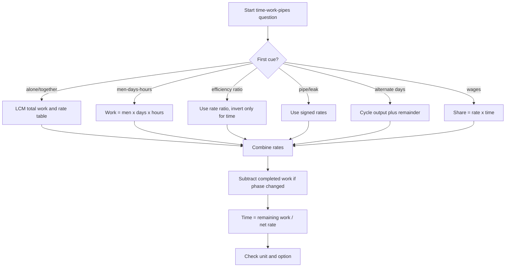

## Concept Ladder

**36-second Quant scoring bar**  
Time-Work and Pipes should be 36-second rate questions. Use 5 seconds to choose LCM work units or signed pipe rates, 20-25 seconds to combine efficiencies, and the last 5 seconds to check whether the question asks total time, remaining work, wages, or tank fill/empty time.

### Corpus Pressure

The uploaded book-PYQ corpus marks `time-work-pipes` as a 50/50 Quant topic with 324 promoted questions. The strongest repeat area is ordinary Work and Time, but the same rate-unit engine also powers pipes, leaks, wages, alternate-day work, and men-day changes. Treat this as one rate chapter: every question is total work divided by net rate after the first 5-second classification.

| Corpus bucket | Promoted questions | What it usually tests | 36-second implication |
|---|---:|---|---|
| `Work and Time` | 139 promoted questions | Basic combined work, individual rates, efficiency ratios, men-days, remaining work | LCM unit selection must be automatic |
| `ssc-maths-6800-mcq-p0341-p0360` | 112 promoted questions | Dense book-PYQ practice around standard work, partnership of rates, cyclic work | Solve by rate table, not by fractions in the head |
| `ssc-maths-6800-mcq-p0381-p0400` | 47 promoted questions | Mixed work, pipes, leakage, staggered starts, partial tanks | Use signed rates and event checkpoints |
| `ssc-maths-6800-mcq-p0361-p0380` | 6 promoted questions | Residual advanced work variants | Keep as repair set after basics are fast |
| `Pipe and Cistern` | 5 promoted questions | Inlet, outlet, leak, partial filling | Sign discipline decides the score |

### First 5-Second Classification

| First cue in question | Bucket | First move |
|---|---|---|
| "A alone", "B alone", "together" | Basic combined work | Choose LCM of times as total work, write rates |
| "men", "women", "boys", "days" | Men-days | Use total man-days only if equal efficiency is implied |
| "twice efficient", "20% more work" | Efficiency ratio | Convert to rate ratio, then invert only for time |
| "alternate days", "one day each" | Cyclic work | Compute full cycle output, then handle remainder day |
| "fills", "empties", "leak" | Pipes and cisterns | Mark inlet as positive, outlet/leak as negative |
| "left", "joined", "after x days" | Phase change | Compute completed work before the event, then remaining |
| "wages", "paid", "share" | Work wages | Split in proportion to rate x time, not attendance alone |

### Full Type Tree for 50/50

| Type code | Shape | Fast model | Fail trigger |
|---|---|---|---|
| TWP-1 | A and B alone/together | LCM total work -> add rates -> W/R | Adding days directly |
| TWP-2 | A+B together, A alone, find B | Rate subtraction: B = together - A | Subtracting times instead of rates |
| TWP-3 | Men-days equal efficiency | Work = men x days x hours | Forgetting hours/day changes |
| TWP-4 | Different efficiencies | Convert efficiency to rate ratio | Applying simple man-days |
| TWP-5 | Percentage efficiency | 25% more = 5:4 rate ratio | Using 25 as a time change directly |
| TWP-6 | Alternate-day work | Cycle output + remainder | Ignoring who starts |
| TWP-7 | A leaves or joins | Phase table: done, left, new rate | Reusing original combined rate |
| TWP-8 | Wages | Share = rate x time | Equal split because they worked together |
| TWP-9 | Inlet/outlet pipes | Signed net rate | Adding outlet as positive |
| TWP-10 | Leak | Leak = normal fill rate - net fill rate | Treating leak time as fill time |
| TWP-11 | Partially filled tank | Remaining capacity first | Solving for full tank |
| TWP-12 | Staggered pipe starts | Event checkpoint table | Starting all pipes together |

**Prerequisite Arithmetic**  
- Work = Rate x Time (W = R x T).  
- Inverse relationship: more workers -> less time (if all work at same rate).  
- Unit conversion: 1 day = (work done in 1 day).  
- Fraction arithmetic: adding, subtracting, inverting.

**Step 1 - LCM Total Work Unit**  
Assign LCM of all given times as the total work (in units). Then individual rates = work units / time. This avoids fractions and speeds up calculation.

**Step 2 - Efficiency and Rate Conversion**  
Efficiency = work done per unit time. If A takes 5 days and B takes 10 days, let total work = LCM(5,10)=10 units. Then A's rate = 2 units/day, B's rate = 1 unit/day. Combined rate = 3 units/day -> time = 10/3 days.

**Step 3 - Men-Days and Inverse Proportionality**  
Work = Men x Days (if constant rate per man). If men change, time changes inversely. Example: 12 men finish in 8 days -> work = 96 man-days. To finish in 6 days, need 96/6 = 16 men.

**Step 4 - Combined Work with Positive and Negative Rates (Pipes)**  
Inlet fills at +rate, outlet drains at -rate. Net rate = sum of signed rates. Time to fill/empty = total work / net rate. For partially filled tanks, work done = remaining part.

**Step 5 - Alternate-Day and Cyclic Work**  
If A and B work on alternate days, compute their pair's output in 2 days. Then find how many such cycles fit, then handle leftover.

**Step 6 - Work and Wages Distribution**  
Wages are proportional to work done (or to individual rates x time). If A and B work together, share of total wage = (A's rate x A's time) : (B's rate x B's time).

**Exam-Level Integration**  
- Multi-step problems: combine pipes with partial filling, then start/stop of one pipe.  
- Efficiency given as percentage or ratio.  
- Misleading language: "A is twice as efficient as B" -> rate ratio 2:1, not time ratio.  
- Work left undone after some workers leave.

## Type System

| Type | Recognition Cue | Method | Speed Target | Trap |
|------|-----------------|--------|--------------|------|
| Basic LCM Work | "A takes x days, B takes y days, together?" | LCM as total work; add rates | <30 sec | Forgetting to invert time to rate |
| Men-Days | "M men do work in D days" | Work = M x D; find required men or days | <20 sec | Confusing direct/inverse |
| Efficiency Ratio | "A is 3 times as efficient as B" | Let B = 1 unit/day, A = 3; find total | <40 sec | Misinterpreting ratio as time |
| Alternate Day Work | "A works day1, B day2, repeat" | Find 2-day output; cycle count + leftover | <50 sec | Ignoring partial cycles |
| Pipes Inlet/Outlet | "Pipe A fills, pipe B empties" | Use + for inlet, - for outlet; net rate | <40 sec | Sign error - adding instead of subtracting |
| Leak + Fill | "A fills, but there is a leak" | Net rate = fill rate - leak rate | <45 sec | Confusing leak as negative capacity |
| Wages Distribution | "Wages paid according to work" | Share = rate x time proportion | <35 sec | Dividing equally |
| Cyclic with Stoppage | "A works for 2 days then leaves, B continues" | Compute work done in first phase, then remaining by B | <50 sec | Assuming they work together always |
| Partially Filled Tank | "Tank is half full, then inlets opened" | Required work = remaining fraction | <30 sec | Using full tank work |
| Variable Efficiencies | "A does 20% more work than B" | Convert % to ratio (6:5) | <45 sec | Taking 20% as 1.2 vs 0.8 |
| Combined with Hours | "Works 6 hours/day" | Convert all work to hourly rates | <40 sec | Using day rate without hour adjustment |
| Multiple Pipes Simultaneous | "Three pipes open at different times" | Track cumulative work at each event | <60 sec | Not adjusting for staggered start |

## Speed Methods

**Mental Conversion Tables** (for common LCMs)  
| Given Days | LCM (Work) | Individual Rates (units/day) |
|------------|------------|------------------------------|
| 2,3       | 6          | 3,2                          |
| 3,4       | 12         | 4,3                          |
| 4,5       | 20         | 5,4                          |
| 6,8       | 24         | 4,3                          |
| 10,15     | 30         | 3,2                          |
| 7,9       | 63         | 9,7                          |

**Step-by-Step Algorithm for LCM method**  
1. Identify all time values (days, hours, minutes) - convert to same unit.  
2. Compute LCM of those numbers -> Total Work (W).  
3. Rate of each person = W / time.  
4. For combined: sum rates (keep sign for pipes).  
5. Time = W / net rate.  
6. For alternation: find 2-unit cycle output, then multiply.

**Efficiency Shortcut**  
If A = n times B, use rate ratio directly: B's rate = 1 unit/day and A's rate = n units/day. For combined work, total rate = n + 1 units/day. Keep the same total work unit throughout; LCM is still the safest method when actual completion times are given.

**Wages Quick Proportion**  
If A works for x days at rate a, B works for y days at rate b, then total wage W is split as (a*x) : (b*y). No need to find total work.

**Partial Work**  
If work done = k units, remaining = total - k. Then extra time = remaining / net rate.

**Sign Handling for Pipes**  
- Inlet (+), Outlet (-).  
- Net rate = (+ sum of inlets) - (+ sum of outlets).  
- If net rate positive -> fills; negative -> empties. Time = absolute(W)/|net rate|.

## Trap Table

1. **Assuming rates are additive without common unit** - Always convert to same unit (e.g., work per day).  
2. **Mistaking "twice as efficient" for "half the time"** - Efficiency ratio is inverse of time ratio.  
3. **Forgetting to convert hours to days** - If some work 8 hours/day, others 6 hours/day, must use hourly rates.  
4. **Ignoring left work after partial work** - When some workers leave, recalculate remaining work with new combined rate.  
5. **Adding inlet and outlet rates arithmetically without sign** - Always assign sign based on flow direction.  
6. **Using total work as 1 (fraction method) when LCM is faster** - LCM eliminates fraction addition errors.  
7. **Applying man-day formula when workers have different efficiencies** - Only valid if all men work at same rate.  
8. **For alternate-day work, assuming one cycle = 2 days then taking integer part without remainder** - Always compute full cycles and then a partial day.  
9. **Wages: dividing based on time only instead of work done** - Wages = share of output, not time share.  
10. **Leak considered as a separate pipe that never closes** - Leak always negative; if pipe also closes, leak still acts.  
11. **Misreading "A and B together take 12 days, A alone takes 20 days, find B alone"** - Do not invert directly; use LCM.  
12. **Skipping to check if tank is already partly filled** - Work left = full - initial, not full.

## Flowchart

## Solved Examples

**Example 1 (Basic LCM)**  
A alone can do a work in 15 days, B alone in 20 days. How many days will they take together?  
(a) 8 4/7  
(b) 8 5/7  
(c) 9  
(d) 7 1/2  
**Answer:** (a) 8 4/7  
**Explanation:** LCM(15,20)=60 units. A's rate=4, B's=3. Combined=7. Time=60/7=8 4/7.

**Example 2 (Men-days)**  
12 men finish a work in 10 days. How many men are needed to finish in 8 days?  
(a) 15  
(b) 18  
(c) 14  
(d) 16  
**Answer:** (a) 15  
**Explanation:** Total work=12x10=120 man-days. Required men=120/8=15.

**Example 3 (Efficiency ratio)**  
A is twice as efficient as B. Together they finish in 18 days. In how many days can A alone finish?  
(a) 27  
(b) 24  
(c) 36  
(d) 30  
**Answer:** (a) 27  
**Explanation:** Let B's rate=1, A's rate=2. Work in 18 days = (1+2)x18=54 units. A's time = 54/2=27.

**Example 4 (Alternate day)**  
A can do in 6 days, B in 10 days. They work alternately starting with A. In how many days work done?  
(a) 6 1/3  
(b) 7 1/3  
(c) 7 2/3  
(d) 8  
**Answer:** (b) 7 1/3  
**Explanation:** LCM(6,10)=30. A's rate is 5 units/day and B's rate is 3 units/day. One two-day cycle gives 8 units. After 3 cycles, 6 days have passed and 24 units are complete. Remaining work = 6 units. Day 7 is A's turn, so A completes 5 units and leaves 1 unit. On day 8, B completes 1 unit in 1/3 day. Total time = 7 1/3 days.

**Example 5 (Pipes Inlet/Outlet)**  
Pipe A fills a tank in 12 hours, Pipe B empties it in 18 hours. If both are opened together, how long to fill?  
(a) 36  
(b) 24  
(c) 30  
(d) 32  
**Answer:** (a) 36  
**Explanation:** LCM(12,18)=36 units. A rate = +3 units/hr, B rate = -2 units/hr. Net rate = +1 unit/hr. Time = 36/1 = 36 hours.

**Example 6 (Leak + Fill)**  
A pipe can fill a tank in 10 hours. Due to a leak, it takes 15 hours. How long would the leak alone empty the tank?  
(a) 30  
(b) 25  
(c) 20  
(d) 40  
**Answer:** (a) 30  
**Explanation:** Let total = LCM(10,15)=30 units. Fill rate = 3 units/hr. Net rate with leak = 2 units/hr. Leak rate = 3 - 2 = 1 unit/hr empty. Time to empty alone = 30/1 = 30 hours.

**Example 7 (Wages)**  
A, B, C can do a work in 10, 15, 20 days respectively. They together get Rs.6500. Find B's share.  
(a) 2000  
(b) 2500  
(c) 1500  
(d) 2600  
**Answer:** (a) 2000  
**Explanation:** LCM(10,15,20)=60. Rates: A=6, B=4, C=3 per day. Work done per day together=13. Ratio of wages = 6:4:3. B's share = (4/13)x6500 = 2000.

**Example 8 (Partial Work - Men leaving)**  
20 men can complete a job in 30 days. They start work and after 5 days, 5 men leave. How many more days will the remaining take?  
(a) 30  
(b) 33 1/3  
(c) 35  
(d) 25  
**Answer:** (b) 33 1/3  
**Explanation:** Total work = 20x30 = 600 man-days. Work done in 5 days = 20x5=100. Remaining = 500. Men left = 15. Days = 500/15 = 33 1/3.

**Example 9 (Multiple pipes staggered)**  
Pipe A fills in 12 hours, B in 18 hours. A is opened at 8 am, B at 10 am. At what time will the tank be full?  
(a) 6 pm  
(b) 8 pm  
(c) 4 pm  
(d) 5 pm  
**Answer:** (c) 4 pm  
**Explanation:** LCM(12,18)=36. A's rate is 3 units/hr and B's rate is 2 units/hr. From 8 am to 10 am, A alone fills 2x3 = 6 units. Remaining work = 30 units. After 10 am, combined rate = 5 units/hr. Time needed = 30/5 = 6 hours. Finish time = 10 am + 6 hours = 4 pm.

**Example 10 (Variable efficiencies - percentage)**  
A does 25% more work than B. B alone can finish a work in 30 days. How many days for A alone?  
(a) 24  
(b) 20  
(c) 22.5  
(d) 27  
**Answer:** (a) 24  
**Explanation:** A's efficiency = 125% of B = 5/4 of B. So time ratio A:B = 4:5 (inverse). B takes 30 -> A takes (4/5)x30 = 24.

**Example 11 (Cyclic with stoppage)**  
A can do a work in 6 days, B in 8 days. They start together but after 2 days, A leaves. How many days will B take to finish remaining?  
(a) 3 1/3  
(b) 4  
(c) 2  
(d) 5  
**Answer:** (a) 3 1/3  
**Explanation:** LCM(6,8)=24. A=4, B=3. Together 2 days = 7x2=14 units. Remaining 10. B's time = 10/3 = 3 1/3.

**Example 12 (Partially filled tank + leak)**  
Tank is 2/5 full. Pipe A fills in 5 hours, pipe B empties in 20 hours. Both opened together. How many hours to fill?  
(a) 4  
(b) 5  
(c) 6  
(d) 8  
**Answer:** (a) 4  
**Explanation:** LCM(5,20)=20. Pipe A fills at +4 units/hr and pipe B empties at -1 unit/hr. Net rate = +3 units/hr. Since the tank is already 2/5 full, remaining work is 3/5 of 20 = 12 units. Time = 12/3 = 4 hours.

**Example 13 (Together and one alone)**  
A and B together complete a work in 12 days. A alone completes it in 20 days. In how many days can B alone complete it?  
(a) 25  
(b) 30  
(c) 35  
(d) 40  
**Answer:** (b) 30  
**Explanation:** LCM(12,20)=60 units. Together rate = 5 units/day, A rate = 3 units/day, so B rate = 2 units/day. B alone time = 60/2 = 30 days.

**Example 14 (Three workers together)**  
A, B and C can complete a work in 12, 15 and 20 days respectively. In how many days will they complete it together?  
(a) 4  
(b) 5  
(c) 6  
(d) 8  
**Answer:** (b) 5  
**Explanation:** LCM(12,15,20)=60 units. Rates are 5, 4 and 3 units/day. Combined rate = 12. Time = 60/12 = 5 days.

**Example 15 (Work left after fixed days)**  
A can do a work in 24 days and B can do it in 36 days. They work together for 8 days. What fraction of work remains?  
(a) 1/3  
(b) 4/9  
(c) 5/9  
(d) 2/3  
**Answer:** (b) 4/9  
**Explanation:** LCM(24,36)=72 units. A rate=3, B rate=2, together=5. In 8 days they do 40 units. Remaining = 32/72 = 4/9.

**Example 16 (Men-days with partial work)**  
18 men can complete a work in 20 days. After working 5 days, 6 men leave. How many more days are needed?  
(a) 18  
(b) 20  
(c) 22.5  
(d) 25  
**Answer:** (c) 22.5  
**Explanation:** Total work = 18 x 20 = 360 man-days. Work done in 5 days = 90. Remaining = 270. Men left = 12. Days = 270/12 = 22.5.

**Example 17 (Hours per day changes)**  
10 men working 6 hours per day finish a work in 12 days. How many days will 8 men working 9 hours per day take?  
(a) 8  
(b) 10  
(c) 12  
(d) 15  
**Answer:** (b) 10  
**Explanation:** Total work = 10 x 6 x 12 = 720 man-hours. New daily work = 8 x 9 = 72 man-hours. Days = 720/72 = 10.

**Example 18 (Efficiency percentage)**  
A is 50% more efficient than B. If B alone completes a work in 30 days, how many days will A and B together take?  
(a) 10  
(b) 12  
(c) 15  
(d) 18  
**Answer:** (b) 12  
**Explanation:** A:B efficiency = 150:100 = 3:2. If B rate=2, A rate=3. B alone time 30 means total work = 2 x 30 = 60 units. Together rate = 5. Time = 60/5 = 12.

**Example 19 (Efficiency and time ratio)**  
A can complete a work in 16 days. B is 25% less efficient than A. In how many days can B complete the work?  
(a) 18  
(b) 20  
(c) 21 1/3  
(d) 24  
**Answer:** (c) 21 1/3  
**Explanation:** B efficiency = 75% of A = 3/4 of A. Time is inverse, so B time = 16 x 4/3 = 64/3 = 21 1/3 days.

**Example 20 (Alternate day with B starting)**  
A can do a work in 8 days and B in 12 days. They work on alternate days starting with B. In how many days is the work complete?  
(a) 9 1/3  
(b) 9 2/3  
(c) 10  
(d) 10 1/3  
**Answer:** (b) 9 2/3  
**Explanation:** LCM(8,12)=24 units. A rate=3, B rate=2. A two-day cycle starting B then A gives 5 units. After 4 cycles, 8 days and 20 units done. Day 9 is B: 2 units done, 2 units remain. Day 10 is A and needs 2/3 day. Total = 9 2/3 days.

**Example 21 (A joins later)**  
A can complete a work in 10 days and B in 15 days. B starts alone and A joins after 3 days. How many total days are needed?  
(a) 7 1/5  
(b) 7 4/5  
(c) 8 1/5  
(d) 8 4/5  
**Answer:** (b) 7 4/5  
**Explanation:** LCM(10,15)=30 units. A rate=3, B rate=2. B alone for 3 days completes 6 units. Remaining = 24. Together rate=5, so extra time = 24/5 = 4.8 days. Total = 3 + 4.8 = 7 4/5 days.

**Example 22 (Clean A joins later)**  
A can complete a work in 12 days and B in 18 days. B works alone for 6 days, then A joins. How many total days are required?  
(a) 10 4/5  
(b) 11 2/5  
(c) 12  
(d) 13 1/5  
**Answer:** (a) 10 4/5  
**Explanation:** LCM(12,18)=36 units. A rate=3, B rate=2. B alone in 6 days completes 12 units. Remaining = 24. Together rate=5, so extra time = 24/5 = 4 4/5 days. Total = 10 4/5 days.

**Example 23 (Two inlets one outlet)**  
Two pipes fill a tank in 12 hours and 15 hours. A third pipe empties it in 20 hours. If all are opened together, how long will the tank take to fill?  
(a) 8  
(b) 9  
(c) 10  
(d) 12  
**Answer:** (c) 10  
**Explanation:** LCM(12,15,20)=60 units. Filling rates = 5 and 4, outlet = -3. Net rate = 6 units/hr. Time = 60/6 = 10 hours.

**Example 24 (Leak from delayed discovery)**  
A tap fills a tank in 8 hours. A leak can empty the full tank in 12 hours. If the tap and leak are both active, what fraction of the tank is filled in 3 hours?  
(a) 1/8  
(b) 1/6  
(c) 1/4  
(d) 3/8  
**Answer:** (a) 1/8  
**Explanation:** LCM(8,12)=24 units. Tap rate=3 units/hr, leak rate=-2 units/hr, net=1 unit/hr. In 3 hours, filled = 3 units out of 24 = 1/8.

**Example 25 (Wages with unequal days)**  
A can do a work in 10 days and B can do it in 15 days. A works for 3 days and B works for 6 days. If total wage for the completed part is Rs.7000, what is A's share?  
(a) Rs.2500  
(b) Rs.3000  
(c) Rs.3500  
(d) Rs.4000  
**Answer:** (b) Rs.3000  
**Explanation:** LCM(10,15)=30 units. A rate=3, B rate=2. A's work = 3 x 3 = 9 units. B's work = 2 x 6 = 12 units. Ratio = 9:12 = 3:4. A's share = 3/7 of 7000 = Rs.3000.

## PYQ Mapping

This section connects topic types to the book-PYQ practice routes and the live topic drills:

- **Basic Combined Work & LCM Method** -> Practice on [Time, Work, and Pipes Topic Page](/exams/ssc-cgl/topics/time-work-pipes) - solve at least 20 problems using LCM logic until you hit 30 sec per question.
- **Men-Days & Inverse Proportion** -> Use the same topic page, filter "men-days" type. Speed target: 20 sec.
- **Efficiency Ratios & Percentage** -> Also on topic page, about 15 problems. Recognize and convert quickly.
- **Alternate Day & Cyclic Work** -> Use the topic page, 10 problems. Master the 2-day cycle method.
- **Pipes & Cisterns (Inlet/Outlet)** -> On topic page, 20 problems. Always draw sign diagram.
- **Leak and Partial Tank** -> Topic page, 10 problems. Use LCM approach.
- **Wages Distribution** -> Topic page, 10 problems. Practice proportion directly.
- **Mixed and Staggered Starts** -> Topic page, 10 problems. Track cumulative work.
- **Speed Test** -> After individual types, take full-length tests from [SSC CGL Quantitative Aptitude Speed Sprint](/exams/ssc-cgl/tests/ssc-cgl-quantitative-aptitude-speed-sprint). Aim for 15 questions in 15 minutes, 100% accuracy on time-work-pipes.

## 200/200 Drill

**Timed Micro-Drills** (do each in strict time limit):

1. **LCM Blitz** (2 min): Solve 4 basic combined work questions (e.g., A 12, B 18; A 15, B 20; A 24, B 36; A 8, B 12). Answer in days as fractions.
2. **Men-Days Sprint** (1.5 min): 3 questions of type "12 men finish in 10 days, how many men for 6 days?" plus "work done by 8 men in 12 days, how many days for 16 men?" and "20 men complete 1/3 work in 5 days, how many men to finish rest in 10 days?".
3. **Pipe Signs** (2 min): 4 pipe problems with inlet/outlet, some with leakage. Write net rate and time.
4. **Alternate & Wages** (2.5 min): 2 alternate day problems, 2 wages problems.
5. **Mixed Bag** (3 min): 5 mixed types from the six categories above.

**Repair Rules** - if you miss a question during drill:  
- Identify the trap from the Trap Table.  
- Re-solve using the step-by-step algorithm from Speed Methods.  
- Time yourself again on a similar question from the topic page.  
- If sign or ratio error, write the correct sign/ratio on a sticky note and place on your study table.

**Final Check**: Before the exam, re-read the Trap Table and Flowchart in 5 minutes. Do one warm-up micro-drill (3 questions in 2 minutes) from [Speed Sprint](/exams/ssc-cgl/tests/ssc-cgl-quantitative-aptitude-speed-sprint) to activate speed.
<!-- SSC-FINAL-PRACTICE-QUEUE:START -->
## Final Practice Queue

1. Start one-by-one practice: [Time, Work, and Pipes practice](/exams/ssc-cgl/practice/time-work-pipes). Finish every question in this topic bank, not just the samples in the note.
2. Move to timed sets: [SSC CGL tests](/exams/ssc-cgl/tests?topic=time-work-pipes). Use topic drills first, then section mocks once accuracy is stable.
3. Repair every miss immediately: record the error label, redo 20 mixed questions from the same topic, then retest after 24 hours.
4. 200/200 rule: do not mark this topic exam-ready until correct answers come within 36 seconds and wrong answers are explained without looking at the solution.

<!-- SSC-FINAL-PRACTICE-QUEUE:END -->
