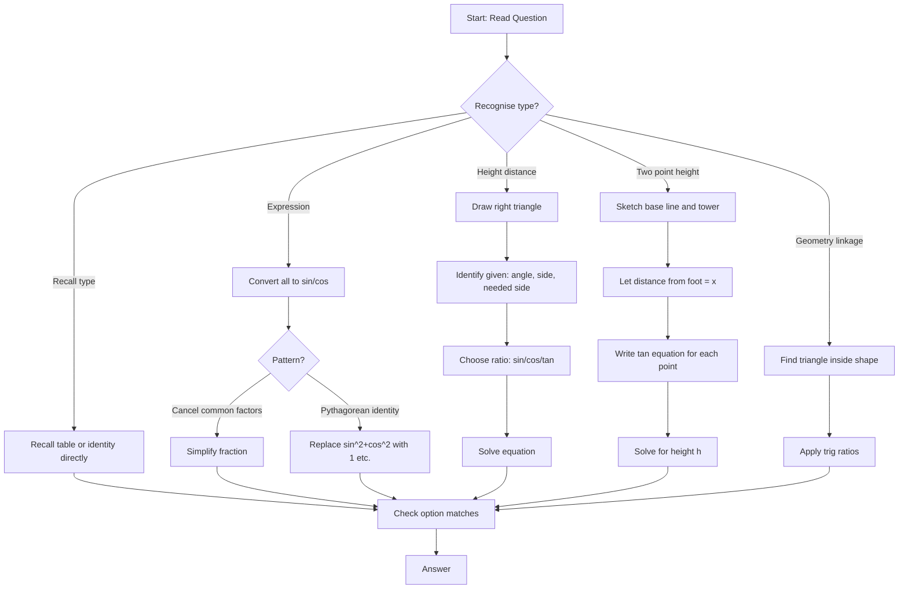

## Concept Ladder

1. **First Principles (Right Triangle)**  
   - In a right triangle with angle theta (acute), define:  
     - sin theta = opposite/hypotenuse  
     - cos theta = adjacent/hypotenuse  
     - tan theta = opposite/adjacent  
     - cot theta = adjacent/opposite = 1/tan theta  
     - sec theta = hypotenuse/adjacent = 1/cos theta  
     - cosec theta = hypotenuse/opposite = 1/sin theta  

2. **Standard Values (0, 30, 45, 60, 90 degrees)**  
   - Memorise table:  
     | Angle | sin | cos | tan | cot | sec | cosec |  
     |-------|-----|-----|-----|-----|-----|-------|  
     | 0     | 0   | 1   | 0   | inf | 1   | inf   |  
     | 30    | 1/2 | sqrt3/2 | 1/sqrt3 | sqrt3 | 2/sqrt3 | 2 |  
     | 45    | 1/sqrt2 | 1/sqrt2 | 1 | 1 | sqrt2 | sqrt2 |  
     | 60    | sqrt3/2 | 1/2 | sqrt3 | 1/sqrt3 | 2 | 2/sqrt3 |  
     | 90    | 1   | 0   | inf | 0   | inf | 1     |  
   - Fraction forms and surds must be automatic.

3. **Identities (Foundation)**  
   - Reciprocal: sin.cosec=1, cos.sec=1, tan.cot=1  
   - Quotient: tan = sin/cos, cot = cos/sin  
   - Pythagorean: sin^2 + cos^2 = 1; 1+tan^2 = sec^2; 1+cot^2 = cosec^2  

4. **Complementary Angle Rules**  
   - sin(90-A)=cos A, cos(90-A)=sin A, tan(90-A)=cot A, cot(90-A)=tan A, sec(90-A)=cosec A, cosec(90-A)=sec A  

5. **Exam-Level Integration**  
   - Simplify expressions using identities; convert to sin/cos when stuck.  
   - Height-distance: diagram with right triangle, angle of elevation/depression.  
   - Geometry linkage: angles in triangles (sum 180), parallel lines, alternate angles.  
   - Substitution: when degrees unknown, use x for speed.  
   - Option testing: when expression simplifies to constant, test with theta=30 or 45.  
   - Approximation: for non-standard angles in height-distance, use approximate ratios (sin 30 ~ 0.5, etc.) but prefer exact values.

### Corpus Pressure

The uploaded book-PYQ corpus marks `trigonometry` as a 200/200 dominant-repeat Quant topic with 561 promoted questions. The biggest bucket is direct `Trigonometry` with 487 questions, and the remaining tagged questions spill into geometry, algebra, number-system/calculation pages, and speed-distance style applications. That means this page has to train two separate muscles:

1. **Instant recall**: standard values, reciprocal pairs, complementary pairs, and the three Pythagorean identities.
2. **Expression control**: long-looking algebraic trigonometry expressions must be reduced by pattern recognition, not expanded blindly.

For SSC CGL Tier-I speed, the target is not "know trigonometry". The target is:

| Corpus pressure | What it demands | 36-second implication |
|---:|---|---|
| 487 direct trig questions | Values, identities, simplification, ratios from given sin/cos/tan | Most direct trig questions must finish in 15-25 seconds |
| `ssc-maths-6800-mcq-p0061-p0080` | 22 promoted questions from the book-page bucket that reinforces direct values and triangle reconstruction | Treat this as a focused value-to-triangle repair set |
| Mixed geometry tags | Diagonal, altitude, triangle, and angle relationships | Draw the right triangle before choosing a ratio |
| Algebra-linked tags | Expressions with powers, products, and substitutions | Convert to sin/cos or test an option angle |
| Calculation pages | Surd arithmetic and rationalisation | Keep `sqrt3`, `1/sqrt3`, `2/sqrt3`, `sqrt2` exact |
| Height-distance style prompts | One or two right triangles | Use tan first unless hypotenuse is explicitly involved |

One wrong trigonometry recall can convert an easy 20-second mark into a 2.5-mark loss. For 50/50 Quant, every standard value and identity must be automatic enough that your attention stays on the question wording.

## Type System

| Type | Recognition Cue | Method | Speed Target | Trap |
|------|----------------|--------|--------------|------|
| Standard Value | Direct ask: sin 30, cos 60 | Recall table; 5 sec | 10 sec | Confusing sin 30 vs sin 60; use memory trick: sin 0=0, sin30=1/2, sin45=1/sqrt2, sin60=sqrt3/2, sin90=1 |
| Reciprocal | "Find cosec if sin = a/b" | Use 1/value; 5 sec | 10 sec | Forgetting to invert numerator/denominator |
| Complementary | "sin 60 = cos ?" | Apply complementary identity; 5 sec | 10 sec | Using wrong pair (sin to tan) |
| Pythagorean (find ratio) | "sin = 3/5, find cos" | sin^2+cos^2=1; 10 sec | 15 sec | Sign ambiguity; acute means positive |
| Quotient | "tan from sin and cos" | tan = sin/cos; 5 sec | 10 sec | Dividing incorrectly (flip) |
| Identity Simplification | "Simplify sin^2 + cos^2" | Use identity to get constant; 10 sec | 10 sec | Not recognizing pattern, over-complicating |
| Expression with multiple ratios | "Simplify (1+tan^2)/(1+cot^2)" | Convert to sin/cos or sec/cosec; 20 sec | 20 sec | Mismatch of identities; use cross-check with theta=45 |
| Height-Distance (single triangle) | "Shadow, angle, find height" | tan = opposite/adjacent; 15 sec | 20 sec | Using wrong ratio (sin vs tan) or forgetting to rationalise |
| Height-Distance (two points) | "From point A angle 30, from B angle 60, find height" | Set up two tan equations, solve for height; 30 sec | 30 sec | Incorrectly assigning distances; draw diagram |
| Geometry linkage (e.g., in square/rectangle) | "Diagonal makes angle 30, find side" | Use triangle inside figure; 20 sec | 25 sec | Assuming angle without checking |

### Full Type Tree for 200/200

Use this type tree while reviewing. Every missed trigonometry question must be assigned to one row; otherwise the repair is too vague.

| Type code | Question shape | First move | Fast route | Fail trigger |
|---|---|---|---|---|
| T1 | sin/cos/tan/cot/sec/cosec standard value | Recall table | Pattern sin rises, cos falls | Table not instant |
| T2 | Reciprocal from given ratio | Invert pair | sin-cosec, cos-sec, tan-cot | Answer repeats given value |
| T3 | Complementary angle | Convert 90 - A pair | sin<->cos, tan<->cot, sec<->cosec | Wrong pair |
| T4 | Given sin or cos, find another ratio | Draw triangle or use identity | 3-4-5, 5-12-13, 8-15-17 patterns | Forgot hypotenuse |
| T5 | Given tan/cot, find sin/cos/sec/cosec | Build opposite-adjacent triangle | tan = opp/adj, hyp by Pythagoras | Used tan as sin |
| T6 | Direct Pythagorean identity | Match pattern | sin^2 + cos^2 = 1 and variants | Expanded unnecessarily |
| T7 | Expression with reciprocal ratios | Replace reciprocal products | sin*cosec = 1, tan*cot = 1 | Treating product as square |
| T8 | Expression with quotient ratios | Convert tan/cot | tan = sin/cos, cot = cos/sin | Dividing in wrong order |
| T9 | Expression with `1 - sin^2` or `1 - cos^2` | Use complement square | 1 - sin^2 = cos^2 | Leaves expression long |
| T10 | Expression with `sec^2 - tan^2` | Pythagorean reverse | Equals 1 | Sign error |
| T11 | Product-to-sum or sum-product prompt | Recognise formula family | Use only if formula is directly asked | Trying to derive in exam |
| T12 | tan(A +/- B) expression | Spot numerator-denominator pattern | tan(A +/- B) = (tanA +/- tanB)/(1 -/+ tanA tanB) | Sign in denominator reversed |
| T13 | Half/double angle from advanced book-style prompts | Decide if Tier-I-worthy or skip | Use identity only if clean | Spending 90 seconds |
| T14 | Height-distance single triangle | Draw tower/shadow | tan angle = height/base | Used sin when base is given |
| T15 | Height-distance two points | Draw common tower, two bases | Two tan equations | Mixed near/far distance |
| T16 | Geometry figure trig | Find right triangle in figure | Label opposite/adjacent/hypotenuse | Assumed wrong angle |
| T17 | Option substitution | Test theta = 45 or 30 | Only if expression is angle-independent | Substituted invalid value |
| T18 | Surd simplification | Keep exact form | Rationalise only if options require | Decimal approximation |

## Speed Methods

**36-second attempt plan:** For all trig questions, aim 20-30 seconds. Use the following decision rules:

- **Direct formula**: If standard value or identity, recall instantly. No calculation time.
- **Option testing**: If expression simplifies to one of few constants (0,1,tan,etc.), test theta=45 or 60.
- **Approximation**: Only for non-standard angles in height-distance (rare in CGL); else use exact values.
- **Substitution**: Replace unknown theta with a convenient acute angle (30 or 45) to test options quickly.
- **Skip-and-return**: If question seems lengthy (two-point height-distance without diagram), spend max 40 seconds; if stuck, mark for later.

**Recall Tables (Memorise):**

Standard values (see Concept Ladder). Identity quick list:

- sin^2 A + cos^2 A = 1
- sec^2 A - tan^2 A = 1
- cosec^2 A - cot^2 A = 1
- sin A cosec A = 1
- cos A sec A = 1
- tan A cot A = 1
- tan A = sin A / cos A
- cot A = cos A / sin A

Complementary pairs:

- sin(90-A) = cos A
- cos(90-A) = sin A
- tan(90-A) = cot A
- cot(90-A) = tan A
- sec(90-A) = cosec A
- cosec(90-A) = sec A

### Standard Value Memory Grid

Memorise this as a shape, not as scattered facts.

| Angle | sin | cos | tan | cot | sec | cosec |
|---:|---:|---:|---:|---:|---:|---:|
| 0 | 0 | 1 | 0 | not defined | 1 | not defined |
| 30 | 1/2 | sqrt3/2 | 1/sqrt3 | sqrt3 | 2/sqrt3 | 2 |
| 45 | 1/sqrt2 | 1/sqrt2 | 1 | 1 | sqrt2 | sqrt2 |
| 60 | sqrt3/2 | 1/2 | sqrt3 | 1/sqrt3 | 2 | 2/sqrt3 |
| 90 | 1 | 0 | not defined | 0 | not defined | 1 |

Memory rule:

- sin values rise from 0 to 1.
- cos values are sin values in reverse.
- tan = sin/cos.
- cot = 1/tan.
- sec = 1/cos.
- cosec = 1/sin.

Do not memorise sec and cosec separately first. Derive them from cos and sin until the derivation is instant.

### Identity Toolbox by Use Case

| Need | Identity | When to use | Example pattern |
|---|---|---|---|
| Kill squares | sin^2 A + cos^2 A = 1 | Any sum of sin-square and cos-square | sin^2 A + cos^2 A + tanA cotA |
| Replace `1 - sin^2` | 1 - sin^2 A = cos^2 A | Numerator/denominator has complement square | (1 - sin^2 A) / cos^2 A |
| Replace `1 - cos^2` | 1 - cos^2 A = sin^2 A | Same as above | (1 - cos^2 A) / sin^2 A |
| Kill sec/tan | sec^2 A - tan^2 A = 1 | Difference of sec-square and tan-square | sec^2 30 - tan^2 30 |
| Kill cosec/cot | cosec^2 A - cot^2 A = 1 | Difference of cosec-square and cot-square | cosec^2 A - cot^2 A |
| Convert ratio | tan A = sin A / cos A | Expression has tan with sin/cos terms | tanA cosA |
| Convert reciprocal | sec A = 1 / cos A | Expression has sec/cosec/cot products | cosA secA |
| Complementary | sin(90-A)=cosA | Angles add to 90 | sin35 - cos55 |
| Addition formula | tan(A+B) = (tanA+tanB)/(1-tanA tanB) | Book-style expressions with tan72 and tan27 | tanA - tanB - tanA tanB |
| Product-to-sum | sinA sinB = 1/2[cos(A-B)-cos(A+B)] | Only if directly asked in options | sinA sinB = ? |

The 200/200 rule: if an identity is not immediately visible by 20 seconds, convert everything to sin and cos. This is slower than a direct identity, but it is safer than staring at the expression.

### Triangle Pattern Recall

Many ratio-finding questions are not about trigonometry at all; they are Pythagoras in disguise.

| Given | Triangle | Useful ratios |
|---|---|---|
| tan A = 3/4 | opposite 3, adjacent 4, hypotenuse 5 | sin=3/5, cos=4/5, sec=5/4 |
| sin A = 5/13 | opposite 5, hypotenuse 13, adjacent 12 | cos=12/13, tan=5/12 |
| cos A = 8/17 | adjacent 8, hypotenuse 17, opposite 15 | sin=15/17, tan=15/8 |
| cot A = 12/5 | adjacent 12, opposite 5, hypotenuse 13 | tan=5/12, sin=5/13 |
| sec A = 25/7 | hypotenuse 25, adjacent 7, opposite 24 | cos=7/25, tan=24/7 |

When the angle is acute, all six ratios are positive. If the book-style question mentions quadrant, apply signs carefully; for Tier-I-style acute identities, do not invent negative signs.

### Option Testing and Substitution

Use substitution when the expression appears identity-like and options are constants. Pick an angle that makes arithmetic safe:

| Substitute | Use when | Avoid when |
|---|---|---|
| theta = 45 | Expression has tan and cot; both become 1 | Denominator becomes 0 |
| theta = 30 | Expression has sin/cos standard values | Surds make options too close |
| theta = 60 | Expression has complementary pairs | Surds become messy |

Example: If options are 0, 1, 2, and -1, and expression is `(sin^2 A + cos^2 A) / (tanA cotA)`, choose A = 45. Numerator = 1, denominator = 1, result = 1. This is faster than formal proof.

Never substitute when the question asks for a specific angle result like sin30 or a height-distance measurement. Substitution is for identity verification, not for changing the question.

**Step-by-step algorithms:**

1. **Given sin, find cos**: cos = (1 - sin^2). Check quadrant (acute positive).
2. **Simplify expression**: Convert everything to sin and cos. Cancel common factors. Apply Pythagorean if sum of squares appears.
3. **Height-distance**: Draw right triangle, label given side as opposite/adjacent. Decide ratio: if angle and opposite known, use tan; if hypotenuse and opposite, use sin. Solve for unknown.
4. **Two-point height**: Let height = h, distances from base = d1, d2. tan 1 = h/d1, tan 2 = h/d2. Use given difference or total of d1,d2 to solve.
5. **Option testing**: If expression yields constant irrespective of theta, substitute theta=30 (or 45) and evaluate numeric value; match with options.

## Trap Table

| Trap | Trigger Wording | Wrong Move | Correct Move | Repair Drill |
|------|----------------|------------|--------------|-------------|
| Confusing sin/cos standard values | "sin 30" | Answer sqrt3/2 by swapping it with sin60 | Use memory: sin values rise from 0 to 1 | Repeat table daily: write sin 0,30,45,60,90 from memory |
| Reciprocal mistake | "Find cosec if sin = 3/5" | Answer 3/5 | cosec = 5/3 | Practise inverting fractions: 1/(a/b)=b/a |
| Complementary mispair | "cos 60 =" | tan 30 | cos 60 = sin 30 | Write all six complementary pairs |
| Identity sign confusion | "sin^2 + cos^2" | 0 | 1 | Recall "1 = sin^2+cos^2" always |
| tan = sin/cos order | "Find tan from sin, cos" | cos/sin | sin/cos | Remember tan = opposite/adjacent = sin/cos |
| cot=1/tan mistake | "cot = 2, find tan" | 2 | 1/2 | cot and tan are reciprocals |
| Height-distance: wrong ratio | "angle of elevation 45, shadow 10 m, height?" | Use sin 45 = height/hypotenuse | Use tan 45 = height/shadow | Always identify which side is opposite/adjacent |
| Decimal approximation | "tan 30 =" | 0.333 | 1/3 or 0.577 | Use exact surd form; no approximation unless specified |
| Forgetting to rationalise | "sec 30 =" | Leave 2/sqrt3 when options are rationalised | sec 30 = 2/sqrt3 = 2sqrt3/3 | Practise rationalising 1/sqrt3 and 2/sqrt3 |
| Two-point height: distance confusion | "from 30 m away angle 30, from 10 m away angle 60" | Subtract distances incorrectly | Let distance from nearer point = x, then height = x tan60 = (x+20)tan30 | Draw diagram with base line and tower |
| Expression not simplifying | "(1 - sin^2)/cos^2" | Leaves as fraction | cos^2/cos^2 = 1 | Replace 1 - sin^2 with cos^2 |
| cot/sec/cosec values mis-recalled | "cot 45 =" | 0 | 1 | Standard table: cot 45 = 1/tan45 = 1 |
| Acute angle assumption | "If tan = 3/4, find sin" | sin = 3/4 | Draw triangle: opp=3, adj=4, hyp=5, sin=3/5 | Always compute hypotenuse by Pythagoras |
| Geometry linkage: angle inside square | "Diagonal makes 45" | Side = diagonal/2 | Side = diagonal/2 | Use right triangle in square: diagonal = side2 |
| Double angle (not in scope, but confusion) | "sin 120" on CGL? Not asked; but trap | Trying to use standard value for 120 | Not needed; CGL only acute angles in identities | Stick to 0-90 degrees; if >90, use complementary rule? Not required. |

## Flowchart

## Solved Examples

**Example 1: Standard Value**  
Find sin 30 degrees.  
Options: (a) 1/2 (b) 1/sqrt(2) (c) sqrt(3)/2 (d) 1  
**Solution**: From the standard value table, sin 30 degrees = 1/2. **Answer: (a) 1/2**

**Example 2: Complementary Angle**  
cos 60 degrees is equal to:  
Options: (a) sin 30 degrees (b) sin 60 degrees (c) tan 30 degrees (d) cot 60 degrees  
**Solution**: cos theta = sin(90 degrees - theta). Therefore cos 60 degrees = sin 30 degrees. **Answer: (a) sin 30 degrees**

**Example 3: Pythagorean Identity**  
If sin theta = 3/5 and theta is acute, find cos theta.  
Options: (a) 2/5 (b) 3/4 (c) 4/5 (d) 5/4  
**Solution**: sin^2 theta + cos^2 theta = 1. cos theta = sqrt(1 - 9/25) = sqrt(16/25) = 4/5. **Answer: (c) 4/5**

**Example 4: Tan from Sin and Cos**  
If sin theta = 5/13 and cos theta = 12/13, find tan theta.  
Options: (a) 5/12 (b) 12/5 (c) 13/5 (d) 5/13  
**Solution**: tan theta = sin theta / cos theta = (5/13)/(12/13) = 5/12. **Answer: (a) 5/12**

**Example 5: Reciprocal Identity**  
If tan theta = 3/4, find cot theta.  
Options: (a) 3/4 (b) 4/3 (c) 5/3 (d) 5/4  
**Solution**: cot theta is reciprocal of tan theta. Therefore cot theta = 4/3. **Answer: (b) 4/3**

**Example 6: Expression Simplification**  
Simplify sin^2 theta + cos^2 theta.  
Options: (a) 0 (b) 1 (c) tan theta (d) sec theta  
**Solution**: The basic Pythagorean identity is sin^2 theta + cos^2 theta = 1. **Answer: (b) 1**

**Example 7: Sec and Cos**  
If cos theta = 2/5, find sec theta.  
Options: (a) 2/5 (b) 5/2 (c) 3/5 (d) 5/3  
**Solution**: sec theta = 1/cos theta = 1/(2/5) = 5/2. **Answer: (b) 5/2**

**Example 8: Height and Distance**  
A pole casts a shadow of 10 m when the angle of elevation of the sun is 45 degrees. Find the height of the pole.  
Options: (a) 5 m (b) 10 m (c) 15 m (d) 20 m  
**Solution**: tan 45 degrees = height/shadow = height/10. Since tan 45 degrees = 1, height = 10 m. **Answer: (b) 10 m**

**Example 9: Height with tan 30**  
The angle of elevation of the top of a tower is 30 degrees from a point 30sqrt(3) m away. Find the height of the tower.  
Options: (a) 10 m (b) 20 m (c) 30 m (d) 40 m  
**Solution**: tan 30 degrees = height/distance = h/(30sqrt(3)). Since tan 30 degrees = 1/sqrt(3), h = 30 m. **Answer: (c) 30 m**

**Example 10: Identity Conversion**  
Simplify 1 + tan^2 theta.  
Options: (a) sec^2 theta (b) cosec^2 theta (c) cot^2 theta (d) sin^2 theta  
**Solution**: The identity is 1 + tan^2 theta = sec^2 theta. **Answer: (a) sec^2 theta**

**Example 11: Triangle From tan**  
If tan theta = 5/12 and theta is acute, find sin theta.  
Options: (a) 5/12 (b) 12/13 (c) 5/13 (d) 13/5  
**Solution**: tan = opposite/adjacent = 5/12. Hypotenuse = sqrt(5^2 + 12^2) = 13. Therefore sin = opposite/hypotenuse = 5/13. **Answer: (c) 5/13**

**Example 12: Complementary Pair**  
Find the value of sin 38 degrees - cos 52 degrees.  
Options: (a) 0 (b) 1 (c) -1 (d) 2  
**Solution**: cos 52 degrees = sin(90 - 52) = sin 38 degrees. Therefore sin38 - cos52 = sin38 - sin38 = 0. **Answer: (a) 0**

**Example 13: Reverse Identity**  
Simplify sec^2 A - tan^2 A + cosec^2 A - cot^2 A.  
Options: (a) 0 (b) 1 (c) 2 (d) 3  
**Solution**: sec^2 A - tan^2 A = 1 and cosec^2 A - cot^2 A = 1. Total = 2. **Answer: (c) 2**

**Example 14: Convert to sin/cos**  
Simplify tan A cos A.  
Options: (a) sin A (b) cos A (c) sec A (d) cosec A  
**Solution**: tan A = sin A / cos A. So tan A cos A = sin A. **Answer: (a) sin A**

**Example 15: Option Substitution**  
Simplify `(sin^2 A + cos^2 A) / (tan A cot A)`.  
Options: (a) 0 (b) 1 (c) tan A (d) sec A  
**Solution**: sin^2 A + cos^2 A = 1 and tan A cot A = 1. The value is 1. If you do not see it instantly, substitute A = 45 degrees: numerator = 1 and denominator = 1. **Answer: (b) 1**

**Example 16: Height-Distance With tan 60**  
From a point 20 m away from the foot of a tower, the angle of elevation is 60 degrees. Find the height of the tower.  
Options: (a) 10 m (b) 20 m (c) 20sqrt3 m (d) 40 m  
**Solution**: tan60 = height/base = h/20. Since tan60 = sqrt3, h = 20sqrt3 m. **Answer: (c) 20sqrt3 m**

**Example 17: Shadow From Height**  
A tree is 12sqrt3 m high. If the angle of elevation of the sun is 60 degrees, find the shadow length.  
Options: (a) 12 m (b) 18 m (c) 24 m (d) 36 m  
**Solution**: tan60 = height/shadow = 12sqrt3 / shadow. Since tan60 = sqrt3, shadow = 12 m. **Answer: (a) 12 m**

**Example 18: Two-Point Height**  
The angle of elevation of the top of a tower from a point is 30 degrees. From a point 20 m nearer to the tower, the angle is 60 degrees. Find the height.  
Options: (a) 10 m (b) 10sqrt3 m (c) 20 m (d) 20sqrt3 m  
**Solution**: Let nearer distance be x and height be h. Then h/x = tan60 = sqrt3, so h = x sqrt3. Farther distance = x + 20, and h/(x+20) = tan30 = 1/sqrt3. Therefore h sqrt3 = x + 20. Substitute h = x sqrt3: 3x = x + 20, so x = 10. Hence h = 10sqrt3 m. **Answer: (b) 10sqrt3 m**

**Example 19: Product-to-Sum Recognition**  
Which identity represents sin A sin B?  
Options: (a) 1/2[cos(A-B)-cos(A+B)] (b) 1/2[cos(A-B)+cos(A+B)] (c) 1/2[sin(A+B)+sin(A-B)] (d) 1/2[sin(A+B)-sin(A-B)]  
**Solution**: The product-to-sum identity is sin A sin B = 1/2[cos(A-B)-cos(A+B)]. **Answer: (a) 1/2[cos(A-B)-cos(A+B)]**

**Example 20: tan(A-B) Pattern**  
Find the value of `tan72 - tan27 - tan72 tan27` if 72 degrees and 27 degrees are read as A and B with A-B = 45 degrees and the expression is compared to the tan(A-B) denominator pattern.  
Options: (a) -1 (b) 0 (c) 1 (d) 2  
**Solution**: Since 72 degrees = 45 degrees + 27 degrees, let t = tan27. Then tan72 = tan(45+27) = (1+t)/(1-t). The expression becomes `(1+t)/(1-t) - t - t(1+t)/(1-t) = (1-t)/(1-t) = 1`. **Answer: (c) 1**

**Example 21: Given sec**  
If sec A = 13/5 and A is acute, find tan A.  
Options: (a) 5/12 (b) 12/5 (c) 13/12 (d) 12/13  
**Solution**: sec = hypotenuse/adjacent = 13/5. Opposite = sqrt(13^2 - 5^2) = 12. Therefore tan = opposite/adjacent = 12/5. **Answer: (b) 12/5**

**Example 22: Identity With `1 - sin^2`**  
Simplify `(1 - sin^2 A) / cos^2 A`.  
Options: (a) 0 (b) 1 (c) tan^2 A (d) sec^2 A  
**Solution**: 1 - sin^2 A = cos^2 A. Therefore the expression becomes cos^2 A / cos^2 A = 1. **Answer: (b) 1**

**Example 23: Triangle Reconstruction From cosec**  
If cosec A = 25/7 and A is acute, find cot A.  
Options: (a) 7/24 (b) 24/7 (c) 25/24 (d) 24/25  
**Solution**: cosec = hypotenuse/opposite = 25/7, so take hypotenuse = 25 and opposite = 7. Adjacent = sqrt(25^2 - 7^2) = sqrt(625 - 49) = sqrt576 = 24. Therefore cot A = adjacent/opposite = 24/7. This is a 20-second triangle question if you remember the 7-24-25 triplet. **Answer: (b) 24/7**

**Example 24: Complementary Product**  
Simplify `sin(90 - A) sec A`.  
Options: (a) 0 (b) 1 (c) tan A (d) cot A  
**Solution**: sin(90 - A) = cos A. Therefore the expression becomes cos A sec A = 1. The fastest route is complementary pair first, reciprocal product second. **Answer: (b) 1**

**Example 25: tan-cot Algebra Under Timer**  
If tan A + cot A = 2, find tan^2 A + cot^2 A.  
Options: (a) 0 (b) 1 (c) 2 (d) 4  
**Solution**: Let x = tan A and 1/x = cot A. Given x + 1/x = 2. Squaring, x^2 + 2 + 1/x^2 = 4, so x^2 + 1/x^2 = 2. Therefore tan^2 A + cot^2 A = 2. Do not solve a quadratic here; square the sum and subtract 2. **Answer: (c) 2**

## PYQ Mapping

- **Standard Values & Reciprocals**: Direct recall; most common in Tier-I. Practice route: /exams/ssc-cgl/topics/trigonometry - drill flashcard set.
- **Complementary Angles**: Usually paired with identities. Solve 10 questions from the practice route.
- **Pythagorean/Quotient Identity**: Used in simplification and ratio-finding. Practice with complex fractions.
- **Expression Simplification**: High-weightage in CGL 2020-2024. Work through mixed expressions involving sec, tan, cosec.
- **Height-Distance (single triangle)**: Often as first question of trigonometry section. Solve 5-10 using tan with standard angles.
- **Height-Distance (two-point)**: Less frequent but appears in mains; practise with variable distances. Link to geometry-mensuration: /exams/ssc-cgl/topics/geometry-mensuration for triangle properties.
- **Geometry linkage**: Questions where angle from diagonal or altitude given. Use practice route above.
- For speed sprint, take timed tests: /exams/ssc-cgl/tests/ssc-cgl-quantitative-aptitude-speed-sprint - aim for 5 trig questions in under 3 minutes.

### Practice Routing by Error Type

| Error type | Route | What to do |
|---|---|---|
| Standard value error | `/exams/ssc-cgl/topics/trigonometry` | Use only direct recall questions until the table is instant |
| Identity simplification error | `/exams/ssc-cgl/topics/trigonometry` | Tag every miss as reciprocal, quotient, or Pythagorean |
| Diagram/height-distance error | `/exams/ssc-cgl/topics/geometry-mensuration` plus trig topic | Draw the triangle before opening options |
| Slow expression handling | `/exams/ssc-cgl/tests/ssc-cgl-quantitative-aptitude-speed-sprint` | Cap each trig question at 36 seconds |
| Surd arithmetic error | `/exams/ssc-cgl/topics/calculation-speed` | Drill sqrt2/sqrt3 rationalisation and exact values |

Do not count a trigonometry mistake as repaired after reading the solution once. It is repaired only when you solve another same-type question under the timer and can name the identity used.

## 200/200 Drill

**Timed Micro-Drills (complete each in 60 seconds)**  

Drill 1: Standard values  
- Write sin 0, sin 30, sin 45, sin 60, sin 90  
- Write cos 0, cos 30, cos 45, cos 60, cos 90  
- Write tan 0, tan 45, tan 60, cot 30, sec 45  
(Time: 60 sec; if any wrong, redo the table five times)

Drill 2: Reciprocal fill  
- sin A = 3/5, cosec A = ?  
- cos B = 7/25, sec B = ?  
- tan C = 2, cot C = ?  
- sec D = 13/5, cos D = ?  
(Time: 60 sec; for each, if error >1, drill with flash cards)

Drill 3: Complementary Pairs  
- sin 30 = cos ?  
- cos 60 = sin ?  
- tan 45 = cot ?  
- sec 30 = cosec ?  
- cosec 45 = sec ?  
(Time: 30 sec; if any wrong, write all six pairs)

Drill 4: Simplify expressions  
- sin^2 60 + cos^2 60  
- 1 + tan^2 45  
- sec^2 30 - tan^2 30  
- (1 - sin^2 30)/cos^2 30  
(Time: 40 sec; use identity, no calculator)

Drill 5: Height-Distance quick  
- Angle 45, shadow 15 m, height?  
- Angle 30, distance 103 m, height?  
- Tower height 20 m, shadow length when angle 60?  
(Time: 30 sec; draw mental triangle)

Drill 6: Identity family sorting  
- Put each expression into one family: reciprocal, quotient, Pythagorean, complementary, height-distance.  
- `sinA cosecA`, `1 + tan^2A`, `tanA cosA`, `sin(90-A)`, `h/base`.  
(Time: 45 sec; if a family is missed, write the identity group twice)

Drill 7: Triangle reconstruction  
- tan A = 7/24, find sin A and cos A.  
- cot B = 8/15, find tan B and cosec B.  
- sec C = 17/8, find sin C and tan C.  
(Time: 90 sec; every answer must come from a drawn or mental right triangle)

Drill 8: 10-question mixed trig sprint  
- 3 standard values  
- 2 reciprocal questions  
- 2 identity simplifications  
- 2 triangle reconstruction questions  
- 1 height-distance question  
(Time: 6 minutes maximum. If more than one wrong, repeat the same pattern next day.)

**Repair Rules:**  
- If you misrecall any standard value (for example, writing sin60 as 1/2), repeat the table 10 times until error-free.  
- If you invert reciprocal (cosec given as 1/sin but answer sin = 2/5 gives cosec = 5/2; wrong if you wrote 2/5), practise 1/(a/b) = b/a twenty times.  
- If you forget complementary pair (e.g., cos 60 = sin 30), write pair list on a sticky note and glance before every drill.  
- For expression simplification, if you cannot see identity, convert everything to sin and cos - this always works.  
- For height-distance, always draw a minimal diagram even if mental - prevents ratio mistakes.

**Race Condition:** In 15 minutes for 25 Quant questions, allocate max 36 seconds per trig question. Use the 36-second attempt plan: if you cannot solve in 20 seconds, use substitution (theta=45) or option elimination. If still stuck, mark for review and move on. For height-distance, if two-point problem takes >30 seconds, solve partially (find h in terms of one variable) and check options. Always end with a guess if time runs out - but with drill, you should solve all trig questions in under 30 seconds.

### Mastery Standard

You can treat trigonometry as exam-ready only when all four standards are true:

1. You can write the full standard value table from memory in under 75 seconds.
2. You can solve 20 direct identity/value questions with 18 or more correct in under 8 minutes.
3. You can solve 5 height-distance questions without choosing the wrong ratio.
4. In a mixed Quant section, no trigonometry question takes more than 45 seconds unless it is a deliberate skip-and-return item.

If any standard fails, do not add more random mocks. Repair the exact failing layer: table, identity family, triangle reconstruction, or height-distance diagram.
<!-- SSC-FINAL-PRACTICE-QUEUE:START -->
## Final Practice Queue

1. Start one-by-one practice: [Trigonometry practice](/exams/ssc-cgl/practice/trigonometry). Finish every question in this topic bank, not just the samples in the note.
2. Move to timed sets: [SSC CGL tests](/exams/ssc-cgl/tests?topic=trigonometry). Use topic drills first, then section mocks once accuracy is stable.
3. Repair every miss immediately: record the error label, redo 20 mixed questions from the same topic, then retest after 24 hours.
4. 200/200 rule: do not mark this topic exam-ready until correct answers come within 36 seconds and wrong answers are explained without looking at the solution.

<!-- SSC-FINAL-PRACTICE-QUEUE:END -->
