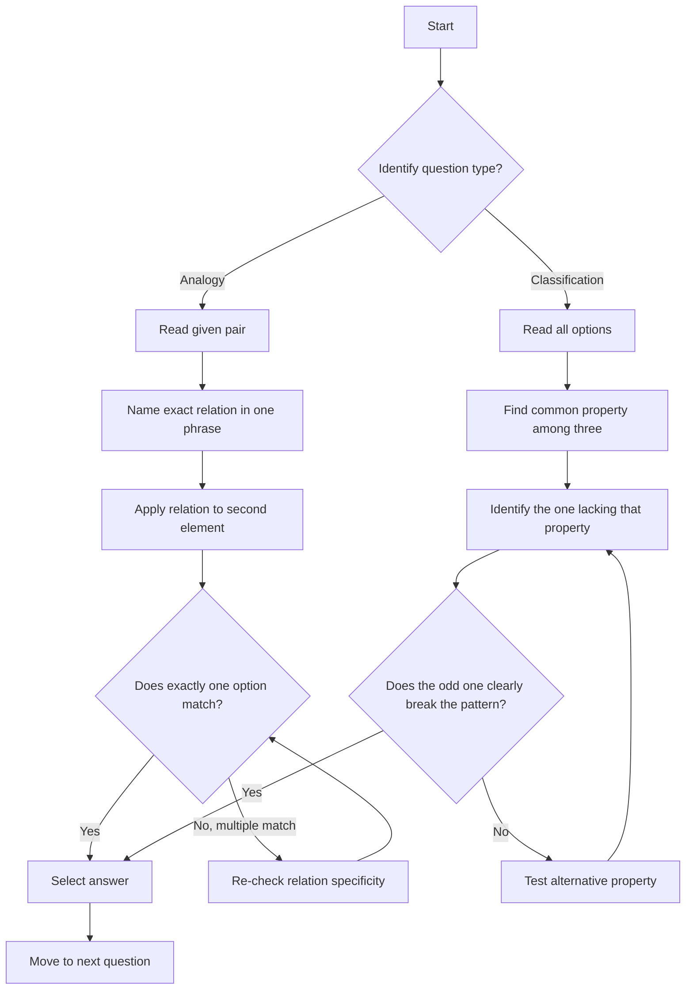

## Concept Ladder

**Step 1: Core Definition**  
Analogy means identifying a relation between a given pair (words/numbers/letters) and applying the same relation to a new pair. Classification (odd-one-out) means finding the element that does not share the common property/relation of the group.

### Corpus Pressure

The uploaded book-PYQ corpus marks `analogy-classification` as a 200/200 dominant-repeat Reasoning topic with 1285 promoted questions. The corpus signal is unusually strong: all 1285 are tagged from the reasoning book import stream, so this note must train the exact skill the book repeatedly tests: relation recognition under time pressure.

The source pressure is concentrated in `Scribd HTML Pages`, which contributes **1285 indexed book-PYQ entries** and **1285 promoted questions** to this topic. Treat that as a mandate for breadth: the note must cover word analogy, number analogy, letter analogy, mixed code-style analogy, semantic odd one out, number classification, letter classification, and relation-direction traps.

For the SSC CGL Tier-I Reasoning section, the constraint is brutal: 25 questions in 15 minutes means 36 seconds per question if time is evenly distributed. Analogy and classification should usually finish faster than that, because they are the questions that protect time for seating, statement-conclusion, non-verbal, or calculation-heavy reasoning.

Use this priority table:

| Corpus pressure | What must become automatic | Why it affects 200/200 |
|---:|---|---|
| 1285 promoted questions | Word, number, letter, and mixed relation families | These are repeated enough that hesitation is avoidable |
| Scribd HTML Pages | 1285 indexed book-PYQ entries from the imported reasoning book | Practice should use book-backed relation families, not generic puzzle guessing |
| High trap density | Direction, partial relation, broad category, two-step number logic | A relation that is only half right creates a negative mark risk |
| Fast-mark nature | Many items are solvable in 10-25 seconds | Saving 10 seconds here helps harder reasoning questions |
| Mixed source wording | "same relation", "similar relationship", "does not belong", "odd one" | You must identify the command before solving |
| Classification overlap | Odd-one-out can be category, number property, letter pattern, or pair logic | Broad category guesses are the common wrong answers |

The mastery standard is not "I understand analogy". The standard is: in 10 seconds, you can name the exact relation family; in 25 seconds, you can select the answer; and if two options look possible, you can explain why one relation is more exact.

**Step 2: First Principles - Relation Types**  
All analogies rely on one of these fundamental relations:  
- **Functional**: purpose/use (pen:write, knife:cut)  
- **Part-Whole**: component vs set (wheel:car, page:book)  
- **Cause-Effect**: rain:flood, fire:smoke  
- **Sequence/Order**: day:night, first:second  
- **Degree/Intensity**: cool:frigid, warm:scorching  
- **Class/Member**: bird:sparrow, fruit:apple  
- **Opposite/Antonym**: hot:cold, light:dark  
- **Synonym/Similar**: happy:joyful  
- **Mathematical**: square, cube, product, difference, digit sum, etc.  
- **Letter pattern**: shift (+1,+2 etc.), reverse order, positional mapping

**The SSC relation sentence rule**  
Never solve an analogy by "feeling" that words are connected. Write a short relation sentence:

| Given pair | Bad relation | Exact relation sentence |
|---|---|---|
| Pen : Write | "both related to study" | A pen is used to write |
| Wheel : Car | "vehicle relation" | A wheel is a part of a car |
| Doctor : Hospital | "medical" | A doctor works in a hospital |
| 9 : 81 | "big number" | Second number is square of first |
| ACE : BDF | "letters increase" | Each letter shifts forward by 1 |

Only after the sentence is exact should you look at options. If the sentence is vague, the answer will be vulnerable to distractors.

**Step 3: Exam-Level Integration**  
In SSC CGL Tier-I, analogy and classification appear as 2-4 questions in the 25-question Reasoning section (15 minutes). The target is 30-40 seconds per question with 100% accuracy. The key is to **name the exact relation before looking at options** (for analogy) and to **identify the common property first** (for classification). Speed comes from mastering relation families and immediate pattern recognition.

**Step 4: Advanced Traps**  
- Partial relation match: e.g., "pen:write" vs "knife:cut" is functional; a student might mistakenly treat it as "both are tools." But the relation is more specific: item to primary action.  
- Number analogy with multiple steps: e.g., 9:81 (square) vs 12:? (144), but sometimes it's digit product or sum. Always test the simplest relation first.  
- Classification where all seem different: Look for category, property, mathematical property, or sequence consistency.

## Type System

### First 5-Second Classification

The first five seconds are for naming the command and relation family, not for staring at options. This is the classifier that keeps analogy/classification under the 20-25 second target.

| First signal | Immediate class | First action |
|---|---|---|
| Two word pairs with `::` or "same relation" | Word analogy | Say the exact relation sentence: tool-action, part-whole, class-member, cause-effect, synonym, antonym, degree, source-product |
| Four words with "odd one out" | Semantic classification | Find the narrowest property shared by exactly three items |
| Two number pairs | Number analogy | Test square, cube, multiply/divide, add/subtract, n^2 +/- k, n^3 +/- k, digit sum, digit product, reverse |
| Four numbers | Number classification | Test prime/composite, square, cube, power, divisibility, digit sum, sequence rule |
| Letter group to letter group | Letter analogy | Convert to positions and check equal shift, alternating shift, reverse, opposite alphabet, or internal gaps |
| Four letter clusters | Letter classification | Check internal gaps first, then starting-letter progression |
| Word to number | Mixed word-number analogy | Add, multiply, or pattern letter positions; do not use word meaning first |
| Letter to number | Alphabet position analogy | Use anchors A=1, E=5, J=10, M=13, N=14, O=15, T=20, Z=26 |
| Two options feel possible | Trap-filter situation | Check direction and primary relation; reject associated-but-secondary matches |
| Relation not named by 15 seconds | Skip threshold | Mark and move; return after easier reasoning questions |

| Type | Recognition Cue | Method | Speed Target | Trap |
|------|-----------------|--------|--------------|------|
| Word Analogy (Function) | "used for", "works with", "purpose of" | Identify primary action of first word; find option with matching action. | 20s | Choosing a word that is associated but not the primary action (e.g., knife:sharpener instead of cutting) |
| Word Analogy (Part-Whole) | "is a part of", "component of" | Find the whole that contains the first word. | 20s | Confusing part-whole with whole-part (reverse order) |
| Word Analogy (Cause-Effect) | "leads to", "causes", "results in" | Determine what effect the first word produces. | 25s | Choosing a related but indirect effect (e.g., rain:water vs rain:flood) |
| Word Analogy (Opposite/Synonym) | "opposite of", "same as" | Find antonym or synonym directly. | 15s | Overthinking; the relation is often direct |
| Number Analogy (Square/Cube) | Numbers like 9,16,25,27,64 | Check if first is square/cube of a number; second should be square/cube of the same logic. | 30s | Mismatch of operation (e.g., 9:81 is square, but 12:144 is square; some test cube vs square confusion) |
| Number Analogy (Digit/Sum/Product) | Two-digit numbers, or numbers that aren't perfect powers | Try digit sum, product, reverse digits, difference. | 35s | Assuming only one operation; always test multiplication/addition first |
| Letter Analogy (Shift) | Letters in sequence, like ACE to BDF | Find step increment between letters. | 20s | Forgetting to apply same shift to all letters; mixing forward/backward direction |
| Letter Analogy (Position) | Single letter to number, or letter to letter | Convert to alphabet positions (A=1, B=2...). | 25s | Miscalculating positions (skipping letters or including space) |
| Classification (Category) | Mixed items like Rose, Lotus, Lily, Mango | Identify the category that three share; odd one is different. | 15s | Assuming a broad category that includes all (e.g., "living things") - need a narrow common property |
| Classification (Number property) | Numbers like 16,25,36,48 | Check prime, composite, square, cube, even/odd, digit sum. | 20s | Failing to test all properties; often square vs non-square is common |
| Classification (Letter pattern) | Groups of letters like BDF, HJL, NPR, TVX | Check gap between consecutive letters; also check starting letter positions. | 25s | Missing that pattern may be two-tier: gap within group and gap between starting letters |
| Pair Relation Naming | Two words given, find missing word for new pair | Name relation exactly ("doctor works in hospital" -> "teacher works in school"). | 20s | Choosing a word that fits only a partial relation (e.g., teacher:student instead of workplace) |

### Full Type Tree for 200/200

Use this table as the repair checklist. If any row is slow, it belongs in daily practice until relation naming becomes automatic.

| Cluster | Subtype | Recognition cue | Fast action | Common distractor |
|---|---|---|---|---|
| Word analogy | Tool to action | Pen:Write, Knife:Cut | Write "used to..." | Associated object instead of action |
| Word analogy | Person to workplace | Doctor:Hospital, Judge:Court | Write "works in..." | Person served by profession |
| Word analogy | Person to instrument | Farmer:Plough, Soldier:Rifle | Write "uses..." | Workplace or product |
| Word analogy | Animal to young one | Cow:Calf, Dog:Puppy | Recall young-one pair | Gender word instead of young one |
| Word analogy | Animal to sound | Dog:Bark, Lion:Roar | Recall sound pair | Habitat or young one |
| Word analogy | Object to material | Table:Wood, Ornament:Gold | Write "made of..." | Place where object is found |
| Word analogy | Part to whole | Page:Book, Petal:Flower | Check direction | Whole-to-part reversal |
| Word analogy | Class to member | Bird:Sparrow, Fruit:Mango | Write "is a type of..." | Part-whole confusion |
| Word analogy | Cause to effect | Fire:Smoke, Rain:Flood | Write "can cause..." | Broad association |
| Word analogy | Synonym | Big:Large, Joy:Delight | Match same meaning | Near but weaker meaning |
| Word analogy | Antonym | Hot:Cold, Expand:Contract | Match opposite meaning | Same category word |
| Word analogy | Degree/intensity | Warm:Hot, Angry:Furious | Identify stronger/weaker | Antonym mistaken for intensity |
| Word analogy | Study/science field | Botany:Plants, Ornithology:Birds | Recall subject-object | Tool or place |
| Word analogy | Country/capital/currency | Japan:Yen, France:Paris | Identify relation type first | Capital-currency swap |
| Word analogy | Product/source | Milk:Cow, Honey:Bee | Write "obtained from..." | Consumer or container |
| Number analogy | Square/cube | 12:144, 6:216 | Test power relation | Picking double/triple |
| Number analogy | Add/subtract constant | 7:12, 15:20 | Difference same | Ratio assumption |
| Number analogy | Multiply/divide | 8:32, 11:44 | Factor same | Addition with same output |
| Number analogy | n^2 +/- k | 5:26, 7:50 | Square then adjust | Only square without adjustment |
| Number analogy | n^3 +/- k | 4:65, 5:126 | Cube then adjust | Square relation |
| Number analogy | Digit sum/product | 37:10, 24:8 | Test sum, product, difference | Reverse digits only |
| Number analogy | Reverse/order | 123:321 | Reverse digits | Digit sum |
| Number classification | Prime/composite | 11,13,17,21 | Check primality | Even/odd only |
| Number classification | Square/cube | 16,25,36,48 | Check perfect power | Divisibility only |
| Letter analogy | Same shift | ACE:BDF | Convert to positions | Applying shift to only first letter |
| Letter analogy | Alternating shift | ACF:BDG | Check each position separately | One common shift assumed |
| Letter analogy | Reverse order | ABC:CBA | Reverse before shifting | Shift before reverse |
| Letter analogy | Opposite alphabet | A:Z, B:Y | Position sum = 27 | Simple forward shift |
| Letter classification | Internal gaps | BDF, HJL, NPR, TWZ | Check gap inside group | Only checking starting letters |
| Letter classification | Starting gap | BDF, HJL, NPR, TVX | Check first-letter progression | Internal gap only |
| Mixed analogy | Letter-number | C:3, H:8 | A=1 position | Alphabet count error |
| Mixed analogy | Word-number | CAT:24 | Sum/product of letter positions | Word meaning instead of letters |
| Classification | Semantic category | Rose, Lotus, Lily, Mango | Find narrow group of 3 | Broad category that includes all |
| Classification | Profession vs relation | Father, Mother, Sister, Teacher | Identify family/profession | Gender grouping |
| Classification | Object property | Iron, Copper, Silver, Wood | Metal/non-metal or conductor | Use/color association |

### Relation Priority Order

When the relation is not obvious, test in this order:

1. **Word questions**: synonym/antonym, tool-action, part-whole, class-member, person-workplace, animal-young/sound, cause-effect, source-product, science-study.
2. **Number questions**: square, cube, multiply/divide, add/subtract, n^2 +/- k, n^3 +/- k, digit sum/product, reverse.
3. **Letter questions**: alphabet positions, equal shift, alternating shift, reverse, opposite alphabet, internal gaps, starting gaps.
4. **Classification questions**: narrow category, number property, letter pattern, relation pair, exception by direction.

This order prevents the two common time losses: trying clever operations too early, and choosing a broad semantic category before checking the exact one.

## Speed Methods

**For Word/Number/Letter Analogy - Step Algorithm**  
1. **Name the relation** of the given pair in one word or phrase (e.g., "use", "part", "opposite"). Do NOT look at options yet.  
2. **Apply that exact relation** to the second given element. Keep the statement in mind.  
3. **Scan options** quickly - eliminate distractors that violate the relation.  
4. **Verify** that no other option fits the same relation more strongly. If two fit, the question has a trap; pick the most primary/essential.

**For Classification - Step Algorithm**  
1. **Find the common property** among three of the options. Look for category, mathematical property, pattern, or relationship.  
2. **Identify the odd one** as the one lacking that property.  
3. **Double-check** by testing if a different property unites the odd with one other; if so, your common property is wrong. Choose a property that only three share.

**Recall Tables for Common Relation Families**

| Relation Family | Example | How to Verify |
|----------------|---------|---------------|
| Tool -> Action | Pen:Write, Knife:Cut | First item used to perform second. |
| Animal -> Young | Cat:Kitten, Dog:Puppy | Second is baby of first. |
| Person -> Workplace | Doctor:Hospital, Teacher:School | Where they work. |
| Part -> Whole | Wheel:Car, Page:Book | First is component of second. |
| Cause -> Effect | Rain:Flood, Fire:Smoke | First can cause second. |
| Degree -> Intensified | Cool:Frigid, Warm:Scorching | Second is extreme version of first. |
| Number -> Square | 9:81, 12:144 | Second = first^2. |
| Number -> Cube | 8:512, 5:125 | Second = first^3. |
| Number -> Digit sum | 23:5, 41:5 | 2+3=5, 4+1=5. |
| Letter -> Forward shift | ACE:BDF (+1 each) | Each letter increments by 1. |
| Letter -> Backward shift | ZYX:YXW (-1 each) | Each letter decrements by 1. |

**Skip Threshold**  
If after 15 seconds you cannot name the relation (analogy) or cannot spot a common property (classification), **mark the question** and move on. Return only if time permits. Many candidates lose flow by overthinking a single odd analogy.

### 36-Second Attempt Discipline

Use this clock in the Reasoning section:

| Time | Action | Failure sign |
|---:|---|---|
| 0-5s | Identify command: analogy, classification, word pair, number pair, letter cluster | You start reading options before naming type |
| 5-12s | Write relation sentence or common property | Relation is vague, like "related to" |
| 12-22s | Test options against the exact relation | Two options seem equally possible |
| 22-30s | Apply trap filter: direction, broad category, digit operation, alphabet position | You are just guessing by familiarity |
| 30-36s | Mark answer or skip | No exact rule found |

For 200/200, analogy/classification should average 20-25 seconds. Do not spend the full 36 seconds unless it is a number or letter relation with a calculation.

### Alphabet Position Anchors

Memorize these anchors to avoid counting from A every time:

| Letter | Position | Use |
|---|---:|---|
| A | 1 | Start |
| E | 5 | Vowel anchor |
| J | 10 | First double-digit anchor |
| M | 13 | Middle |
| N | 14 | Middle plus one |
| O | 15 | Vowel anchor |
| T | 20 | Common high anchor |
| Z | 26 | End |

For positions near anchors: Q = 17 because it is two after O; W = 23 because it is three before Z; H = 8 because it is two before J.

## Trap Table

| Trap | Trigger Wording | Wrong Move | Correct Move | Repair Drill |
|------|----------------|-------------|--------------|--------------|
| Partial relation match | "Pen is to Write as Knife is to ____" | Choose "Sharpener" because knife's associated object | Choose "Cut" because primary action | Practice naming relation in 3 words: "tool-action" |
| Reverse direction | "Car is to Wheel as Book is to ____" | Choose "Page" (part-whole) instead of whole-part | The given is whole:part, so Book:Page | Test direction: first is whole, second is part. |
| Number square vs cube mix | "8 is to 64 as 27 is to ____" | Choose 81 by treating 27 as 9 | 8^2 = 64, so 27^2 = 729 | Always verify operation before touching options |
| Letter shift confusion | "ACE to BDF as GIK to ____" | Choose HJK (+1, +1, +1) | Correct is HJL (+1,+1,+1) - check each letter position. | Write letter numbers (1,3,5) then add 1 each. |
| Broad category instead of specific | "Rose, Lotus, Lily, Mango" | Say all are living things | Rose, Lotus, Lily are flowers; Mango is fruit | Always choose the narrowest property shared by three |
| Ignoring digit logic | "23 : 5" and "41 : ?" | Assume product: 2*3=6, 4*1=4. But 5 is sum? 2+3=5, 4+1=5. | Correct relation is digit sum. | Write both possibilities (sum, product, difference) and test. |
| Confusing "kind of" vs "part of" | "Sparrow is to Bird as Shark is to ____" | Choose "Fish" (kind of) | Sparrow is a kind of bird; Shark is a kind of fish. But "kind of" and "example of" are same. | Distinguish: "type of" vs "part of". |
| Assumption of single operation | "5 : 25" and "6 : ?" | Try unrelated operations | 5^2 = 25, so 6^2 = 36 | Stick to the simplest relation that fits the full pair |
| Letter grouping with odd spacing | "BDF, HJL, NPR, TWZ" | Check only first letter | BDF, HJL, NPR have internal +2 gaps; TWZ has +3 and +3 | Check gap consistency inside each group |
| Family relation vs profession | "Father, Mother, Sister, Teacher" | Choose Sister (female) | Teacher is the odd one (profession). | Categorize each element's primary attribute. |
| Number classification skipping prime check | "11, 13, 17, 21" | Choose 21 as "odd" | All are odd; 21 is composite (not prime). | Test all properties: even/odd, prime/composite, square, digit sum. |
| Word analogy using secondary meaning | "Light is to Heavy as Gloomy is to ____" | Choose "Dark" (synonym) | Light:Heavy (opposites), Gloomy:Cheerful (opposites). | Determine if relation is synonym, antonym, or something else. |
| Letter-number mix | "A is to 1 as Z is to ____" | Choose 25 (forgetting Z=26) | Z=26. | Memorize alphabet positions 1-26. |
| Classification with one broken number pattern | "2, 4, 8, 15" | Choose 2 because it is prime | 2, 4, 8 are powers of 2; 15 breaks the pattern | Check whether three items form a tighter sequence |

## Flowchart

## Solved Examples

**Example 1: Function Analogy**  
Pen is related to Writing in the same way Knife is related to:  
Options: (a) Cutting (b) Reading (c) Measuring (d) Painting  
**Solution**: A pen is used for writing. A knife is used for cutting. **Answer: (a) Cutting**

**Example 2: Part-Whole Analogy**  
Wheel is related to Car in the same way Page is related to:  
Options: (a) Ink (b) Book (c) Pen (d) Desk  
**Solution**: A wheel is a part of a car. A page is a part of a book. **Answer: (b) Book**

**Example 3: Number Analogy**  
9 is related to 81 in the same way 12 is related to:  
Options: (a) 96 (b) 120 (c) 144 (d) 156  
**Solution**: 81 is 9 squared. 12 squared is 144. **Answer: (c) 144**

**Example 4: Letter Analogy**  
ACE is related to BDF in the same way GIK is related to:  
Options: (a) HJL (b) HJK (c) JLM (d) FIL  
**Solution**: Each letter moves one step forward: A->B, C->D, E->F. Therefore GIK becomes HJL. **Answer: (a) HJL**

**Example 5: Classification by Square**  
Choose the odd one out: 16, 25, 36, 48  
Options: (a) 16 (b) 25 (c) 36 (d) 48  
**Solution**: 16, 25, and 36 are perfect squares. 48 is not a perfect square. **Answer: (d) 48**

**Example 6: Classification by Category**  
Choose the odd one out: Rose, Lotus, Lily, Mango  
Options: (a) Rose (b) Lotus (c) Lily (d) Mango  
**Solution**: Rose, Lotus, and Lily are flowers. Mango is a fruit. **Answer: (d) Mango**

**Example 7: Classification by Prime**  
Choose the odd one out: 11, 13, 17, 21  
Options: (a) 11 (b) 13 (c) 17 (d) 21  
**Solution**: 11, 13, and 17 are prime numbers. 21 is composite. **Answer: (d) 21**

**Example 8: Word Pair Relation**  
Doctor is related to Hospital in the same way Teacher is related to:  
Options: (a) Court (b) School (c) Bank (d) Farm  
**Solution**: A doctor commonly works in a hospital. A teacher commonly works in a school. **Answer: (b) School**

**Example 9: Opposite Relation**  
Hot is related to Cold in the same way Day is related to:  
Options: (a) Light (b) Night (c) Sun (d) Noon  
**Solution**: Hot and cold are opposites. Day and night are opposites. **Answer: (b) Night**

**Example 10: Cause-Effect Relation**  
Rain is related to Flood in the same way Fire is related to:  
Options: (a) Smoke (b) Water (c) Ice (d) Soil  
**Solution**: Heavy rain can cause flood. Fire can cause smoke. **Answer: (a) Smoke**

**Example 11: Letter Classification**  
Choose the odd one out: BDF, HJL, NPR, TWZ  
Options: (a) BDF (b) HJL (c) NPR (d) TWZ  
**Solution**: BDF, HJL, and NPR have letters increasing by +2 inside the group. TWZ has T->W = +3 and W->Z = +3. **Answer: (d) TWZ**

**Example 12: Family Category Classification**  
Choose the odd one out: Father, Mother, Sister, Teacher  
Options: (a) Father (b) Mother (c) Sister (d) Teacher  
**Solution**: Father, Mother, and Sister are family relations. Teacher is a profession. **Answer: (d) Teacher**

**Example 13: Animal Young One**  
Cat is related to Kitten in the same way Horse is related to:  
Options: (a) Calf (b) Foal (c) Cub (d) Colt  
**Solution**: Kitten is the young one of a cat. Foal is the young one of a horse. **Answer: (b) Foal**

**Example 14: Animal Sound**  
Dog is related to Bark in the same way Lion is related to:  
Options: (a) Roar (b) Bray (c) Bleat (d) Chirp  
**Solution**: A dog barks. A lion roars. **Answer: (a) Roar**

**Example 15: Study Field**  
Botany is related to Plants in the same way Ornithology is related to:  
Options: (a) Birds (b) Insects (c) Fishes (d) Reptiles  
**Solution**: Botany is the study of plants. Ornithology is the study of birds. **Answer: (a) Birds**

**Example 16: Material Relation**  
Table is related to Wood in the same way Ring is related to:  
Options: (a) Finger (b) Gold (c) Round (d) Ornament  
**Solution**: The relation is object to material. A table can be made of wood; a ring can be made of gold. **Answer: (b) Gold**

**Example 17: Source Product**  
Bee is related to Honey in the same way Cow is related to:  
Options: (a) Milk (b) Grass (c) Calf (d) Farm  
**Solution**: Honey is obtained from bee; milk is obtained from cow. **Answer: (a) Milk**

**Example 18: Opposite Alphabet**  
A is related to Z in the same way D is related to:  
Options: (a) W (b) X (c) Y (d) V  
**Solution**: Opposite alphabet pairs have positions summing to 27. A(1)+Z(26)=27. D(4) pairs with W(23). **Answer: (a) W**

**Example 19: Letter-Number Position**  
H is related to 8 in the same way Q is related to:  
Options: (a) 15 (b) 16 (c) 17 (d) 18  
**Solution**: H is the 8th letter. Q is the 17th letter. **Answer: (c) 17**

**Example 20: Number Analogy with Adjustment**  
5 is related to 26 in the same way 7 is related to:  
Options: (a) 48 (b) 49 (c) 50 (d) 51  
**Solution**: 5^2 + 1 = 26. Therefore 7^2 + 1 = 50. **Answer: (c) 50**

**Example 21: Digit Sum**  
37 is related to 10 in the same way 46 is related to:  
Options: (a) 8 (b) 9 (c) 10 (d) 24  
**Solution**: 3+7=10. Therefore 4+6=10. **Answer: (c) 10**

**Example 22: Digit Product**  
24 is related to 8 in the same way 36 is related to:  
Options: (a) 9 (b) 12 (c) 18 (d) 21  
**Solution**: 2*4=8. Therefore 3*6=18. **Answer: (c) 18**

**Example 23: Classification by Powers**  
Choose the odd one out: 2, 4, 8, 15  
Options: (a) 2 (b) 4 (c) 8 (d) 15  
**Solution**: 2, 4, and 8 are powers of 2. 15 is not. **Answer: (d) 15**

**Example 24: Classification by Letter Position Gap**  
Choose the odd one out: CFI, JMQ, PSV, WZC  
Options: (a) CFI (b) JMQ (c) PSV (d) WZC  
**Solution**: CFI has +3,+3; JMQ has +3,+4; PSV has +3,+3; WZC wraps with +3,+3. The broken internal gap is JMQ. **Answer: (b) JMQ**

**Example 25: Mixed Word-Number Analogy**  
If CAT is coded as 24 by adding alphabet positions, DOG will be coded as:  
Options: (a) 24 (b) 25 (c) 26 (d) 27  
**Solution**: CAT = C(3)+A(1)+T(20)=24. DOG = D(4)+O(15)+G(7)=26. **Answer: (c) 26**

## PYQ Mapping

Based on the uploaded book-PYQ corpus, analogy and classification is a 1285-question pressure area. Treat the practice route as the primary question bank for this chapter, then use speed sprints to test whether the relation-naming method is automatic.

| Practice block | Corpus-linked demand | Daily target | Route |
|---|---|---:|---|
| Word analogy | Function, part-whole, class-member, cause-effect, synonym, antonym, profession-place | 40 questions | /exams/ssc-cgl/topics/analogy-classification |
| Number analogy | Square, cube, arithmetic operation, digit sum/product, reverse | 30 questions | /exams/ssc-cgl/topics/analogy-classification |
| Letter analogy | Alphabet shifts, internal gaps, opposite alphabet, reverse order | 30 questions | /exams/ssc-cgl/topics/analogy-classification |
| Classification category | Semantic odd-one-out and narrow category recognition | 30 questions | /exams/ssc-cgl/topics/analogy-classification |
| Classification numeric/letter | Prime, square, cube, gap pattern, starting-letter pattern | 30 questions | /exams/ssc-cgl/topics/analogy-classification |
| Overlap repair | Letter/number series contamination | 20 questions | /exams/ssc-cgl/topics/series-coding |

For timed section practice, use /exams/ssc-cgl/tests/ssc-cgl-reasoning-speed-sprint. The target is not only correctness; the target is a 20-25 second average on this chapter so the full Reasoning section remains under control.

## 200/200 Drill

**Timed Micro-Drill 1 (Analogy - 30 seconds)**  
Solve in 30 seconds:  
1. Clock : Time :: Thermometer : ? (a) Heat (b) Temperature (c) Pressure (d) Speed  
2. 8 : 512 :: 6 : ? (a) 216 (b) 36 (c) 72 (d) 128  
3. Cat : Kitten :: Dog : ? (a) Puppy (b) Bitch (c) Pet (d) Canine  
**Answers**: 1-b (A clock measures time; a thermometer measures temperature), 2-a (8^3=512, 6^3=216), 3-a (A kitten is the young one of a cat; a puppy is the young one of a dog)

**Timed Micro-Drill 2 (Classification - 30 seconds)**  
Find odd one in 30 seconds:  
1. 2, 4, 8, 15 (a) 2 (b) 4 (c) 8 (d) 15  
2. Apple, Mango, Potato, Orange (a) Apple (b) Mango (c) Potato (d) Orange  
3. P, R, T, W (a) P (b) R (c) T (d) W  
**Answers**: 1-d (15 is not a power of 2), 2-c (potato is vegetable, rest fruits), 3-d (P=16,R=18,T=20,W=23 - gap not consistent)

**Timed Micro-Drill 3 (Relation Sentence - 2 minutes)**  
Write the exact relation sentence for each pair before looking at options:

| Pair | Relation sentence |
|---|---|
| Knife : Cut | A knife is used to cut |
| Petal : Flower | A petal is a part of a flower |
| Botany : Plants | Botany is the study of plants |
| 6 : 36 | Second is square of first |
| A : Z | Opposite alphabet pair |

Repeat until the sentence appears faster than the options.

**Repair Rules**  
- If you get an analogy wrong: Write the correct relation in your notebook. Create a flashcard for that relation family.  
- If you get a classification wrong: Identify the property you missed. Drill that property (e.g., prime numbers, perfect squares) separately.  
- Speed rule: If you spend >40 seconds on any question, you lose overall time. Practice with a timer. Use the skip threshold: at 20 seconds without confident answer, mark and move.

### Error Autopsy

| Error label | Symptom | Repair action | Retest |
|---|---|---|---|
| Vague relation | You said "related to" instead of a precise sentence | Rewrite the pair as tool-action, part-whole, class-member, etc. | 25 word analogies under 10 minutes |
| Direction reversal | You used whole-part when the pair was part-whole | Add arrows over the pair before options | 20 part-whole and whole-part questions |
| Broad category | Odd-one-out answer used too broad a group | Force the narrowest property shared by exactly three | 30 semantic classification questions |
| Number operation miss | Square/cube/addition/digit logic confused | Test operations in priority order | 30 number analogies in 12 minutes |
| Alphabet count error | Letter position was miscounted | Use anchor letters A, E, J, M, N, O, T, Z | 30 letter-position questions |
| Internal gap miss | Letter cluster checked only by first letter | Write gaps between letters inside each group | 25 letter classification questions |
| Partial relation | Two options seemed possible | Choose the relation that is primary and exact, not just associated | 20 mixed word analogies |
| Time failure | Correct but above 36 seconds | Redo with relation sentence before options | Same set repeated with timer |

**Final Check**  
For 200/200, you must master all 25 solved examples above. Re-solve them blind in 8 minutes. Then practice random book-backed questions from /exams/ssc-cgl/topics/analogy-classification until you can maintain 95-100 percent accuracy with a 20-25 second average.

### Mastery Standard

Analogy and classification is ready for exam pressure only when:

1. You can name at least 30 relation families from memory.
2. You can solve direct word analogies in under 20 seconds.
3. You can solve number and letter analogies in under 30 seconds unless calculation is unusually long.
4. You do not choose an answer until you can state the relation sentence.
5. You can complete a 25-question mixed analogy/classification drill in 12 minutes with at least 24 correct.
6. Every miss has an error label from the autopsy table.
<!-- SSC-FINAL-PRACTICE-QUEUE:START -->
## Final Practice Queue

1. Start one-by-one practice: [Analogy and Classification practice](/exams/ssc-cgl/practice/analogy-classification). Finish every question in this topic bank, not just the samples in the note.
2. Move to timed sets: [SSC CGL tests](/exams/ssc-cgl/tests?topic=analogy-classification). Use topic drills first, then section mocks once accuracy is stable.
3. Repair every miss immediately: record the error label, redo 20 mixed questions from the same topic, then retest after 24 hours.
4. 200/200 rule: do not mark this topic exam-ready until correct answers come within 36 seconds and wrong answers are explained without looking at the solution.

<!-- SSC-FINAL-PRACTICE-QUEUE:END -->
