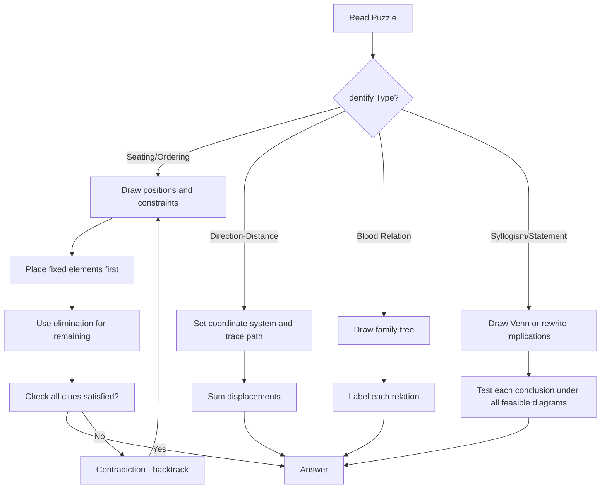

## Concept Ladder

Arrangements and Logic is a core reasoning area carrying high weight in SSC CGL Tier-I (25 questions total). Mastery demands a clear hierarchy: start with concrete spatial reasoning, then layer symbolic constraints, then integrate multi-type puzzles.

**First Principles**  
- **Linear ordering**: Assign positions (1,2,3,...) and track relative clues like "immediately left", "second to the right", "between". Use a consistent reference (facing north means left/right from the person's perspective).  
- **Circular seating**: Fix one person to break rotational symmetry. For centre-facing, "right" means clockwise; for outward-facing, reverse. Mark positions (e.g., 6 positions labelled 1 to 6 clockwise).  
- **Ranking / ordering**: Convert "from top/bottom" to a common rank. If rank from top = r, then from bottom = N - r + 1.  
- **Floor/box arrangements**: Assign floors (lowest = 1, highest = N) or layers. Use stack or grid representation.  
- **Direction-distance**: Use coordinate axes (x,y). Right turn = +90, left turn = -90. Track net displacement.  
- **Blood relation**: Draw hierarchical tree. "Only son" / "only daughter" are critical clues. Use gender markers.  
- **Syllogism**: Draw Venn diagrams (two or three overlapping circles) or use Aristotle's logical rules.  
- **Statement-conclusion**: Distinguish "A implies B" from "B implies A". Words: "only", "all", "none", "some".  
- **Calendar**: Use modulo 7 for day shifts. Know month lengths and leap year rules.  
- **Coding-decoding**: Identify pattern (shift, reverse, position sum). Test on first example, then apply.

**Intermediate Integration**  
- Combine multiple arrangements in one puzzle (e.g., seating + blood relation). Build a diagram that captures all clues simultaneously.  
- Use a "tally table" for membership tests in syllogisms. For "some A are B", shade overlapping region.  
- For puzzles with constraints (e.g., "A is two floors above B"), write inequalities: floor(A) = floor(B) + 2.  
- Check consistency: if a clue forces a contradiction, immediately backtrack or eliminate that possibility.  
- Practice "answer-locking": after placing all elements, no ambiguity remains. If multiple solutions exist, the problem is under-specified (rare in SSC).

**Exam-Level Application**  
- Time per question ~35 seconds. Speed comes from pattern recognition and diagram templates.  
- For circular seating with six persons, always fix the first person at top and fill clockwise.  
- For inequality-based rankings (e.g., "A is taller than B but shorter than C"), draw a chain: C > A > B.  
- In statement-conclusion, treat "only A are B" as: B -> A (if it is B, it is A).  
- Use elimination: if a conclusion is not necessarily true under all possible Venn diagrams, discard.  
- For calendar, remember odd days (365 mod 7 = 1, 366 mod 7 = 2). January 2026 has 31 days -> +3 days.

## Type System

| Type | Recognition Cue | Method | Speed Target | Trap |
|------|----------------|--------|------------|------|
| Linear Seating (North facing) | "row", "facing north", "immediate left/right" | Draw 5 or more dashes, label leftmost as 1, place clues stepwise | 20-25 sec | Confusing left/right when facing south |
| Circular Seating (centre-facing) | "around a table", "facing centre" | Fix one person at top, mark clockwise positions, place opposite clues first | 30-35 sec | Confusing "immediate right" as anticlockwise |
| Ranking (top/bottom) | "rank from top", "rank from bottom", "between" | Convert to same base (rank from top), compute gap = larger rank - smaller rank - 1 | 15-20 sec | Forgetting to subtract the persons themselves |
| Floor Arrangement | "lives on floor 1 to N", "above/below" | Draw building with floors, write names on floors using inequalities | 25-30 sec | Ignoring "immediately above" vs "above (not necessarily adjacent)" |
| Direction-Distance | "walks east", "turns right/left", "how far" | Use coordinate system: start (0,0), map each leg, compute Pythagorean or Manhattan distance | 20 sec | Wrong turn orientation (e.g., right from south = west) |
| Blood Relation | "mother's only son", "father's sister" | Draw tree: male square, female circle, connect with lines; label relations | 25-30 sec | Assuming gender wrongly (e.g., "sibling" could be brother/sister) |
| Syllogism | "All/Some/No ... are ...", "conclusions follow" | Draw overlapping circles or use distribution rules (AA, EA, etc.) | 20 sec | Assuming "some" implies "all" |
| Statement-Conclusion | "Only", "unless", "if...then", "conclusion" | Rewrite as logical implication; check necessary vs sufficient condition | 20 sec | Reversing the logic (e.g., "only A are B" -> all B are A, not all A are B) |
| Calendar | "day of the week", "leap year", "year 2026" | Compute odd days, use known reference (e.g., 1 Jan 2026 is Thursday) | 15 sec | Forgetting leap year for February |
| Coding-Decoding | "word is written as", "code" | Identify pattern (shift, reverse, vowel/cons change) | 15 sec | Applying pattern only partially (e.g., shift by 1 on all but check if cyclic) |
| Mixed Puzzles | Multiple constraints (seating + height + colour) | Start with most restrictive clue, build table, check consistency | 45-50 sec | Forgetting to update all constraints after each placement |

## Speed Methods

**Recall Tables**  
- Day Odd-Days Table:  
  Non-leap year: 365 mod 7 = 1 odd day; Leap year: 366 mod 7 = 2 odd days.  
  Month odd days: Jan 3, Feb 0/1 (leap), Mar 3, Apr 2, May 3, Jun 2, Jul 3, Aug 3, Sep 2, Oct 3, Nov 2, Dec 3.  
- Syllogism distribution table:  
  All A are B: A outside B not allowed. Some A are B: overlap exists. No A are B: disjoint.  

**Decision Rules**  
- In linear seating, if a person is "immediately left" of another, place them adjacent with left person on the left side.  
- In circular, "opposite" means exactly N/2 positions away if even number of people.  
- For ranking, if Ravi is 12th from top out of 40, then there are 11 students above him.  
- For blood relation, "my mother's only son" = me (assuming I am male). "My father's daughter" = my sister (if father has only one daughter) or could be me if female.  
- For statement-conclusion, "only A are B" is equivalent to "all B are A".  

**Step-by-Step Algorithms**  

*Algorithm for Linear Seating (north facing, up to 8 persons)*  
1. Number positions 1 to N left to right.  
2. Place any person fixed by an explicit clue (e.g., "A sits at left end" -> position 1).  
3. Place "second to the left/right" by counting positions.  
4. Place immediate neighbours.  
5. Fill remaining persons using elimination.  
6. Verify all clues are satisfied.  

*Algorithm for Circular Seating (centre-facing, N even/odd)*  
1. Choose a fixed reference (e.g., "P sits at top"). Mark N positions clockwise.  
2. Place "opposite" pairs: if P opposite S, then S is N/2 positions clockwise from P.  
3. Place "immediate right/left": for centre-facing, immediate right means clockwise step; immediate left means anticlockwise step.  
4. Complete the circle using remaining clues.  
5. Read off answer.  

*Algorithm for Syllogism (two statements, two conclusions)*  
1. Draw Venn diagram with circles for each distinct term (e.g., Pens, Tools, Blue).  
2. Represent first statement: if "All pens are tools", draw pen circle inside tools circle.  
3. Represent second statement: if "Some tools are blue", shade overlapping region of tools and blue (the overlap may be inside or outside pen circle).  
4. Check each conclusion: is it necessarily true in all possible configurations? If yes, follow; else no.  
5. Use rule "All A are B + Some B are C -> no definite conclusion" unless A and C overlap is forced.  

## Trap Table

| Trap | Trigger Wording | Wrong Move | Correct Move | Repair Drill |
|------|----------------|------------|-------------|-------------|
| Left/Right confusion | "sits to the right" in a row facing north | Assign right side as the person's own right (true) but misplace when seating is north/south | Always use perspective of the seated person facing north: left = west side, right = east side | Practice with a physical directional arrow; draw left/right labels on the row |
| Opposite for odd circle | "sits opposite" in a circle of 5 | Assume a neat diametrically opposite (which only works for even) | In odd number circle, "opposite" means directly across the table, but not evenly spaced - use exact clue positions; avoid guessing | Memorise that "opposite" is defined only when clue explicitly gives relation; don't force symmetry for odd number |
| Ranking double subtraction | "Ravi is 12th from top, Meena 15th from bottom, how many between?" | Compute 12+15 = 27, then 27 - 40 = -13 (wrong) | Convert bottom rank to top rank: rank from top = N - bottom rank + 1; then compute gap | Drill: always convert to same reference |
| "Immediately above" misread | "B lives immediately above A" | Place B on floor 1 and A on floor 2 (reverse) | "Above" means higher floor number: B is on floor A+1 | Draw floors from bottom to top; mark clear up arrow |
| Turn direction in distance | "walks east, turns right" | Turn to north instead of south | Right from east is south; use a compass rose diagram | Memorise: Right = clockwise turn, Left = anticlockwise |
| Gender assumption in blood relation | "Pointing to a woman, Arun says 'She is the daughter of my mother's only son'" | Assume woman is Arun's sister (because "daughter" could be misunderstood) | "Mother's only son" = Arun (assuming male); then daughter of Arun = his daughter | Always resolve "only son/daughter" as first step |
| "Only A are B" misinterpretation | "Only disciplined candidates clear exam" | Conclude "all disciplined candidates clear" | Actually "only disciplined" means "if you clear, you must be disciplined"; the reverse is not true | Rewrite as "clearing -> disciplined" |
| Overlapping in syllogism | "Some A are B. All B are C." conclusion "Some A are C" | Assume some A are not C automatically | Use Venn: if all B are inside C, and some A are inside B, then that part is inside C; so conclusion "some A are C" is valid | Draw Venn, shade overlap |
| Leap year mistake | "February 2026" | Assume 29 days | 2026 is not divisible by 4, so February has 28 days | Check last two digits divisible by 4; century years need 400 divisibility |
| Coding pattern partially applied | "CAT -> DBU (shift +1)" for DOG | Write DOG -> DPH (only first letter shift) | Apply same shift to all letters consistently | Test on the given example fully before applying |
| Fixed person symmetry | "Six people around table" | Don't fix any person leading to multiple arrangements | Always fix one person (e.g., P) to anchor the circle | Make it a habit: "fix P at top" as first step |
| Neglect of "candidates who clear are disciplined" | "All disciplined candidates clear" as false conclusion | Accept both as valid | Use logic: All X are Y means X -> Y, not reverse | Practice with "Only X are Y" and "All Y are X" |
| Overlooking "between" in seating | "A sits between B and C" | Place A left of B and C (ambiguous) | "Between" means B-A-C or C-A-B; need additional clue to order B and C | When you see "between", it implies adjacency, but not order of the two neighbours |
| Assuming unstated opposites | "P sits opposite S" for circle of 6 | Also assume Q opposite T automatically | Only use explicitly given opposites; fill rest by elimination | In circular puzzles, treat each opposite clue as independent |
| Calendar odd day addition | "Add 3 days to Thursday yields Saturday" | For 31 days, add 31 mod 7 = 3 days, but forget to start counting from next day | Thursday + 3 = Sunday (Thu +1=Fri, +2=Sat, +3=Sun) | Do small count on fingers: Thu->Fri(1), Sat(2), Sun(3) |

## Flowchart

## Solved Examples

**Example 1: Linear Seating**  
Five people A, B, C, D, and E sit in a row facing north. A sits at the left end. C sits second to the right of A. B sits immediately left of C. E sits immediately right of C. Who sits in the middle?  
Options: (a) A (b) B (c) C (d) E  
**Solution**: Number seats 1 to 5 from left. A is at seat 1. C is second to the right of A, so C is at seat 3. B is immediately left of C, so B is at seat 2. E is immediately right of C, so E is at seat 4. D remains at seat 5. The middle seat is seat 3, occupied by C. **Answer: (c) C**

**Example 2: Circular Seating**  
Six people P, Q, R, S, T, and U sit around a circular table facing the centre. P sits opposite S. Q sits immediately right of P. R sits opposite Q. Who sits opposite T if U sits immediately left of S?  
Options: (a) P (b) Q (c) R (d) U  
**Solution**: Mark six positions clockwise. Put P anywhere. Since all face centre, immediate right means clockwise. Q is clockwise next to P. S is opposite P. R is opposite Q. U is immediately left of S, so U is anticlockwise next to S. The only remaining seat is T. In this arrangement, T is opposite U. **Answer: (d) U**

**Example 3: Ranking**  
In a class of 40 students, Ravi is 12th from the top and Meena is 15th from the bottom. How many students are between Ravi and Meena if Ravi is above Meena?  
Options: (a) 11 (b) 12 (c) 13 (d) 14  
**Solution**: Meena's rank from the top is 40 - 15 + 1 = 26. Ravi is 12th from the top. Students between them = 26 - 12 - 1 = 13. **Answer: (c) 13**

**Example 4: Floor Arrangement**  
Five people A, B, C, D, and E live on floors 1 to 5, where 1 is bottom and 5 is top. B lives immediately above A. D lives on floor 5. C lives below A but above E. Who lives on floor 2?  
Options: (a) A (b) B (c) C (d) E  
**Solution**: D is on floor 5. C is below A but above E, so C cannot be floor 1. B is immediately above A. The only clean placement is E at floor 1, C at floor 2, A at floor 3, B at floor 4, D at floor 5. Floor 2 has C. **Answer: (c) C**

**Example 5: Direction-Distance**  
A man walks 6 m east, turns right and walks 8 m, turns right and walks 6 m. How far is he from the starting point?  
Options: (a) 6 m (b) 8 m (c) 10 m (d) 14 m  
**Solution**: Start at (0,0). Move east to (6,0). Right from east is south, so move to (6,-8). Right from south is west, so move to (0,-8). Distance from start is 8 m. **Answer: (b) 8 m**

**Example 6: Blood Relation**  
Pointing to a woman, Arun says, "She is the daughter of my mother's only son." How is the woman related to Arun?  
Options: (a) Sister (b) Daughter (c) Niece (d) Mother  
**Solution**: Arun's mother's only son is Arun himself. The woman is the daughter of Arun. Therefore, she is Arun's daughter. **Answer: (b) Daughter**

**Example 7: Syllogism**  
Statements: All pens are tools. Some tools are blue. Conclusions: I. Some pens are blue. II. Some tools are pens.  
Options: (a) Only I follows (b) Only II follows (c) Both follow (d) Neither follows  
**Solution**: All pens are inside tools. Some tools are blue, but those blue tools may or may not be pens, so conclusion I is not definite. Since all pens are tools, at least some tools are pens if pens exist in the statement set. Conclusion II follows. **Answer: (b) Only II follows**

**Example 8: Statement-Conclusion**  
Statement: Only disciplined candidates clear high-pressure exams. Conclusion I: All candidates who clear high-pressure exams are disciplined. Conclusion II: All disciplined candidates clear high-pressure exams.  
Options: (a) Only I follows (b) Only II follows (c) Both follow (d) Neither follows  
**Solution**: "Only disciplined candidates clear" means clearing is possible only inside the disciplined group. So all who clear are disciplined. It does not mean every disciplined candidate clears. **Answer: (a) Only I follows**

**Example 9: Calendar**  
If 1 January 2026 is Thursday, what day is 1 February 2026?  
Options: (a) Saturday (b) Sunday (c) Monday (d) Tuesday  
**Solution**: January has 31 days. A shift of 31 days means 31 mod 7 = 3 days. Thursday + 3 = Sunday. **Answer: (b) Sunday**

**Example 10: Coding-Decoding**  
In a code, CAT is written as DBU. How is DOG written?  
Options: (a) EPH (b) ENH (c) FPH (d) EOG  
**Solution**: Each letter is shifted forward by one: C->D, A->B, T->U. Therefore D->E, O->P, G->H. DOG becomes EPH. **Answer: (a) EPH**

## PYQ Mapping

The following practice routes align with the major topic subtypes frequently tested in SSC CGL Tier-I. Use them to build confidence and speed.

- **Seating Arrangements (Linear & Circular)**: /exams/ssc-cgl/topics/seating-arrangement  
  - Practice puzzles with 5-8 persons, both north-facing and centre-facing.  
  - Focus on 'immediate left/right', 'second to the left', and 'opposite' clues.  
  - Time yourself: aim for below 30 sec per puzzle after 10 attempts.

- **Statement-Conclusion & Inference**: /exams/ssc-cgl/topics/statement-conclusion  
  - Master the logic of 'only', 'unless', and 'if...then'.  
  - Solve 15-20 variations to internalise necessary vs sufficient conditions.

- **Syllogism (Venn Diagrams)**: /exams/ssc-cgl/topics/syllogism-venn  
  - Practice two-statement and three-statement syllogisms.  
  - Use the 'all+some' and 'no+some' combination rules.  
  - Draw Venn diagrams for each to avoid misjudgment.

- **Direction & Distance**: /exams/ssc-cgl/topics/direction-distance  
  - Include problems with turns (right/left), shadow direction, and displacement.  
  - Practice both straight-line and right-angle triangle displacement using Pythagoras.

- **Blood Relation**: /exams/ssc-cgl/topics/blood-relation (when available) but also general practice on family trees.

- **Mixed Puzzles**: Combine two types (e.g., seating + blood relation, or floor + ranking) from mock tests.

Practice route: Start with one-type questions (seating, syllogism) until you hit 90% accuracy, then move to mixed puzzles. Dedicate 15 minutes daily to each subtype for 10 days. Track errors per type using a mini error log.

## 200/200 Drill

**Timed Micro-Drills (5 minutes each)**  
1. **Linear Seating Blitz**: 5 questions - each must be solved within 20 seconds. Draw only necessary positions.  
2. **Circular Seating Sprint**: 5 questions - fix person first, fill opposites, then immediate neighbours. 25 seconds each.  
3. **Ranking Rapid**: 5 questions - convert to same reference, then compute gap. 15 seconds each.  
4. **Direction-Distance Dash**: 5 questions - use coordinate method, find shortest distance. 20 seconds each.  
5. **Blood Relation Quick**: 5 questions - identify the key person (e.g., mother's only son = me). 20 seconds each.  
6. **Syllogism Speed Test**: 5 questions - draw minimal Venn, test each conclusion. 20 seconds each.  
7. **Statement-Conclusion Blast**: 5 questions - rewrite as implications, check necessity. 15 seconds each.  
8. **Calendar & Coding Combo**: 5 questions - use odd days method; identify coding pattern. 15 seconds each.

**Daily Challenge**  
- Attempt 10 mixed arrangement+logic puzzles in 8 minutes total (48 seconds per puzzle). Aim for 10/10.  
- Use a stopwatch and strict cut-off. If you exceed time, mark the question and analyse why (e.g., diagram too large, re-read clue multiple times).  
- After each drill, identify your weakest subtype and focus extra time there.

**Repair Rules**  
1. If you misplace left/right in seating, draw an arrow on top of your row indicating north -> up, so left = west, right = east.  
2. If you confuse opposite for odd circles, memorise that "opposite" is given only when possible; do not assume symmetry.  
3. If you make a ranking error, rewrite both ranks from top before subtracting.  
4. If you misread "immediately above", physically write the floor numbers from 1 (bottom) upward, and place the person accordingly.  
5. If you lose direction during distance problems, stop and sketch a compass rose at each turn.  
6. If you incorrectly map blood relations, always start from the speaker (e.g., "I" or "Arun") and build outward.  
7. For syllogism, always draw two feasible Venn diagrams (one showing conclusion true, one showing false) - if a conclusion is false in any, it does not follow.  
8. For statement-conclusion, write the implication arrow: "Only A are B" -> "B  A". Then test.  
9. For calendar, double-check leap year rule: year divisible by 4 but not by 100 unless divisible by 400.  
10. For coding, always verify the pattern on the given code word before applying to the target.

**Self-Check**  
After each drill, calculate accuracy percentage. If below 80%, revisit Concept Ladder for that type. If 80-90%, focus on speed methods. If above 90%, move to mixed puzzles. Aim to maintain 95%+ accuracy under 30 seconds per question by the end of two weeks.

Now go to the practice routes:  
- /exams/ssc-cgl/topics/seating-arrangement  
- /exams/ssc-cgl/topics/statement-conclusion  
- /exams/ssc-cgl/topics/syllogism-venn  
- /exams/ssc-cgl/topics/direction-distance  

Your goal: 200/200 in General Intelligence and Reasoning. Consistency in arrangements and logic is the cornerstone. Execute the drills daily and lock your answers with conviction.

