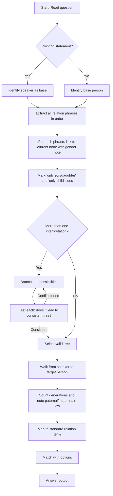

## Concept Ladder

**Step 1: Foundation - What is a family?**  
Every blood relation problem builds a family tree using parent-child, sibling, and spousal links. You must know:

### Corpus Pressure

The uploaded book-PYQ corpus marks `blood-relation` as a 200/200 standard Reasoning topic with **118 promoted questions**. The promoted source block is `Scribd HTML Pages`, which contributes **118 promoted questions** from the uploaded reasoning book. The question bank repeatedly tests pointing statements, coded relation symbols, only-son/only-daughter traps, in-law chains, and generation movement.

| Corpus Source | Promoted Load | What It Trains |
|----------------|---------------|----------------|
| Scribd HTML Pages | 118 promoted questions | Pointing statements, coded relation equations, family trees, in-law paths, only-word traps, and generation count |

The 200/200 target is simple: every blood-relation question must become a 25-30 second relation walk unless it is a long coded symbol set, which can take up to 45 seconds. In the 15-minute Reasoning section, this topic should be a banked mark, not a time sink.

- **Parent**: father/mother; **Child**: son/daughter.
- **Sibling**: brother/sister sharing at least one parent.
- **Grandparent**: parent of a parent.
- **Spouse**: husband/wife; in-laws are relations through marriage.

**Step 2: Symbol System**  
Standardise your scratchpad to avoid confusion. Use:
- `M` for male, `F` for female.
- `= ` for spouse, `---` for sibling, `|` for parent-child.
- A person's name or role (e.g., Arun) is written once and linked.

**Step 3: Pronoun and Possessive Cues**  
Statements like "my mother's only son" are chained left-to-right:
- Start with the speaker (first person), then follow each relation word.
- "only son" = the sole male child (implies no other brothers).
- "only daughter" = sole female child.
- Pronoun "he/she/they" - if gender is unclear, note it and watch for later clues.

**Step 4: Paternal vs Maternal**  
- Paternal: father's side (father's brother = paternal uncle).
- Maternal: mother's side (mother's brother = maternal uncle).
- In-law: spouse's side (wife's sister = sister-in-law; husband's father = father-in-law).

**Step 5: Generation Depth**  
Count generations from the speaker:
- 0: self.
- +1: parents, uncles, aunts.
- +2: grandparents.
- -1: children, nephews, nieces.
- -2: grandchildren.
- In-laws = same generation as the linking spouse.

**Step 6: Pruning Impossible Trees**  
- If a person is called "only son", he cannot have a brother.
- A father cannot be younger than his child (age logic).
- Two statements that conflict (e.g., "X is the son of Y" and "Y is the son of X") are impossible - choose the consistent interpretation.
- When a pronoun is ambiguous, list all possible matches and test each against the given relations.

**Step 7: Exam-Level Integration**  
You will face 2-4 blood relation questions in 15 minutes. Accuracy depends on:
- Speed in drawing a small, clean tree.
- Immediate recognition of common chains (see Type System).
- Zero assumption about genders of unnamed persons - only use given cues.
- Mastery of "only" qualifiers and in-law loops.

---

## Type System

| Type | Recognition Cue | Method | Speed Target | Trap |
|------|-----------------|--------|--------------|------|
| Direct parent/child | "my father's son", "her mother's daughter" | Chain backwards: speaker -> relation -> target. | 15 sec | Skipping "only" qualifier changes child count. |
| Grandparent | "father's father", "mother's mother" | Two upward steps. | 10 sec | Confusing paternal/maternal. |
| Sibling | "brother of", "sister of" | Same parent link; watch for "only child" excluded. | 10 sec | Assuming gender from name (use given pronouns). |
| Uncle/Aunt | "father's brother", "mother's sister" | Parent's sibling; specify side. | 15 sec | "Uncle" could be maternal or paternal - must state. |
| Cousin | "father's brother's daughter" | Child of a parent's sibling; same generation. | 20 sec | Mistaking for sibling (different parents). |
| In-law (spouse side) | "wife's sister", "husband's father" | Spouse's blood relative becomes in-law to speaker. | 20 sec | Forgetting that in-law relation is non-blood. |
| In-law (sibling's spouse) | "brother's wife", "sister's husband" | Spouse of sibling; treat as sibling-in-law. | 20 sec | Combining spouse and sibling direction. |
| Multiple generations | "my grandson's father" | Link stepwise; may need to reverse at the end. | 30 sec | Generation miscount - draw tree. |
| Pronoun ambiguous | "he is my father's son" (who is "he"?) | Find all referents for pronoun; test each. | 30 sec | Picking one referent without checking consistency. |
| "Only son/only daughter" | "my mother's only son" | That person is the unique child of that gender. | 20 sec | Forgetting that "only son" implies no brothers, but may have sisters. |
| Coded relation symbols | "A + B means A is father of B" | Translate symbols into a tree before answering. | 35-45 sec | Solving the expression without replacing every symbol. |

---

### First 5-Second Classification

Use the first sentence and answer choices to decide the solving frame before drawing anything.

| First Cue | Frame to Use | Instant Rule |
|-----------|--------------|--------------|
| "Pointing to a man/woman..." | Speaker-to-target chain | The person who says the sentence is the base. The pointed person is the target. |
| "my father's/mother's..." | Direct relation chain | Start from "my", move one relation word at a time, then name the final relation. |
| "only son/only daughter/only child" | Only-word precision | Only son excludes brothers, not sisters. Only child excludes all siblings. |
| "A + B means..." | Coded relation table | Decode every symbol first, then draw the tree from left to right. |
| "family of five/six members" | Full named family tree | Create nodes for all names and link definite parent/sibling/spouse relations first. |
| "husband/wife/brother's wife" | In-law chain | The moment the path crosses a spouse, check whether the final relation is in-law or no direct relation. |
| "grandson's father" | Generation reversal | Move down to grandson, then back up to his father. Do not stop at grandson. |
| "paternal/maternal" | Side-specific uncle/aunt/grandparent | Paternal = father's side; maternal = mother's side. |
| "son/daughter of X" | Gender lock | Son fixes male, daughter fixes female; names alone do not fix gender. |
| Similar options such as uncle/aunt/cousin | Generation filter | First count generation, then decide side, then decide gender. |

### Corpus Micro-Type Repair: Multi Generation Family Puzzle

The corpus label **multi generation family puzzle** covers SSC stems with couples, children, cousin branches, in-laws, and two or three generation jumps. Solve these as a compact tree, not as a sentence chain in your head.

| Step | What To Do | Speed Rule | Common Error |
|------|------------|------------|--------------|
| 1 | Put oldest generation on top, current/speaker generation in middle, children below | 5s | Drawing people in reading order instead of generation order |
| 2 | Lock spouses with a horizontal line before adding children | 5s | Treating spouse's sibling as blood sibling |
| 3 | Place siblings on the same level and cousins on the same level but different parent branch | 8s | Calling cousin a brother/sister |
| 4 | Mark gender from son/daughter/husband/wife only; do not infer from name | 5s | Gender assumption from Indian names |
| 5 | Walk from the asked person to the target and count up/down levels | 7s | Stopping one generation early |

Example frame: A and B are a couple. C is their son. D is C's wife. E is D's daughter. If asked "How is A related to E?", go E -> mother D -> husband C -> father A, so A is the paternal grandfather of E. If the options include grandfather, father, uncle, brother, first eliminate by generation: A is two levels above E, so only grandfather can survive.

---

## Speed Methods

### Shortcut Relation Chains (Memorise)

| Statement | Relation to Speaker | Generation |
|-----------|---------------------|------------|
| my father's father | paternal grandfather | +2 |
| my mother's father | maternal grandfather | +2 |
| my father's mother | paternal grandmother | +2 |
| my mother's mother | maternal grandmother | +2 |
| my father's brother | paternal uncle | +1 |
| my mother's brother | maternal uncle | +1 |
| my father's sister | paternal aunt | +1 |
| my mother's sister | maternal aunt | +1 |
| my brother's son | nephew | -1 |
| my brother's daughter | niece | -1 |
| my sister's son | nephew | -1 |
| my sister's daughter | niece | -1 |
| my father's brother's son | cousin | 0 |
| my father's brother's daughter | cousin | 0 |
| my mother's brother's son | cousin | 0 |
| my mother's brother's daughter | cousin | 0 |
| my husband's father | father-in-law | +1 |
| my husband's mother | mother-in-law | +1 |
| my wife's father | father-in-law | +1 |
| my wife's mother | mother-in-law | +1 |
| my brother's wife | sister-in-law | 0 |
| my sister's husband | brother-in-law | 0 |

### Decision Rules for Pointing Statements

1. **One-person pointer**: "Pointing to X, Y says..." - always start from Y (speaker) and build the relation between Y and X.
2. **Two-person pointer**: If the statement involves a third person (e.g., "He is my father's son"), you must first resolve the middle person (here, "my father's son" = either the speaker or his brother). Then link the pointer to that person.
3. **Pronoun ambiguity**: If "he" or "she" appears without a clear referent, list all possible people in the story. Use the rest of the statement to narrow down.

### Step-by-Step Algorithm (for any question)

1. List all named/mentioned persons. Write them as nodes.
2. Assign genders only from explicit words such as man, woman, father, mother, son, daughter, husband, wife, brother, or sister. If a name alone is unclear, mark gender as `?` until another clue fixes it.
3. Draw the first definite relation (usually the speaker's immediate family).
4. Add relations one by one from the statement. Use arrows for parent-child.
5. Mark "only son/only daughter" by adding a note (e.g., "no brothers").
6. When done, find the path from the speaker to the target person. Count generations and side.
7. Check for in-law transitions: if a path goes through a spouse, the relation becomes in-law.
8. Write the answer in the simplest form (e.g., "maternal uncle" not just "uncle").

### Time Targets per Question Type

| Difficulty | Target Time | Technique |
|------------|-------------|-----------|
| Simple (grandparent, sibling) | 10-15 s | Direct chain from memory. |
| Moderate (uncle/aunt, cousin) | 20-25 s | Quick tree with 3-4 people. |
| Hard (ambiguous, multi-gen, in-law) | 30-45 s | Draw full tree, test two possibilities. |

---

## Trap Table

| Trap | Trigger Wording | Wrong Move | Correct Move | Repair Drill |
|------|-----------------|------------|--------------|--------------|
| Only son misinterpretation | "my mother's only son" | Assume he has no sisters. | "Only son" means no brothers; sisters may exist. | Practice Q: "my father's only son's sister" - that is the speaker's sister. |
| Only daughter misinterpretation | "my father's only daughter" | Assume she has no siblings. | No brothers of same parent? Only daughter means no sisters; brothers may exist. | Drill: Point to a woman and say "She is my father's only daughter." Then ask who she is - answer is speaker (if female) or speaker's sister. |
| Pronoun referent error | "he is my father's son" - who is he? | Assume he is the speaker. | Could be speaker or speaker's brother if father has more than one son. | Test: If father has two sons, "he" could be either. The statement alone is ambiguous. |
| Gender assumption | Name like "Suman" (can be male or female) | Mark as one gender. | Note as unknown; wait for "he/she" or other clues. | Repair: Rerun with both genders if needed. |
| Uncle/Aunt side not specified | "uncle" in answer choices | Pick any uncle. | Must specify paternal or maternal if choices include both. | Check cue: father's brother -> paternal; mother's brother -> maternal. |
| In-law confusion | "brother's wife" | Call her "sister". | She is sister-in-law (brother's wife). | Remember: spouse of sibling is sibling-in-law. |
| Reversing direction | "Rina's father's son is pointing to a boy" | Treat Rina as speaker. | The pointer is not always the speaker. Identify who is speaking first. | Drill: "Pointing to a man, X says" - X is speaker. |
| Multiple parent wording | Statement like "A is the son of B and C" | Assume one parent line. | B and C usually represent the two parents; keep the conventional family tree unless the stem states otherwise. | Very rare in SSC CGL; use only the relation stated in the question. |
| Generation skip | "my grandson's father" | Think grandson is child's child. | Grandson's father = son (one generation down). | Draw: speaker -> son -> grandson; son is grandson's father. |
| "Only child" vs "only son" | "my mother's only child" | Treat same as "only son". | Only child means no siblings at all, regardless of gender. | Adjust both brothers and sisters: none. |
| Spouse side sibling | "wife's brother's wife" | Stop at wife's brother. | Continue: brother's wife is sister-in-law of the speaker (in-law of in-law). | Chain: speaker's wife - wife's brother - brother's wife. |
| Aunt through spouse | "husband's sister" | Call her "sister". | She is sister-in-law (husband's sister). | Use rule: spouse's sibling = sibling-in-law. |
| Double in-law | "sister's husband's father" | Assume father-in-law. | Sister's husband = brother-in-law. His father = father of brother-in-law, no direct relation to speaker. | That person is not a blood relation; if asked, it is "no relation" or "father of brother-in-law". |
| Time pressure overdrawing | Complex family | Draw full six-person tree. | Draw minimal tree: only relevant persons. | Use abbreviations and prune dead ends. |

---

## Flowchart

---

## Solved Examples

**Example 1: Direct Maternal Son Path**  
Pointing to a woman, Arun says, "She is the daughter of my mother's only son." How is the woman related to Arun?  
Options: (a) Sister (b) Daughter (c) Niece (d) Mother  
**Solution**: Arun's mother's only son is Arun himself. Therefore the woman is Arun's daughter. **Answer: (b) Daughter**

**Example 2: Maternal Uncle**  
Pointing to a man, Rina says, "He is my mother's brother." How is the man related to Rina?  
Options: (a) Maternal uncle (b) Paternal uncle (c) Father (d) Brother  
**Solution**: The man's mother is Rina's mother, so this is her maternal uncle. **Answer: (a) Maternal uncle**

**Example 3: Paternal Uncle**  
Pointing to a man, Karan says, "He is my father's brother." How is the man related to Karan?  
Options: (a) Maternal uncle (b) Cousin (c) Paternal uncle (d) Grandfather  
**Solution**: The man's father is the same as Karan's father, so he is Karan's paternal uncle. **Answer: (c) Paternal uncle**

**Example 4: Paternal Aunt**  
Pointing to a woman, Meena says, "She is my father's sister." How is the woman related to Meena?  
Options: (a) Maternal aunt (b) Paternal aunt (c) Cousin (d) Mother  
**Solution**: The woman's father is Meena's grandfather, so she is her paternal aunt. **Answer: (b) Paternal aunt**

**Example 5: Brother-In-Law**  
Pointing to a man, Ananya says, "He is my brother's husband." How is the man related to Ananya?  
Options: (a) Brother-in-law (b) Father-in-law (c) Cousin (d) Brother  
**Solution**: The man is married to Ananya's brother, so he is Ananya's brother-in-law. **Answer: (a) Brother-in-law**

**Example 6: Nephew via Brother**  
Pointing to a boy, Prakash says, "He is my brother's son." How is the boy related to Prakash?  
Options: (a) Son (b) Nephew (c) Cousin (d) Brother  
**Solution**: The boy is the son of Prakash's brother, so he is Prakash's nephew. **Answer: (b) Nephew**

**Example 7: Niece via Brother**  
Pointing to a girl, Reema says, "She is my brother's daughter." How is the girl related to Reema?  
Options: (a) Niece (b) Daughter (c) Cousin (d) Sister  
**Solution**: The girl's father is Reema's brother, so she is Reema's niece. **Answer: (a) Niece**

**Example 8: Paternal Cousin**  
Pointing to a girl, Rohit says, "She is my father's brother's daughter." How is the girl related to Rohit?  
Options: (a) Cousin (b) Sister (c) Niece (d) Aunt  
**Solution**: The man's sister (father's brother's daughter) has the same grandparents as Rohit but is in a separate branch, so she is Rohit's cousin. **Answer: (a) Cousin**

**Example 9: Paternal Grandfather**  
Pointing to a man, Nisha says, "He is my father's father." How is the man related to Nisha?  
Options: (a) Grandfather (b) Uncle (c) Grandson (d) Brother  
**Solution**: A person's father's father is their paternal grandfather. **Answer: (a) Grandfather**

**Example 10: Sister-in-Law (via Husband)**  
Pointing to a woman, Dev says, "She is my wife's sister." How is the woman related to Dev?  
Options: (a) Maternal aunt (b) Sister-in-law (c) Cousin (d) Stepmother  
**Solution**: The woman is the sister of Dev's wife, so she is Dev's sister-in-law. **Answer: (b) Sister-in-law**

**Example 11: Maternal Grandmother**  
Pointing to a woman, Kiran says, "She is my mother's mother." How is the woman related to Kiran?  
Options: (a) Aunt (b) Mother (c) Grandmother (d) Niece  
**Solution**: The woman's daughter is Kiran's mother, so she is Kiran's maternal grandmother. **Answer: (c) Grandmother**

**Example 12: Father-in-Law**  
Pointing to a man, Ritu says, "He is my husband's father." How is the man related to Ritu?  
Options: (a) Son-in-law (b) Father-in-law (c) Brother-in-law (d) Uncle  
**Solution**: The man is the father of Ritu's husband, so he is Ritu's father-in-law. **Answer: (b) Father-in-law**

**Example 13: Only Son Precision**  
Pointing to a girl, Mohan says, "She is the daughter of my mother's only son." How is the girl related to Mohan?  
Options: (a) Sister (b) Daughter (c) Niece (d) Cousin  
**Solution**: Mohan's mother's only son is Mohan himself. The girl is the daughter of Mohan, so she is his daughter. **Answer: (b) Daughter**

**Example 14: Only Daughter Precision**  
Pointing to a woman, Asha says, "She is my father's only daughter." If Asha is female, who is the woman?  
Options: (a) Asha herself (b) Asha's sister (c) Asha's mother (d) Asha's aunt  
**Solution**: Asha is female and her father's only daughter. Therefore the woman is Asha herself. **Answer: (a) Asha herself**

**Example 15: Daughter-in-Law**  
Pointing to a woman, a man says, "She is my son's wife." How is the woman related to the man?  
Options: (a) Daughter (b) Daughter-in-law (c) Sister-in-law (d) Niece  
**Solution**: The wife of a person's son is daughter-in-law. **Answer: (b) Daughter-in-law**

**Example 16: Son-in-Law**  
Pointing to a man, a woman says, "He is my daughter's husband." How is the man related to the woman?  
Options: (a) Son (b) Brother-in-law (c) Son-in-law (d) Nephew  
**Solution**: The husband of a person's daughter is son-in-law. **Answer: (c) Son-in-law**

**Example 17: Grandson's Father**  
Ramesh says, "The man in the picture is my grandson's father." How is the man related to Ramesh?  
Options: (a) Father (b) Son (c) Grandfather (d) Brother  
**Solution**: Ramesh's grandson is the child of Ramesh's son or daughter. The grandson's father is most directly Ramesh's son in the usual SSC chain. **Answer: (b) Son**

**Example 18: Maternal Cousin**  
Pointing to a boy, Neha says, "He is my mother's brother's son." How is the boy related to Neha?  
Options: (a) Brother (b) Maternal cousin (c) Paternal cousin (d) Nephew  
**Solution**: Mother's brother is maternal uncle. His son is Neha's maternal cousin. **Answer: (b) Maternal cousin**

**Example 19: Paternal Cousin**  
Pointing to a girl, Varun says, "She is my father's sister's daughter." How is the girl related to Varun?  
Options: (a) Paternal cousin (b) Maternal cousin (c) Sister (d) Aunt  
**Solution**: Father's sister is paternal aunt. Her daughter is Varun's paternal cousin. **Answer: (a) Paternal cousin**

**Example 20: Coded Relation - Simple**  
If `A + B` means A is the father of B and `A - B` means A is the sister of B, then in `P + Q - R`, how is P related to R?  
Options: (a) Father (b) Uncle (c) Grandfather (d) Brother  
**Solution**: `P + Q` means P is father of Q. `Q - R` means Q is sister of R, so Q and R are siblings. P is father of Q and also father of R. **Answer: (a) Father**

**Example 21: Coded Relation - In-Law Check**  
If `A x B` means A is wife of B and `A + B` means A is father of B, then in `M + N x P`, how is M related to P?  
Options: (a) Father (b) Father-in-law (c) Brother-in-law (d) Son-in-law  
**Solution**: M is father of N. N is wife of P. Therefore M is the father of P's wife, which makes M P's father-in-law. **Answer: (b) Father-in-law**

**Example 22: Family of Five**  
In a family, P is the sister of Q. R is the mother of Q. S is the father of R. How is P related to S?  
Options: (a) Daughter (b) Granddaughter (c) Sister (d) Mother  
**Solution**: R is mother of Q. P is sister of Q, so R is also P's mother. S is father of R, so S is P's maternal grandfather. P is S's granddaughter. **Answer: (b) Granddaughter**

**Example 23: Speaker Base Trap**  
Pointing to a man, Kavita says, "His mother is the only daughter of my mother." How is the man related to Kavita?  
Options: (a) Son (b) Nephew (c) Brother (d) Father  
**Solution**: My mother's only daughter is Kavita herself. The man's mother is Kavita, so the man is Kavita's son. **Answer: (a) Son**

**Example 24: No Direct Relation**  
Pointing to a man, Sita says, "He is my sister's husband's brother." How is the man related to Sita?  
Options: (a) Brother (b) Brother-in-law (c) Cousin (d) No direct blood relation  
**Solution**: Sister's husband is Sita's brother-in-law. His brother is from the brother-in-law's family and is not Sita's blood relative. In SSC choices, this is usually no direct blood relation unless "brother-in-law" is used broadly. **Answer: (d) No direct blood relation**

**Example 25: 36-Second Chain**  
Pointing to a woman, Raj says, "She is the wife of my father's only son." If Raj is male, how is the woman related to Raj?  
Options: (a) Mother (b) Wife (c) Sister (d) Daughter  
**Solution**: Raj's father's only son is Raj himself. The wife of Raj is his wife. **Answer: (b) Wife**

---

## PYQ Mapping

Based on SSC CGL Tier-I exam patterns (2019-2024), blood relation questions appear in three varieties:

1. **Direct Chain** (60% of occurrences): A single statement linking speaker to target (Examples 1-4, 9, 11-12).  
   *Practice route*: /exams/ssc-cgl/topics/blood-relation - 20+ drill questions.

2. **In-law and Sibling Extension** (30%): Involves spouse of sibling or sibling of spouse (Examples 5, 10).  
   *Practice route*: /exams/ssc-cgl/topics/statement-conclusion - many questions overlap.

3. **Multi-generation and Pronoun Ambiguity** (10%): Requires tree drawing and multiple possibilities (rare but high-value).  
   *Practice route*: /exams/ssc-cgl/topics/syllogism-venn - Venn/logic skills help in consistency check.

**Speed sprint**: /exams/ssc-cgl/tests/ssc-cgl-reasoning-speed-sprint - timed 5-minute sets of 8-10 blood relation questions.

---

## 200/200 Drill

### Micro-Drill 1: 10 Pointing Statements in 2 minutes

Solve each using the one-chain method. Time yourself.

1. A man says, "He is my father's only son." What is the man referring to?  
2. A woman says, "She is my mother's only daughter." What is the woman referring to?  
3. A man points to a boy and says, "He is my brother's son." How is the boy related to the man?  
4. A woman points to a girl and says, "She is my sister's daughter." How is the girl related to the woman?  
5. A man points to a boy and says, "He is my wife's brother's son." How is the boy related to the man?  
6. A woman points to a girl and says, "She is my mother's sister's daughter." How is the girl related to the woman?  
7. A man points to a boy and says, "He is my father's brother's son." How is the boy related to the man?  
8. A woman points to another woman and says, "She is my husband's mother." How is the other woman related to her?  
9. A man points to a boy and says, "He is my daughter's brother." How is the boy related to the man?  
10. A woman points to another woman and says, "She is my son's wife." How is the other woman related to her?

**Answers**: 1) himself 2) herself 3) nephew 4) niece 5) nephew 6) cousin 7) cousin 8) mother-in-law 9) son 10) daughter-in-law.

### Micro-Drill 2: Only-Word and In-Law Precision - 5 questions in 90 seconds

Solve each without adding any unstated sibling or gender assumption.

1. A woman has no sister. She says, "This girl is my mother's only daughter." Who is the girl?  
2. A man says, "This woman is my wife's mother." How is the woman related to him?  
3. A woman says, "This man is my father's only brother." How is the man related to her?  
4. A man says, "This girl is my only son's daughter." How is the girl related to him?  
5. A woman says, "This boy is my brother's wife's son." How is the boy related to her?

**Answers**: 1) the speaker herself 2) mother-in-law 3) paternal uncle 4) granddaughter 5) nephew.

### Repair Rules

- **Misread gender**: Cross-check with pronouns in the question. If unknown, note "?" and continue.
- **Missed "only"**: When you see "only son/daughter/child", underline it and check siblings count.
- **In-law misstep**: When relation passes through a spouse, always add "-in-law" to the final term.
- **Time overrun**: If after 30 seconds you cannot get a unique relation, mark the most likely based on the first chain and move on. Return only if time permits.
- **Tree too messy**: Redraw using only initials and single-line links. Discard dead branches.

### Final Polishing Tips

- In the exam, use the margin or blank space for a tiny tree. Do not waste time on neatness.
- If a statement includes "pointing to a man/woman", immediately label that person as the target.
- For answer choices, eliminate obviously wrong generation (e.g., "grandfather" for a -1 relation).
- When two options are similar (e.g., maternal vs paternal uncle), check the side from the statement.
- Never assume the gender of an unnamed "cousin" - look for he/she, man/woman, or son/daughter in the options.

Achieve 200/200 by drilling these patterns until they become reflex.
<!-- SSC-FINAL-PRACTICE-QUEUE:START -->
## Final Practice Queue

1. Start one-by-one practice: [Blood Relation practice](/exams/ssc-cgl/practice/blood-relation). Finish every question in this topic bank, not just the samples in the note.
2. Move to timed sets: [SSC CGL tests](/exams/ssc-cgl/tests?topic=blood-relation). Use topic drills first, then section mocks once accuracy is stable.
3. Repair every miss immediately: record the error label, redo 20 mixed questions from the same topic, then retest after 24 hours.
4. 200/200 rule: do not mark this topic exam-ready until correct answers come within 36 seconds and wrong answers are explained without looking at the solution.

<!-- SSC-FINAL-PRACTICE-QUEUE:END -->
