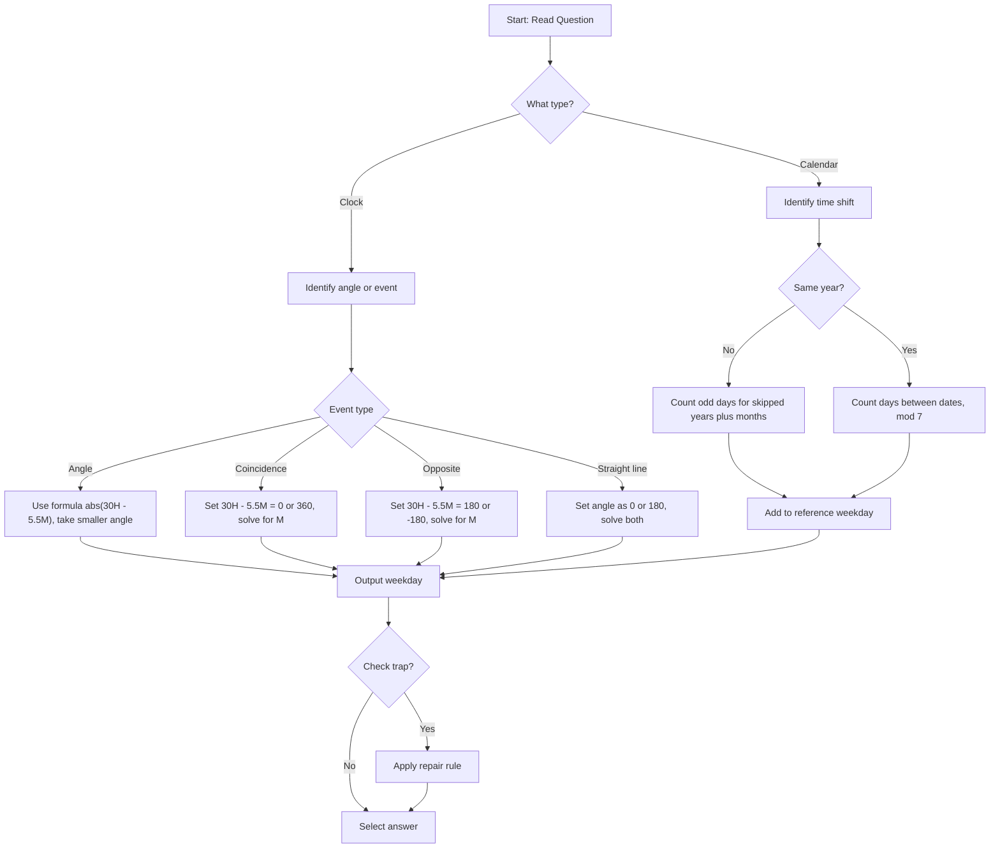

## Corpus Pressure

The uploaded book-PYQ corpus marks `calendar-clock` as a Reasoning coverage-gap topic with **13 promoted questions**. The source load is concentrated in **Scribd HTML Pages**, which contributes **13 promoted questions**. The count is small, but calendar-clock is a high-risk accuracy topic because one forgotten leap-year exception or one clock-hand formula slip can waste an otherwise easy mark.

| Corpus Source | Promoted Load | What It Trains |
|----------------|---------------|----------------|
| Scribd HTML Pages | 13 promoted questions | Odd days, leap year, century rule, month code, date shift, clock angle, hand coincidence, opposite hands, straight-line count, and angular speed |

For 200/200, calendar-clock should be a controlled mark. Calendar one-year and month-shift questions should close in 15-20 seconds. Clock angle and angular-speed questions should close in 20-30 seconds. Coincidence/opposite-hand equations can take 40-50 seconds, but only if the numbers are not a direct recall case.

## Concept Ladder

**Step 1: Fundamental Counting - Odd Days**  
A week has 7 days. Any number of days beyond a multiple of 7 is called an odd day. For example, 365 days = 52 weeks + 1 day, so an ordinary year has 1 odd day. A leap year (366 days) has 2 odd days.

**Step 2: Leap Year Logic**  
- A year divisible by 4 is a leap year (e.g., 2024, 2028).  
- Exception: Century years (ending in 00) are leap years only if divisible by 400. So 1900 is not a leap year but 2000 is.

**Step 3: Month Day Counts and Month Codes**  
Every calendar question can be solved by adding odd days month by month. Using memorised month codes (e.g., Jan=0, Feb=3, Mar=3, Apr=6, May=1, Jun=4, Jul=6, Aug=2, Sep=5, Oct=0, Nov=3, Dec=5 for ordinary year, adjust for leap Jan=0, Feb=3, Mar=4, etc.) speeds up month-to-month shifts.

**Step 4: Day-of-Week Movement**  
If you know a reference day (e.g., 1 Jan 2025 = Wednesday), then adding total odd days from that date gives the target weekday. For year-to-year shifts, use 1 odd day per ordinary year and 2 odd days per leap year between dates.

**Step 5: Clock Basics**  
- Full circle = 360 degrees.  
- Hour hand moves 360/12 = 30 degrees per hour = 0.5 degrees per minute.  
- Minute hand moves 360/60 = 6 degrees per minute.

**Step 6: Clock Angle Formula**  
Angle between hands = |30H - 5.5M|, where H is hour (0 to 11 for 12-hour clock) and M is minutes. Always take the smaller angle if the result is more than 180 degrees, do 360 - angle.

**Step 7: Relative Speed of Hands**  
The minute hand gains on the hour hand at a relative speed of 5.5 degrees per minute. The hands coincide when the minute hand laps the hour hand (every 65 5/11 minutes). In 12 hours, they coincide 11 times.

**Step 8: Special Cases - Opposite, Straight Line**  
- Opposite: angle = 180 degrees, occurs 11 times in 12 hours.  
- Straight line (0 or 180): occurs 22 times per 12 hours (11 coincidences + 11 opposite).

**Step 9: Integration for Exams**  
SSC CGL Tier-I asks for rapid computation. You must decide instantly whether to use odd-day counting, month codes, or clock formula. The goal: finish in 30-40 seconds per question with zero error.

## Type System

| Type | Recognition Cue | Method | Speed Target | Trap |
|------|-----------------|--------|--------------|------|
| Ordinary year odd days | Year or day count given, find weekday after 1 year | Count odd days (1 for ordinary, 2 for leap) | 20 sec | Forgetting leap year has 2 odd days |
| Leap year check | Year divisible by 4 or century year | Check divisibility by 4 or 400 for centuries | 10 sec | Treating 1900 as leap year |
| Month-day shift | Date in same year, no year boundary | Calculate days difference, mod 7 | 15 sec | Forgetting to account for leap February |
| Date reference from known anchor | "If 1 Jan 2020 is Wednesday, what is 1 Mar 2023?" | Add odd days for each year and month | 40 sec | Missing leap year between dates |
| Clock angle given time | Specific time like 3:40 | Formula: \|30H - 5.5M\| | 25 sec | Using larger angle >180 when smaller required |
| Hands coincide | "At what time between 4 and 5 do hands meet?" | Use overlap time = (60/11)\*H or relative speed method | 35 sec | Assuming exact hour marks |
| Opposite or straight line | "When are hands opposite between 5 and 6?" | Angle = 180, solve 30H - 5.5M = +/-180 | 40 sec | Forgetting two possible equations (+/-180) |
| How many times in 12 hours | "How many times do hands coincide in a day?" | Recall 11 coincidences, 22 straight line in 12 hours | 15 sec | Doubling incorrectly (say 22 instead of 11) |
| Minute hand angular speed | "How many degrees in 20 minutes?" | 6 degrees per minute | 10 sec | Using 0.5 deg/min for minute hand |
| Hour hand angular speed | "How many degrees in 30 minutes?" | 0.5 degrees per minute | 10 sec | Using 6 deg/min for hour hand |

### First 5-Second Classification

Read the object first: date, weekday, leap year, clock angle, or clock event.

| First Cue | Frame to Use | Instant Rule |
|-----------|--------------|--------------|
| "ordinary year" | Odd-day recall | Add 1 odd day |
| "leap year" | Odd-day recall | Add 2 odd days |
| "century year" | 400-rule check | Leap only if divisible by 400 |
| "same month/date shift" | Day difference | Difference mod 7 decides weekday shift |
| "February involved" | Leap-Feb gate | Check whether February has 28 or 29 days |
| "100/200/300/400 years" | Century odd-day table | 100=5, 200=3, 300=1, 400=0 |
| "angle at H:M" | Clock angle formula | Use abs(30H - 5.5M), then smaller angle |
| "minute hand moves" | Angular speed | 6 degrees per minute |
| "hour hand moves" | Angular speed | 0.5 degrees per minute |
| "coincide/overlap" | Relative speed | Minute hand gains 5.5 degrees per minute |
| "opposite" | 180-degree equation | Solve both sign forms and keep valid minute |
| "straight line" | 0 or 180 degree event | Count or solve coincidence plus opposite cases |

## Speed Methods

### 36-Second Attempt Plan
For reasoning, the section has 25 questions in 15 minutes, i.e., 36 seconds per question. Follow this decision rule:
1. **Read and classify**: Is it calendar (odd days) or clock (angle/overlap)?
2. **Calendar**: If one-year shift, use odd day count directly. If multi-year, sum odd days quickly using leap year pattern (every 4th year = 1 extra odd day). Use month codes if crossing months.
3. **Clock**: If angle at a given time, use formula instantly. If coincidence/opposite, set up equation.
4. **If formula not recalled in 15 seconds**, skip and return. Trust your memory; do not panic.

**Odd Day Recall Table**  
| Number of years | Odd days |
|----------------|----------|
| 1 ordinary year | 1 |
| 1 leap year | 2 |
| 100 years | 5 (124 odd days = 17 weeks + 5 days) |
| 200 years | 3 (249 odd days = 35 weeks + 3 days) |
| 300 years | 1 |
| 400 years | 0 (multiple of 7) |

**Month Code Table (Ordinary Year)**  
| Month | Code |
|-------|------|
| Jan | 0 |
| Feb | 3 |
| Mar | 3 |
| Apr | 6 |
| May | 1 |
| Jun | 4 |
| Jul | 6 |
| Aug | 2 |
| Sep | 5 |
| Oct | 0 |
| Nov | 3 |
| Dec | 5 |

For leap year, add 1 to codes from March onward.

**Clock Angle Shortcut**  
Angle = |30H - 5.5M|. If result >180, angle = 360 - result.  
For 12:00, use H=0.

**Overlap Time**  
Between H and H+1, overlap time = (60H/11) minutes past H. Example: between 3 and 4, overlap = 180/11 ~= 16.36 min past 3.

**Opposite Time**  
Angle = 180: solve 30H - 5.5M = 180 or = -180. Choose the one giving M between 0 and 60.

**When to Use Direct Formula vs Option Testing**  
- Direct formula: always for clock angle.  
- Option testing: when calendar question gives options you can back-solve using known anchors.  
- Approximation: for clock angle round to nearest degree.  
- Substitution: plug in extreme times to verify.  
- Skip-and-return: if a leap year exception is unclear or multi-century date appears, skip and return after finishing.

## Trap Table

| Trap | Trigger Wording | Wrong Move | Correct Move | Repair Drill |
|------|-----------------|------------|--------------|--------------|
| Treat every fourth year as leap | "Is 1900 a leap year?" | Say yes (divisible by 4) | Check century rule: must be divisible by 400 | Drill: list 5 century years, classify leap or not |
| February days | "How many days in Feb 1900?" | Say 29 | It is not a leap year, so 28 days | Memorise: 1900, 2100, 2200, 2300 have 28 days |
| Clock larger angle | "Find the angle between hands at 4:00" | Give 120 degrees | 120 <=180, so answer 120 (no conversion needed) | Always check if result <= 180; if not, subtract from 360 |
| Hour hand at exact hour | "Angle at 3:00" | Forgets hour hand moves with minutes | At exact hour, minute hand at 12, hour at 3 => 90 deg | Practice whole hour angles: 12:00=0, 1:00=30, 2:00=60, 3:00=90, 6:00=180, 9:00=90 |
| Ignoring hour hand movement | "Angle at 3:30" | Uses 30*3 - 6*30 = 90 - 180 = -90 => 90 deg | Correct: 30*3 - 5.5*30 = 90 - 165 = -75 => 75 deg | Drill: calculate for 3:15, 3:45, 4:20 |
| Coincidence count per day | "How many times coincide in 24 hours?" | Answer 22 | 22 is correct for 24 hours, but many think 11 for 12 hours; know both | Practice: 12h=11, 24h=22 |
| Opposite count per 12 hours | "How many times opposite in 12 hours?" | Answer 12 | 11 times (one is missing around 6:00 exact) | Recall: opposite occurs 11 times per 12 hours |
| Straight line count per day | "How many times straight line in 24 hours?" | Answer 44 | 44 correct: 22 coincidences + 22 opposite | Use: 24h gives 44 straight line positions |
| Adding odd days for leap year | "If 1 Jan 2020 is Wed, what is 1 Jan 2021?" | Add 2 odd days without naming the year being crossed | 2020 is leap, and the reference day is 1 Jan 2020; the crossed year 2020 has 366 days, so add 2 odd days -> Wed+2=Fri | Name the crossed year before adding odd days. |
| Modulo operation mistake | "14 days after Monday" | Count starting Monday as day 0 | 14 mod 7=0, so Monday again | Drill: 7 days ahead = same day; 8 days = +1 |
| Century year odd days | "How many odd days in 100 years?" | Answer 5 but forget extra leap year | Correct: 100 years have 24 leap years (not 25), total days = 36500+24 = 36524 = 5217 weeks + 5 odd days | Memorise: 100y=5 odd, 200y=3, 300y=1, 400y=0 |
| Month code forgetting leap | "1 Feb 2024 is Thursday -> 1 March 2024?" | Add Feb=3 odd days | 2024 leap => Feb has 29 days => 1 odd day => Thursday+1=Friday | Drill: always check if the month includes Feb of a leap year |
| Clock formula sign error | "Angle = |30H - 5.5M| but confusion" | Write 30*2 - 5.5*20 = 60-110=-50 => absolute 50 | Correct: absolute value always works | Practice with negative results; always take absolute |
| Skip 6:00 opposite | "At what time between 5 and 6 are hands opposite?" | Solve 30*5 - 5.5M = 180 => 150-5.5M=180 => M=-30/5.5 negative | Need to use 150 - 5.5M = -180 => -5.5M = -330 => M=60 exactly => 6:00 | Always consider both +/-180 equations |

## Flowchart

## Solved Examples

**Example 1: Ordinary Year Odd Days**  
If 1 January 2026 is Thursday, what day is 1 January 2027?  
Options: (a) Thursday (b) Friday (c) Saturday (d) Sunday  
**Solution**: 2026 is an ordinary year, so it has 365 days = 52 weeks + 1 odd day. Thursday + 1 = Friday. **Answer: (b) Friday**

**Example 2: Leap Year Odd Days**  
If 1 January 2028 is Saturday, what day is 1 January 2029?  
Options: (a) Sunday (b) Monday (c) Tuesday (d) Wednesday  
**Solution**: 2028 is a leap year, so it has 366 days = 52 weeks + 2 odd days. Saturday + 2 = Monday. **Answer: (b) Monday**

**Example 3: Month Shift**  
If 1 March is Monday, what day is 15 March of the same year?  
Options: (a) Sunday (b) Monday (c) Tuesday (d) Wednesday  
**Solution**: From 1 March to 15 March is 14 days. 14 mod 7 = 0, so the weekday remains Monday. **Answer: (b) Monday**

**Example 4: February in Leap Year**  
If 1 February 2024 is Thursday, what day is 1 March 2024?  
Options: (a) Thursday (b) Friday (c) Saturday (d) Sunday  
**Solution**: February 2024 has 29 days. 29 mod 7 = 1. Thursday + 1 = Friday. **Answer: (b) Friday**

**Example 5: Century Rule**  
Which of the following is a leap year?  
Options: (a) 1900 (b) 2100 (c) 2000 (d) 1800  
**Solution**: Century years must be divisible by 400 to be leap years. 2000 is divisible by 400; 1900, 2100, and 1800 are not. **Answer: (c) 2000**

**Example 6: Clock Angle**  
Find the angle between the hands of a clock at 3:00.  
Options: (a) 60 degrees (b) 75 degrees (c) 90 degrees (d) 120 degrees  
**Solution**: At 3:00, minute hand is at 12 and hour hand is at 3. Each hour mark is 30 degrees, so angle = 3 x 30 = 90 degrees. **Answer: (c) 90 degrees**

**Example 7: Clock Formula**  
Find the smaller angle between clock hands at 2:20.  
Options: (a) 40 degrees (b) 50 degrees (c) 55 degrees (d) 60 degrees  
**Solution**: Angle = |30H - 5.5M| = |30 x 2 - 5.5 x 20| = |60 - 110| = 50 degrees. **Answer: (b) 50 degrees**

**Example 8: Straight Line**  
At what angle are the clock hands at 6:00?  
Options: (a) 0 degrees (b) 90 degrees (c) 180 degrees (d) 270 degrees  
**Solution**: At 6:00, hour hand is at 6 and minute hand is at 12. They are opposite each other, so the smaller angle is 180 degrees. **Answer: (c) 180 degrees**

**Example 9: Coincidence Around 12**  
How many times do the hour and minute hands coincide in 12 hours?  
Options: (a) 10 (b) 11 (c) 12 (d) 13  
**Solution**: In 12 hours, the hands coincide 11 times. This is a standard clock result because one overlap is skipped between 11 and 1. **Answer: (b) 11**

**Example 10: Opposite in 12 Hours**  
How many times are the hands of a clock opposite each other in 12 hours?  
Options: (a) 10 (b) 11 (c) 12 (d) 22  
**Solution**: In 12 hours, the hands are opposite each other 11 times. **Answer: (b) 11**

**Example 11: Minute Hand Speed**  
How many degrees does the minute hand move in 15 minutes?  
Options: (a) 60 degrees (b) 75 degrees (c) 90 degrees (d) 120 degrees  
**Solution**: The minute hand moves 6 degrees per minute. In 15 minutes, it moves 15 x 6 = 90 degrees. **Answer: (c) 90 degrees**

**Example 12: Hour Hand Speed**  
How many degrees does the hour hand move in 20 minutes?  
Options: (a) 5 degrees (b) 10 degrees (c) 15 degrees (d) 20 degrees  
**Solution**: The hour hand moves 0.5 degrees per minute. In 20 minutes, it moves 20 x 0.5 = 10 degrees. **Answer: (b) 10 degrees**

**Example 13: 400-Year Cycle**  
How many odd days are there in 400 years?  
Options: (a) 0 (b) 1 (c) 3 (d) 5  
**Solution**: In the Gregorian calendar, 400 years contain a whole number of weeks. Odd days = 0. **Answer: (a) 0**

**Example 14: 100-Year Cycle**  
How many odd days are there in 100 years?  
Options: (a) 0 (b) 1 (c) 3 (d) 5  
**Solution**: In 100 years there are 24 leap years and 76 ordinary years. Odd days = 24 x 2 + 76 x 1 = 124; 124 mod 7 = 5. **Answer: (d) 5**

**Example 15: Day After 45 Days**  
If today is Tuesday, what day will it be after 45 days?  
Options: (a) Wednesday (b) Thursday (c) Friday (d) Saturday  
**Solution**: 45 mod 7 = 3. Tuesday + 3 = Friday. **Answer: (c) Friday**

**Example 16: Day Before 29 Days**  
If today is Sunday, what day was it 29 days ago?  
Options: (a) Friday (b) Saturday (c) Sunday (d) Monday  
**Solution**: 29 mod 7 = 1. One day before Sunday is Saturday. **Answer: (b) Saturday**

**Example 17: Date Shift Across January**  
If 5 January is Monday, what day is 25 January of the same year?  
Options: (a) Sunday (b) Monday (c) Tuesday (d) Wednesday  
**Solution**: Difference = 20 days. 20 mod 7 = 6. Monday + 6 = Sunday. **Answer: (a) Sunday**

**Example 18: Leap February Difference**  
If 1 February 2028 is Tuesday, what day is 1 March 2028?  
Options: (a) Tuesday (b) Wednesday (c) Thursday (d) Friday  
**Solution**: 2028 is leap, so February has 29 days. 29 mod 7 = 1. Tuesday + 1 = Wednesday. **Answer: (b) Wednesday**

**Example 19: Non-Leap February Difference**  
If 1 February 2027 is Monday, what day is 1 March 2027?  
Options: (a) Monday (b) Tuesday (c) Wednesday (d) Sunday  
**Solution**: 2027 is ordinary, so February has 28 days. 28 mod 7 = 0. Day remains Monday. **Answer: (a) Monday**

**Example 20: Clock Angle at 4:30**  
Find the smaller angle between the hands at 4:30.  
Options: (a) 30 degrees (b) 35 degrees (c) 45 degrees (d) 60 degrees  
**Solution**: Angle = abs(30 x 4 - 5.5 x 30) = abs(120 - 165) = 45 degrees. **Answer: (c) 45 degrees**

**Example 21: Clock Angle at 7:20**  
Find the smaller angle between the hands at 7:20.  
Options: (a) 90 degrees (b) 100 degrees (c) 110 degrees (d) 120 degrees  
**Solution**: Angle = abs(30 x 7 - 5.5 x 20) = abs(210 - 110) = 100 degrees. **Answer: (b) 100 degrees**

**Example 22: Smaller Angle Conversion**  
Find the smaller angle between the hands at 10:10.  
Options: (a) 115 degrees (b) 125 degrees (c) 135 degrees (d) 145 degrees  
**Solution**: Raw angle = abs(300 - 55) = 245 degrees. Smaller angle = 360 - 245 = 115 degrees. **Answer: (a) 115 degrees**

**Example 23: Coincidence Count in a Day**  
How many times do the hands of a clock coincide in 24 hours?  
Options: (a) 11 (b) 12 (c) 22 (d) 24  
**Solution**: Hands coincide 11 times in 12 hours, so in 24 hours they coincide 22 times. **Answer: (c) 22**

**Example 24: Straight Line in 12 Hours**  
How many times are the hands in a straight line in 12 hours?  
Options: (a) 11 (b) 12 (c) 22 (d) 24  
**Solution**: Straight line includes 0-degree coincidence and 180-degree opposition. In 12 hours: 11 + 11 = 22. **Answer: (c) 22**

**Example 25: Overlap Between 2 and 3**  
At what time between 2 and 3 do the hands coincide?  
Options: (a) 120/11 minutes past 2 (b) 130/11 minutes past 2 (c) 140/11 minutes past 2 (d) 150/11 minutes past 2  
**Solution**: Overlap after H o'clock = 60H/11 minutes. For H = 2, time = 120/11 minutes past 2. **Answer: (a) 120/11 minutes past 2**

## PYQ Mapping

The current promoted corpus gives this topic **13 promoted questions**, all from **Scribd HTML Pages**. The book-PYQ corpus shows calendar-clock as a low-count but high-carelessness reasoning topic. The most common patterns are:
- Finding day after N years (often uses year 2000 as anchor).
- Clock angle at specific time (e.g., 3:40 appears frequently).
- Coincidence count (11 per 12 hours).
- Century leap year check (2000, 1900).

**Practice Route**  
1. Solve all calendar questions in /exams/ssc-cgl/topics/calendar-clock.  
2. Take the speed sprint test at /exams/ssc-cgl/tests/ssc-cgl-reasoning-speed-sprint to build 36-second pacing.  
3. Attempt the 50-question set /exams/ssc-cgl/tests/ssc-cgl-reasoning-50-50-set-01 for comprehensive coverage.

Focus on month-code drills and clock formula recall. Use repair drills from the Trap Table for weak areas.

## 200/200 Drill

**Timed Micro-Drills**  
1. **Odd Day Sprint** (5 questions, 1 minute)  
   - Predict day of week given a date anchor. Example: 1 Jan 2025 Wed, what is 1 Jan 2026? (Answer: Thu)  
   - Mix ordinary and leap years.  

2. **Clock Angle Blitz** (5 questions, 1.5 minutes)  
   - Compute smaller angle for 4:15, 7:35, 9:00, 12:30, 5:20. Use formula, no calculator.  

3. **Special Events** (3 questions, 1 minute)  
   - How many coincidences in 24 hours? (Answer: 22)  
   - How many straight lines in 12 hours? (Answer: 22)  
   - At what time between 2 and 3 do hands coincide? (Answer: 120/11 ~= 10:54 approx)  

4. **Century Leap** (4 questions, 30 seconds)  
   - Classify 1700, 2000, 2400, 1800 as leap or not. (Answers: no, yes, yes, no)  

**Repair Rules**  
- If you get a calendar question wrong, rewrite the odd day count for that year range and check leap years manually.  
- For clock angle errors, re-derive the formula from first principles: hour hand moves 0.5 deg/min, minute hand 6 deg/min.  
- For coincidence count mistakes, draw a timeline of 12 hours and mark overlaps. Remember that between 11 and 1 there is exactly one overlap at 12:00.  

**Final Challenge**  
Solve this in 30 seconds: 1 January 2000 was Saturday. What day was 1 January 2005?  
Step: odd days from 2000 to 2005 = 2000 leap + 2001 ord + 2002 ord + 2003 ord + 2004 leap = 2+1+1+1+2 = 7 odd days = 0 mod 7. Day = Saturday. Answer: Saturday.

Master these drills and you are ready for any calendar or clock question in the exam.
<!-- SSC-FINAL-PRACTICE-QUEUE:START -->
## Final Practice Queue

1. Start one-by-one practice: [Calendar and Clock practice](/exams/ssc-cgl/practice/calendar-clock). Finish every question in this topic bank, not just the samples in the note.
2. Move to timed sets: [SSC CGL tests](/exams/ssc-cgl/tests?topic=calendar-clock). Use topic drills first, then section mocks once accuracy is stable.
3. Repair every miss immediately: record the error label, redo 20 mixed questions from the same topic, then retest after 24 hours.
4. 200/200 rule: do not mark this topic exam-ready until correct answers come within 36 seconds and wrong answers are explained without looking at the solution.

<!-- SSC-FINAL-PRACTICE-QUEUE:END -->
