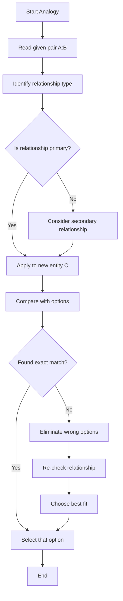

## Concept Ladder

**Step 1: Foundational Principles**
- General Intelligence and Reasoning in SSC CGL Tier-I tests pattern recognition, relation mapping, and logical deduction across 25 questions in 15 minutes.
- Speed and accuracy are critical; every second counts. High-yield rules must be immediately recallable.

**Step 2: Core Domains**
- Analogy and Classification: Identify relationships or odd entities.
- Series: Number and alphabet sequences with missing terms.
- Coding-Decoding: Letter shifts, symbol maps, and reverse patterns.
- Mathematical Operations: Symbol substitution with BODMAS.
- Non-Verbal Reasoning: Mirror/water images, embedded figures, paper folding, dice.
- Other Topics: Calendar, clock, dictionary order, ranking, syllogism.

**Step 3: Analogy and Classification Method**
- Analogy: Find relationship in first pair (e.g., purpose, class, cause-effect) and map it to the second.
- Classification: Detect a shared property (e.g., all are squares except one) and pick the non-conforming element.

**Step 4: Series and Coding Strategy**
- Number Series: Compute differences, then ratios, then special patterns (squares, primes). Always list differences first.
- Alphabet Series: Convert letters to positions (A=1, B=2,... Z=26). Look for arithmetic progression in positions.
- Coding-Decoding: Identify if shift is forward/backward constant, or reverse alphabet mapping (A=Z, B=Y).

**Step 5: Non-Verbal Reasoning Rules**
- Mirror Image: Left-right reversal. Only letters with vertical symmetry (A, H, I, M, O, T, U, V, W, X, Y) stay unchanged.
- Water Image: Upside-down reversal. Letters with horizontal symmetry (B, C, D, E, H, I, K, O, X) stay unchanged.
- Embedded Figure: Check if rotation is allowed. If not, orientation must match exactly.
- Paper Folding: Track fold lines symmetrically. For holes, count layers and positions.
- Dice: Standard die has opposite pairs summing to 7 (1-6, 2-5, 3-4).

**Step 6: Exam-Level Integration**
- Use elimination to discard clearly wrong options first.
- Maintain a pattern library: memorize common sequences (e.g., 2^n, n^2, Fibonacci).
- Practice symbol discipline: rewrite all operations before solving.
- Build a repair log for recurring trap types to avoid repeat mistakes.

## Type System

| Type | Recognition Cue | Method | Speed Target | Trap |
|------|-----------------|--------|--------------|------|
| Analogy | A is related to B as C is to ? | Identify relationship type (purpose, class, etc.) and apply | 20 s | Overlooking secondary relationships |
| Classification | Find odd one out: A, B, C, D | Check common property; isolate different one | 15 s | Assuming property that is inconsistent |
| Number Series | Number sequence with missing term | Compute differences; then ratios; then special patterns | 20 s | Confusing arithmetic with geometric progression |
| Alphabet Series | Letter sequence | Convert to positions; find pattern in differences | 20 s | Forgetting circular alphabet after Z |
| Coding-Decoding | Code for word/number | Identify shift or substitution rule; apply to target | 20 s | Misapplying reverse order when direct shift is used |
| Mathematical Operations | Symbols have different meanings (e.g., + means x) | Replace symbols with operations; apply BODMAS | 25 s | Forgetting to replace all symbols before solving |
| Venn Diagram | Which diagram best represents sets | Identify set relationships (all, some, no) | 15 s | Misdrawing overlapping regions |
| Mirror Image | Which is the mirror image? | Left-right reversal; check symmetry | 10 s | Confusing with water image |
| Water Image | Which is the water image? | Upside-down reversal; check reflected shape | 10 s | Applying mirror rules to water image |
| Embedded Figure | Find hidden part in larger figure | Check if rotation allowed; scan for exact shape | 20 s | Ignoring rotation possibility |
| Paper Folding | Visualize folded and cut pattern | Track fold lines and hole positions logically | 30 s | Missing order of folds |
| Dice | Number opposite to given face | Use standard opposite pairs (1-6, 2-5, 3-4) | 10 s | Forgetting non-standard dice rules |
| Calendar | Day of week for a date | Use odd day count; know anchor day | 30 s | Miscounting leap years |
| Clock | Angle between hour and minute hands | Formula: 30H - 5.5M (absolute difference) | 20 s | Forgetting minute hand moves continuously |

## Speed Methods

**Recall Table: Common Patterns**
- Analogies: purpose (knife:cutting), class (sparrow:bird), part-whole (finger:hand), cause-effect (fire:smoke).
- Number Series: add constant (+2 each), multiply by constant (x2), square (1,4,9,16), prime (2,3,5,7,11), Fibonacci (each term sum of previous two).
- Alphabet Series: positions (+1,+2,+3,...), reverse order (A=Z, B=Y), cyclic wrap (Z next to A).
- Coding-Decoding: direct shift (A+3=D), reverse shift (A-3=X), substitution by pattern (every letter replaced by next consonant).

**Decision Rules**
- If two options seem plausible in analogy, re-check the exact relationship (primary vs. secondary).
- For classification, first test geometric properties (squares, cubes, primes) before arithmetic.
- For non-verbal, always confirm rotation allowance before matching embedded figures.

**Step-by-Step Algorithms**

1. **Analogy Algorithm** (20 s)
   - Step 1: State relationship between A and B (e.g., A is used for B).
   - Step 2: Apply the same relationship to C.
   - Step 3: Compare with options; if multiple match, refine relationship.
   - Step 4: Select best fit.

2. **Number Series Algorithm** (20 s)
   - Step 1: Compute differences between consecutive terms.
   - Step 2: If differences constant, the pattern is arithmetic.
   - Step 3: If differences follow a pattern (e.g., increasing by 2), apply.
   - Step 4: If not, compute ratios (x2, x3, etc.).
   - Step 5: If still no pattern, check squares, cubes, primes, or mixed operations (x2+1).
   - Step 6: Apply found pattern to find missing term.

3. **Mathematical Operations Algorithm** (25 s)
   - Step 1: Read the operation map (e.g., + means x, x means ).
   - Step 2: Rewrite the expression with standard operators by substituting each symbol.
   - Step 3: Apply BODMAS: Brackets, Orders, Division, Multiplication, Addition, Subtraction.
   - Step 4: Compute step-by-step and match with options.

## Trap Table

| Trap | Trigger Wording | Wrong Move | Correct Move | Repair Drill |
|------|-----------------|------------|--------------|--------------|
| Analogy secondary relationship | "Book is related to Reading in the same way Knife is related to" | Assuming knife is for writing (book has pages, knife could carve writing?) | Identify primary purpose: reading vs cutting. | Practice 10 analogy drills focusing only on purpose relationship. |
| Classification inconsistent property | "Odd one: 16, 25, 36, 48" | Saying 48 is even but all are even? | Check perfect squares: 16,25,36 are squares; 48 is not. | Drill on number classification (square, cube, prime). |
| Series pattern misidentification | "3, 7, 15, 31, ?" | Guessing 55 because differences 4,8,16 (doubling) | Pattern is x2+1, so 31x2+1=63. | Memorize common mixed patterns: x2+1, x2-1, x3+2. |
| Alphabet series circular skip | "B, E, J, Q, ?" | Thinking next is X (pattern +3,+5,+7 then +9 gives 26=Z) | Convert to numbers: 2,5,10,17; differences +3,+5,+7; next +9 = 26 = Z. | Always convert letters to positions. Practice number-letter mapping. |
| Coding shift direction error | "If AB is written as BC, what is XY?" | Shifting forward by 1 gives YZ, but check if consistent | Confirm shift: A->B (+1), B->C (+1); XY->YZ. | Always test shift on first letter to confirm direction. |
| Mathematical operation symbol confusion | "If + means x, x means ,  means /, / means +" | Solving 8+3 as 8+3 first? | Rewrite: 8 x 3  4 + 2; then apply BODMAS. | Write each replacement visibly before solving. |
| Mirror vs Water Image | "Which is mirror image?" | Applying upside-down reversal | Vertical mirror flips left-right; water image flips upside-down. | Memorize: mirror=left-right, water=up-down. |
| Embedded figure rotation ignored | "Find the embedded figure" | Searching only exact orientation | Check question: if rotation allowed, mentally rotate options. | Always read rotation condition first. |
| Dice opposite face confusion | "Opposite of 2 in standard dice?" | Saying 3 because 2+? | Standard opposite pairs: 1-6,2-5,3-4; opposite of 2 is 5. | Memorize standard dice opposite pairs. |
| Calendar leap year miscount | "Day of week for Feb 29, 2000" | Assuming 2000 not leap because divisible by 100? | 2000 divisible by 400, so leap year. | Review leap year rule: divisible by 4, but not by 100 unless by 400. |
| Clock angle formula error | "Angle at 3:15" | Using 3x30 - 15x6 = 90-90=0 | Hour hand moves 0.5 deg/min, so at 3:15 hour is 97.5, minute is 90, angle = 7.5. Use formula |30H-5.5M|. | Practice with fractional hours. |
| Syllogism "some/all" confusion | "All A are B; some B are C" | Concluding all A are C | Not valid; draw Venn: only some A may be C. | Practice syllogism with all, some, no statements. |
| Dictionary order alphabetical tie | "adapt, adept, adopt, adult" | Placing adept before adapt because e comes before p? | Compare letter by letter: ada < ade, so adapt first. | Always compare third letter when first two are same. |
| Ranking position double counting | "John is 5th from left and 8th from right, total?" | Assuming 5+8+1=14? | Correct: left + right -1 = 5+8-1=12. | Drill on ranking formulas. |
| Non-verbal paper folding fold order | "Paper folded twice, punch hole" | Punching after first fold only | Consider all folds; hole appears symmetrically in each layer. | Visualize step-by-step; use symmetry. |

## Flowchart

## Solved Examples

**Example 1: Analogy**
Book is related to Reading in the same way Knife is related to:
Options: (a) Writing (b) Cutting (c) Cooking (d) Drawing
**Solution**: A book is primarily used for reading. A knife is primarily used for cutting. **Answer: (b) Cutting**

**Example 2: Classification**
Choose the odd one out: 16, 25, 36, 48
Options: (a) 16 (b) 25 (c) 36 (d) 48
**Solution**: 16, 25, and 36 are perfect squares. 48 is not a perfect square. **Answer: (d) 48**

**Example 3: Number Series**
Find the missing term: 3, 7, 15, 31, ?
Options: (a) 47 (b) 55 (c) 63 (d) 67
**Solution**: Each term is previous x 2 + 1: 3->7, 7->15, 15->31. Next = 31 x 2 + 1 = 63. **Answer: (c) 63**

**Example 4: Alphabet Series**
Find the next term: B, E, J, Q, ?
Options: (a) X (b) Y (c) Z (d) W
**Solution**: Alphabet positions are 2, 5, 10, 17. Differences are +3, +5, +7. Next difference is +9, so 17 + 9 = 26 = Z. **Answer: (c) Z**

**Example 5: Mathematical Operations**
If + means x, x means -, - means /, and / means +, what is 8 + 3 x 4 / 2?
Options: (a) 18 (b) 20 (c) 22 (d) 24
**Solution**: Replace symbols: 8 x 3 - 4 + 2 = 24 - 4 + 2 = 22. **Answer: (c) 22**

**Example 6: Venn Diagram**
Which diagram best represents Women, Doctors, and Mothers?
Options: (a) All separate (b) Mothers inside women, doctors overlapping women (c) Doctors inside mothers (d) Women inside doctors
**Solution**: All mothers are women, so mothers are inside women. Doctors may be men or women, and some women can be doctors, so doctors overlap women. **Answer: (b) Mothers inside women, doctors overlapping women**

**Example 7: Mirror Image Rule**
Which letter remains unchanged in a vertical mirror?
Options: (a) B (b) C (c) H (d) R
**Solution**: H is symmetrical across a vertical axis. B, C, and R change shape. **Answer: (c) H**

**Example 8: Embedded Figure**
In embedded-figure questions, what should be checked first?
Options: (a) Colour (b) Rotation allowed or not (c) Option length (d) Alphabet order
**Solution**: The first rule is whether rotation is allowed. If not allowed, orientation must match exactly. **Answer: (b) Rotation allowed or not**

**Example 9: Dictionary Order**
Arrange in dictionary order: adapt, adept, adopt, adult
Options: (a) adapt, adept, adopt, adult (b) adept, adapt, adopt, adult (c) adapt, adept, adult, adopt (d) adult, adopt, adept, adapt
**Solution**: Compare letter by letter. ada comes before ade, ado, adu. Therefore adapt, adept, adopt, adult. **Answer: (a) adapt, adept, adopt, adult**

**Example 10: Dice**
If a standard cube shows 1 opposite 6, 2 opposite 5, and 3 opposite 4, which number is opposite 2?
Options: (a) 3 (b) 4 (c) 5 (d) 6
**Solution**: The given opposite pair is 2 opposite 5. **Answer: (c) 5**

## PYQ Mapping

To master Reasoning High-Yield Rules for SSC CGL Tier-I, focus on practice routes for each type:

- Analogy and Classification: Use [Analogy-Classification](/exams/ssc-cgl/topics/analogy-classification) to drill relationship families and odd-one-out checks.
- Series and Coding: Use [Series-Coding](/exams/ssc-cgl/topics/series-coding) for number/alphabet series and coding-decoding shift rules.
- Non-Verbal Reasoning: Use [Non-Verbal-Reasoning](/exams/ssc-cgl/topics/non-verbal-reasoning) for mirror, water image, embedded figures, paper folding, and dice.
- Mathematical Operations: Use [Mathematical-Operations](/exams/ssc-cgl/topics/mathematical-operations) for symbol substitution and BODMAS practice.

Each route contains targeted exercises, time trials, and trap logs. After completing drills, attempt full-length Reasoning tests to simulate exam pressure.

## 200/200 Drill

For a 200/200 score, you need speed and zero errors. Implement the following timed micro-drills and repair rules.

**Timed Micro-Drills (15 minutes total):**
- Drill 1: Analogy - 5 questions in 2 minutes (24 seconds each).
- Drill 2: Classification - 5 questions in 1.5 minutes (18 seconds each).
- Drill 3: Number Series - 5 questions in 2 minutes (24 seconds each).
- Drill 4: Alphabet Series - 5 questions in 2 minutes (24 seconds each).
- Drill 5: Coding-Decoding - 5 questions in 2 minutes (24 seconds each).
- Drill 6: Mathematical Operations - 5 questions in 2.5 minutes (30 seconds each).
- Drill 7: Non-Verbal - 5 questions in 3 minutes (36 seconds each).

Total time: 15 minutes for 35 questions. Adjust based on your weak areas.

**Repair Rules:**
- After each drill, note any errors in a repair log.
- For each error, identify the trap from the Trap Table and practice the repair drill.
- Example: If you misidentified a series pattern, revisit the pattern library and do 10 extra questions on that pattern.
- Use the flowchart to step through your thinking process for missed questions.
- Aim for 100% accuracy in drills before attempting full tests.

**Final Tip:** In the exam, skip a question if stuck for more than 45 seconds. Mark for review and return if time permits. Use elimination heavily.

