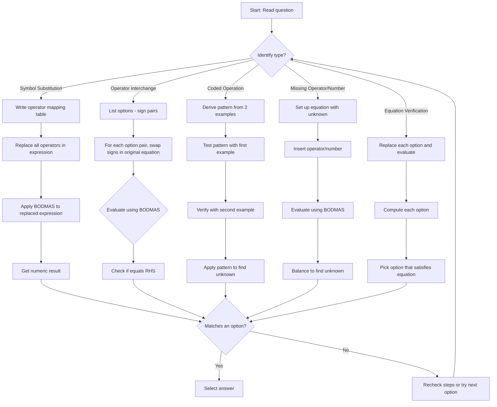

## Concept Ladder

**Step 1: Fundamental Arithmetic Operators**  
Know standard operations: +, -, x, /, brackets ( ), and BODMAS precedence: Brackets, Orders (powers/roots), Division, Multiplication, Addition, Subtraction. In the exam, only basic arithmetic is used.

### Corpus Pressure

The uploaded book-PYQ corpus marks `mathematical-operations` as a 200/200 standard Reasoning topic with 157 promoted questions. The promoted source block is concentrated in `Scribd HTML Pages`, which contributes **157 promoted questions**. This is a focused reasoning skill: the same traps repeat through symbol replacement, operator interchange, BODMAS, coded operations, and equation balance.

| Corpus signal | What it demands | 36-second implication |
|---|---|---|
| `Scribd HTML Pages` | **157 promoted questions** from one concentrated source block | Build a fixed operator-table habit instead of solving each question casually |
| Symbol substitution repeats | Operators are renamed before arithmetic | Replace first, calculate second |
| Operator interchange repeats | Two signs must be swapped everywhere | Test options systematically; do not swap in only one location |
| Coded operation repeats | A symbol hides a formula | Verify the rule on all given examples before applying it |
| BODMAS traps repeat | Replacement changes precedence pressure | Write the replaced expression before mental arithmetic |

The 200/200 standard is: classify the question in five seconds, write the operator map or rule, solve under BODMAS, and verify the answer with either equality check or option elimination.

**Step 2: Symbol Substitution**  
The question assigns new meanings to operators. Example: + means x. Replace every operator according to the given map *before* calculating. Never perform arithmetic with the original symbol.

**Step 3: Operator Interchange**  
Two signs are swapped to make an equation correct. Systematically test each option by replacing the two signs and evaluating with BODMAS. Only the correct pair will yield the RHS.

**Step 4: Coded Operations**  
An abstract symbol (e.g., @, #, *) defines a hidden pattern like a @ b = a + b + a x b. Deduce the pattern from examples, then apply to the unknown.

**Step 5: Missing Operator/Number**  
Insert the correct operator or number to balance the equation. Use option testing or backtracking from the result.

**Step 6: BODMAS After Replacement**  
After substituting symbols, always apply BODMAS in the expression. Ignoring brackets or computing left-to-right is the most common error.

**Step 7: Equation Balance & Verification**  
For "which equation is correct?" translate each option and evaluate independently. The one that matches the RHS is the answer.

**Step 8: Reverse Engineering & Pattern Extrapolation**  
Given two coded examples, derive the rule by analyzing difference, product, sum, or exponent patterns. Confirm with a third example if needed.

**Step 9: Speed Tailoring for 200/200**  
Most questions can be solved in 15-25 seconds. For interchange questions, start with the most likely option (often + and x). For pattern questions, write the pattern algebraically from the first example and verify with the second.

**Step 10: Integration with Section Strategy**  
Mathematical operations appear 2-4 times in the exam. They are high-yield: accuracy outranks raw speed. Use the 36-second reasoning attempt plan: 10 seconds to identify type, 15 seconds to solve, 5 seconds to confirm with option testing. Skip if the pattern is not clear in 10 seconds, and return after attempting all straightforward questions.

## Type System

| Type | Recognition Cue | Method | Speed Target | Trap |
|------|----------------|--------|--------------|------|
| Symbol Substitution | "If + means x, then find ..." | Replace all operators, then BODMAS | 15 seconds | Calculating before replacement |
| Operator Interchange | "Which two signs should be interchanged to make ... correct?" | Test each option by mentally swapping & evaluating | 20 seconds | Forgetting to swap both signs |
| Coded Arithmetic | "If a @ b = a + b + a x b, then find 2 @ 3" | Derive pattern from examples, apply to unknown | 20 seconds | Pattern misread (e.g., using sum only) |
| Missing Operator | "Which operator makes 12 ? 4 ? 3 = 9 true?" | Test options left-to-right with BODMAS | 20 seconds | Ignoring precedence; assuming left-to-right |
| Missing Number / Balance | "Find the value of x: 5 x 4 + x = 27" | Isolate x after BODMAS on LHS | 10 seconds | Forgetting BODMAS (e.g., adding before multiply) |
| Equation Verification | "Which of the following equations is correct after replacing symbols?" | Replace each option and check equality | 25 seconds | Numeric miscalculation under time pressure |
| Reverse Pattern | "9 # 4 = 45 and 8 # 3 = 32; find rule" | Compare differences, try multiplication, addition, exponents | 25 seconds | Assuming linear pattern (e.g., a+b) without verification |

### Corpus Micro-Type Repair: Sign Number Interchange Equation Repair

The book-PYQ corpus for this topic is dominated by **sign interchange equation repair**, **number interchange equation repair**, and **BODMAS equation repair**. Treat these as option-testing questions, not as normal arithmetic questions. Your job is to repair the equation with the allowed swap and verify equality.

| Corpus Label | Recognition Cue | 36-Second Method | Trap |
|--------------|-----------------|------------------|------|
| sign interchange equation repair | "Which two signs should be interchanged..." | Swap the two signs everywhere, rewrite once, then apply BODMAS | Swapping only the first occurrence |
| number interchange equation repair | "Which two numbers should be interchanged..." | Swap the two numbers everywhere, keep signs fixed, then test equality | Changing operation signs while swapping numbers |
| BODMAS equation repair | "make the equation correct" | After each candidate repair, evaluate division/multiplication before addition/subtraction | Left-to-right calculation |

Mini drill: `8 + 4 x 3 + 2 = 38`. If `+` and `x` are interchanged everywhere, the expression becomes `8 x 4 + 3 x 2 = 32 + 6 = 38`, so the equation is repaired. Do not stop after swapping only the first `+`; repeated signs must all change.

### First 5-Second Classification

Classify the question before calculating. The first five seconds prevent most careless losses.

| First 5-second cue | Classification | Immediate move | Time ceiling |
|---|---|---|---:|
| "If + means x, - means /..." | Symbol substitution | Draw a two-row operator map and rewrite the expression | 20 sec |
| "Which two signs should be interchanged" | Operator interchange | Test each option by swapping both signs everywhere | 25 sec |
| "If a @ b = ..." | Coded operation | Write the formula once, then plug in the asked values | 20 sec |
| Two examples define an unknown symbol | Reverse coded pattern | Verify the derived rule on both examples | 25 sec |
| One blank operator appears between numbers | Missing operator | Try options using BODMAS, not left-to-right arithmetic | 20 sec |
| An equation has an unknown number | Equation balance | Apply BODMAS first, then isolate the unknown | 15 sec |
| Four equations are given as options | Equation verification | Translate each option and stop at the first true equality | 30 sec |
| Brackets appear | Bracket priority | Resolve bracket expression before replacement arithmetic | 20 sec |
| Division and multiplication appear together | Equal-precedence lock | Evaluate left to right after replacement | 20 sec |

## Speed Methods

**Method 1: Substitute First, Calculate Later**  
Always write the replaced expression on rough paper. Use the symbol table as:  
Original: + - x /  
New:      x + - /  
Then solve using BODMAS.  
*When to use:* Every symbol substitution question.  
*Speed trick:* If the expression involves only two operators, you may do mental replacement.

**Method 2: Option Testing for Operator Interchange**  
List the options (e.g., + and x, + and -, etc.). For each option, mentally swap the two symbols in the given equation and evaluate quickly. Usually the correct option yields a round number.  
*Decision rule:* Start with the pair that involves the most frequent operators (+, x).  
*Approximation/option elimination:* If after swapping, the result is far from RHS, eliminate immediately.

**Method 3: Pattern Derivation - Algebra First**  
Given two examples, set up a general form: a @ b = f(a,b). Try common forms:  
- a + b + c  
- a x b + (a + b)  
- a x b + a + b  
- a^2 + b^2  
- a x (b + k)  
Test the first example, then verify with the second.  
*Skip threshold:* If you cannot see a pattern in 10 seconds, move to next question.

**Method 4: Missing Operator - Backtrack with BODMAS**  
For "12 ? 4 ? 3 = 9", the first operator likely influences the magnitude. If division (/) is present, try it first: 12 / 4 = 3, then ? 3 = 9  second operator is x.  
*Speed rule:* Always try lower-precedence operators first (+, -) only after checking division/multiplication.

**Method 5: Equation Balance - Direct Substitution**  
For missing number, after BODMAS on LHS, solve simple linear equation. No need to test options unless the options are large.  
*When to skip option testing:* When the equation is linear and single variable, solve algebraically.

**Method 6: Coded Operation - Write Formula Once**  
As soon as the pattern is clear, write the formula: e.g., a @ b = a + b + a x b. Then plug in numbers.  
*Avoid mental arithmetic errors:* Do each step on paper.

## Trap Table

| Trap | Trigger Wording | Wrong Move | Correct Move | Repair Drill |
|------|----------------|------------|--------------|--------------|
| Calculate before replacement | "If + means x, find 2+3x4" | 2+3=5, then 5x4=20 | Replace first: 2x3+4=6+4=10 | Drill: Write replaced expression before any arithmetic |
| Ignore BODMAS after replacement | "8+3x4/2" (using given map) | Left-to-right: 8+3=11, 11x4=44, 44/2=22 (wrong if map changes signs) | Apply BODMAS after substitution | Practice 5 expressions daily with BODMAS check |
| Forget bracket order | "18-(6/3)x4" | 18-6=12, 12/3=4, 4x4=16 (wrong) | Bracket first: 6/3=2, then 2x4=8, then 18-8=10 | Daily bracket priority drills |
| Misread symbol meaning | "P means +, Q means -, R means x, S means /" but use original meaning while calculating | 10 R 2 Q 5 = 10 R 2 -5 = 10x2-5=15 correct? (if they forget to replace R) | Replace every symbol before evaluation | Create a mapping table on rough sheet |
| Pattern overgeneralization | "4*5=41, 6*7=85 assumes a*b = a^2 + b^2 but check with 8*3 = 73; but if only one example given, assume wrong pattern | Use a+b or a*b+constant | Verify pattern with both examples | Always test derived pattern on the second example |
| Sign interchange - only swap in one place | "Interchange + and x in 6+4x6=30" | Swap only first occurrence: 6x4+6=30 (correct), but other occurrence may be missed if multiple | Swap all occurrences of both signs | Practice multi-operator equations |
| Negative sign mishandling | "18/3-4x2" after replacement gives -2; student writes 6-8 = -2 correct, but then takes absolute value | Write 2 instead of -2 | Keep sign as computed | Recheck sign at the end |
| Option testing in wrong order | "Which pair of operators makes 12?4?3=9" | Test + and x first: 12+4x3=12+12=24, then try other; may miss /,x | Use systematic order: test likely operators first (/ and x) | Drill: list operators in order of precedence and test that order |
| Missing operator over-constraint | "What replaces ? in 5 ? 1 = 6" and assume only + works | Only consider +; but x then -? 5 x 1 =5, not 6; 5+1=6 | Test all operators quickly | Memorize: +, -, x, / are the only options |
| Fraction misinterpretation | "12/4x3" from replacement; student does 12/4=3, but then 3/3=1 instead of 3x3 | 12/(4x3) = 12/12=1 | Division and multiplication have equal precedence, evaluated left-to-right | Practice expressions with both / and x |
| Bracket omission in original equation | "Find 6+4x6=30 after interchange" but mistaken to add bracket around 4x6 automatically | 6+(4x6)=30, but without brackets it's same due to BODMAS; but some create extra brackets | Do not add brackets not given | Only apply BODMAS as per written expression |
| Copying wrong symbol map | "If + means x, x means -, - means /, / means +" student misses one | Use map partially | Write full map before starting | Create a 2-row mapping table |
| Speed-driven mental arithmetic error | "18 / 3 - 4 x 2" after replacement: compute 18/3=6, then 6-4=2, then 2x2=4 (wrong order) | Multiply after subtraction | Compute 4x2 first, then 6-8=-2 | Use rough paper for every step |
| Pattern extrapolation with different operation structure | "If 2@3=11 and 4@5=29, find 6@7" - uses a^2+b^2+? | Assume a@b = a*b + (a+b) etc. without verifying | Test derived rule on both | Always cross-check using the second example |
| Ignoring negative results | "18/3 - 4x2 = -2" student selects option with positive 2 | Choose option (b) 2 instead of (a) -2 | Always include sign in answer | Practice negative outcomes |

## Flowchart

## Solved Examples

**Example 1: Symbol Substitution**  
If + means x, x means -, - means /, and / means +, find 8 + 3 x 4 / 2.  
Options: (a) 18 (b) 20 (c) 22 (d) 24  
**Solution**: Replace symbols: 8 x 3 - 4 + 2 = 24 - 4 + 2 = 22. **Answer: (c) 22**

**Example 2: BODMAS After Replacement**  
If + means -, - means x, x means /, and / means +, find 18 x 3 + 4 - 2.  
Options: (a) -2 (b) 2 (c) 6 (d) 14  
**Solution**: Replace symbols: 18 / 3 - 4 x 2 = 6 - 8 = -2. **Answer: (a) -2**

**Example 3: Correct Equation**  
Which two signs should be interchanged to make 6 + 4 x 6 = 30 correct?  
Options: (a) + and x (b) + and - (c) x and / (d) - and /  
**Solution**: Interchange + and x: 6 x 4 + 6 = 24 + 6 = 30. **Answer: (a) + and x**

**Example 4: Number Relation**  
If 4 * 5 = 41 and 6 * 7 = 85, then 8 * 3 = ?  
Options: (a) 65 (b) 70 (c) 73 (d) 75  
**Solution**: Pattern: a * b = a^2 + b^2. 4^2 + 5^2 = 16 + 25 = 41. 8^2 + 3^2 = 64 + 9 = 73. **Answer: (c) 73**

**Example 5: Missing Operator**  
Which operator pair makes 12 ? 4 ? 3 = 9 true if normal precedence is followed?  
Options: (a) +, - (b) /, x (c) x, - (d) -, +  
**Solution**: Test option (b): 12 / 4 x 3 = 3 x 3 = 9. The other listed pairs do not give 9. **Answer: (b) /, x**

**Example 6: Operation Code**  
If A @ B means A + B + AB, find 2 @ 3.  
Options: (a) 8 (b) 9 (c) 10 (d) 11  
**Solution**: 2 @ 3 = 2 + 3 + 2 x 3 = 5 + 6 = 11. **Answer: (d) 11**

**Example 7: Equation Balance**  
Which number replaces x: 5 x 4 + x = 27?  
Options: (a) 5 (b) 6 (c) 7 (d) 8  
**Solution**: BODMAS first: 5 x 4 = 20. Then 20 + x = 27, so x = 7. **Answer: (c) 7**

**Example 8: Reverse Operation**  
If 9 # 4 = 45 and 8 # 3 = 32, which rule fits?  
Options: (a) a + b (b) a x (b + 1) (c) a^2 - b (d) a - b  
**Solution**: 9 x (4 + 1) = 45 and 8 x (3 + 1) = 32. Rule is a x (b + 1). **Answer: (b) a x (b + 1)**

**Example 9: Symbol Meaning**  
If P means +, Q means -, R means x, and S means /, find 10 R 2 Q 5.  
Options: (a) 10 (b) 12 (c) 15 (d) 20  
**Solution**: Replace symbols: 10 x 2 - 5 = 20 - 5 = 15. **Answer: (c) 15**

**Example 10: Bracket Awareness**  
Find the value of 18 - (6 / 3) x 4.  
Options: (a) 10 (b) 12 (c) 14 (d) 16  
**Solution**: Bracket first: 6 / 3 = 2. Then 2 x 4 = 8. Finally 18 - 8 = 10. **Answer: (a) 10**

**Example 11: Odd Equation**  
Find the wrong equation if x means + and + means x.  
Options: (a) 2 x 3 + 4 = 14 (b) 5 x 2 + 3 = 21 (c) 4 x 1 + 5 = 25 (d) 6 x 2 + 2 = 16  
**Solution**: Replace x with + and + with x. Option (a): 2 + 3 x 4 = 14 true. (b): 5 + 2 x 3 = 11, not 21. **Answer: (b) 5 x 2 + 3 = 21**

**Example 12: Operator Priority**  
What should be solved first in 9 + 6 / 3 x 2?  
Options: (a) 9 + 6 (b) 6 / 3 (c) 3 x 2 (d) 9 + 2  
**Solution**: Division and multiplication are solved before addition, left to right. First solve 6 / 3. **Answer: (b) 6 / 3**

**Example 13: Double Replacement**  
If + means /, / means x, x means -, and - means +, find 24 + 3 / 4 x 5.  
Options: (a) 27 (b) 31 (c) 32 (d) 35  
**Solution**: Replace first: 24 / 3 x 4 - 5 = 8 x 4 - 5 = 32 - 5 = 27. **Answer: (a) 27**

**Example 14: Interchange With Repeated Sign**  
Which two signs should be interchanged to make 8 + 4 x 3 + 2 = 38 correct?  
Options: (a) + and x (b) x and - (c) + and / (d) - and /  
**Solution**: Interchange + and x everywhere: 8 x 4 + 3 x 2 = 32 + 6 = 38. The repeated + sign must be swapped in both places. **Answer: (a) + and x**

**Example 15: Clean Interchange**  
Which two signs should be interchanged to make 7 + 5 x 2 = 37 correct?  
Options: (a) + and x (b) + and - (c) x and / (d) - and /  
**Solution**: Swap + and x: 7 x 5 + 2 = 37. **Answer: (a) + and x**

**Example 16: Coded Operation Product Plus Difference**  
If a @ b = ab + a - b, find 6 @ 4.  
Options: (a) 22 (b) 24 (c) 26 (d) 28  
**Solution**: 6 @ 4 = 6 x 4 + 6 - 4 = 24 + 2 = 26. **Answer: (c) 26**

**Example 17: Rule From Two Examples**  
If 3 # 2 = 13 and 5 # 4 = 41, find 6 # 3.  
Options: (a) 39 (b) 42 (c) 45 (d) 48  
**Solution**: Check a # b = a^2 + b^2: 3^2 + 2^2 = 13 and 5^2 + 4^2 = 41. Therefore 6 # 3 = 36 + 9 = 45. **Answer: (c) 45**

**Example 18: Missing Operator With Precedence**  
Which operator replaces ? in 18 / 3 ? 4 = 10?  
Options: (a) + (b) - (c) x (d) /  
**Solution**: First 18 / 3 = 6. We need 6 ? 4 = 10, so ? is +. **Answer: (a) +**

**Example 19: Missing Number After BODMAS**  
Find x if 9 x 3 - x = 20.  
Options: (a) 5 (b) 7 (c) 9 (d) 11  
**Solution**: BODMAS gives 9 x 3 = 27. Then 27 - x = 20, so x = 7. **Answer: (b) 7**

**Example 20: Symbol Map With Brackets**  
If + means -, - means x, and x means +, find (8 + 3) - 2 x 5.  
Options: (a) 5 (b) 10 (c) 15 (d) 20  
**Solution**: Replace symbols: (8 - 3) x 2 + 5 = 5 x 2 + 5 = 15. **Answer: (c) 15**

**Example 21: Equality Verification**  
If P means x and Q means +, which equation is true?  
Options: (a) 3 P 4 Q 2 = 14 (b) 3 Q 4 P 2 = 14 (c) 5 P 2 Q 1 = 12 (d) 6 Q 2 P 3 = 24  
**Solution**: Option (a): 3 x 4 + 2 = 14, true. Stop after verifying equality. **Answer: (a)**

**Example 22: Negative Result Discipline**  
If + means -, x means +, and - means x, find 12 + 8 - 2.  
Options: (a) -4 (b) 4 (c) 20 (d) 28  
**Solution**: Replace: 12 - 8 x 2. BODMAS: 8 x 2 = 16, then 12 - 16 = -4. **Answer: (a) -4**

**Example 23: Left-to-Right Equal Precedence**  
Find the value of 36 / 6 x 2.  
Options: (a) 3 (b) 6 (c) 12 (d) 18  
**Solution**: Division and multiplication have equal precedence, so solve left to right: 36 / 6 = 6, then 6 x 2 = 12. **Answer: (c) 12**

**Example 24: Pattern Verification Drill**  
If 2 @ 4 = 14 and 3 @ 5 = 23, which rule fits both?  
Options: (a) ab + a (b) ab + b (c) ab + a + b (d) a + b^2  
**Solution**: Test option (c): 2 x 4 + 2 + 4 = 14 and 3 x 5 + 3 + 5 = 23. The rule fits both examples. **Answer: (c) ab + a + b**

**Example 25: 36-Second Mixed Question**  
If A means +, B means x, C means -, and D means /, find 18 D 3 A 4 B 2 C 5.  
Options: (a) 7 (b) 9 (c) 11 (d) 13  
**Solution**: Translate: 18 / 3 + 4 x 2 - 5. BODMAS gives 6 + 8 - 5 = 9. **Answer: (b) 9**

## PYQ Mapping

The following practice routes cover all sub-types of Mathematical Operations in SSC CGL Tier-I. Use them to build speed and accuracy.

- **Symbol Substitution & BODMAS**: Practice 20 questions from /exams/ssc-cgl/topics/mathematical-operations focusing on replacement and BODMAS computation. Alternate between simple (2 operators) and complex (4 operators with brackets) sets.
- **Operator Interchange**: Solve 15 questions from the same route. For each, time yourself (20 seconds max). Use the option-testing speed method.
- **Coded Operations (Pattern Recognition)**: Practice 10 questions from /exams/ssc-cgl/topics/series-coding to strengthen pattern-detection skills. Then return to mathematical operations coded problems.
- **Equation Balance & Missing Operator**: Combine with arithmetic drill from /exams/ssc-cgl/tests/ssc-cgl-reasoning-speed-sprint. Focus on linear equations and BODMAS backtracking.
- **Full Timed Sprint**: Attempt the mock test at /exams/ssc-cgl/tests/ssc-cgl-reasoning-speed-sprint for 25 Reasoning questions in 15 minutes, including at least 5 mathematical operations questions. Aim for 100% accuracy before moving to speed.

## 200/200 Drill

**Timed Micro-Drills (daily, 5 minutes each):**

1. **Operator Map Drill** - Given a mapping table, write the replaced expression for 5 different arithmetic strings. No calculation, only replacement. Time: 60 seconds.
2. **BODMAS Computation Drill** - Solve 5 replaced expressions step-by-step using BODMAS. Use rough paper. Time: 90 seconds.
3. **Option Testing Sprint** - For 3 operator-interchange questions, test all options in order. Circle the correct pair. Time: 60 seconds.
4. **Pattern Derivation Blitz** - Given two coded examples, write the algebraic rule in 20 seconds per question. Do 3 questions. Time: 60 seconds.
5. **Equation Balance Speed Test** - Solve 5 missing-number questions by isolating x after BODMAS. Time: 60 seconds.

**Repair Rules:**

- If you ever calculate before replacement, do 5 extra replacement-only drills immediately.
- If you get a BODMAS order wrong, rewrite the expression with explicit brackets showing precedence.
- If you fail to identify a pattern within 15 seconds, move on and review pattern types (square sum, product+sum, etc.) after the drill.
- If you select a wrong option in interchange, check again by swapping both signs for every occurrence.

**Weekly Accuracy Goal:** Solve 30 mixed mathematical operations questions (from the practice links) with 29 correct (97% accuracy) before focusing on speed. Once accuracy is stable, reduce per-question time by 5 seconds until you reach 15-20 seconds per question.

**Mastery Standard:** On exam day, use the 36-second reasoning attempt plan: 10 seconds to recognize type, 15 seconds to solve using the matching method, 5 seconds to verify with equality or option check, and 6 seconds as buffer. For any question that takes more than 30 seconds, mark and skip; return only after finishing all 25 questions. Maintain a symbol map on rough sheet for all substitution questions. The target is zero careless operator errors.
<!-- SSC-FINAL-PRACTICE-QUEUE:START -->
## Final Practice Queue

1. Start one-by-one practice: [Mathematical Operations practice](/exams/ssc-cgl/practice/mathematical-operations). Finish every question in this topic bank, not just the samples in the note.
2. Move to timed sets: [SSC CGL tests](/exams/ssc-cgl/tests?topic=mathematical-operations). Use topic drills first, then section mocks once accuracy is stable.
3. Repair every miss immediately: record the error label, redo 20 mixed questions from the same topic, then retest after 24 hours.
4. 200/200 rule: do not mark this topic exam-ready until correct answers come within 36 seconds and wrong answers are explained without looking at the solution.

<!-- SSC-FINAL-PRACTICE-QUEUE:END -->
