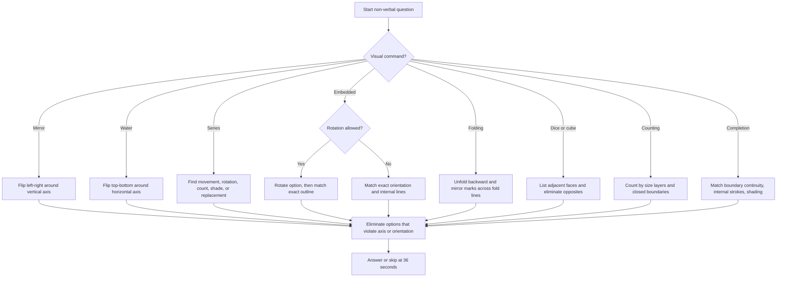

## Concept Ladder

**Step 1: Non-verbal reasoning is rule-based visual compression**  
The exam shows a shape, sequence, folded sheet, cube, or hidden figure. Your job is to identify the visual rule before comparing options. If you start by staring at options, similar-looking distractors pull you into wrong orientation, wrong axis, or wrong count.

**Step 2: Axis comes before detail**  
Mirror image uses a vertical axis: left and right swap. Water image uses a horizontal axis: top and bottom swap. Rotation uses a center point: direction changes but the shape's handedness does not flip. This distinction is the foundation for most non-verbal marks.

**Step 3: Visual changes have a grammar**  
Every figure-series item changes through one or more grammar units:
- Movement: clockwise, anticlockwise, left, right, up, down.
- Rotation: 45, 90, 135, 180, 270 degrees.
- Count: one line, dot, arrow, side, or sector added or removed.
- Shading: shaded part shifts or alternates.
- Position: element changes corner or edge.
- Replacement: one shape changes into another in a fixed order.

**Step 4: Embedded figure is boundary matching**  
For embedded figures, first ask whether rotation is allowed. Then match the outer boundary, then internal strokes. A correct option must have every line segment present inside the main figure. Do not choose an option because it "resembles" part of the figure; choose it only when the exact outline exists.

**Step 5: Paper folding is reverse mirroring**  
Folding problems are solved by unfolding backward. Each unfold mirrors all existing marks across the fold line. After two folds, do not simply multiply holes; track position and side. The count is useful, but placement decides the answer.

**Step 6: Dice and cubes are adjacency problems**  
Opposite faces never share an edge. If two faces are visible together, they are adjacent and cannot be opposite. In SSC questions, do not blindly assume standard opposite pairs. Use only the given cube views unless the question explicitly gives a standard die.

**Step 7: Counting shapes requires a register**  
Triangle and square counting fails when candidates count only small shapes or double-count large combined shapes. Use layers: smallest units, two-unit shapes, three-unit shapes, full boundary shapes, then special diagonals. Every counted shape must have a closed boundary.

**Step 8: Completion questions are line-continuity questions**  
Figure completion and matrix completion depend on continuing lines, curves, diagonals, borders, rotations, and shading. First match the outer boundary. Then match internal strokes. Then check whether the option preserves symmetry or repeated transformation.

**Step 9: Section timing standard**  
SSC CGL Tier-I reasoning has 25 questions in a 15-minute section, so the average budget is 36 seconds per question. Non-verbal questions must be classified in the first 5 seconds and solved in 15 to 35 seconds. If a visual problem crosses 45 seconds in practice, tag the type and repair that exact visual rule.

## Type System

### Corpus Pressure

The uploaded reasoning blueprint has **300 indexed book-PYQ entries** for `non-verbal-reasoning`, all under **Scribd HTML Pages**. The generated practice queue has **298 promoted questions** after exact duplicate and projection handling. This is a high-yield 200/200 topic because the same visual families repeat: mirror image, water image, embedded figure, paper folding, dice, cube, rotation, figure series, figure completion, and counting shapes.

| Corpus source | Indexed pressure | Promoted practice signal | Required mastery |
|---|---:|---:|---|
| Scribd HTML Pages | 300 indexed book-PYQ entries | 298 promoted questions | Axis flips, hidden outlines, fold-unfold placement, cube adjacency, shape counting, and sequence grammar |

The target is not "understand images". The target is to classify the visual command in 5 seconds, apply the right transformation without option bias, and finish most items inside the 36-second SSC pacing window.

### First 5-Second Classification

| First cue in question | Classify as | Immediate move |
|---|---|---|
| Mirror image | Vertical reflection | Swap left-right; top-bottom unchanged |
| Water image | Horizontal reflection | Swap top-bottom; left-right unchanged |
| Next figure | Figure series | Identify movement, rotation, count, shading, or replacement |
| Hidden/embedded figure | Embedded figure | Check if rotation is allowed, then match boundary lines |
| Folded and punched | Paper folding | Unfold backward; mirror marks across each fold |
| Open cube or cube net | Cube net | Pair opposite faces and test valid folding |
| Opposite face | Dice/cube | List visible adjacencies; opposite never adjacent |
| Number of triangles/squares | Counting shapes | Count by size layers and closed boundaries |
| Complete the figure | Figure completion | Match boundary continuation before internal strokes |
| Rotated/turned | Rotation | Track angle and direction; do not reflect |

### Full Type Tree for 200/200

| Type | Recognition cue | 36-second method | Trap to block |
|---|---|---|---|
| Mirror image basic | Mirror on right/left | Reverse left-right around vertical axis | Applying water-image flip |
| Mirror image letters | Letters or words | Use vertical symmetry set and reverse order | Treating all familiar letters as unchanged |
| Water image basic | Reflection in water | Reverse top-bottom around horizontal axis | Reversing left-right |
| Water image letters | Word/letter image | Flip vertical positions, keep left-right order | Using mirror-letter memory |
| Rotation single step | Turned 90 or 180 degrees | Rotate around center; handedness remains | Reflecting instead of rotating |
| Rotation sequence | Figure changes angle each step | Measure angle difference across steps | Assuming every step is 90 degrees |
| Figure series movement | Arrow, dot, shaded part moves | Track position around corners or sides | Missing clockwise vs anticlockwise |
| Figure series count | Lines/dots increase | Count increment per frame | Ignoring alternating count pattern |
| Figure series composite | More than one change | Separate shape, shade, count, and direction | Solving only the first visible rule |
| Embedded figure exact | Hidden figure without rotation | Match exact outline and internal strokes | Choosing similar but absent outline |
| Embedded figure rotation | Rotation allowed | Mentally rotate option, then match lines | Rejecting rotated correct option |
| Paper folding one fold | Single fold and punch | Mirror punch once across fold line | Putting holes on wrong side |
| Paper folding two folds | Folded twice | Unfold second fold first, then first fold | Multiplying holes without placement |
| Paper cutting | Fold and cut shape | Mirror the cut shape across each fold | Counting cuts but not orientation |
| Dice visible faces | Two or three cube views | Record adjacent pairs from each view | Calling adjacent faces opposite |
| Dice opposite face | Ask face opposite X | Eliminate every face seen with X | Assuming standard die sum 7 |
| Cube net | Flat net folds to cube | Identify opposite panels in net | Treating edge-touching in net as cube adjacency |
| Counting triangles | Triangular grid | Count smallest, medium, large, and combined | Counting only visible small triangles |
| Counting squares | Square grid or diagonals | Count 1x1, 2x2, 3x3, tilted squares | Missing diagonal/tilted squares |
| Figure completion | Missing part | Match border, then internal lines, then shading | Choosing symmetry without line continuity |
| Matrix non-verbal | 3x3 figure matrix | Compare row rule and column rule | Using only one row |
| Analogy non-verbal | Figure A:B :: C:? | Name transformation from A to B | Matching surface shape only |

## Speed Methods

**A. Axis Checklist**

| Task | Axis | What changes | What stays |
|---|---|---|---|
| Mirror image | Vertical line | Left and right swap | Top and bottom positions |
| Water image | Horizontal line | Top and bottom swap | Left and right positions |
| Rotation | Center point | Direction/orientation angle | Handedness and relative order |
| Paper unfold | Fold line | Marks mirror across fold | Distance from fold line |

**B. 36-Second Attempt Discipline**

1. Spend 0-5 seconds naming the type: mirror, water, series, embedded, folding, dice, counting, completion.
2. Spend 5-12 seconds applying the type's first rule: axis, movement, fold order, adjacency, or count layer.
3. Spend 12-25 seconds eliminating options that break the rule.
4. Spend 25-36 seconds checking the most dangerous second rule: direction, orientation, boundary line, or duplicate count.
5. If the rule is still unclear at 36 seconds, skip and return. Non-verbal over-staring burns reasoning time.

**C. Mirror and Water Memory**

| Visual element | Mirror image | Water image |
|---|---|---|
| Arrow pointing right | Points left | Still points right if only horizontal flip does not alter horizontal direction |
| Arrow pointing up | Still points up | Points down |
| Clockwise curved arrow | Becomes anticlockwise | Becomes anticlockwise if the curve is vertically flipped |
| Letter H | Usually unchanged in mirror and water | Usually unchanged |
| Letter B | Changes in mirror | Often changes in water depending on font |
| Digit 6 | Becomes reversed 6 in mirror | Resembles 9 under water flip |

**D. Paper Folding Method**

1. Mark the final folded rectangle or triangle.
2. Identify the last fold made. Unfold it first.
3. Reflect every punch or cut across that fold line.
4. Repeat for the previous fold.
5. Compare both count and position. Count alone is not enough.

**E. Dice and Cube Method**

1. From every visible cube view, list adjacent face pairs.
2. A face cannot be opposite to any face seen adjacent with it.
3. If one face appears in two views, align that common face and compare the side faces.
4. For cube nets, fold mentally around the central face and identify faces that land opposite.
5. Use standard opposite-sum only when the question explicitly says standard die.

**F. Counting Shapes Method**

| Shape count | Method | Speed cue |
|---|---|---|
| Triangles | Count by size: smallest, two-unit, three-unit, full-size | Every triangle needs three closed sides |
| Squares | Count 1x1, 2x2, 3x3, then tilted squares | Equal sides and right angles |
| Rectangles | Count horizontal choices times vertical choices | Use grid formula if clear |
| Cubes | Count visible, hidden, and removed blocks | Layer by layer |

## Trap Table

| Trap | Trigger wording | Wrong move | Correct move | Repair drill |
|---|---|---|---|---|
| Mirror-water confusion | Mirror image / water image | Flip along the wrong axis | Mirror = left-right, water = top-bottom | Drill 20 mixed axis prompts |
| Reflection vs rotation | Turned or rotated | Reverse handedness | Rotate without flipping | Draw arrow before and after rotation |
| Option-first bias | Similar looking options | Match by overall look | Apply rule before reading options | Cover options for first 5 seconds |
| Embedded outline missing | Hidden figure | Choose partial resemblance | Every option line must exist in main figure | Trace the option outline segment by segment |
| Rotation allowed ignored | Embedded figure with rotation | Reject rotated correct outline | Rotate option mentally if allowed | Practice 10 rotated outlines |
| Fold order error | Folded twice | Unfold first fold first | Unfold last fold first | Write fold order 1,2 then unfold 2,1 |
| Hole count only | Paper punching | Pick correct count, wrong position | Track mirror position across fold line | Mark distance from fold line |
| Standard dice assumption | Opposite face | Use sum 7 automatically | Use given views unless standard die stated | List all adjacent pairs |
| Adjacent as opposite | Cube views | Call visible-together faces opposite | Visible together means adjacent | Make adjacency table |
| Counting only small shapes | Count triangles | Ignore combined figures | Count smallest, medium, large layers | Use layer tally |
| Double counting | Complex grid | Count same shape twice | Count unique closed boundaries | Label counted shapes |
| Direction reversal | Series movement | Move clockwise instead of anticlockwise | Compare frame 1 to frame 2 first | Draw arrows under frames |
| Step increment missed | Series rotation | Assume constant angle | Check if angle increases each step | Write angle sequence |
| Shading rule missed | Series with shape and shade | Track shape only | Track each visual feature separately | Make shape/shade/count columns |
| Boundary ignored | Completion | Pick symmetric-looking option | Continue boundary lines first | Trace border through missing area |
| Matrix row-only mistake | 3x3 figure matrix | Use only row rule | Test row and column rule | Write row rule and column rule separately |

## Flowchart

## Solved Examples

**Example 1**  
Q: In a mirror image formed by a vertical mirror, what happens to a right-pointing arrow?  
A) It points right  
B) It points left  
C) It points up  
D) It disappears  
**Answer: B**  
Explanation: A vertical mirror swaps left and right. A right arrow becomes a left arrow.

**Example 2**  
Q: In a water image, what happens to an upward-pointing arrow?  
A) It points up  
B) It points down  
C) It points right  
D) It points left  
**Answer: B**  
Explanation: A water image flips top and bottom. Up becomes down.

**Example 3**  
Q: A figure is rotated 90 degrees clockwise twice. What is the total rotation?  
A) 90 degrees  
B) 180 degrees  
C) 270 degrees  
D) 360 degrees  
**Answer: B**  
Explanation: 90 + 90 = 180 degrees.

**Example 4**  
Q: In embedded figure questions, what should be checked before matching options?  
A) Whether rotation is allowed  
B) Whether the option number is even  
C) Whether the figure is shaded  
D) Whether letters are present  
**Answer: A**  
Explanation: If rotation is not allowed, orientation must match exactly.

**Example 5**  
Q: A square paper is folded once vertically and punched once. How many holes appear after unfolding?  
A) 1  
B) 2  
C) 3  
D) 4  
**Answer: B**  
Explanation: One fold mirrors the punch once, so two holes appear.

**Example 6**  
Q: A paper is folded twice and punched once after the second fold. What is the maximum number of holes after full unfolding?  
A) 1  
B) 2  
C) 3  
D) 4  
**Answer: D**  
Explanation: Two clean folds can replicate one punch into four positions. Placement still depends on fold lines.

**Example 7**  
Q: In cube questions, two faces shown together in one view are:  
A) Opposite  
B) Adjacent  
C) Hidden  
D) Identical  
**Answer: B**  
Explanation: Visible-together faces share an edge or meet at a corner in the visible view; they are not opposite.

**Example 8**  
Q: If a standard die is explicitly given, the face opposite 5 is:  
A) 1  
B) 2  
C) 3  
D) 6  
**Answer: B**  
Explanation: Standard die opposite pairs sum to 7, so 5 is opposite 2. Use this only when standard die is stated.

**Example 9**  
Q: A series has a shaded sector moving one corner clockwise each step. Starting at top-left, after two steps it reaches:  
A) Top-right  
B) Bottom-right  
C) Bottom-left  
D) Top-left  
**Answer: B**  
Explanation: Top-left -> top-right -> bottom-right.

**Example 10**  
Q: A dot count is 2, 4, 6, 8, ?. What is the next count?  
A) 9  
B) 10  
C) 12  
D) 16  
**Answer: B**  
Explanation: The count increases by 2 each step.

**Example 11**  
Q: A dot count is 1, 2, 4, 8, ?. What is the next count?  
A) 10  
B) 12  
C) 16  
D) 18  
**Answer: C**  
Explanation: The count doubles each step.

**Example 12**  
Q: For a hidden figure, an option has an extra diagonal not present in the main figure. What should you do?  
A) Select it if outline matches  
B) Reject it  
C) Rotate it automatically  
D) Ignore the diagonal  
**Answer: B**  
Explanation: Every line in the option must exist in the main figure.

**Example 13**  
Q: In figure completion, which check comes first?  
A) Boundary continuity  
B) Option label  
C) Random symmetry  
D) Darkest shading only  
**Answer: A**  
Explanation: The missing piece must continue the outer and inner boundary lines.

**Example 14**  
Q: In a triangle-counting figure, why are larger triangles counted separately?  
A) They are made of closed boundaries too  
B) They are decorative  
C) They replace small triangles  
D) They are never counted  
**Answer: A**  
Explanation: Any distinct closed triangle counts, whether small or combined.

**Example 15**  
Q: A 2 by 2 square grid contains how many 1 by 1 squares?  
A) 2  
B) 3  
C) 4  
D) 5  
**Answer: C**  
Explanation: Four unit cells make four 1 by 1 squares.

**Example 16**  
Q: A 2 by 2 square grid contains how many total axis-aligned squares?  
A) 4  
B) 5  
C) 6  
D) 8  
**Answer: B**  
Explanation: Four 1 by 1 squares plus one 2 by 2 square = 5.

**Example 17**  
Q: If a figure rotates clockwise by 45 degrees each step, after four steps it has rotated:  
A) 90 degrees  
B) 135 degrees  
C) 180 degrees  
D) 360 degrees  
**Answer: C**  
Explanation: 45 x 4 = 180 degrees.

**Example 18**  
Q: In a matrix figure, the row rule and column rule disagree for one option. What should you do?  
A) Select it if row rule fits  
B) Select it if column rule fits  
C) Reject it  
D) Ignore the matrix  
**Answer: C**  
Explanation: A 3x3 matrix answer should satisfy both row and column patterns.

**Example 19**  
Q: A cube net has six panels. What must be identified before choosing the folded cube?  
A) Opposite and adjacent faces  
B) Font size  
C) Paper color  
D) Option order  
**Answer: A**  
Explanation: Cube-net questions are solved by valid opposite and adjacent face placement.

**Example 20**  
Q: If two faces are opposite in a cube net, can they appear together as adjacent faces in a valid cube view?  
A) Yes  
B) No  
C) Only if numbered  
D) Only if shaded  
**Answer: B**  
Explanation: Opposite faces never share an edge in the folded cube.

**Example 21**  
Q: A figure series changes both rotation and shading. What is the fastest safe method?  
A) Track only shading  
B) Track only rotation  
C) Make separate rotation and shading columns  
D) Guess from the last figure  
**Answer: C**  
Explanation: Composite series must be split into independent change tracks.

**Example 22**  
Q: A water image of digit 6 most closely resembles which digit under simple top-bottom flip?  
A) 6  
B) 9  
C) 3  
D) 0  
**Answer: B**  
Explanation: Top-bottom flip changes 6-like orientation toward 9-like orientation.

**Example 23**  
Q: In mirror image of a word, what happens to letter order?  
A) It remains in same left-to-right order  
B) It reverses left-to-right  
C) It becomes top-to-bottom only  
D) It disappears  
**Answer: B**  
Explanation: A vertical mirror swaps left and right, so the order of letters reverses.

**Example 24**  
Q: A figure has an arrow rotating clockwise and a dot moving anticlockwise. Which rule should decide the answer?  
A) Arrow only  
B) Dot only  
C) Both arrow and dot rules together  
D) Neither rule  
**Answer: C**  
Explanation: Multi-element series require all independent movement rules to match.

**Example 25**  
Q: A folded paper answer has the correct number of holes but mirrored on the wrong side. What is the result?  
A) Correct  
B) Wrong  
C) Correct if hole count matches  
D) Cannot decide from position  
**Answer: B**  
Explanation: Paper folding answers require both count and placement. Correct count with wrong mirrored side is wrong.

## PYQ Mapping

- **Mirror and water image**: Drill `/exams/ssc-cgl/topics/non-verbal-reasoning` until axis selection is automatic. Tag every miss as mirror-water confusion, letter symmetry, or word-order reversal.
- **Figure series and matrix**: Use the same topic route and record whether the rule was movement, rotation, count, shading, replacement, or composite.
- **Embedded figure**: Mark whether rotation was allowed and whether the missed option failed boundary or internal-stroke matching.
- **Paper folding and cutting**: Repair by drawing fold order and unfold order. Count plus placement must both match.
- **Dice, cube, and cube net**: Build adjacency tables from visible faces. Use `/exams/ssc-cgl/tests/ssc-cgl-reasoning-speed-sprint` for mixed 15-minute pressure.
- **Counting shapes**: Every missed count must be reworked by size layer: small, medium, large, tilted, and hidden-combined shapes.

## 200/200 Drill

| Drill | Task | Time limit | Target |
|---|---|---:|---|
| 1 | 20 mirror vs water axis prompts | 4 minutes | 20/20 |
| 2 | 20 figure-series transformations | 8 minutes | 19/20 |
| 3 | 15 embedded-figure outline checks | 6 minutes | 15/15 |
| 4 | 15 paper-folding unfold placements | 8 minutes | 14/15 |
| 5 | 15 dice/cube adjacency prompts | 5 minutes | 15/15 |
| 6 | 10 triangle/square counting figures | 8 minutes | 9/10 |
| 7 | 25 mixed non-verbal questions | 15-minute reasoning section cap | 24/25 minimum |

Repair rule: every wrong answer must be tagged as axis, rotation, composite-series, boundary, fold-order, hole-placement, adjacency, opposite-face, or counting-layer. Redo five nearby book-PYQ questions from `/exams/ssc-cgl/topics/non-verbal-reasoning` before switching topics.
<!-- SSC-FINAL-PRACTICE-QUEUE:START -->
## Final Practice Queue

1. Start one-by-one practice: [Non-Verbal Reasoning practice](/exams/ssc-cgl/practice/non-verbal-reasoning). Finish every question in this topic bank, not just the samples in the note.
2. Move to timed sets: [SSC CGL tests](/exams/ssc-cgl/tests?topic=non-verbal-reasoning). Use topic drills first, then section mocks once accuracy is stable.
3. Repair every miss immediately: record the error label, redo 20 mixed questions from the same topic, then retest after 24 hours.
4. 200/200 rule: do not mark this topic exam-ready until correct answers come within 36 seconds and wrong answers are explained without looking at the solution.

<!-- SSC-FINAL-PRACTICE-QUEUE:END -->
