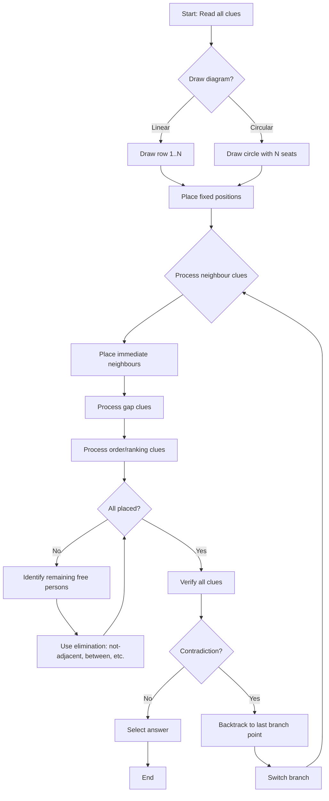

## Concept Ladder

**First Principles**  
Seating arrangement problems test your ability to place entities (people, boxes, floors) in a defined order based on relative position clues. The fundamental skill is translating verbal clues into absolute positions using a consistent reference frame.  

### Corpus Pressure

The uploaded book-PYQ corpus marks `seating-arrangement` as a 200/200 standard Reasoning topic with **138 promoted questions**. The promoted source block is `Scribd HTML Pages`, contributing **138 promoted questions**. That is enough volume to treat seating arrangement as a scoring certainty: the exam pattern keeps repeating the same placement mechanics with small wording changes.

| Corpus Source | Promoted Load | What It Trains |
|----------------|---------------|----------------|
| Scribd HTML Pages | 138 promoted questions | Linear rows, circular tables, facing direction, floor/stack order, gap clues, and branch control |

Your target is not only to know the formats. Your target is to classify the format in the first 5 seconds, draw the correct skeleton, and complete most one-question arrangements inside 25-30 seconds so the full Reasoning section stays inside the 15-minute timer.

- **Position**: A numbered slot in a row or a seat around a circle.  
- **Left/Right**: Always interpreted from the person's perspective. For facing-north rows, left is west, right is east. For facing-south, left is east, right is west.  
- **Immediate neighbour**: Adjacent seat, no gap.  
- **Second to left/right**: One seat between them.  

**Building Blocks**  
- **Linear arrangement**: Row with defined ends; positions 1..N from left to right (observer's left).  
- **Circular arrangement**: No ends; seats are symmetric; use relative positions. Facing centre vs. outside reverses left-right.  
- **Facing direction**: Reverses left-right mapping. Always draw an arrow on each person showing their facing direction.  
- **Opposite positions**: On a circle with even number of seats, opposite means directly across.  
- **Gap clues**: "Two persons between A and B" means positions differ by 3.  

**Exam-Level Integration**  
In SSC CGL Tier-I, you must solve 5-7 seating puzzles in the 15-minute Reasoning section. Speed comes from:  
- Drawing a numbered timeline or circular diagram instantly.  
- Placing fixed clues first (ends, exact positions).  
- Using immediate neighbour clues to eliminate branches.  
- Rechecking all clues after placing all elements.  
- Detecting contradictions early to switch branch.  

**Mastery Goal**  
Solve any linear (1D) puzzle in 30 seconds; any circular puzzle in 45 seconds. Achieve 100% accuracy by applying the Trap Table and Flowchart.

## Type System

| Type | Recognition Cue | Method | Speed Target | Trap |
|------|-----------------|--------|--------------|------|
| Linear Facing North | "sit in a row facing north" | Number positions 1..N from observer's left. Left/right = west/east. | 20-30 sec | Mistaking left/right in the clue |
| Linear Facing South | "facing south" | Number positions 1..N from observer's left. But left/right reversed: left = east, right = west. | 20-30 sec | Not reversing left-right |
| Two-Row Facing Each Other | "two rows facing each other" | Draw two parallel rows. Use relative directions carefully. | 35-45 sec | Mixing up row and column coordinates |
| Circular Facing Centre | "around a circular table facing the centre" | Draw circle; left = anticlockwise, right = clockwise. | 30-40 sec | Using clockwise/anticlockwise wrong from observer |
| Circular Facing Outside | "facing outside" | Left = clockwise, right = anticlockwise (reversed). | 30-40 sec | Keeping same orientation as centre-facing |
| Floor Arrangement | "live on floors 1 to 5" | Treat as linear vertical. Top = higher number or bottom? Clue: "immediately above" means floor number difference 1. | 20-30 sec | Misinterpreting "above" and "below" |
| Box Stack | "stacked vertically" | Topmost is position 1. "Immediately below" means consecutive positions. | 20-30 sec | Confusing stack order with linear row |
| Ordering with End Clues | "sits at the left end" | Fix that end position. Then propagate. | 15-20 sec | Assuming symmetry when ends are not explicitly opposite |
| Gap Clues | "sits second to the left of B" | Count positions: if B is at p, then A is at p-2. | 10-15 sec | Counting one extra or less |
| Immediate Neighbour | "sits immediately right of" | Place adjacent. | 10 sec | Forgetting the order of the two persons |
| Opposite Seats (Even Circle) | "sits opposite" | On N-seat circle, opposite means N/2 positions apart. | 15-20 sec | Placing opposite as side-by-side |
| Branching Puzzles | "A and B are not adjacent" | Initially two possible placements; test each branch until contradiction. | 45-60 sec | Excessive branching without checking all clues first |
| Ranking + Arrangement | "12th from left" | Convert rank to position. Total known? Use formula: position from left = total - rank from right + 1. | 20-30 sec | Adding instead of subtracting |

### First 5-Second Classification

Use the first sentence to lock the diagram before reading the detailed clues.

| First Cue | Diagram to Draw | Instant Rule |
|-----------|-----------------|--------------|
| "row facing north" | Horizontal row, positions 1 to N from observer's left | Person's left = observer left; right = observer right |
| "row facing south" | Horizontal row, positions 1 to N from observer's left, arrow south | Person's left = observer right; right = observer left |
| "two rows facing each other" | Top row and bottom row with opposite arrows | Top row facing south reverses left/right; bottom row facing north does not |
| "circular table facing centre" | N-seat circle, one fixed reference seat | Lock clockwise/anticlockwise before moving any person |
| "circular table facing outside" | N-seat circle with outward arrows | Reverse the centre-facing movement |
| "floors" | Vertical line with floor 1 at bottom unless stated otherwise | Above = higher number; below = lower number |
| "boxes stacked" | Vertical stack with top and bottom labelled | Immediately below/above means adjacent |
| "ranked from left/right" | Number line and rank conversion | Position from left = total - rank from right + 1 |
| "not adjacent" or "not at end" | Same skeleton plus exclusion marks | Do not branch until all fixed and neighbour clues are placed |
| "between" | Three-slot mini pattern | The middle entity is fixed; side order may still branch |

## Speed Methods

**Recall table - Facing Direction and Left/Right**

| Facing | Person's Left | Person's Right |
|--------|---------------|----------------|
| North | West (observer left) | East (observer right) |
| South | East (observer right) | West (observer left) |
| Centre (circle) | Anticlockwise | Clockwise |
| Outside (circle) | Clockwise | Anticlockwise |

**Decision rule - When to branch**  
- If a clue offers two symmetrical possibilities (e.g., "A sits somewhere left of B" but exact gap unknown), first place B and leave A's range.  
- Only branch when two distinct placements are possible and no other clue resolves it.  
- Use the "skip threshold": if after 25 seconds you have not placed 3 elements, mark and move on. Return later if time allows.

**Step-by-step algorithm for linear arrangement**  
1. Read all clues once. Identify fixed positions (ends, exact numbers).  
2. Draw a line and number positions 1..N from observer's left.  
3. Place all fixed persons. Write their names in the correct numbered slot.  
4. Process immediate neighbour clues. For "A sits immediately left of B", put B at position p, then A at p-1.  
5. Process gap clues: "second to right of A" -> A at p, then person at p+2.  
6. If a person has no position yet, leave blank.  
7. Use elimination: "A sits between B and C" -> B _ A _ C (B and C must be on opposite sides of A).  
8. After placing all clues, check every clue again. Mark any contradiction and change branch.  

**Step-by-step algorithm for circular arrangement**  
1. Draw a circle with N equally spaced seats. Mark an arbitrary seat as "top".  
2. Place all fixed persons (e.g., "A sits opposite D" -> place A at top, D at top+N/2).  
3. For "immediate right of A", use the facing direction table to decide clockwise or anticlockwise.  
4. Use symmetry to fill relative positions.  
5. Check that each person occupies exactly one seat.  

**36-second success protocol** (for reasoning, not quant - adapt phrasing)  
- 0-12s: Read clues and draw diagram.  
- 12-30s: Place fixed and neighbour clues.  
- 30-36s: Quick check of all clues; choose answer.  
If stuck after 25s, note the branch and move to next question. Return only after solving all easy ones.

## Trap Table

| Trap | Trigger Wording | Wrong Move | Correct Move | Repair Drill |
|------|-----------------|------------|--------------|--------------|
| Facing direction ignored | "five persons sit in a row" without facing | Assume north default | Check if facing given; if not, assume north | Always mark a small arrow for each person's facing. |
| Left-right reversal for south | "facing south" | Treat left as observer left | Person's left = observer right | Draw a small compass; for south-facing, left is east. |
| Circular centre - clockwise mix | "immediate right" for centre-facing | Place clockwise as right | Right of centre-facing person = anticlockwise (top view) | Memorise: centre-facing right = anticlockwise. |
| Circular outside reversal | "facing outside" | Same as centre-facing | Right of outside-facing = clockwise | Practise with 4-person circle outside: draw arrows outward. |
| Immediate neighbour order | "A sits immediately left of B" | Put B left of A | Put A left of B (A then B from left to right) | Rewrite clue as "A left of B" -> A is at lower index. |
| Gap miscount | "second to left" | Place one seat away | Exactly two seats apart (one gap) | Count using fingers: left-1, left-2. |
| Opposite in odd-number circle | "opposite" in 5-seat circle | Assume exact opposite | Not possible; opposite only for even numbers | If odd, clue is invalid or "directly across" is impossible. |
| End placement ambiguity | "at one of the ends" | Fix at left end only | Try both ends; check subsequent clues | Write "left end OR right end" and test each. |
| Branching prematurely | "A is somewhere to the left of B" | Guess exact position | Leave as range; place B, note A is left of B, but do not fix until forced | Use symbols: A < B. |
| Not checking all clues after placement | After placing all persons | Submit answer | Read each original clue and verify | Keep a checklist on scratch. |
| Floor numbering upside down | "lives on floor 4" top or bottom? | Assume 4 is high | If not given, assume 1 is bottom. | Write "top = highest number" or "bottom = 1". |
| Two-row confusion | "two rows facing each other" | Mix row positions | Draw two rows side by side; left/right for each row is from that person's view | Label top row facing south, bottom row facing north. |
| Not using elimination | "A does not sit next to C" | Place A next to C accidentally | Mark that A and C must have at least one person between | Draw a cross between them. |
| Over-relying on a single branch | After 20 seconds still only one branch | Continue without checking alternative | If a clue gives only one possible branch, confirm no other interpretation | Double-check wording: "immediately left" vs "immediately next" (direction given?). |

## Flowchart

## Solved Examples

**Example 1: Linear Facing North**  
Five people A, B, C, D, and E sit in a row facing north. A sits at the left end. C sits second to the right of A. B sits immediately left of C. Who sits in the middle?  
Options: (a) A (b) B (c) C (d) D  
**Solution**: Number positions 1 to 5 from left. A is at 1. C is second to the right of A, so C is at 3. B is immediately left of C, so B is at 2. The middle position is 3, occupied by C. **Answer: (c) C**

**Example 2: Linear Facing South**  
P, Q, R, S, and T sit in a row facing south. P sits at the extreme right end. Q sits immediately left of P. Who is second from the right?  
Options: (a) P (b) Q (c) R (d) S  
**Solution**: Positions are counted from the observer's left, but right/left is from the person's facing direction. P is at extreme right. Q is immediately left of P. Therefore Q is second from the right. **Answer: (b) Q**

**Example 3: Immediate Neighbour**  
Six people A, B, C, D, E, and F sit in a row facing north. D is immediately right of B. B is third from the left. Who is fourth from the left?  
Options: (a) A (b) C (c) D (d) F  
**Solution**: B is at position 3. D is immediately right of B, so D is at position 4. **Answer: (c) D**

**Example 4: Two Fixed Ends**  
A, B, C, D, and E sit in a row facing north. A sits at the left end and E sits at the right end. C sits exactly between A and E. Who sits in the middle?  
Options: (a) A (b) B (c) C (d) E  
**Solution**: With five seats, the middle is position 3. C sits exactly between the two ends, so C is in the middle. **Answer: (c) C**

**Example 5: Circular Facing Centre**  
Six people P, Q, R, S, T, and U sit around a circular table facing the centre. Q sits immediately right of P. Which side of P is Q on?  
Options: (a) Clockwise side (b) Anticlockwise side (c) Opposite side (d) Cannot be determined  
**Solution**: In a circular arrangement facing the centre, a person's immediate right is anticlockwise from the observer's top view. Since Q is immediately right of P, Q is on P's anticlockwise side. **Answer: (b) Anticlockwise side**

**Example 6: Opposite Seats**  
Six people sit around a circular table facing the centre. A sits opposite D. If A is fixed at one seat, where must D sit?  
Options: (a) Immediately right of A (b) Immediately left of A (c) Three seats away from A (d) Next to A  
**Solution**: In a six-seat circle, opposite means three positions away. Therefore D must sit three seats away from A. **Answer: (c) Three seats away from A**

**Example 7: Facing Outside**  
Four people A, B, C, and D sit around a circular table facing outside. B sits immediately right of A. In outside-facing circles, what happens to right-left orientation?  
Options: (a) Same as centre-facing (b) Reversed from centre-facing (c) Ignored (d) Always opposite  
**Solution**: When people face outside, left and right reverse compared with centre-facing diagrams. This is the main trap. **Answer: (b) Reversed from centre-facing**

**Example 8: Ranking Link**  
In a row of 30 students, R is 12th from the left and S is 10th from the right. How many students are between R and S if R is left of S?  
Options: (a) 6 (b) 7 (c) 8 (d) 9  
**Solution**: S position from left = 30 - 10 + 1 = 21. Students between R at 12 and S at 21 = 21 - 12 - 1 = 8. **Answer: (c) 8**

**Example 9: Floor Arrangement**  
Five people A, B, C, D, and E live on floors 1 to 5, where 1 is the bottom. D lives on floor 5. B lives immediately above A. C lives below A but above E. Who lives on floor 2?  
Options: (a) A (b) B (c) C (d) E  
**Solution**: D is fixed at floor 5. Since C is below A but above E, E must be below C. B immediately above A. The consistent order is E-1, C-2, A-3, B-4, D-5. Floor 2 has C. **Answer: (c) C**

**Example 10: Box Stack**  
Five boxes A, B, C, D, and E are stacked vertically. A is at the top. C is immediately below A. D is at the bottom. Which box is second from the top?  
Options: (a) A (b) B (c) C (d) D  
**Solution**: A is top, so position 1. C is immediately below A, so C is position 2. **Answer: (c) C**

**Example 11: Gap Clue**  
In a row facing north, A sits second to the left of B. If B is fifth from the left, where is A?  
Options: (a) First from left (b) Second from left (c) Third from left (d) Seventh from left  
**Solution**: B is at position 5. Second to the left of B is position 3. **Answer: (c) Third from left**

**Example 12: End Clue**  
Seven people sit in a row facing north. M sits at one of the ends. N sits immediately right of M. If M is at the left end, what is N's position?  
Options: (a) First from left (b) Second from left (c) Third from left (d) Last from left  
**Solution**: If M is at the left end, M is position 1. N immediately right of M is position 2. **Answer: (b) Second from left**

**Example 13: South-Facing Reversal**  
Five people A, B, C, D, and E sit in a row facing south. C sits third from the observer's left. B sits immediately left of C. What is B's position from the observer's left?  
Options: (a) First (b) Second (c) Fourth (d) Fifth  
**Solution**: In a south-facing row, a person's left is the observer's right. C is at position 3, so B immediately left of C is at position 4 from the observer's left. **Answer: (c) Fourth**

**Example 14: Two Rows Facing Each Other**  
P, Q, and R sit in the top row facing south. A, B, and C sit in the bottom row facing north. Q sits opposite B. P sits immediately right of Q. Who sits opposite P?  
Options: (a) A (b) B (c) C (d) R  
**Solution**: Fix Q opposite B in the middle column. The top row faces south, so Q's immediate right is the observer's left. P is in the left column of the top row. The bottom person opposite that column is A. **Answer: (a) A**

**Example 15: Circular Facing Outside**  
Six people A, B, C, D, E, and F sit around a circular table facing outside. B sits immediately left of A. If A is fixed at the top seat, where is B placed?  
Options: (a) Clockwise from A (b) Anticlockwise from A (c) Opposite A (d) Two seats away  
**Solution**: For outside-facing circles, left/right reverse from centre-facing orientation. Immediate left of A goes clockwise from the top view. **Answer: (a) Clockwise from A**

**Example 16: Not-Adjacent Control**  
Six people A, B, C, D, E, and F sit in a row facing north. A sits at the left end. C sits third from the left. B does not sit adjacent to C. Which position can B not occupy?  
Options: (a) Second (b) Fourth (c) Fifth (d) Sixth  
**Solution**: C is at position 3. Adjacent positions to C are 2 and 4. Since B cannot be adjacent to C, B cannot be in position 2 or 4. Among the listed trap positions, position 4 is invalid. **Answer: (b) Fourth**

**Example 17: One-End Branch**  
Four people P, Q, R, and S sit in a row facing north. P sits at one of the ends. Q sits immediately right of P. Which end must P occupy?  
Options: (a) Left end (b) Right end (c) Middle seat (d) Cannot be an end  
**Solution**: If P were at the right end, there would be no seat to P's right. Therefore P must be at the left end and Q at the second position. **Answer: (a) Left end**

**Example 18: Floor Above-Below Chain**  
Five persons A, B, C, D, and E live on floors 1 to 5, with 1 at the bottom. B lives immediately above D. A lives below D. C lives on the top floor. Who can live on floor 2 if A is on floor 1?  
Options: (a) B (b) C (c) D (d) E  
**Solution**: A is floor 1. D must be above A and B immediately above D. C is floor 5. The only valid D-B adjacent pair left is D on floor 2 and B on floor 3. **Answer: (c) D**

**Example 19: Box Stack**  
Seven boxes A, B, C, D, E, F, and G are stacked vertically. G is at the bottom. C is immediately above G. A is immediately above C. Which box is third from the bottom?  
Options: (a) A (b) C (c) G (d) E  
**Solution**: From bottom upward: G, C, A. Therefore the third box from the bottom is A. **Answer: (a) A**

**Example 20: Rank Conversion**  
In a row of 28 students, Kavya is 9th from the right. What is her position from the left?  
Options: (a) 18th (b) 19th (c) 20th (d) 21st  
**Solution**: Position from left = total - rank from right + 1 = 28 - 9 + 1 = 20. **Answer: (c) 20th**

**Example 21: Between Clue**  
Five people A, B, C, D, and E sit in a row facing north. C sits exactly between A and E. A sits at the left end. Which person is in the middle?  
Options: (a) A (b) C (c) E (d) D  
**Solution**: A at position 1 and C exactly between A and E means the pattern is A _ C _ E across positions 1, 3, and 5. C is in the middle. **Answer: (b) C**

**Example 22: Opposite in an Even Circle**  
Eight people sit around a circular table facing the centre. M sits opposite Q. If M is fixed at seat 1, which seat is Q on?  
Options: (a) Seat 3 (b) Seat 4 (c) Seat 5 (d) Seat 6  
**Solution**: In an 8-seat circle, opposite seats are 4 positions apart. From seat 1, the opposite is seat 5. **Answer: (c) Seat 5**

**Example 23: Mixed Gap Row**  
Seven people A, B, C, D, E, F, and G sit in a row facing north. D sits third to the right of A. A sits second from the left. Who sits fifth from the left?  
Options: (a) A (b) B (c) D (d) G  
**Solution**: A is position 2. Third to the right of A is position 5. Hence D sits fifth from the left. **Answer: (c) D**

**Example 24: Two-Row Direction Check**  
In two rows of three each, the top row faces south and the bottom row faces north. X sits in the top row immediately left of Y. If Y is in the middle of the top row, where is X from the observer's view?  
Options: (a) Left of Y (b) Right of Y (c) Opposite Y (d) Below Y  
**Solution**: The top row faces south, so a person's left is the observer's right. X is immediately left of Y, so X is to the observer's right of Y. **Answer: (b) Right of Y**

**Example 25: 36-Second Mixed Placement**  
Six people A, B, C, D, E, and F sit in a row facing north. A sits second from the left. D sits immediately right of A. F sits at the right end. Who sits third from the left?  
Options: (a) A (b) D (c) F (d) E  
**Solution**: A is position 2. D immediately right of A is position 3. F is position 6. The third position is D. **Answer: (b) D**

## PYQ Mapping

This section maps the topic types to the most effective practice routes based on the book-PYQ corpus. Do not copy past PYQs; instead, link each type to a specific drill path.

- **Linear Facing North/South**: Practice with /exams/ssc-cgl/topics/seating-arrangement (Linear sets). Focus on row length 5-7, with both end and middle placements. Aim for 15 solved sets.
- **Circular Facing Centre/Outside**: Use the same route: /exams/ssc-cgl/topics/seating-arrangement (Circular sets). Emphasise even-number circles (6, 8) and centre-facing orientation first, then outside-facing reversal.
- **Two-Row Facing Each Other**: Supplementary drills at /exams/ssc-cgl/topics/direction-distance (since directions are involved). Practice at least 5 puzzles.
- **Floor/Stack Arrangement**: Included in /exams/ssc-cgl/topics/seating-arrangement (vertical sets). Recognise as linear with 'above'/'below' language.
- **Ranking + Arrangement**: Additional practice at /exams/ssc-cgl/topics/direction-distance (ranking questions). Convert ranks to positions using total count.
- **Branching Puzzles**: For speed, take the SSC CGL Reasoning Speed Sprint at /exams/ssc-cgl/tests/ssc-cgl-reasoning-speed-sprint. The timer forces quick branching decisions.

After each practice session, review mistakes against the Trap Table and apply repair drills.

## 200/200 Drill

**Timed Micro-Drills**

1. **Speed Foundations** (3 minutes)  
   - Draw a row of 7 seats. Place: A at left end, B at right end, C third from left, D immediately left of C. Time: 30s. Repeat for south-facing.  
   - Draw a 6-seat circle facing centre. Place: P opposite Q, R immediate right of P. Time: 45s.

2. **Trap Immunity** (2 minutes)  
   - Write the left-right mapping for each facing direction on a flashcard. Rehearse until instantaneous.  
   - For each trap in the Trap Table, write one example clue and the correct placement.

3. **Contradiction Detection** (5 minutes)  
   - Solve a puzzle with 6 persons; deliberately include a clue that makes two contradictions when placed. Identify which clue is impossible. Time: 1 minute per puzzle.

4. **Full Simulated Sets** (10 minutes)  
   - Solve 6 SSC CGL style seating puzzles (mix of linear, circular, floor) in 10 minutes. After each set, verify with PYQ Mapping links.

**Repair Rules**

- **Rule 1**: If you misplace left/right, correct by checking the facing arrow. Repeat 5 faulty placements until error rate zero.  
- **Rule 2**: If you over-branched, practice puzzles with exactly one branch point. Use a cheat sheet: "Branch only when forced by a 'not' clue or ambiguous end."  
- **Rule 3**: If you missed a clue after placement, develop a check ritual: after filling all names, read each clue aloud and point to the diagram.  
- **Rule 4**: If you ran out of time, reduce drawing time: use numbered lines only, no extra labels. Practise 5 puzzles with a stopwatch.  

**Final Challenge**  
Solve the following in 36 seconds each:  
- Linear: 5 seats, north, A at extreme left, C second to right of A, B left of C. Who is middle?  
- Circular: 6 seats, centre, P opposite R, Q immediate right of P. Who is left of Q?  
- Floor: 5 floors, bottom=1, top=5. D on 5, B above A, C below A but above E. Who on floor 2?  

Check answers with Example 1, Example 5 pattern, Example 9. If any wrong, revisit the corresponding Speed Method.  

**Repair Drill**: Write your own 10-puzzle set using the Type System. Exchange with a partner or self-test after 24 hours. Aim for 100% accuracy and under 5 minutes total.

Remember: 200/200 demands zero errors and sub-30 second averages. Use the Flowchart for every puzzle. If a puzzle feels too long, skip and return after finishing easier ones. The PYQ Mapping routes will build the speed.
<!-- SSC-FINAL-PRACTICE-QUEUE:START -->
## Final Practice Queue

1. Start one-by-one practice: [Seating Arrangement practice](/exams/ssc-cgl/practice/seating-arrangement). Finish every question in this topic bank, not just the samples in the note.
2. Move to timed sets: [SSC CGL tests](/exams/ssc-cgl/tests?topic=seating-arrangement). Use topic drills first, then section mocks once accuracy is stable.
3. Repair every miss immediately: record the error label, redo 20 mixed questions from the same topic, then retest after 24 hours.
4. 200/200 rule: do not mark this topic exam-ready until correct answers come within 36 seconds and wrong answers are explained without looking at the solution.

<!-- SSC-FINAL-PRACTICE-QUEUE:END -->
