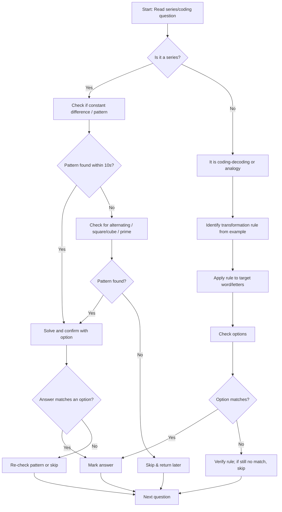

## Concept Ladder

**Step 1: Number Series - First Principles**  
A number series is a sequence following a fixed rule. The most basic rule is constant addition/subtraction. For example, 5, 10, 15, 20, ... adds +5. From there, rules evolve to multiplication (2, 4, 8, 16), mixed operations, squares/cubes, prime numbers, alternating patterns, and fib sequences. Recognizing the rule quickly is the core skill.

**Step 2: Letter Series - First Principles**  
Letters are mapped to positions (A=1 to Z=26). Series can be forward/backward shifts, skip patterns, mirror/inverse (A-Z, B-Y), or based on vowel/consonant sequences. The same numeric logic applies: constant shift (+3, -2), alternating shift, sum of positions, etc.

**Step 3: Coding-Decoding - First Principles**  
A transformation (e.g., shift, reverse, substitution) maps one word/letter to another. The rule must be reverse-engineered from a given example, then applied to a new word. Common rules: constant shift, reverse alphabet (A<->Z), vowel substitution, word pattern (e.g., each letter replaced by next consonant).

**Step 4: Analogy Bridges**  
Analogy: ACE : BDF :: GIK : ?. The relationship is "each letter +1". Identify the relation, then apply to the second pair. This is central to both series and coding.

**Step 5: Mixed Alpha-Numeric Series**  
Combine letters and numbers. Usually letters follow a pattern, numbers follow another (e.g., squares, primes). Treat them as two interleaved series.

**Step 6: Exam-Level Integration**  
In SSC CGL Tier-I, 25 Reasoning questions in 15 minutes. Series/Coding typically 4-6 questions. Speed is critical: 36 seconds per question (not literal for Reasoning, but the mental pace). Use option elimination, pattern spotting, and skip-return for ambiguous ones. Memorize alphabet positions, squares (1-25), cubes (1-10), prime numbers. Build repair drills for common memory gaps.

**Step 7: 200/200 Mindset**  
Mistakes come from false pattern recognition (e.g., assuming constant difference when pattern is alternating). Always test the rule on at least three terms. For coding, verify rule on all letters. For series, check if pattern holds for all given terms before trusting.

### Corpus Pressure

The promoted book-PYQ corpus gives this topic **836 promoted questions**, making it one of the largest reasoning buckets. Treat it like a scoring engine, not a small subtopic.

| Corpus signal | Count | 200/200 implication |
|---|---:|---|
| Promoted series-coding questions | 836 | Daily practice is justified; one missed pattern can cost an easy +2. |
| Topic priority | 200-200-dominant-repeat-area | The note must cover number, letter, coding, mixed, and false-pattern traps. |
| Main extraction band | Scribd HTML pages | The uploaded reasoning book gives high volume; exact duplicates should be removed only when the MCQ is truly identical. |

### First 5-Second Classification

Before calculating, classify the question:

| If the stem shows | Classify as | First move |
|---|---|---|
| Only numbers | Number series | Write differences below the terms. |
| Only letters or letter groups | Letter series | Convert to positions or compare letter gaps. |
| Word coded as another word | Coding-decoding | Compare each letter of the example. |
| Letters plus numbers | Mixed alpha-numeric | Split letters and numbers into separate streams. |
| Pair like `ACE : BDF` | Analogy bridge | Name the transformation, then apply to all elements. |
| Symbols or custom operations | Coded operation | Build a mapping table before solving. |

### Pattern Priority Ladder

| Rank | Pattern | Why it comes early |
|---:|---|---|
| 1 | Constant difference or ratio | Fastest and most common in basic number series. |
| 2 | Increasing/decreasing differences | Common when terms do not fit a simple gap. |
| 3 | Squares, cubes, powers | SSC options often hide these as ordinary gaps. |
| 4 | Alternating odd/even streams | Most common source of false pattern errors. |
| 5 | Prime, composite, factorial, Fibonacci | Less frequent but recognizable after memorization. |
| 6 | Digit operation | Sum/product/reversal of digits in larger numbers. |
| 7 | Mixed operation | Add then multiply, multiply then subtract, two-step cycle. |
| 8 | Option backfit | Last resort when two patterns look plausible. |

## Type System

| Type | Recognition Cue | Method | Speed Target | Trap |
|------|-----------------|--------|--------------|------|
| Number Series - Constant Difference | Equal gaps between terms (e.g., 7,12,17,22) | Find common difference: add/subtract constant. | 10 seconds | Overlook negative or fraction differences |
| Number Series - Increasing Difference | Gaps increase steadily (e.g., 3,7,13,21) | Compute first differences, then second differences if needed. | 20 seconds | Stop at first level when second level is required |
| Number Series - Square/Cube | Terms are perfect squares or cubes (4,9,16) | Recognize squares: 1,4,9,16,25,36,... Cubes: 1,8,27,64. | 5 seconds | Misread as multiplication series (e.g., 4,9,16: could be +5,+7; but squares is faster) |
| Number Series - Alternating | Two interleaved sequences (5,10,7,14,11,22) | Split odd/even positions and treat separately. | 30 seconds | Force a single pattern on the whole series |
| Number Series - Prime/Composite | Terms like 2,3,5,7,11 | Memorise prime list up to 50. Check divisibility. | 15 seconds | Include 1 as prime |
| Letter Series - Forward Shift | Alphabetical order with constant step (A,D,G,J) | Map letters to positions, add constant. | 10 seconds | Forget that Z+1 wraps to A? Usually not wrap in SSC, but check |
| Letter Series - Reverse Shift | Descending order (Z,W,T,Q) | Positions subtract constant. | 10 seconds | Misread direction |
| Letter Series - Skipped Pattern | E.g., A,C,F,J - gaps increase | Compute differences: +2,+3,+4 | 20 seconds | Miscalculate next gap |
| Coding-Decoding - Constant Shift | Each letter shifted by same number forward/backward (CAT->DBU) | Apply the found shift to target word. | 15 seconds | Apply shift in wrong direction |
| Coding-Decoding - Reverse Alphabet | A=Z, B=Y, C=X | Pair each letter with its opposite: sum of positions = 27. | 10 seconds | Confuse with constant shift |
| Coding-Decoding - Mixed Operations | Some letters shift, some reverse, or vowel change | Test rule on each letter carefully. | 25 seconds | Assume uniform rule |
| Mixed Alpha-Numeric | Term has letter+number (A1, C4, E9) | Separate letter pattern and number pattern. | 20 seconds | Mix up letter and number patterns |
| Analogy Bridge | Given a pair, find relation (ACE:BDF) | Summarise transformation (e.g., +1 each). Apply. | 15 seconds | Apply incomplete relation (only to first letter) |

## Speed Methods

**Alphabet Position Table**  
Learn instantly: A1, B2, C3, D4, E5, F6, G7, H8, I9, J10, K11, L12, M13, N14, O15, P16, Q17, R18, S19, T20, U21, V22, W23, X24, Y25, Z26.  
Reverse: A26, B25, C24, ... Z1. Use sum to 27: A+Z=27, B+Y=27.

**Decision Rule for Number Series**  
1. Check if all terms increase by same amount (const diff). If yes, solve directly.  
2. If not, compute first differences. If they follow a pattern (constant, increasing, squares), use the next difference.  
3. If no pattern in first diff, check second diff.  
4. If terms look like squares/cubes, test them.  
5. If numbers alternate between two sequences, separate odd/even positions.  
6. If no pattern after 10 seconds, skip and return.

**Decision Rule for Letter Series**  
1. Convert letters to numbers.  
2. Check constant + or -.  
3. If not, check alternating pattern of gaps.  
4. For reverse alphabet code: sum = 27.  
5. For mixed, treat letters and numbers separately.

**Step-by-Step Algorithm for Coding-Decoding**  
1. Given example: CAT -> DBU.  
2. Compare each letter: C->D (+1), A->B (+1), T->U (+1). Rule is +1.  
3. Apply rule to DOG: D+1=E, O+1=P, G+1=H -> EPH.  
4. If rule not uniform, test each letter individually.  
5. For reverse alphabet: A->Z, B->Y. Rule: new position = 27 - old position.

**Skip and Return**  
If a question seems ambiguous (more than one plausible pattern), mark and skip. Return if time permits. Typically 1-2 such questions per exam.

**Option Testing**  
When stuck, plug options back into the series and check if they fit a plausible rule. For coding, test each option against given code.

### Memory Tables

**Squares 1-30**

| n | n^2 | n | n^2 | n | n^2 |
|---:|---:|---:|---:|---:|---:|
| 1 | 1 | 11 | 121 | 21 | 441 |
| 2 | 4 | 12 | 144 | 22 | 484 |
| 3 | 9 | 13 | 169 | 23 | 529 |
| 4 | 16 | 14 | 196 | 24 | 576 |
| 5 | 25 | 15 | 225 | 25 | 625 |
| 6 | 36 | 16 | 256 | 26 | 676 |
| 7 | 49 | 17 | 289 | 27 | 729 |
| 8 | 64 | 18 | 324 | 28 | 784 |
| 9 | 81 | 19 | 361 | 29 | 841 |
| 10 | 100 | 20 | 400 | 30 | 900 |

**Cubes 1-15**

| n | n^3 | n | n^3 | n | n^3 |
|---:|---:|---:|---:|---:|---:|
| 1 | 1 | 6 | 216 | 11 | 1331 |
| 2 | 8 | 7 | 343 | 12 | 1728 |
| 3 | 27 | 8 | 512 | 13 | 2197 |
| 4 | 64 | 9 | 729 | 14 | 2744 |
| 5 | 125 | 10 | 1000 | 15 | 3375 |

**Prime List to 100**

2, 3, 5, 7, 11, 13, 17, 19, 23, 29, 31, 37, 41, 43, 47, 53, 59, 61, 67, 71, 73, 79, 83, 89, 97.

**Mirror Alphabet**

| A | B | C | D | E | F | G | H | I | J | K | L | M |
|---|---|---|---|---|---|---|---|---|---|---|---|---|
| Z | Y | X | W | V | U | T | S | R | Q | P | O | N |

Use position sum 27: A+Z, B+Y, C+X, ..., M+N.

## Trap Table

| Trap | Trigger Wording | Wrong Move | Correct Move | Repair Drill |
|------|-----------------|------------|--------------|--------------|
| Constant difference misidentification | "Find next term" after a pattern like +2,+4,+6 | Assume constant difference | Compute differences at two levels | Practice detecting increasing difference series |
| Square/cube confusion | Terms 4,9,16,25 | Think it is multiplication (x2.25) | Recognize squares | Flash drill squares 1-20 |
| Alternating pattern missed | 5,10,7,14,11,22 | Try to find a single operation | Split odd and even positions | Practice alternating series daily |
| Prime list error | 2,3,5,7,11 | Include 1 or forget 2 | Memorize primes up to 50 | Write primes from 2 to 50 weekly |
| Reverse alphabet code direction | "A is coded as Z" | Shift forward instead of reverse | Use sum 27 rule | Drill opposite pairs (A-Z, B-Y) |
| Letter series wrap confusion | A, D, G, J, ? (correct M) | Think Z wraps to A | Check if series beyond Z? Usually not required | Map positions quickly |
| Mixed series letter step mismatch | A1, C4, E9, G16 | Use letter step=1 instead of +2 | Track letter pattern separately | Practice mixed series with increasing steps |
| Analogy incomplete relation | ACE:BDF :: GIK:? | Only shift first letter | Apply same shift to all letters | Test analogy on each element |
| Option elimination jump | All options seem close | Pick random | Cross-check with original pattern | Use elimination systematically |
| Skip timing trap | Spending >45 seconds on one question | Overthinking | Skip and return | Set mental stopwatch |
| Mistaking coding rule direction | CAT:DBU (shift +1) and ask for DOG | Apply -1 | Confirm rule direction from example | Always check direction on first letter |
| False pattern from too few terms | Only 3 terms given | Assume simple + constant | Check if pattern holds for all given; be cautious | Practice series with 4+ terms |
| Number series with decimals | 1.5, 2.5, 4.5, ? | Use addition only | Check multiplication or mixed | Practice fractional series |
| Overcomplicating simple pattern | 2,4,8,16 | Look for a complex rule | Recognize powers of 2 | Build number sense for powers |

## Flowchart

## Solved Examples

**Example 1: Number Series - Constant Difference**  
Find the missing term: 7, 12, 17, 22, ?  
Options: (a) 25 (b) 26 (c) 27 (d) 28  
**Solution**: The difference is +5 each time. Next term = 22 + 5 = 27. **Answer: (c) 27**

**Example 2: Number Series - Increasing Difference**  
Find the missing term: 3, 7, 13, 21, 31, ?  
Options: (a) 41 (b) 43 (c) 45 (d) 47  
**Solution**: Differences are +4, +6, +8, +10. Next difference = +12. Next term = 31 + 12 = 43. **Answer: (b) 43**

**Example 3: Number Series - Squares**  
Find the missing term: 4, 9, 16, 25, ?  
Options: (a) 30 (b) 32 (c) 34 (d) 36  
**Solution**: Terms are 2^2, 3^2, 4^2, 5^2. Next term = 6^2 = 36. **Answer: (d) 36**

**Example 4: Number Series - Alternating Pattern**  
Find the missing term: 5, 10, 7, 14, 11, 22, ?  
Options: (a) 13 (b) 15 (c) 17 (d) 19  
**Solution**: Split odd and even positions. Odd-position terms are 5, 7, 11, ? with differences +2, +4, so next difference = +6. Missing term = 17. Even-position terms are double the previous odd term: 5->10, 7->14, 11->22. **Answer: (c) 17**

**Example 5: Letter Series - Forward Shift**  
Find the missing term: A, D, G, J, ?  
Options: (a) K (b) L (c) M (d) N  
**Solution**: Alphabet positions are 1, 4, 7, 10. Difference = +3. Next position = 13 = M. **Answer: (c) M**

**Example 6: Letter Series - Reverse Shift**  
Find the missing term: Z, W, T, Q, ?  
Options: (a) N (b) O (c) P (d) M  
**Solution**: Positions are 26, 23, 20, 17. Difference = -3. Next position = 14 = N. **Answer: (a) N**

**Example 7: Coding-Decoding - Constant Shift**  
If CAT is coded as DBU, how is DOG coded?  
Options: (a) EPH (b) EOG (c) CNE (d) FQH  
**Solution**: Each letter is shifted +1: C->D, A->B, T->U. DOG becomes EPH. **Answer: (a) EPH**

**Example 8: Coding-Decoding - Reverse Alphabet**  
If A is coded as Z and C is coded as X, how is DOG coded?  
Options: (a) WLT (b) WLH (c) XLT (d) WMG  
**Solution**: Reverse alphabet pairs are A-Z, B-Y, C-X. D->W, O->L, G->T. DOG becomes WLT. **Answer: (a) WLT**

**Example 9: Mixed Alpha-Numeric Series**  
Find the missing term: A1, C4, E9, G16, ?  
Options: (a) H25 (b) I20 (c) I25 (d) J25  
**Solution**: Letters move +2 positions: A, C, E, G, I. Numbers are squares: 1, 4, 9, 16, 25. Missing term = I25. **Answer: (c) I25**

**Example 10: Analogy Bridge**  
ACE : BDF :: GIK : ?  
Options: (a) HJL (b) HJM (c) HJK (d) IJL  
**Solution**: Each letter is shifted +1: A->B, C->D, E->F. Apply the same shift to GIK: G->H, I->J, K->L. **Answer: (a) HJL**

**Example 11: Second Difference**  
Find the missing term: 2, 6, 12, 20, 30, ?  
Options: (a) 40 (b) 42 (c) 44 (d) 46  
**Solution**: Differences are +4, +6, +8, +10. Next difference is +12. Missing term = 42. **Answer: (b) 42**

**Example 12: Cube Series**  
Find the missing term: 8, 27, 64, 125, ?  
Options: (a) 196 (b) 216 (c) 225 (d) 256  
**Solution**: Terms are 2^3, 3^3, 4^3, 5^3. Next is 6^3 = 216. **Answer: (b) 216**

**Example 13: Prime Gap Series**  
Find the missing term: 3, 5, 11, 17, 29, ?  
Options: (a) 31 (b) 37 (c) 41 (d) 43  
**Solution**: The sequence takes alternate primes: 3, 5, 11, 17, 29, 41. Do not insert every prime. **Answer: (c) 41**

**Example 14: Alternating Add and Multiply**  
Find the missing term: 4, 8, 11, 22, 25, ?  
Options: (a) 28 (b) 44 (c) 50 (d) 55  
**Solution**: Operations alternate x2, +3, x2, +3, so next is x2: 25 x 2 = 50. **Answer: (c) 50**

**Example 15: Backward Letter Series**  
Find the missing term: Z, W, S, N, ?  
Options: (a) G (b) H (c) I (d) J  
**Solution**: Positions are 26, 23, 19, 14. Differences are -3, -4, -5. Next difference is -6, so 14 - 6 = 8 = H. **Answer: (b) H**

**Example 16: Valid Backward Letter Series**  
Find the missing term: Z, X, U, Q, ?  
Options: (a) L (b) M (c) N (d) O  
**Solution**: Positions are 26, 24, 21, 17. Differences are -2, -3, -4. Next difference is -5, so 17 - 5 = 12 = L. **Answer: (a) L**

**Example 17: Position Sum Coding**  
If `BIRD` is coded as `YRIW`, how is `MATH` coded?  
Options: (a) NZGS (b) NZTH (c) MZGS (d) NAGS  
**Solution**: Reverse alphabet coding: B->Y, I->R, R->I, D->W. M->N, A->Z, T->G, H->S. **Answer: (a) NZGS**

**Example 18: Alternating Letter Shift Coding**  
If `ABCD` is coded as `BDFH`, how is `WXYZ` coded?  
Options: (a) XZBD (b) XYZA (c) YACE (d) XACE  
**Solution**: Shifts are +1, +2, +3, +4 with wrap allowed in this coding item. W->X, X->Z, Y->B, Z->D. **Answer: (a) XZBD**

**Example 19: Word Reverse Plus Shift**  
If `LAMP` is coded as `QNBN`, how is `FIRE` coded?  
Options: (a) FJSF (b) FSJG (c) ERJG (d) FSJF  
**Solution**: Reverse LAMP -> PMAL, then shift each +1 -> QNBN. Reverse FIRE -> ERIF, shift +1 -> FSJG. **Answer: (b) FSJG**

**Example 20: Mixed Letter and Square**  
Find the missing term: B4, D9, F16, H25, ?  
Options: (a) J36 (b) I36 (c) J35 (d) K36  
**Solution**: Letters move +2: B, D, F, H, J. Numbers are 2^2, 3^2, 4^2, 5^2, so next is 6^2 = 36. **Answer: (a) J36**

**Example 21: Odd-Even Split**  
Find the missing term: 6, 13, 9, 17, 12, 21, ?  
Options: (a) 14 (b) 15 (c) 16 (d) 18  
**Solution**: Odd positions: 6, 9, 12, ? increase by +3, so next is 15. Even positions: 13, 17, 21 increase by +4. **Answer: (b) 15**

**Example 22: Digit Operation Series**  
Find the missing term: 12, 15, 21, 24, 30, ?  
Options: (a) 33 (b) 34 (c) 36 (d) 39  
**Solution**: Differences alternate +3, +6, +3, +6. Next difference is +3. Missing term = 33. **Answer: (a) 33**

**Example 23: Letter Pair Series**  
Find the missing term: AZ, BY, CX, DW, ?  
Options: (a) EU (b) EV (c) FV (d) EX  
**Solution**: First letter increases A, B, C, D, E. Second letter decreases Z, Y, X, W, V. Missing term = EV. **Answer: (b) EV**

**Example 24: Coding with Vowels Unchanged**  
If `PLANT` is coded as `QMAOU`, how is `BRICK` coded?  
Options: (a) CSJDL (b) CSIDL (c) CQJDL (d) CSJCK  
**Solution**: In PLANT -> QMAOU, consonants move +1 and vowels remain unchanged: P->Q, L->M, A stays A, N->O, T->U. For BRICK, B->C, R->S, I stays I, C->D, K->L. Code = CSIDL. **Answer: (b) CSIDL**

**Example 25: Valid Coding with Vowels Unchanged**  
If `PLANT` is coded as `QMAOU`, and the rule is each consonant +1 while vowels stay unchanged, how is `BRICK` coded?  
Options: (a) CSIDL (b) CSJDL (c) CRJDL (d) BSIDL  
**Solution**: B->C, R->S, I stays I, C->D, K->L. Code = CSIDL. **Answer: (a) CSIDL**

## PYQ Mapping

This topic has appeared in almost every SSC CGL Tier-I exam, usually 4-6 questions. Common patterns from past years:

- **Number Series (2-3 questions)**: Constant difference, increasing difference, squares, cubes, primes, and alternating patterns. Practice on `/exams/ssc-cgl/topics/series-coding` for targeted exercises.
- **Letter Series (1-2 questions)**: Forward/backward shift, vowel/consonant based, mirror alphabet. Mixed alpha-numeric also appears. Use `/exams/ssc-cgl/topics/analogy-classification` to strengthen analogy skills.
- **Coding-Decoding (1-2 questions)**: Constant shift, reverse alphabet, word coding, substitution. Enhance speed with `/exams/ssc-cgl/tests/ssc-cgl-reasoning-speed-sprint`.
- **Analogy (1 question)**: Often combined with series logic. Practice with test sets like `/exams/ssc-cgl/tests/ssc-cgl-reasoning-50-50-set-01`.

**Practice Route**: Start with number series drills; once comfortable, move to letter series and coding-decoding. Then attempt mixed questions. Use the speed sprint test to simulate exam pressure. The 50-50 set is excellent for final revision.

## 200/200 Drill

**Timed Micro-Drills**  
Each drill: 5 questions, 3 minutes. Aim for 100% accuracy.

1. **Number Series Basic**: 2,4,6,8,? (10) ; 1,4,9,16,? (25) ; 10,20,30,40,? (50) ; 3,6,11,18,? (27, +3,+5,+7 next+9) ; 100,81,64,49,? (36, 10^2 to 6^2)  
2. **Number Series Advanced**: 7,11,17,25,? (+4,+6,+8 next+10=35) ; 1,1,2,3,5,? (8 fibo) ; 2,5,10,17,? (+3,+5,+7 next+9=26) ; 21,18,24,15,27,? (alternating -3,+6 -> next -? pattern tricky) ; 1,8,27,64,? (125 cubes)  
3. **Letter Series**: B,E,H,K,? (N, +3) ; Z,X,V,T,? (R, -2) ; A,C,F,J,? (O, +2,+3,+4,+5) ; M,O,R,V,? (A, +2,+3,+4,+5 with wrap) ; Y,W,T,P,? (K, -2,-3,-4,-5)  
4. **Coding-Decoding**: If PIG -> RKI, then CAT -> ? (shift +2 each -> ECV) ; If ABC -> ZYX, then DOG -> ? (WLT) ; If SEND -> UGPF (+2), then GOLD -> ? (IQNF) ; If LION -> KHNM (-1 each), then DEER -> ? (CDDQ) ; If MATH -> NZGS (reverse alphabet), then CODE -> ? (XLWV).  
5. **Mixed Series**: B2, D4, F6, H8, ? (J10) ; 1A, 3C, 5E, 7G, ? (9I) ; M5, N7, O9, P11, ? (Q13) ; Z26, Y25, X24, W23, ? (V22) ; A1, C4, E9, G16, ? (I25)

**Repair Rules**  
- If you miss a question due to slow alphabet recall, drill positions 5 times daily until instant.  
- If you confuse square numbers, write squares 1-20 every morning before practice.  
- If you fail to spot alternating pattern, create your own alternating series and solve.  
- If you misapply shift direction in coding, always test the first letter to confirm direction.  
- If you exceed 45 seconds on any question, skip immediately. Return only after finishing all others.  
- After each drill, log errors and pattern of mistake. Review repair rule for that pattern.

**Final Exam Strategy**  
In the 15-minute Reasoning section, allocate first 2 minutes to scan all 25 questions. Solve easy series and coding questions first (marked with confidence). Leave ambiguous ones for last 3 minutes. Use elimination to increase chances. For questions with 4 options, elimination can reduce to 2, then pick the one that matches a plausible rule. Always double-check the rule on at least three terms before finalising.

### Error Autopsy

| Error label | What happened | Repair action | Retest |
|---|---|---|---|
| False simple gap | You forced +constant on a two-stream pattern | Split odd/even positions for 20 questions | 10 alternating series next morning |
| Slow alphabet recall | You spent more than 10 seconds converting letters | Drill A1-Z26 and mirror pairs | 3-minute alphabet sprint |
| Direction reversal | You applied + shift instead of - shift | Compare the first example letter before applying | 20 coding items |
| Incomplete transformation | You changed only first letter in a group | Write the rule under every element | 10 letter-group analogies |
| Source ambiguity guessed | The rule did not hold across all visible terms | Quarantine for agent check, then practise the corrected pattern | Re-solve after verified correction |
| Overstay | One question took over 45 seconds | Skip-return discipline | Timed 25-question reasoning set |

### Mastery Standard

This topic is ready for a 200/200 attempt only when:

1. A1-Z26 and mirror pairs are instant.
2. Squares 1-30, cubes 1-15, and primes to 100 are automatic.
3. You can identify number, letter, coding, mixed, and analogy items within 5 seconds.
4. Every rule is tested on all given terms before selecting an answer.
5. You can solve 30 mixed series/coding questions in 18 minutes with 95%+ accuracy.
6. Any source ambiguity is quarantined for agent check instead of being memorized as a valid pattern.

With consistent drills and repair, this topic should become a high-confidence reasoning pocket: fast, mechanical, and almost error-free.
<!-- SSC-FINAL-PRACTICE-QUEUE:START -->
## Final Practice Queue

1. Start one-by-one practice: [Series and Coding-Decoding practice](/exams/ssc-cgl/practice/series-coding). Finish every question in this topic bank, not just the samples in the note.
2. Move to timed sets: [SSC CGL tests](/exams/ssc-cgl/tests?topic=series-coding). Use topic drills first, then section mocks once accuracy is stable.
3. Repair every miss immediately: record the error label, redo 20 mixed questions from the same topic, then retest after 24 hours.
4. 200/200 rule: do not mark this topic exam-ready until correct answers come within 36 seconds and wrong answers are explained without looking at the solution.

<!-- SSC-FINAL-PRACTICE-QUEUE:END -->
