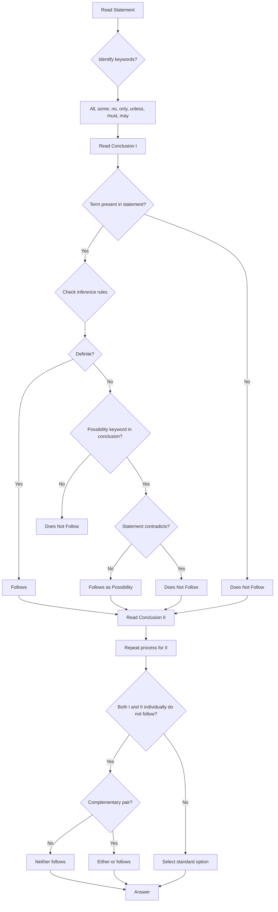

## Corpus Pressure

The uploaded book-PYQ corpus marks `statement-conclusion` as a Reasoning coverage-gap topic with **14 promoted questions**. The source load is concentrated in **Scribd HTML Pages**, which contributes **14 promoted questions**. The raw count is smaller than seating, blood relation, or direction-distance, but this topic overlaps heavily with syllogism, assumption, course of action, cause-effect, and critical-reasoning traps. For 200/200, the note must train strict inference boundaries instead of just listing rules.

| Corpus Source | Promoted Load | What It Trains |
|----------------|---------------|----------------|
| Scribd HTML Pages | 14 promoted questions | Definite follows, possibility, all/some/no conversion, only/unless, either-or, course of action, cause-effect, and assumption-vs-inference separation |

Most direct all/some/no conclusions should close in 15-20 seconds. Conditional, only/unless, and either-or cases can take 30-40 seconds. Dense course-of-action or cause-effect stems may take up to 50 seconds, but only if the answer options are close. The 36-second target is protected by one rule: do not decide from real-world truth; decide only from the statement.

## Concept Ladder

**First Principle:** A statement is a set of words that claim something. A conclusion is a proposition that must be true *if* the statement is true - not because it matches real-world facts, but because it follows necessarily from the given wording.

**Step 2: Deductive vs Inductive Inference.** In SSC CGL, conclusion questions are **deductive**: only what definitely follows from the statement alone. Real-world plausibility, popular opinion, or outside knowledge are irrelevant. If the statement says "All cats are mammals" and we are asked "Some mammals are cats" - that follows (conversion). But "Dogs are not cats" does not follow because the statement says nothing about dogs.

**Step 3: Language of Limits.** Keywords lock the logic:
- **All, Every, No, None** - universal statements.
- **Some, Many, A few** - particular affirmative.
- **Some...not, Not all** - particular negative.
- **Only, Only if** - necessary condition. "Only A is B" means all B are A.
- **Unless, Until** - conditionals with negative implication.

**Step 4: Immediate Inferences.** Direct deduction rules:
- **All A are B** -> Some A are B, Some B are A. (but not Some B are not A)
- **No A is B** -> Some A are not B, Some B are not A.
- **Some A are B** -> Some B are A. (reversible)
- **Some A are not B** -> No reversal.
- **Only A are B** -> All B are A.

**Step 5: Assumption vs Inference.** An assumption is an unstated premise needed for the conclusion to hold. An inference is a conclusion that follows from the statement. SSC often asks "Which of these is an assumption of the statement?" - that is a different skill. For statement-conclusion questions, we only check whether the conclusion necessarily follows.

**Step 6: Complementary Pair and Either-Or.** Two conclusions that together cover all possibilities without overlap. If one says "Some A are B" and the other says "No A is B", they can be a complementary pair. But in statement-conclusion, either-or appears when both cannot be true together, but one must be true. The SSC pattern: "If conclusion I does not follow, then conclusion II may still follow" - but the typical either-or flag is when the two conclusions are contradictory and the statement gives no definite relation.

**Step 7: Course of Action & Cause-Effect.** These are separate sub-types under statement-conclusion umbrella. Course of action: Given a problem, which action logically follows. Cause-effect: given two events, does the statement imply a cause-effect relationship? We must treat them strictly: conclusion must be a logical consequence, not a practical suggestion unless stated.

**Step 8: Exam-Level Integration.** In 15 minutes for 25 questions, you spend at most 36 seconds per reasoning question. For statement-conclusion, the 36-second plan:
- 10 seconds: Read statement and conclusions carefully. Underline keywords: all, some, no, only, must, can, should.
- 15 seconds: Eliminate any conclusion that uses outside knowledge or reverses the direction.
- 10 seconds: Check for definite follow using Venn diagram or immediate inference rules.
- 1 second: Mark answer. If stuck > 25 seconds, skip and return.

## Type System

| Type | Recognition Cue | Method | Speed Target | Trap |
|------|----------------|--------|--------------|------|
| Definite Inference | Keywords: definitely, must, necessarily follows | Use immediate inference rules or Venn diagram | 15 sec | Treating 'some' as 'all' |
| Possibility Conclusion | Words: can be, may be, possible | Check if statement does not contradict it. If no contradiction, it 'follows' as a possibility. | 20 sec | Assuming possibility is certainty |
| Complementary Pair | Two conclusions that are contradictory or jointly exhaustive | Check if statement makes both individually invalid | 25 sec | Marking either-or when one conclusion already follows |
| Course of Action | "Which action should be taken?" | Must directly address the problem; should be practical but not extreme | 25 sec | Choosing an action that is beyond scope or violates the statement |
| Cause-Effect | "Statement I is the cause, II is the effect" | Check if the effect necessarily follows from the cause; no reverse | 20 sec | Assuming temporal order = causation |
| Assumption (hidden premise) | "Which is an assumption in the above statement?" | Find the unstated link that makes the argument work | 25 sec | Confusing assumption with inference |
| Either-Or conclusion | "Either I or II follows" | Both conclusions cannot be true together, but statement means at least one must hold | 30 sec | Applying either-or rule when one is already true |

### First 5-Second Classification

Read the instruction line and conclusion keywords before solving.

| First Cue | Frame to Use | Instant Rule |
|-----------|--------------|--------------|
| "definitely follows" | Deductive inference | Only guaranteed truth counts |
| "can be" or "may be" | Possibility | Follows if not contradicted by the statement |
| "all" in conclusion | Universal check | It rarely follows from a "some" statement |
| "some" in conclusion | Existence/subset check | It follows from all/no only when the relevant class exists in the SSC frame |
| "no" in statement | Reversible negative | No A is B means no B is A |
| "some not" | Non-reversible negative | Some A are not B does not give some B are not A |
| "only A are B" | Reverse universal | Translate as all B are A |
| "only if A, B" | Necessary condition | B implies A; A does not guarantee B |
| "unless A, B" | Conditional rewrite | If not A, then B; use contrapositive carefully |
| "should be done" | Course of action | Action must address the problem directly and avoid extremity |
| "cause/effect" | Directional relation | Time order is not enough; statement must support causation |
| "either I or II" | Complementary-pair test | Use only when both fail individually and the pair covers all cases |

## Speed Methods

**Recall Table: Immediate Inferences**

| Given Statement | Valid Conclusions (inference) | Invalid Conclusions |
|----------------|-------------------------------|---------------------|
| All A are B | Some A are B; Some B are A | All B are A; No A is B |
| No A is B | Some A are not B; Some B are not A | Some A are B; All A are B |
| Some A are B | Some B are A | All A are B; No A is B |
| Some A are not B | Specific: some A are not B | No A is B; Some B are not A (not necessarily) |
| Only A are B | All B are A | All A are B |

**Decision Rules for 'Definitely Follows'**

1. **Keyword scan:** If conclusion uses 'all' but statement uses 'some' -> does not follow.
2. **Reversal check:** "All A are B" does NOT mean "All B are A".
3. **Outside knowledge:** If conclusion introduces a term not present in statement -> does not follow.
4. **Negation flip:** For 'some not', do not convert to 'some are'.
5. **Only and Unless:** "Only if A then B" means B implies A. "Unless A, B" means if not A then B.

**Step-by-Step Algorithm for a Statement-Conclusion Question**

Step 1: Read statement and identify all terms (A, B, C). Mark keywords: all, some, no, only, must, can, should.

Step 2: For each conclusion:
   - Underline its keywords.
   - Check if any term not in statement -> discard.
   - Use immediate inference table: if conclusion matches a valid inference -> follows.
   - If conclusion is a possibility (may, can be) and not contradicted -> follows as possibility.
   - If conclusion is negative and statement is positive, check contrapositive.

Step 3: If two conclusions form complementary pair (all + some not, or some + no), and individually none follows, then either-or follows.

Step 4: Mark answer accordingly.

**36-Second Reasoning Attempt Plan**

- 0-10 sec: Read statement once, mark keywords.
- 10-25 sec: Attack conclusion I. Apply decision rules. Mark follows / does not follow.
- 25-40 sec: Attack conclusion II.
- 40-45 sec: Combine results. Select option.
- If confused > 25 sec per conclusion: skip to next question. Return if time permits.

**Skip Thresholds:** If a conclusion uses a term not in statement, skip immediately (0 sec). If a conclusion is a possibility but has 'all' or 'no' and clashes with possibility wording, skip. If the statement has complex conditionals (unless, only if) and time > 20 sec, mark uncertain and move.

## Trap Table

| Trap | Trigger Wording | Wrong Move | Correct Move | Repair Drill |
|------|----------------|------------|--------------|--------------|
| Real-world truth | "Everyone knows that smoking is harmful" in conclusion | Marking conclusion as follows because it is true in life | Ignore real-world truth; only check logical deduction from statement | Practice with statements like "All politicians are honest" - do not bring outside knowledge |
| Overgeneralization | Statement: "Some students are tall." Conclusion: "All students are tall" | Thinking 'some' implies 'all' is possible | 'Some' never implies 'all' in definite inference | Drill: Convert 'some' statements to Venn |
| Reversal | Statement: "All dogs are mammals." Conclusion: "All mammals are dogs" | Reversing 'all' without thinking | 'All A are B' does not equal 'All B are A' | Memorize: only 'Some' and 'No' are reversible |
| Possibility as certainty | Conclusion: "Some cats are black" when statement says "Some cats may be black" | Marking as definitely follows | 'May be' only gives possibility; not definite | Differentiate 'can be' vs 'must be' |
| Outside knowledge | Conclusion uses a term not in statement (eg, "Animals" when statement only has "Dogs") | Assuming the term is implied | Reject immediately - term must be present | Practice identifying terms in statement |
| Complementary pair misapplication | Statement: "All A are B." Conclusions: I: Some A are B. II: No A is B. | Marking either-or because they are contradictory | I already follows, so either-or does not apply | Rule: Either-or only when both individually do not follow |
| 'Only' confusion | Statement: "Only successful people are rich." Conclusion: "All rich people are successful" | Thinking 'only' means 'all successful are rich' | 'Only X are Y' means Y implies X, so conclusion is correct | Translate: Only A are B = All B are A |
| Assumption vs inference | Statement: "The exam was postponed because of rain." Conclusion: "The exam was postponed" | Confusing with assumption | The conclusion directly follows from statement (cause-effect) | Practice identifying what is explicitly stated |
| Cause-effect reversal | Statement: "A leads to B." Conclusion: "B leads to A" | Assuming causation is symmetric | Causation is directional; conclusion may not follow | Check direction keyword: 'because', 'hence', 'therefore' |
| 'No' negation mistake | Statement: "No dog is a cat." Conclusion: "Some dogs are not cats" | Treating universal negative as if it gives no particular inference | 'No A are B' implies 'Some A are not B' if A exists | SSC assumes named categories exist unless the stem blocks existence |
| 'Some not' conversion | Statement: "Some birds are not black." Conclusion: "Some black things are not birds" | Reversing 'some not' | 'Some A are not B' does not reverse | Only universal negatives reverse |
| 'Must' vs 'should' | Statement: "You must work hard to succeed." Conclusion: "You should work hard" | Thinking 'must' and 'should' are interchangeable | 'Must' is necessity; 'should' is recommendation - not same | Check modal verb strength |
| Ignoring 'unless' | Statement: "Unless you study, you will fail." Conclusion: "If you study, you will not fail" | Directly taking as equivalent | 'Unless A, B' means 'if not A then B'; the conclusion is not logically equivalent | Draw truth table for unless |
| Combinatorial statements | Statement: "All A are B. Some B are C. No C is D." Multiple conclusions | Trying to combine mentally without Venn | Draw quick Venn diagram (intersecting circles) for complex statements | Practice 3-set Venn problems |

## Flowchart

## Solved Examples

**Example 1**
Statement: All birds can fly. Some birds are sparrows.
Conclusions:
I. Some sparrows can fly.
II. All sparrows can fly.

Options: (a) Only I follows (b) Only II follows (c) Both I and II follow (d) Neither follows

Explanation: From "All birds can fly" and "Some birds are sparrows", we can deduce that sparrows are birds, so some sparrows (the ones that are birds) can fly. Conclusion I follows. Conclusion II is an overgeneralization - we only know some sparrows are birds, not all. So only I follows. Answer: (a)

**Example 2**
Statement: No cat is a dog.
Conclusions:
I. Some cats are not dogs.
II. Some dogs are not cats.

Explanation: A universal negative separates both classes. In the SSC reasoning frame, named classes are treated as existing unless blocked by the stem. Therefore, some cats are not dogs and some dogs are not cats. Answer: Both follow.

**Example 3**
Statement: Only intelligent students can solve this puzzle. Rahul solved the puzzle.
Conclusion I: Rahul is intelligent.
Conclusion II: Rahul is a student.

Explanation: "Only intelligent students can solve" means all who solve are intelligent students. Rahul solved, so Rahul is an intelligent student. So both I and II follow. Answer: Both follow.

**Example 4**
Statement: Some politicians are honest. No honest person is corrupt.
Conclusions:
I. Some politicians are not corrupt.
II. No politician is corrupt.

Explanation: Draw Venn: Politicians circle overlapping with Honest circle. Honest circle does not overlap with Corrupt circle. So the overlapping part (politicians who are honest) are not corrupt. So some politicians are not corrupt (I follows). Conclusion II says no politician is corrupt - but there could be politicians outside the honest circle who might be corrupt? Statement doesn't say all politicians are honest, so we cannot conclude that no politician is corrupt. So only I follows. Answer: Only I follows.

**Example 5**
Statement: If it rains, the ground will be wet. The ground is wet.
Conclusion: It rained.

Explanation: This is a fallacy of affirming the consequent. "If rain then wet" does not mean "if wet then rain". The ground could be wet for other reasons. Conclusion does not follow. Answer: Does not follow.

**Example 6**
Statement: Unless you register, you cannot appear for the exam. Rohan appeared for the exam.
Conclusion: Rohan registered.

Explanation: "Unless register, cannot appear" means if not registered then cannot appear. But if someone appeared, they must have registered (contrapositive). Conclusion follows. Answer: Follows.

**Example 7**
Statement: All squares are rectangles. All rectangles are quadrilaterals.
Conclusions:
I. All squares are quadrilaterals.
II. Some rectangles are squares.

Explanation: I uses transitive property: all squares are rectangles, all rectangles are quadrilaterals => all squares are quadrilaterals. Follows. II: Some rectangles are squares? Given all squares are rectangles, it follows that some rectangles are squares (since squares exist). So II also follows. Answer: Both follow.

**Example 8**
Statement: Some doctors are rich. Some rich people are actors.
Conclusions:
I. Some doctors are actors.
II. No doctor is an actor.

Explanation: The two "some" statements do not connect directly. No definite link between doctors and actors. So neither conclusion definitely follows. But they form a complementary pair? I says some doctors are actors, II says no doctor is an actor. They are contradictory. If none individually follows, then either-or follows? But careful: The pair some + no is complementary only when they cover all possibilities. Here, the possibilities are: some doctors are actors, or no doctors are actors. Yes, that covers all. So either I or II follows. Answer: Either I or II follows.

**Example 9**
Statement: Some apples are red. All red things are tasty.
Conclusion: Some apples are tasty.

Explanation: The apples that are red (some apples) are also red things, so they are tasty. That subset gives "some apples are tasty". Follows. Answer: Follows.

**Example 10**
Statement: A team cannot win the championship unless it has a good coach. Team X has a good coach.
Conclusion: Team X will win the championship.

Explanation: "Cannot win unless good coach" means if not good coach then cannot win. Having a good coach is necessary but not sufficient. Team X may still not win due to other factors. Conclusion does not follow. Answer: Does not follow.

**Example 11**
Statement: Many engineers are good managers. Some managers are leaders.
Conclusion: Some engineers are leaders.

Explanation: No direct link. Does not follow. Answer: Does not follow.

**Example 12**
Statement: Either Ravi is lying or Sita is telling the truth. Sita is lying.
Conclusion: Ravi is telling the truth.

Explanation: The statement gives two alternatives and the second alternative is denied. Therefore the remaining alternative must hold. Ravi is telling the truth. Answer: Follows.

**Example 13**
Statement: All books are papers. Some papers are files.
Conclusions:
I. Some books are files.
II. Some files are papers.

Explanation: I does not follow because the books part of papers need not overlap with files. II follows because "some papers are files" reverses to "some files are papers". Answer: Only II follows.

**Example 14**
Statement: Some teachers are writers. All writers are readers.
Conclusions:
I. Some teachers are readers.
II. All readers are writers.

Explanation: The teachers who are writers must be readers, so I follows. "All writers are readers" does not reverse to all readers are writers, so II does not follow. Answer: Only I follows.

**Example 15**
Statement: Only members can enter the library. Ajay entered the library.
Conclusion: Ajay is a member.

Explanation: "Only members can enter" means all entrants are members. Ajay entered, so Ajay is a member. Answer: Follows.

**Example 16**
Statement: Only if a candidate clears prelims can the candidate appear for mains. Riya cleared prelims.
Conclusion: Riya can appear for mains.

Explanation: Clearing prelims is necessary, not sufficient, unless the statement says every prelims-clearer can appear. The conclusion does not follow. Answer: Does not follow.

**Example 17**
Statement: Unless the form is submitted, the application will be rejected. Neha's application was not rejected.
Conclusion: Neha submitted the form.

Explanation: If the form is not submitted, rejection follows. Since rejection did not happen, the form-submission condition must have been met. Answer: Follows.

**Example 18**
Statement: Some laptops are tablets. No tablet is a phone.
Conclusions:
I. Some laptops are not phones.
II. No laptop is a phone.

Explanation: The laptop subset that is tablet cannot be phone, so I follows. But laptops outside the tablet subset may or may not be phones, so II does not follow. Answer: Only I follows.

**Example 19**
Statement: All medals are prizes. No prize is cheap.
Conclusions:
I. No medal is cheap.
II. Some prizes are medals.

Explanation: Medals are inside prizes and prizes are outside cheap, so no medal is cheap. Since all medals are prizes and medals are treated as existing, some prizes are medals. Answer: Both follow.

**Example 20**
Statement: Some pens are pencils.
Conclusions:
I. Some pens are not pencils.
II. All pens are pencils.

Explanation: From "some pens are pencils", neither "some pens are not pencils" nor "all pens are pencils" is guaranteed. They are not a valid either-or pair in SSC conclusion logic because they do not use the standard complementary form around the same certainty boundary. Answer: Neither follows.

**Example 21**
Statement: Some fruits are mangoes.
Conclusions:
I. Some fruits are mangoes.
II. No fruit is a mango.

Explanation: I repeats the statement and follows directly. Since one conclusion already follows, either-or is not used. II contradicts the statement. Answer: Only I follows.

**Example 22**
Statement: The city received heavy rain last night. Several roads are waterlogged today.
Conclusion: Heavy rain last night is the only reason roads are waterlogged.

Explanation: The statement gives two events but does not prove exclusivity. Other causes may exist. Answer: Does not follow.

**Example 23**
Statement: A school notices repeated late arrivals because the gate opens only five minutes before assembly.
Course of action: The school should open the gate earlier.

Explanation: The action directly addresses the stated cause and is practical. Answer: Follows as a suitable course of action.

**Example 24**
Statement: The government warns that fake job messages are circulating online.
Course of action: Citizens should verify job notices from official sources before applying.

Explanation: The action is direct, practical, and limited to the problem. It does not overreach. Answer: Follows as a suitable course of action.

**Example 25**
Statement: All honest officers are respected. Some respected people are strict.
Conclusions:
I. Some honest officers are strict.
II. Some strict people are respected.

Explanation: I does not follow because the respected strict group need not overlap with honest officers. II follows by conversion from "some respected people are strict". Answer: Only II follows.

## PYQ Mapping

The current promoted corpus gives this topic **14 promoted questions**, all from **Scribd HTML Pages**. Statement and Conclusion in SSC CGL Tier-I routinely appears with direct and hybrid logic questions. Based on the corpus and adjacent Reasoning patterns, the following types recur:

1. **Simple immediate inference** (All/Some/No) - Practice sets with 10 questions each focusing on conversion, obversion. Use: /exams/ssc-cgl/topics/statement-conclusion
2. **Possibility conclusions** - High frequency. Practice identifying 'can be' vs 'must be'. Use the same link, filter by possibility type.
3. **Complementary pair and either-or** - Common trap. Dedicated drills at /exams/ssc-cgl/topics/syllogism-venn (as syllogism also uses these rules).
4. **Conditional statements (if-then, unless, only if)** - Appears in hybrids. Practice with cause-effect and course of action. Route: /exams/ssc-cgl/tests/ssc-cgl-reasoning-speed-sprint
5. **Assumption and inference hybrid** - Less common but seen. Use the main topic page for additional pattern sets.

For each topic type, solve at least 50 questions across three difficulty levels. Track accuracy per type. If accuracy falls below 85% on definite inference, revisit Concept Ladder and immediate inference tables.

## 200/200 Drill

**Timed Micro-Drill 1 (2 minutes)**
Solve 4 questions; target 3 correct.
1. Statement: All cats are mammals. Some mammals are dogs. Conclusion: Some cats are dogs. (Does not follow)
2. Statement: No stone is a rock. Conclusion: Some rocks are not stones. (Follows)
3. Statement: Only if you practice you will win. You practice. Conclusion: You will win. (Does not follow)
4. Statement: Some pens are blue. All blue are ink. Conclusion: Some pens are ink. (Follows)

**Timed Micro-Drill 2 (2 minutes)**
Solve 4 questions; identify trap type.
1. All birds are animals. Some animals are pets. Conclusion: Some birds are pets. (Does not follow - no link)
2. No apple is a fruit. (Ignore real-world) Conclusion: No fruit is an apple. (Follows - 'No' is reversible)
3. Some students are singers. All singers are artists. Conclusion: Some students are artists. (Follows)
4. Unless you sleep, you cannot dream. You did not sleep. Conclusion: You did not dream. (Follows - modus tollens)

**Repair Rules**

- **Rule 1:** If you marked a conclusion as follows because it seemed true in real life, review the statement. Ask: "Does the statement guarantee this?" If not, it does not follow.
- **Rule 2:** For every conclusion, write its type (definite/possibility/neither). If you treat possibility as definite, re-do with a 'must' test.
- **Rule 3:** For either-or, check: are both conclusions individually false? And are they contradictory? If yes, then either-or follows. Otherwise no.
- **Rule 4:** Keep a flashcard of immediate inference table. Review daily for first 10 minutes.
- **Rule 5:** For statements with 'only', rewrite as 'All B are A'. For 'unless', rewrite as 'if not A then B' and then contrapositive.

**Final 200/200 Checklist**
- [ ] I can correctly identify immediate inferences within 10 seconds.
- [ ] I never use outside knowledge in reasoning questions.
- [ ] I know the difference between 'follows' and 'possibility follows'.
- [ ] I can spot complementary pairs quickly.
- [ ] I can handle 'only', 'unless', 'if-then' accurately.
- [ ] I have completed at least 100 practice questions on this topic.
- [ ] My accuracy on mock tests is at least 95% for statement-conclusion.

Perform this drill daily until you consistently score 4/4 in 2 minutes. Combine with syllogism and venn diagram practice for overlapping logic. For further practice, use the routes: 
- /exams/ssc-cgl/topics/statement-conclusion
- /exams/ssc-cgl/topics/syllogism-venn
- /exams/ssc-cgl/tests/ssc-cgl-reasoning-speed-sprint
<!-- SSC-FINAL-PRACTICE-QUEUE:START -->
## Final Practice Queue

1. Start one-by-one practice: [Statement and Conclusion practice](/exams/ssc-cgl/practice/statement-conclusion). Finish every question in this topic bank, not just the samples in the note.
2. Move to timed sets: [SSC CGL tests](/exams/ssc-cgl/tests?topic=statement-conclusion). Use topic drills first, then section mocks once accuracy is stable.
3. Repair every miss immediately: record the error label, redo 20 mixed questions from the same topic, then retest after 24 hours.
4. 200/200 rule: do not mark this topic exam-ready until correct answers come within 36 seconds and wrong answers are explained without looking at the solution.

<!-- SSC-FINAL-PRACTICE-QUEUE:END -->
