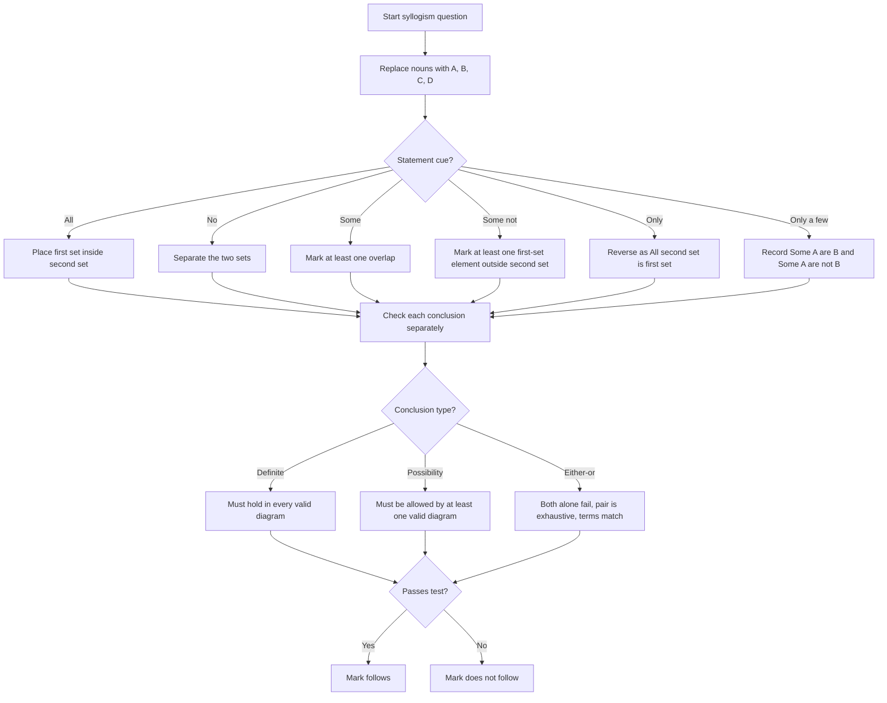

## Concept Ladder

**Rung 1: Syllogism is formal truth, not real-world truth**  
A syllogism question gives statements and conclusions. Your job is not to decide what is true in real life. Your job is to decide what must follow from only the given statements. The statement "All cats are chairs" must be accepted as a temporary set rule even though it is unrealistic.

**Rung 2: Every word is a set**  
Treat every noun as a circle: A, B, C, D. "All", "No", "Some", "Some not", "Only", and "Only a few" tell you how those circles relate.
- All A are B: circle A lies completely inside circle B.
- No A is B: A and B do not overlap.
- Some A are B: at least one confirmed element is in the A-B overlap.
- Some A are not B: at least one confirmed element is in A outside B.
- Only A are B: all B are A; the "only" statement reverses the usual direction.
- Only a few A are B: some A are B and some A are not B.

**Rung 3: Definite conclusion vs possibility**  
A definite conclusion must be true in every valid diagram. A possibility conclusion only needs one valid diagram where the relation can happen, but it must not violate a "No" or an already forced placement. Most SSC errors come from treating a possible relation as definite, or treating a blocked relation as possible.

**Rung 4: Conversion rules are the fastest marks**  
Conversions save time when the conclusion reverses terms.
- All A are B converts to Some B are A.
- Some A are B converts to Some B are A.
- No A is B converts to No B is A.
- Some A are not B does not convert.
- All A are B never converts to All B are A.

**Rung 5: Venn diagram discipline**  
Draw the most general diagram, not the diagram that helps your favorite option. Shade empty areas for "No". Put an existence mark for "Some". Keep unmarked areas flexible. If a conclusion uses an area that is not forced, it is not definite.

**Rung 6: The only-few rule**  
"Only a few A are B" is not just "some A are B". It means both:
- Some A are B.
- Some A are not B.
It does not automatically mean some B are not A unless that is forced separately.

**Rung 7: Either-or is a conclusion-pair rule**  
Either-or applies when two conclusions are individually not definite, but together cover all valid cases and cannot both be false. Common pairs are "Some A are B" with "No A is B", and "All A are B" with "Some A are not B". Do not use either-or when both conclusions can be true together, both can be false together, or terms are not the same.

**Rung 8: Section timing standard**  
SSC CGL Tier-I gives 25 reasoning questions inside a 15-minute section. That is 36 seconds per question. Syllogism should average 20 to 35 seconds because it is rule-based. If a diagram takes longer than 45 seconds in practice, the weak point is usually conversion, possibility blocking, or only-few interpretation.

## Type System

### Corpus Pressure

The uploaded reasoning corpus has **301 indexed book-PYQ entries** for `syllogism-venn`, all under **Scribd HTML Pages** in the blueprint. After exact duplicate handling, the generated practice bank carries **300 promoted questions** for this topic. That is enough volume to treat syllogism as a scoring pillar, not a side topic.

| Corpus source | Indexed pressure | Promoted practice signal | Required mastery |
|---|---:|---:|---|
| Scribd HTML Pages | 301 indexed book-PYQ entries | 300 promoted questions | All core statement forms, only-few, possibility, either-or, and Venn conversion |

The 200/200 target is simple: no lost marks to reverse universals, no casual "some not" conversion, no real-world assumptions, and no unblocked possibility missed under speed.

### First 5-Second Classification

| First cue in question | Classify as | Immediate move |
|---|---|---|
| All A are B | Universal positive | Put A fully inside B; convert only to Some B are A |
| No A is B | Universal negative | Separate A and B; conversion is No B is A |
| Some A are B | Particular positive | Mark one element in overlap; conversion is Some B are A |
| Some A are not B | Particular negative | Mark one element in A outside B; do not convert |
| Only A are B | Only statement | Reverse it: All B are A |
| Only a few A are B | Split definite statement | Some A are B and Some A are not B |
| Possibility | Modal conclusion | Check whether the proposed relation is blocked |
| Either I or II | Complementary pair | First test each conclusion alone, then test pair logic |
| Three or four terms | Chain diagram | Connect only through shared middle terms |
| All conclusions false individually | Pair trap | Check if a valid either-or pair exists before choosing neither |

### Full Type Tree for 200/200

| Type | Recognition cue | 36-second method | Trap to block |
|---|---|---|---|
| All + All chain | All A are B, All B are C | Chain A inside B inside C | Reverse All C are A |
| Some + All chain | Some A are B, All B are C | The marked A-B element enters C | Assuming All A are C |
| All + Some loose link | All A are B, Some B are C | Some B-C may be outside A | Concluding Some A are C |
| No + All chain | No A is B, All C are A | C inside A, so C separated from B | Creating relation between all A and C beyond given |
| All + No chain | All A are B, No B is C | A inside B, so A separated from C | Missing valid No A is C |
| Some + No result | Some A are B, No B is C | Marked A-B element is outside C | Jumping to No A is C |
| No + No loose link | No A is B, No B is C | No forced A-C relation | Concluding No A is C |
| Some + Some loose link | Some A are B, Some B are C | Two "some" marks may be different | Merging two existence marks |
| Some not | Some A are not B | Mark A outside B only | Converting to Some B are not A |
| Only | Only A are B | Translate to All B are A | Reading as All A are B |
| Only a few | Only a few A are B | Write both Some A are B and Some A are not B | Forgetting negative part |
| Possibility blocked | No relation forbids overlap | If blocked by No or forced containment, reject | Treating every possibility as true |
| Possibility open | No statement prevents relation | A relation may be possible even if not definite | Demanding definite proof for possibility |
| Either-or same terms | Some A-B vs No A-B | If both alone fail but one must hold, choose either-or | Using pair rule with different terms |
| Complement All pair | All A are B vs Some A are not B | They are exhaustive opposites | Marking neither because neither is individually definite |
| Definite conversion | Some A are B | Some B are A follows | Forgetting conversion under time |
| Reverse universal | All A are B | Only Some B are A follows | Choosing All B are A |
| Three-statement chain | A-B, B-C, C-D | Move one relation at a time | Connecting first and last without proof |
| Mixed Venn and conclusion count | Two conclusions, options ask I/II/either | Solve each conclusion separately first | Letting option wording drive logic |
| Negative middle term | No B is C plus A relation to B | Transfer only if A is inside or partly inside B | Applying total separation to all A without support |

## Speed Methods

**A. Conversion Table**

| Statement | Valid conversion | Invalid conversion |
|---|---|---|
| All A are B | Some B are A | All B are A |
| No A is B | No B is A | Some A are B |
| Some A are B | Some B are A | All B are A |
| Some A are not B | No conversion | Some B are not A |
| Only A are B | All B are A | All A are B |
| Only a few A are B | Some A are B; Some A are not B | All A are B |

**B. 36-Second Attempt Algorithm**

1. Spend 0-5 seconds naming the statement family: all, no, some, some-not, only, only-few, possibility, either-or.
2. Spend 5-12 seconds drawing or mentally placing circles. Use letters if nouns are long.
3. Spend 12-25 seconds checking conclusion I and conclusion II separately.
4. Spend 25-32 seconds checking conversion, possibility block, or either-or pair if needed.
5. Spend 32-36 seconds marking the answer or skipping. Never spend 70 seconds trying to force one diagram.

**C. Definite vs Possible**

| Conclusion wording | What it asks | How to judge |
|---|---|---|
| "Some A are B" | Definite existence | Must be forced in every valid diagram |
| "No A is B" | Definite separation | A and B must be separated in every valid diagram |
| "All A are B" | Definite containment | Every part of A must be inside B |
| "Some A being B is a possibility" | Allowed overlap | At least one valid diagram can place A in B |
| "All A being B is a possibility" | Allowed containment | No statement prevents A from being fully inside B |
| "Some A are not B" | Definite outside existence | At least one A outside B must be forced |

**D. The SSC Shortcuts**

- If a statement says "No", draw a hard wall. Possibility cannot cross that wall.
- If a statement says "All", only the first term is fully controlled.
- If a statement says "Some", the marked element is the only guaranteed element.
- If two "some" statements share a middle term, do not assume both marks are the same element.
- If the conclusion reverses terms, consult conversion before diagramming again.
- If both conclusions fail alone, check either-or before selecting neither.

## Trap Table

| Trap | Trigger wording | Wrong move | Correct move | Repair drill |
|---|---|---|---|---|
| Reverse universal | All roses are flowers | Conclude All flowers are roses | Only Some flowers are roses follows | Write All A-B -> Some B-A ten times |
| Some-not conversion | Some A are not B | Conclude Some B are not A | No conversion | Mark X in A outside B and leave B flexible |
| Real-world assumption | All cats are chairs | Reject statement as unrealistic | Accept statement as formal set rule | Replace nouns with A, B, C |
| Some + all overreach | Some A are B, All B are C | Conclude All A are C | Only Some A are C | Follow the marked element only |
| All + some overreach | All A are B, Some B are C | Conclude Some A are C | No definite A-C relation | Place B-C overlap outside A once |
| Some + no jump | Some A are B, No B is C | Conclude No A is C | Only Some A are not C | Keep A outside B flexible |
| No + no false chain | No A is B, No B is C | Conclude No A is C | A and C may overlap | Draw A and C overlapping away from B |
| Only reversal | Only students are writers | Read as All students are writers | Translate to All writers are students | Rewrite "only X are Y" as "All Y are X" |
| Only-few half answer | Only a few A are B | Mark only Some A are B | Mark both Some A are B and Some A are not B | Split the statement into two lines |
| Possibility block missed | No A is B, conclusion says A can be B | Mark possibility follows | Reject; No blocks it | Circle every "No" before conclusions |
| Possibility treated as definite | Some A being B is possible | Demand proof that Some A are B follows | Check only whether it is allowed | Say "allowed, not forced" |
| Either-or with different terms | Some A are B / No C is D | Choose either-or | Terms must match | Compare both subject and predicate |
| Both can be true | Some A are B / Some A are not B | Choose either-or | Either-or needs mutually exclusive pair | Test if both can coexist |
| Both can be false | All A are B / No A is B with no A existence | Choose either-or blindly | Check traditional SSC pair context and terms | Use pair checklist |
| Middle term confusion | A-B and B-C and C-D | Link A-D without proof | Move one edge at a time | Write chain arrows beside diagram |
| Mark location fixed too early | Some A are B | Put mark in a convenient subregion | Put mark in the broadest valid region | Delay placement until all statements read |

## Flowchart

## Solved Examples

**Example 1**  
Statements: All roses are flowers. All flowers are plants.  
Conclusion I: All roses are plants.  
Conclusion II: All plants are roses.  
**Answer: Only I follows**  
Explanation: Rose is inside flower and flower is inside plant, so rose is inside plant. Reverse universal does not follow.

**Example 2**  
Statements: Some pens are books. All books are papers.  
Conclusion I: Some pens are papers.  
Conclusion II: All papers are pens.  
**Answer: Only I follows**  
Explanation: The confirmed pen-book element must also be paper. All papers being pens is a reverse overreach.

**Example 3**  
Statements: No mango is apple. All fruits are mangoes.  
Conclusion I: No fruit is apple.  
Conclusion II: Some apples are fruits.  
**Answer: Only I follows**  
Explanation: Fruit is inside mango, and mango is separated from apple.

**Example 4**  
Statements: Some cars are buses. No bus is train.  
Conclusion I: Some cars are not trains.  
Conclusion II: No car is train.  
**Answer: Only I follows**  
Explanation: The car-bus element is outside train. Other cars remain flexible.

**Example 5**  
Statements: All clocks are watches. Some watches are alarms.  
Conclusion I: Some clocks are alarms.  
Conclusion II: Some alarms are watches.  
**Answer: Only II follows**  
Explanation: The watch-alarm overlap may lie outside clocks. But Some watches are alarms converts to Some alarms are watches.

**Example 6**  
Statements: Only a few teachers are writers.  
Conclusion I: Some teachers are writers.  
Conclusion II: Some teachers are not writers.  
**Answer: Both follow**  
Explanation: Only a few A are B gives both positive and negative particular conclusions for A.

**Example 7**  
Statements: All cups are plates. Some plates are bowls.  
Conclusion I: Some cups being bowls is a possibility.  
Conclusion II: No cup is bowl.  
**Answer: Only I follows**  
Explanation: Nothing separates cups from bowls, so overlap is possible. A definite no relation is not forced.

**Example 8**  
Statements: All cats are animals. No animal is stone.  
Conclusion I: Some cats are stones is a possibility.  
Conclusion II: No cat is stone.  
**Answer: Only II follows**  
Explanation: Cat is inside animal, and animal is separated from stone. The possibility is blocked.

**Example 9**  
Statements: Some files are folders. No folder is document.  
Conclusion I: Some files are documents.  
Conclusion II: No file is document.  
**Answer: Either I or II follows**  
Explanation: Some files are confirmed not documents, but other files may or may not be documents. The two conclusions cover the remaining overall A-D relation as an exhaustive pair.

**Example 10**  
Statements: Some tables are chairs. All chairs are wood.  
Conclusion I: Some wood is table.  
Conclusion II: Some chairs are tables.  
**Answer: Both follow**  
Explanation: The table-chair element is inside wood, so Some wood is table. Some tables are chairs also converts.

**Example 11**  
Statements: All A are B. No B is C.  
Conclusion I: No A is C.  
Conclusion II: Some A are not C.  
**Answer: Both follow**  
Explanation: A is inside B, and B is fully separated from C. Therefore all A are outside C. Since A exists in standard SSC syllogism treatment through universal conversion contexts, Some A are not C follows when the option system permits existence conversion from All A are B as Some B are A and A as a class.

**Example 12**  
Statements: No A is B. No B is C.  
Conclusion I: No A is C.  
Conclusion II: Some A are C is a possibility.  
**Answer: Only II follows**  
Explanation: A and C have no direct separation. They can overlap away from B.

**Example 13**  
Statements: Some A are B. Some B are C.  
Conclusion I: Some A are C.  
Conclusion II: Some C are B.  
**Answer: Only II follows**  
Explanation: The two "some" marks with B may be different. The second statement converts to Some C are B.

**Example 14**  
Statements: All A are B. Some C are A.  
Conclusion I: Some C are B.  
Conclusion II: Some B are C.  
**Answer: Both follow**  
Explanation: The C-A element is inside A, and all A is inside B. So Some C are B; conversion gives Some B are C.

**Example 15**  
Statements: Only doctors are surgeons. All surgeons are artists.  
Conclusion I: All surgeons are doctors.  
Conclusion II: Some artists are doctors.  
**Answer: Both follow**  
Explanation: Only doctors are surgeons means All surgeons are doctors. Since all surgeons are artists, some artists are surgeons and therefore doctors.

**Example 16**  
Statements: Some A are not B. All A are C.  
Conclusion I: Some C are not B.  
Conclusion II: Some B are not A.  
**Answer: Only I follows**  
Explanation: The A outside B is still inside C, so Some C are not B. Some-not does not convert to B outside A.

**Example 17**  
Statements: All books are pages. Some pages are covers.  
Conclusion I: All books being covers is a possibility.  
Conclusion II: Some covers are pages.  
**Answer: Both follow**  
Explanation: Nothing blocks all books from lying inside the page-cover overlap. Some pages are covers converts to Some covers are pages.

**Example 18**  
Statements: No rivers are roads. Some roads are bridges.  
Conclusion I: Some bridges are not rivers.  
Conclusion II: No bridge is river.  
**Answer: Only I follows**  
Explanation: The road-bridge element is outside rivers, so Some bridges are not rivers. Other bridges may still be rivers.

**Example 19**  
Statements: All keys are locks. Only locks are metal.  
Conclusion I: All metal are locks.  
Conclusion II: Some locks are keys.  
**Answer: Both follow**  
Explanation: Only locks are metal means All metal are locks. All keys are locks converts to Some locks are keys.

**Example 20**  
Statements: Some chairs are tables. No table is desk.  
Conclusion I: Some chairs are not desks.  
Conclusion II: Some desks are chairs.  
**Answer: Only I follows**  
Explanation: The chair-table element is outside desks. Desk-chair overlap outside tables is not forced.

**Example 21**  
Statements: All singers are dancers. Some dancers are actors.  
Conclusion I: Some singers are actors.  
Conclusion II: Some actors are dancers.  
**Answer: Only II follows**  
Explanation: The dancer-actor overlap can be outside singers. Some dancers are actors converts.

**Example 22**  
Statements: Only a few coins are notes. All notes are papers.  
Conclusion I: Some coins are papers.  
Conclusion II: Some coins are not notes.  
**Answer: Both follow**  
Explanation: Only a few coins are notes gives some coin-note overlap and some coins outside notes. The coin-note overlap is inside paper.

**Example 23**  
Statements: No A is B. All C are B.  
Conclusion I: No C is A.  
Conclusion II: Some B are C.  
**Answer: Both follow**  
Explanation: C is inside B, and B is separated from A. All C are B converts to Some B are C.

**Example 24**  
Statements: Some A are B. All B are C. No C is D.  
Conclusion I: Some A are not D.  
Conclusion II: No B is D.  
**Answer: Both follow**  
Explanation: The A-B element enters C, and C is separated from D. All B is inside C, so B is also separated from D.

**Example 25**  
Statements: All lamps are bulbs. Some bulbs are wires. No wire is switch.  
Conclusion I: Some bulbs are not switches.  
Conclusion II: Some lamps are wires.  
**Answer: Only I follows**  
Explanation: The bulb-wire element is outside switches, so Some bulbs are not switches. The bulb-wire overlap is not forced to touch lamps.

## PYQ Mapping

- **Core statement forms**: Practice All, No, Some, Some not, Only, and Only a few through `/exams/ssc-cgl/topics/syllogism-venn`.
- **Possibility questions**: Use the same topic route and tag every miss as blocked possibility, open possibility, or definite-vs-possible confusion.
- **Either-or questions**: Pair this topic with `/exams/ssc-cgl/topics/statement-conclusion`; the danger is choosing neither before checking complementary pairs.
- **Speed sprint**: Use `/exams/ssc-cgl/tests/ssc-cgl-reasoning-speed-sprint` for 15-minute mixed reasoning pressure.
- **Repair link**: Every wrong question should be mapped back to one row in the Full Type Tree for 200/200.

## 200/200 Drill

| Drill | Task | Time limit | Target |
|---|---|---:|---|
| 1 | 30 conversion prompts | 5 minutes | 30/30 |
| 2 | 20 All/No chain prompts | 8 minutes | 20/20 |
| 3 | 20 Some/Some-not prompts | 8 minutes | 19/20 |
| 4 | 20 possibility prompts | 9 minutes | 19/20 |
| 5 | 15 only/only-few prompts | 6 minutes | 15/15 |
| 6 | 15 either-or prompts | 7 minutes | 14/15 |
| 7 | 25 mixed syllogism questions | 15-minute reasoning section cap | 24/25 minimum |

Repair rule: every miss must be tagged as conversion, reverse universal, some-not conversion, possibility block, only reversal, only-few split, either-or pair, or over-assumption. Redo five nearby book-PYQ questions from `/exams/ssc-cgl/topics/syllogism-venn` before moving to the next topic.
<!-- SSC-FINAL-PRACTICE-QUEUE:START -->
## Final Practice Queue

1. Start one-by-one practice: [Syllogism and Venn Diagrams practice](/exams/ssc-cgl/practice/syllogism-venn). Finish every question in this topic bank, not just the samples in the note.
2. Move to timed sets: [SSC CGL tests](/exams/ssc-cgl/tests?topic=syllogism-venn). Use topic drills first, then section mocks once accuracy is stable.
3. Repair every miss immediately: record the error label, redo 20 mixed questions from the same topic, then retest after 24 hours.
4. 200/200 rule: do not mark this topic exam-ready until correct answers come within 36 seconds and wrong answers are explained without looking at the solution.

<!-- SSC-FINAL-PRACTICE-QUEUE:END -->
