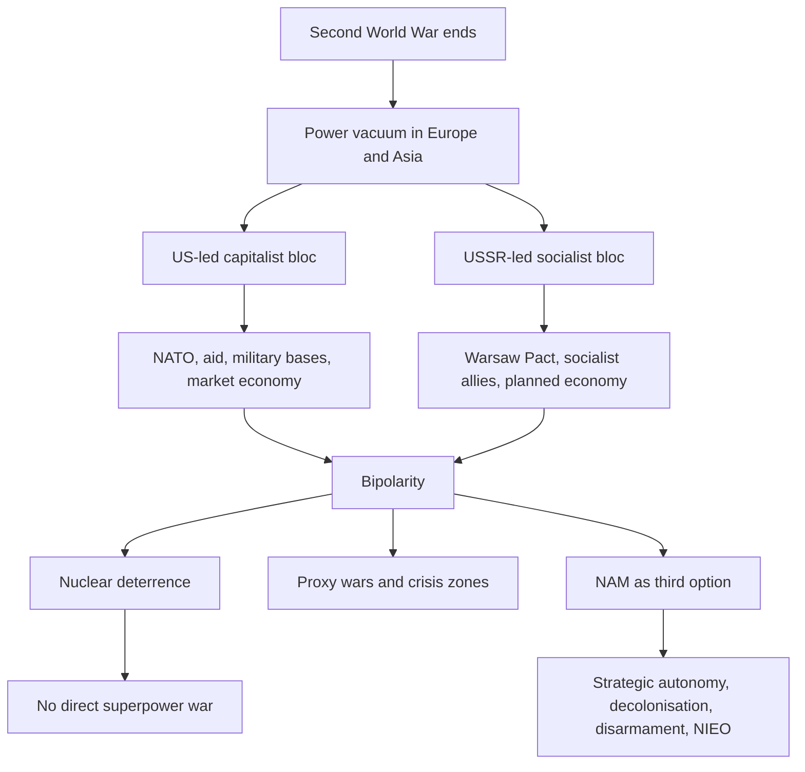

# The Cold War Era

**Class 12 - Contemporary World Politics**  

**Source policy:** supplemental-old-upsc-complete  

**Answer note:** Prelims explanations and Mains outlines are AI-generated study aids; verify against official UPSC keys and the NCERT source.

## Exam Orientation

- Prelims: fix the exact NCERT vocabulary around cold war, non alignment, bipolarity, Deterrence; expect statement-based traps that alter scope, sequence, or institutional roles.
- General Studies II: use the chapter to frame Constitution, governance, democracy, polity, rights, institutions, and social-justice arguments where relevant.
- Essay and interview: convert the chapter's central tension into balanced language: principle, institution, citizen impact, limitation, and reform direction.

## Master Summary

This chapter provides the foundational context of the Cold War, exploring its origins in the post-WWII bipolar rivalry between the US and USSR. It details the Cuban Missile Crisis, the logic of nuclear deterrence, the formation of opposing military alliances (NATO and Warsaw Pact), and the key arenas of conflict. The challenge to bipolarity through the Non-Aligned Movement (NAM) and the push for a New International Economic Order (NIEO) are examined, concluding with an assessment of India's role in NAM.

## Key Concepts

- Cold War
- Bipolarity
- Deterrence
- NATO and Warsaw Pact
- Arenas of Cold War (Korea, Vietnam, Afghanistan, etc.)
- Non-Aligned Movement (NAM)
- New International Economic Order (NIEO)
- India's Role in NAM

## UPSC Relevance

The Cold War era is a critical theme in UPSC Mains GS-II (International Relations) and PSIR optional. It helps explain the post-WWII world order, the ideological battle between capitalism and communism, and the emergence of the Third World. Questions on NAM's role, nuclear deterrence, and India's non-alignment policy are frequently asked. The chapter provides essential background for understanding contemporary global politics and India's strategic autonomy.

## High-Yield Facts

- Source anchor: Class 12 Contemporary World Politics, Chapter 1, The Cold War Era.
- Edition policy: supplemental-old-upsc-complete; revise from the linked source before relying on exact wording in the exam hall.
- Keep a one-line definition, NCERT example, and constitutional or political linkage ready for cold war.
- Keep a one-line definition, NCERT example, and constitutional or political linkage ready for non alignment.
- Keep a one-line definition, NCERT example, and constitutional or political linkage ready for bipolarity.
- Keep a one-line definition, NCERT example, and constitutional or political linkage ready for Deterrence.
- Keep a one-line definition, NCERT example, and constitutional or political linkage ready for NATO and Warsaw Pact.
- Keep a one-line definition, NCERT example, and constitutional or political linkage ready for Arenas of Cold War (Korea, Vietnam, Afghanistan, etc.).

## Topic Notes

### Cuban Missile Crisis (1962)

A pivotal Cold War confrontation when the USSR placed nuclear missiles in Cuba, near the US. The US responded with a naval blockade. After tense negotiations, the USSR withdrew the missiles, averting nuclear war. This crisis epitomized the Cold War—intense rivalry without direct superpower war, and highlighted the logic of deterrence and the need for crisis management.

### What is the Cold War?

The Cold War (1945–1991) was the geopolitical, ideological, and economic rivalry between the US-led capitalist bloc and the USSR-led communist bloc. It was 'cold' because it never escalated into a full-scale 'hot war' between the two superpowers, largely due to nuclear deterrence. The conflict was rooted in ideological differences (liberal democracy vs. socialism), the power vacuum after WWII, and mutual suspicion.

### Logic of Deterrence

Both superpowers possessed massive nuclear arsenals capable of 'mutually assured destruction' (MAD). Deterrence prevented direct war because neither side could afford to initiate conflict without facing unacceptable retaliation. This led to a stable, though tense, peace based on the rationality of avoiding total annihilation. Arms control treaties later emerged to manage the arms race.

### Emergence of Two Power Blocs

Europe was divided into Western (US-aligned, NATO, 1949) and Eastern (USSR-aligned, Warsaw Pact, 1955) blocs. The superpowers extended influence globally through regional alliances like SEATO and CENTO (US) and ties with North Korea, Vietnam, Iraq (USSR). Smaller states joined for security, aid, and ideological alignment, but cracks appeared (e.g., Sino-Soviet split).

### Arenas of the Cold War

Major flashpoints included the Korean War (1950–53), Berlin Crisis (1958–62), Cuban Missile Crisis (1962), Congo Crisis, Vietnam War (1954–75), and Soviet-Afghan War (1979–89). Superpowers fought through proxies, avoiding direct engagement. Non-aligned nations often mediated. The Cold War also witnessed a massive arms race and espionage, but also arms control treaties (LTBT, NPT, ABM).

### Challenge to Bipolarity: NAM

The Non-Aligned Movement emerged as a 'third option' for newly decolonized countries, refusing to join either bloc. Founded by Nehru (India), Tito (Yugoslavia), Nasser (Egypt), Sukarno (Indonesia), and Nkrumah (Ghana), the first summit in Belgrade (1961) included 25 members. NAM was not isolationism or neutrality; members actively mediated conflicts and sought economic justice through the New International Economic Order (NIEO).

### India and NAM

India, under Nehru, was a founding architect of NAM. It championed decolonization, nuclear disarmament, and peaceful coexistence. India played a mediatory role in Korea and other conflicts. NAM helped India safeguard its strategic autonomy and moral leadership, though critics question its effectiveness in protecting national interests during crises.

### New International Economic Order (NIEO)

The NIEO was a proposal by developing nations to reform the global economic system: grant control over resources, improve market access, reduce technology costs, and increase LDC role in international institutions (UNCTAD, 1972). By the 1970s, NAM shifted focus to economic issues, but the NIEO faded by the late 1980s due to opposition from developed countries and lack of unity among non-aligned nations.

## Prelims Traps

- Do not treat NCERT examples as exhaustive lists.
- Watch qualifiers such as only, always, never, directly, indirectly, constitutional, statutory, formal, and informal.
- Separate the broad idea of cold war from adjacent terms; UPSC often swaps related concepts.
- When a statement sounds familiar, check whether it matches the NCERT claim or merely uses NCERT vocabulary.

## Mains Framing

- Opening: define the demand using NCERT language from The Cold War Era, then state why it matters for Indian democracy or governance.
- Body: organise points around cold war, non alignment, bipolarity; add one institution, one citizen-impact angle, and one limitation.
- Conclusion: avoid a slogan; close with a constitutional, democratic, or reform-oriented balancing line.

## Answer Framework Bank

- Use when the question asks you to define cold war: definition, source anchor from Class 12 Contemporary World Politics, NCERT example, limitation, and balanced way forward.
- Dimensions to cover: institutional design, citizen impact, democratic accountability, and the link with non alignment, bipolarity, Deterrence.
- Contrast frame: distinguish cold war from adjacent ideas and show the consequence of confusing them in Prelims statements or Mains arguments.
- Practice conversion: turn one Prelims trap into a 150-word Mains paragraph with introduction, three analytical points, and a reform-oriented close.

## UPSC Expansion Drills

### Mains Answer Scaffold

For The Cold War Era, build a 150-250 word answer as: one-line definition of cold war, NCERT source anchor from Class 12 Contemporary World Politics, two analytical dimensions linked to non alignment, bipolarity, Deterrence, one limitation, and a balanced constitutional or democratic way forward.

### Prelims Trap Check

Turn each familiar phrase about cold war into a true-or-false statement. Test scope words such as only, always, never, formal, informal, constitutional, statutory, direct, and indirect before accepting the option.

### Key Term Anchors

Prepare one precise NCERT-style definition, one chapter example, and one Indian polity or governance linkage for: cold war, non alignment, bipolarity, Deterrence, NATO and Warsaw Pact.

### Comparison Prompt

Compare cold war with the nearest related concept in the chapter by basis, institution involved, citizen impact, and limitation. This prevents using adjacent terms as synonyms in Prelims or Mains.

### Weakness Repair Drill

After every wrong quiz or weak Mains outline, label the error as definition, scope, example, institution, chronology, or conclusion; then rewrite the corrected point as one exam-ready sentence.

## Current-Affairs Bridge

- Use news only as an illustration of the static concept: map any report to cold war, non alignment, bipolarity before writing it in notes.
- Record the institution involved, constitutional or political principle, affected group, and policy trade-off without inventing a current fact.
- Keep current examples replaceable; the NCERT concept should survive even when the news cycle changes.

## Revision Ladder

- [ ] Explain the chapter title in two sentences: The Cold War Era.
- [ ] Define and differentiate: cold war, non alignment, bipolarity.
- [ ] Attach one NCERT example and one Indian polity or governance linkage to each key concept.
- [ ] Attempt the Prelims drill without notes, then rewrite every wrong answer as a trap statement.
- [ ] Write one 150-word Mains answer using definition, dimensions, example, limitation, and way forward.

## Expanded NCERT-to-UPSC Notes

### Core Argument of the Chapter

The Cold War Era should not be revised as a simple list of wars and alliances. Its central UPSC value lies in explaining how a world can be deeply conflict-ridden without direct total war between the principal rivals. The US and the USSR represented opposing ideological, economic, and military visions, but the possession of nuclear weapons made direct confrontation irrational. The result was a tense international order in which rivalry moved into alliances, propaganda, arms races, espionage, proxy conflicts, economic aid, and diplomatic pressure.

For Mains, the chapter gives a classic model of structure and agency. The structure was bipolarity: two superpowers, two blocs, two competing security systems, and two models of development. The agency came from newly independent countries that refused to become passive clients of either bloc. NAM is therefore not a side-topic; it is the political response of decolonised societies to a world order shaped by superpower rivalry. In an answer, show that non-alignment was both a moral claim against bloc politics and a practical strategy for retaining policy autonomy.

### Concept Map

Use this map to build 150-word answers: begin with the post-war division, explain why nuclear weapons stabilised and endangered the system at the same time, then bring in NAM as the response of the Global South.

### Cold War as a Security Dilemma

The security dilemma means that one state's attempt to increase security can make another state feel less secure. In the Cold War, each bloc interpreted the other's alliances, weapons, and ideological expansion as threatening. NATO was presented by the West as a defensive alliance; the USSR saw it as encirclement. The Warsaw Pact was presented by the USSR as socialist security; the West saw it as Soviet domination of Eastern Europe. This is useful for UPSC because it prevents a one-sided answer. The Cold War was not only about aggressive intent; it was also about mistrust, worst-case assumptions, and competitive security planning.

In Prelims, do not confuse "security dilemma" with an actual declared war. It is a condition of mutual suspicion. In Mains, use it to explain why arms control was needed even when both sides claimed defensive motives.

### Nuclear Deterrence: Stability and Fragility

Deterrence produced a paradox. It reduced the likelihood of direct war because both superpowers feared unacceptable retaliation, but it also made every major crisis terrifying because miscalculation could become catastrophic. The Cuban Missile Crisis is the best example. It was not only a US-USSR dispute over missiles in Cuba; it was a test of crisis communication, naval pressure, domestic credibility, and the rational calculation that compromise was better than escalation.

For UPSC answers, write deterrence in two layers:

- Stability layer: fear of mutual destruction restrained direct superpower conflict.
- Fragility layer: arms race, accidental launch, misreading of intentions, and proxy conflicts kept the world insecure.

This balanced framing is stronger than saying deterrence simply "maintained peace". It maintained a limited and anxious peace, not positive peace.

### NAM: What It Was and What It Was Not

Non-alignment was not neutrality, isolationism, or passivity. Neutrality usually means staying out of a specific war. Isolationism means withdrawal from world affairs. Non-alignment meant active participation in world politics without formal military alignment with either superpower bloc. NAM countries tried to mediate, oppose colonialism and racism, support disarmament, and demand a fairer economic order.

The first generation of NAM leaders came from countries that had recently experienced colonial domination or external pressure. Their concern was that formal alignment could reproduce dependency in a new form: military aid, economic aid, diplomatic pressure, and strategic bases might limit sovereign decision-making. Thus NAM was linked to decolonisation and sovereign equality, not merely to tactical balancing between Washington and Moscow.

### India and Non-Alignment: Answer-Ready Dimensions

Use these dimensions when asked about India's Cold War policy:

| Dimension | UPSC-ready point | Example from the chapter theme |
|---|---|---|
| Strategic autonomy | India avoided automatic military alignment so that foreign policy could be decided case by case. | Refusal to join US-led or USSR-led military blocs. |
| Anti-colonial solidarity | India supported newly independent countries and struggles against colonial domination. | Afro-Asian solidarity and NAM leadership. |
| Peace and disarmament | India argued that superpower arms races diverted resources and threatened humanity. | Advocacy of peaceful coexistence and nuclear restraint. |
| Developmental space | Non-alignment helped India seek aid and cooperation without full ideological dependence. | Engagement with both blocs when national interest required it. |
| Limitation | Non-alignment was often criticised as morally ambitious but materially weak. | NAM could not always prevent wars, interventions, or bloc pressure. |

### NIEO as Economic Non-Alignment

The New International Economic Order extends the logic of NAM from political sovereignty to economic sovereignty. Political decolonisation did not automatically end unequal trade, technology dependence, commodity price vulnerability, or weak representation in global institutions. NIEO asked whether newly independent states could be truly sovereign if the rules of the world economy remained dominated by developed countries.

For Mains, connect NIEO to three stable themes:

- Resource sovereignty: developing countries wanted control over natural resources.
- Fair trade: they demanded better access to developed markets and fairer commodity prices.
- Institutional voice: they wanted greater influence in international economic institutions.

Its weakness was not the absence of moral force but limited bargaining power, internal diversity among developing states, and resistance from developed countries.

### Comparison Bank

| Term | Meaning | Common trap | Correct use |
|---|---|---|---|
| Cold War | Sustained rivalry without direct full-scale superpower war | Treating it as complete peace | Say it involved proxy wars, arms race, and ideological conflict. |
| Bipolarity | World order dominated by two major power centres | Equating it with two equal countries in every field | Say the two blocs structured security and diplomacy, though not every state was equally controlled. |
| Deterrence | Preventing attack through fear of retaliation | Calling it disarmament | It relies on possession of weapons, not their abolition. |
| NAM | Active non-alignment from military blocs | Calling it neutrality or isolationism | It was active diplomacy by newly independent countries. |
| NIEO | Demand for fairer global economic rules | Reducing it to foreign aid | It was about structural economic reform and voice. |

### Prelims Trap Bank

- If a statement says the Cold War involved no wars at all, reject it. The superpowers avoided direct total war with each other, but proxy wars and crises occurred.
- If a statement says NAM members were required to be equally distant from both blocs in every situation, be careful. NAM allowed issue-based positions and national-interest choices.
- If a statement equates deterrence with disarmament, reject it. Deterrence depends on credible retaliatory capacity.
- If a statement says NATO and Warsaw Pact were economic organisations, reject it. They were military alliances.
- If a statement says NIEO was only a political-military demand, reject it. It was centrally about global economic restructuring.
- If a statement says non-alignment meant not participating in international institutions, reject it. NAM countries were active in UN debates and global forums.

### Mains Answer Scaffolds

**Question type: "Was NAM a third force?"**

1. Define NAM as an active refusal to join Cold War military blocs.
2. Explain why decolonised states needed collective voice in a bipolar order.
3. Give achievements: anti-colonial solidarity, mediation, disarmament advocacy, NIEO.
4. Give limitations: diversity of members, weak enforcement, economic dependence, superpower pressure.
5. Conclude that NAM was not a military third bloc, but it was a diplomatic and normative third force.

**Question type: "Did nuclear deterrence prevent war?"**

1. Define deterrence as prevention through fear of unacceptable retaliation.
2. Use Cuban Missile Crisis to show crisis pressure.
3. Explain direct-war restraint between superpowers.
4. Add limits: arms race, proxy wars, accidental escalation, insecurity for smaller states.
5. Conclude with the need for arms control and communication channels.

**Question type: "Assess India's non-alignment."**

1. Begin with strategic autonomy and decolonised context.
2. Explain moral basis: anti-colonialism, peaceful coexistence, disarmament.
3. Explain practical basis: freedom to seek aid, avoid bloc entanglement, preserve independent judgement.
4. Add criticism: inconsistent choices, limited capacity to stop conflicts, dependence on great powers in crises.
5. Conclude that non-alignment evolved into strategic autonomy in India's later diplomacy.

### Contemporary Relevance Without Unsupported Current Affairs

The Cold War chapter remains useful even when the world is no longer formally bipolar. Its concepts help interpret stable patterns: major-power rivalry, arms racing, alliance formation, sanctions, technology competition, and strategic autonomy. Do not claim that a "new Cold War" exists as a settled fact unless the question asks for debate. Instead, write that Cold War concepts provide an analogy, while the contemporary world is more economically interdependent and institutionally complex than the US-USSR bipolar order.

For India, the durable relevance is strategic autonomy. India can cooperate with different powers on different issues without reducing foreign policy to bloc loyalty. This is not identical to old NAM because today's world contains multiple power centres, global supply chains, and issue-based coalitions. A strong answer says: "The vocabulary has changed from non-alignment to strategic autonomy, but the underlying concern with independent decision-making remains."

### Weakness-Repair Drills

- If your answer becomes a list of wars, rewrite it around one concept: bipolarity, deterrence, NAM, or NIEO.
- If you write "NAM was neutral", replace it with "NAM was an active policy of not joining military blocs while participating in world affairs."
- If you praise NAM without limits, add one sentence on its heterogeneity and weak enforcement capacity.
- If you criticise NAM as irrelevant, add one sentence on its contribution to decolonisation, disarmament debates, and Global South voice.
- If you mention the Cuban Missile Crisis, always connect it to deterrence and crisis management, not just chronology.
- If you mention NIEO, include economic structure, not only political independence.

## Prelims Drill

Q1
UPSC Prelims 2024
MCQ

The presence of cold ocean currents, Gulf Stream and North Atlantic Drift make the North Atlantic Ocean colder and the isotherms bend towards the north. Select the answer using the code given below:

<label data-opt="a">A1 only</label>
<label data-opt="b">B2 only</label>
<label data-opt="c">CBoth 1 and 2</label>
<label data-opt="d">DNeither 1 nor 2</label>

Show Answer

<strong>Answer: A.</strong> AI-generated study aid: AI-generated study aid: revise the linked NCERT concept and verify the final key against official UPSC answer keys.

Q2
UPSC Prelims 2000
MCQ

The Swarna Jayanti Shahari Rozgar Yojana which came into operation from Dec. 1, 1997 aims to provide gainful employment to the urban unemployed or underemployed poor but does not include

<label data-opt="a">ANehru Rozgar Yojana</label>
<label data-opt="b">BUrban Basic Services Programme</label>
<label data-opt="c">CPrime Minister&#x27;s Integrated Urban Poverty Eradication Programme</label>
<label data-opt="d">DPrime Minister&#x27;s Rozgar Yojana</label>

Show Answer

<strong>Answer: A.</strong> AI-generated study aid: AI-generated study aid: revise the linked NCERT concept and verify the final key against official UPSC answer keys.

Q3
UPSC Prelims 2000
MCQ

Consider the following statements : I. Maharashtra has the highest acreage under jawar in India. II. Gujarat is the largest producer of groundnut in India. III. Rajasthan has the largest area of cultivable wastelands in India. IV. Andhra Pradesh has the highest per hectare yield of maize in India. Which of these statements are correct ?

<label data-opt="a">AI and IV</label>
<label data-opt="b">BII and III</label>
<label data-opt="c">CI and III</label>
<label data-opt="d">DII and IV</label>

Show Answer

<strong>Answer: A.</strong> AI-generated study aid: AI-generated study aid: revise the linked NCERT concept and verify the final key against official UPSC answer keys.

Q4
UPSC Prelims 2000
MCQ

Match List I with List II and select the correct answer using the codes given below the Lists : List I List II I. Land allotted to big feudal landlords (A) Jagirdari System II. Land allotted to revenue farmers or rent collectors (B) Ryotwari System III. Land allotted to each peasant with the right to sublet, mortgage, transfer, gift or sell (C) Mahalwari System IV. Revenue settlements made at village level (D) Zamindari System Codes:

<label data-opt="a">AI-A, II-C, III-B, IV-D</label>
<label data-opt="b">BI-A, II-D, III-B, IV-C</label>
<label data-opt="c">CI-C, II-D, III-A, IV-B</label>
<label data-opt="d">DI-B, II-A, III-C, IV-D</label>

Show Answer

<strong>Answer: A.</strong> AI-generated study aid: AI-generated study aid: revise the linked NCERT concept and verify the final key against official UPSC answer keys.

Q5
UPSC Prelims 2002
MCQ

Who was the first Indian actress to receive the Padma Shri Award ?

<label data-opt="a">ASamita Patil</label>
<label data-opt="b">BNargis Dutt</label>
<label data-opt="c">CMeena Kumari</label>
<label data-opt="d">DMadhubala</label>

Show Answer

<strong>Answer: A.</strong> AI-generated study aid: AI-generated study aid: revise the linked NCERT concept and verify the final key against official UPSC answer keys.

Q6
UPSC Prelims 2002
MCQ

Two ladies simultaneously leave cities A and B connected by a straight road and travel towards each other. The first lady travels 2 km/hr faster than the second lady and reaches B one hour before the second lady reaches A. The two cities A and B are 24 km apart. How many kilometers does each lady travel in one hour?

<label data-opt="a">A5 km, 3 km</label>
<label data-opt="b">B7 km, 5 km</label>
<label data-opt="c">C8 km, 6 km</label>
<label data-opt="d">D16 km, 14 km</label>

Show Answer

<strong>Answer: A.</strong> AI-generated study aid: AI-generated study aid: revise the linked NCERT concept and verify the final key against official UPSC answer keys.

Q7
UPSC Prelims 2003
MCQ

Bangalore is situated more southward than Chennai. Which of these statements is/are?

<label data-opt="a">A1 and 3</label>
<label data-opt="b">BOnly 2</label>
<label data-opt="c">C2 and 3</label>
<label data-opt="d">D1, 2 and 3</label>

Show Answer

<strong>Answer: A.</strong> AI-generated study aid: AI-generated study aid: revise the linked NCERT concept and verify the final key against official UPSC answer keys.

Q8
UPSC Prelims 2003
MCQ

Skid inwards Which of these statements are correct?

<label data-opt="a">A1 and 3</label>
<label data-opt="b">B2 and 4</label>
<label data-opt="c">C2 and 3</label>
<label data-opt="d">D1 and 4</label>

Show Answer

<strong>Answer: A.</strong> AI-generated study aid: AI-generated study aid: revise the linked NCERT concept and verify the final key against official UPSC answer keys.

Q9
UPSC Prelims 2003
MCQ

The Indira Gandhi Peace Prize, 2002 was awarded to - (a) John Hume

<label data-opt="b">BNelson Mandela</label>
<label data-opt="c">CNorodom Sihanouk</label>
<label data-opt="d">DSadako Ogata</label>

Show Answer

<strong>Answer: B.</strong> AI-generated study aid: AI-generated study aid: revise the linked NCERT concept and verify the final key against official UPSC answer keys.

Q10
UPSC Prelims 2003
MCQ

Emperor Harsha&#x27;s southward march was stopped on the Narmada river by

<label data-opt="a">APulakesin-I</label>
<label data-opt="b">BPulakesin-II</label>
<label data-opt="c">CVikramaditya-I</label>
<label data-opt="d">DVilcramaditya-II</label>

Show Answer

<strong>Answer: A.</strong> AI-generated study aid: AI-generated study aid: revise the linked NCERT concept and verify the final key against official UPSC answer keys.

## Mains Answer Practice

### Mains Prompt 1: PSIR 2023 Paper II Q3(a)

> “During the Cold War, the Non-Aligned Movement tried to become a ‘Third force’ in World Politics, but failed because it was too large and unwieldy.” Discuss.

**Source:** UPSC CSE Mains 2023 Political Science & IR Paper II  

**Outline hint (AI-generated study aid):** Introduction: Define NAM and its aim to be a third force between the two blocs.
Body:
- Reasons for aiming as third force: Bipolarity's threat to new nations, desire for strategic autonomy, collective voice.
- Achievements: Mediation in crises (Korea, Congo), push for disarmament, NIEO advocacy, expansion of membership.
- Failure: Heterogeneous membership with diverse interests (pro-West, pro-Soviet, neutral), inability to enforce unity (e.g., India-Pak tensions, Arab divisions), lack of military/economic power, co-option by superpowers, NIEO's collapse.
- Large and unwieldy: Over 100 members by 1980s, consensus difficult, reduced effectiveness.
Conclusion: NAM failed as a cohesive third force due to internal contradictions and external pressures, but it was not a total failure; it gave moral voice to Global South and remains a forum for cooperation.

### Mains Prompt 2: PSIR 2016 Paper II Q5(b)

> Comment on India's contribution to Non-Alignment Movement and its contemporary relevance.

**Source:** UPSC CSE Mains 2016 Political Science & IR Paper II  

**Outline hint (AI-generated study aid):** Introduction: India as a founding leader of NAM, its vision of non-alignment.
Body:
- India's contribution: Nehru's role in establishing principles (Panchsheel), fostering Afro-Asian unity (Bandung 1955), chairing NAM (1983 Delhi Summit), promoting disarmament, anti-colonialism, and peaceful coexistence.
- India's diplomatic mediations (Korea, Congo) and advocacy for NIEO.
- Contemporary relevance: NAM's role in multipolar world—voice for Global South on issues like WTO, climate change, terrorism, UN reforms. India's engagement with NAM alongside new plurilateral forums (BRICS, G20) shows continued value. NAM allows India to balance relations with major powers.
- Criticisms: NAM's inertia, ad-hoc approach, but India has revived it through outreach.
Conclusion: NAM remains relevant as a moral platform, though India diversifies its diplomacy.

### Mains Prompt 3: Essay 2017 Section B

> Has the Non-Alignment Movement (NAM) lost its relevance in a multipolar world?

**Source:** UPSC CSE Mains 2017 Essay Paper  

**Outline hint (AI-generated study aid):** Introduction: Context of NAM's origin in bipolar world, question arising post-Cold War.
Body:
- Arguments for lost relevance: End of Cold War removed original rationale, rise of new global issues (terrorism, climate) requiring different alliances, growth of regional and issue-based groupings (BRICS, SCO, IBSA), NAM's inability to take coherent stances, internal divisions, reduced diplomatic weight.
- Arguments for continued relevance: Persistent North-South gap, need for collective voice in WTO, UN reforms, climate finance; NAM's large membership representing Global South; India's continued engagement (e.g., 2019 NAM summit); NAM principles of sovereignty, territorial integrity still valid.
- Balancing view: NAM has transformed from political to economic and development-focused forum; it complements rather than competes with new institutions.
Conclusion: NAM's relevance has not been lost but has evolved; it remains a platform for South-South cooperation, though not the sole framework.
