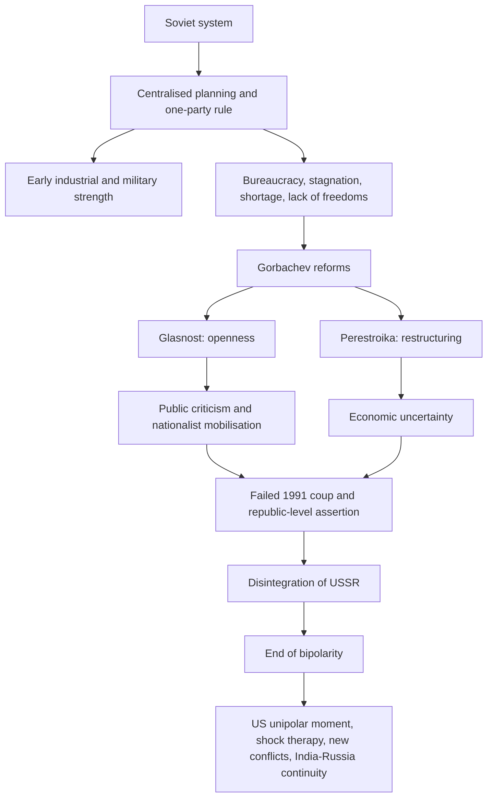

# The End of Bipolarity

**Class 12 - Contemporary World Politics**  

**Source policy:** supplemental-old-upsc-complete  

**Answer note:** Prelims explanations and Mains outlines are AI-generated study aids; verify against official UPSC keys and the NCERT source.

## Exam Orientation

- Prelims: fix the exact NCERT vocabulary around end of bipolarity, soviet union, post cold war, Soviet system – state-controlled economy, one-party rule, egalitarian ideology; expect statement-based traps that alter scope, sequence, or institutional roles.
- General Studies II: use the chapter to frame Constitution, governance, democracy, polity, rights, institutions, and social-justice arguments where relevant.
- Essay and interview: convert the chapter's central tension into balanced language: principle, institution, citizen impact, limitation, and reform direction.

## Master Summary

The chapter examines the disintegration of the Soviet Union, the end of the Cold War, and the collapse of the bipolar world order. It covers the internal weaknesses of the Soviet system, Mikhail Gorbachev's reforms (glasnost and perestroika), the rise of nationalism, and the eventual break-up of the USSR in 1991. The consequences include a unipolar world led by the US, shock therapy economic transitions in post-communist states, and new ethnic conflicts. India's relations with Russia and other post-Soviet countries are discussed, highlighting continuity and change in foreign policy.

## Key Concepts

- Soviet system – state-controlled economy, one-party rule, egalitarian ideology
- Gorbachev’s reforms – glasnost (openness), perestroika (restructuring)
- Disintegration of USSR – nationalist movements, failed coup, CIS formation
- End of bipolarity – collapse of second world, US unipolar moment
- Shock therapy – rapid transition to capitalism, privatisation, IMF/World Bank influence
- Consequences – economic hardship, rise of mafia, weakened social welfare
- Post-Soviet conflicts – Chechnya, Nagorno-Karabakh, Yugoslavia breakup
- India’s post-communist engagement – Look East Policy, Indo-Russia ties

## UPSC Relevance

Crucial for understanding the post-Cold War international system, shifts in global power, and India's foreign policy recalibration. Links to GS Paper II (international relations) and Political Science optional. Frequent source of conceptual questions on unipolarity, globalisation, and state sovereignty.

## High-Yield Facts

- Source anchor: Class 12 Contemporary World Politics, Chapter 2, The End of Bipolarity.
- Edition policy: supplemental-old-upsc-complete; revise from the linked source before relying on exact wording in the exam hall.
- Keep a one-line definition, NCERT example, and constitutional or political linkage ready for end of bipolarity.
- Keep a one-line definition, NCERT example, and constitutional or political linkage ready for soviet union.
- Keep a one-line definition, NCERT example, and constitutional or political linkage ready for post cold war.
- Keep a one-line definition, NCERT example, and constitutional or political linkage ready for Soviet system – state-controlled economy, one-party rule, egalitarian ideology.
- Keep a one-line definition, NCERT example, and constitutional or political linkage ready for Gorbachev’s reforms – glasnost (openness), perestroika (restructuring).
- Keep a one-line definition, NCERT example, and constitutional or political linkage ready for Disintegration of USSR – nationalist movements, failed coup, CIS formation.

## Topic Notes

### The Soviet System

USSR emerged from 1917 socialist revolution, aiming for egalitarian society. State owned all productive assets; economy centrally planned. After WWII, expanded control over East Europe, forming the 'Second World' or socialist bloc. Warsaw Pact provided military unity. Soviet economy grew rapidly but became bureaucratic and authoritarian. One-party rule, lack of democracy, suppression of dissent. Although 15 republics, Russia dominated; non-Russian regions felt neglected.

### Gorbachev and the Disintegration

Mikhail Gorbachev became General Secretary in 1985. Introduced glasnost (political openness) and perestroika (economic restructuring). Relaxed grip over East Europe; non-intervention led to communist regime collapses. Topical coup in 1991 by hardliners failed, accelerated independence demands. Russia, Ukraine, Belarus declared USSR dissolved in December 1991. CIS formed; Russia succeeded USSR in UN.

### Causes of Disintegration

Internal systemic weaknesses: economic stagnation, technological backwardness, denial of political freedoms. Heavy military spending and burden of satellite states. Citizens compared with Western prosperity, leading to disillusionment. Nationalist movements surged, especially in Baltic states and Russia itself. Gorbachev’s reforms unleashed uncontrollable forces; he lost support from both reformers and conservatives.

### Consequences of Disintegration

End of Cold War ideological confrontation; arms race ended. Unipolar world with US as sole superpower. Liberal democracy and capitalism became dominant norms. Emergence of 15 independent states; many joined EU and NATO (Baltic, East Europe). Central Asian republics maintained ties with Russia and explored new partnerships.

### Shock Therapy and Transition

Influenced by World Bank and IMF, post-communist states adopted shock therapy: rapid privatisation, free trade, currency convertibility. Resulted in economic collapse, hyperinflation, unemployment, and social welfare dismantling. State-owned industries sold cheaply; mafia rose. Gradual recovery after 2000 through oil and gas exports.

### Tensions and Conflicts

Many new states faced ethnic strife: Chechnya in Russia, Nagorno-Karabakh (Azerbaijan), Georgia's breakaway provinces, Tajikistan civil war. Yugoslavia disintegrated violently. Central Asia became geopolitical battleground due to energy resources; US, Russia, China vied for influence.

### India and Post-Communist Countries

India maintained cordial relations with post-Soviet states, especially Russia (defence, nuclear cooperation). Central Asian republics gained importance in India's energy security and connectivity (e.g., Chabahar). Look East Policy leveraged end of Cold War to strengthen ties with ASEAN. Cultural and diaspora links supported diplomacy.

## Prelims Traps

- Do not treat NCERT examples as exhaustive lists.
- Watch qualifiers such as only, always, never, directly, indirectly, constitutional, statutory, formal, and informal.
- Separate the broad idea of end of bipolarity from adjacent terms; UPSC often swaps related concepts.
- When a statement sounds familiar, check whether it matches the NCERT claim or merely uses NCERT vocabulary.

## Mains Framing

- Opening: define the demand using NCERT language from The End of Bipolarity, then state why it matters for Indian democracy or governance.
- Body: organise points around end of bipolarity, soviet union, post cold war; add one institution, one citizen-impact angle, and one limitation.
- Conclusion: avoid a slogan; close with a constitutional, democratic, or reform-oriented balancing line.

## Answer Framework Bank

- Use when the question asks you to define end of bipolarity: definition, source anchor from Class 12 Contemporary World Politics, NCERT example, limitation, and balanced way forward.
- Dimensions to cover: institutional design, citizen impact, democratic accountability, and the link with soviet union, post cold war, Soviet system – state-controlled economy, one-party rule, egalitarian ideology.
- Contrast frame: distinguish end of bipolarity from adjacent ideas and show the consequence of confusing them in Prelims statements or Mains arguments.
- Practice conversion: turn one Prelims trap into a 150-word Mains paragraph with introduction, three analytical points, and a reform-oriented close.

## UPSC Expansion Drills

### Mains Answer Scaffold

For The End of Bipolarity, build a 150-250 word answer as: one-line definition of end of bipolarity, NCERT source anchor from Class 12 Contemporary World Politics, two analytical dimensions linked to soviet union, post cold war, Soviet system – state-controlled economy, one-party rule, egalitarian ideology, one limitation, and a balanced constitutional or democratic way forward.

### Prelims Trap Check

Turn each familiar phrase about end of bipolarity into a true-or-false statement. Test scope words such as only, always, never, formal, informal, constitutional, statutory, direct, and indirect before accepting the option.

### Key Term Anchors

Prepare one precise NCERT-style definition, one chapter example, and one Indian polity or governance linkage for: end of bipolarity, soviet union, post cold war, Soviet system – state-controlled economy, one-party rule, egalitarian ideology, Gorbachev’s reforms – glasnost (openness), perestroika (restructuring).

### Comparison Prompt

Compare end of bipolarity with the nearest related concept in the chapter by basis, institution involved, citizen impact, and limitation. This prevents using adjacent terms as synonyms in Prelims or Mains.

### Weakness Repair Drill

After every wrong quiz or weak Mains outline, label the error as definition, scope, example, institution, chronology, or conclusion; then rewrite the corrected point as one exam-ready sentence.

## Current-Affairs Bridge

- Use news only as an illustration of the static concept: map any report to end of bipolarity, soviet union, post cold war before writing it in notes.
- Record the institution involved, constitutional or political principle, affected group, and policy trade-off without inventing a current fact.
- Keep current examples replaceable; the NCERT concept should survive even when the news cycle changes.

## Revision Ladder

- [ ] Explain the chapter title in two sentences: The End of Bipolarity.
- [ ] Define and differentiate: end of bipolarity, soviet union, post cold war.
- [ ] Attach one NCERT example and one Indian polity or governance linkage to each key concept.
- [ ] Attempt the Prelims drill without notes, then rewrite every wrong answer as a trap statement.
- [ ] Write one 150-word Mains answer using definition, dimensions, example, limitation, and way forward.

## Expanded NCERT-to-UPSC Notes

### Core Argument of the Chapter

The end of bipolarity was not simply the collapse of one country. It was a systemic transformation in world politics. The USSR had been one pole of the Cold War order; when it disintegrated, the military, ideological, and economic balance that had structured post-1945 politics also changed. UPSC answers should therefore separate three layers: the internal crisis of the Soviet system, the political process of disintegration, and the international consequences of a post-Cold War world.

The Soviet Union had achievements that should not be ignored: rapid industrialisation, victory in the Second World War, social welfare, and superpower status. But by the 1970s and 1980s it suffered from stagnation, lack of political freedom, bureaucratic control, technological lag, and excessive military expenditure. The chapter's deeper lesson is that a state may possess military power yet weaken if its economy, political legitimacy, and social consent erode.

### Concept Map

Revise the sequence carefully. Gorbachev's reforms did not mechanically "cause" the collapse by themselves; they exposed and accelerated deeper contradictions already present in the Soviet system.

### Soviet System: Strengths, Contradictions, Collapse

For UPSC, avoid cartoonish answers that say the USSR failed only because communism failed. The NCERT treatment is more nuanced. The Soviet system combined social welfare and planned development with authoritarian politics and economic inefficiency. It was able to mobilise resources for heavy industry, defence, education, and scientific achievement. But the same centralisation created rigidity. Enterprises lacked incentives, citizens lacked political voice, and the party-state became insulated from social feedback.

The contradiction was between the promise of equality and the reality of privilege and shortage. Party elites had access to better services while ordinary citizens faced scarcity and restrictions. This damaged legitimacy. Once glasnost allowed criticism, long-suppressed grievances became public. Once Moscow loosened control over republics and Eastern Europe, nationalist movements gained space. Thus the collapse was political, economic, ideological, and national at the same time.

### Gorbachev's Reforms: Exam-Ready Distinction

| Reform | Basic meaning | Intended purpose | Unintended effect |
|---|---|---|---|
| Glasnost | Openness in public discussion and criticism | Improve accountability and reduce secrecy | Released criticism of the party, state, and Soviet history. |
| Perestroika | Economic and political restructuring | Revive a stagnant system without fully abandoning socialism | Created uncertainty and empowered competing reform demands. |
| Democratization | Limited political opening within the system | Renew legitimacy | Made one-party control harder to sustain. |
| Non-intervention in Eastern Europe | Reduced Soviet coercive control | Lower external burden and improve relations with West | Communist regimes in Eastern Europe collapsed rapidly. |

Prelims trap: glasnost is not economic restructuring; perestroika is not simply "freedom of speech". Keep the terms distinct.

### Causes of Disintegration: Multi-Causal Framework

Use a five-factor framework in Mains:

- Economic stagnation: shortages, low productivity, technological lag, and inability to match Western consumer prosperity.
- Political authoritarianism: one-party dominance, suppression of dissent, and lack of democratic accountability.
- Military burden: arms race and support for satellite states placed pressure on the economy.
- Nationality question: non-Russian republics resented domination and demanded autonomy or independence.
- Reform shock: Gorbachev's reforms raised expectations faster than institutions could manage them.

This framework is better than writing only "glasnost and perestroika caused the collapse." The reforms were catalysts, not the entire cause.

### Shock Therapy: Political Economy of Transition

Shock therapy refers to rapid transition from state-controlled socialism to market capitalism. It usually included privatisation, deregulation, currency convertibility, reduced subsidies, and opening to international trade and finance. The NCERT emphasis is on the social cost of abrupt transformation. State assets were often sold cheaply, welfare systems weakened, inflation eroded savings, unemployment rose, and criminal networks gained influence in some countries.

The UPSC value of shock therapy lies in comparing reform paths. China used gradual market reform while retaining one-party political control. Post-Soviet states were pushed toward rapid market conversion after institutional collapse. India after 1991 liberalised gradually within a democratic framework and did not dismantle the state overnight. This comparison helps answer questions on economic reform, state capacity, and social protection.

### Consequences of the End of Bipolarity

| Consequence | Explanation | UPSC use |
|---|---|---|
| End of Cold War confrontation | The ideological and military rivalry between the two blocs lost its earlier structure. | Useful for questions on post-Cold War order. |
| US unipolar moment | The US became the sole superpower in military and institutional terms. | Links to Chapter 3 on hegemony. |
| Expansion of liberal capitalism | Market reforms and liberal democratic language gained prestige. | Use carefully; not every state became liberal-democratic. |
| New states and conflicts | Fifteen republics emerged; some regions saw ethnic and territorial conflict. | Shows that end of bipolarity did not mean end of insecurity. |
| Reorientation of India | India adjusted through economic reform, Look East, and continued Russia ties. | Important for GS II foreign policy answers. |

### India After the Soviet Collapse

India had deep defence, diplomatic, and technological ties with the Soviet Union. Its collapse created uncertainty: defence supplies, rupee-rouble trade, diplomatic support, and global alignment patterns all changed. India's response was not abandonment of Russia but diversification. It maintained a strong relationship with Russia while improving relations with the US, Europe, ASEAN, and other post-Soviet states.

For Mains, present India's adjustment in three layers:

- Continuity: Russia remained important in defence, energy, space, and diplomatic cooperation.
- Diversification: India expanded engagement with the US, ASEAN, Israel, and other partners.
- Economic shift: 1991 reforms made India more integrated with the global economy.

This is the bridge from "non-alignment" to "strategic autonomy". India did not simply join the US-led order; it widened its options.

### Comparison Bank

| Concept | Meaning | Do not confuse with | Correct exam use |
|---|---|---|---|
| End of bipolarity | Collapse of the two-pole Cold War structure | End of all conflicts | Conflicts persisted in new forms. |
| Disintegration of USSR | Break-up of the Soviet Union into independent republics | Collapse of all socialist politics worldwide | Some communist parties and states continued elsewhere. |
| Shock therapy | Rapid market transition in post-communist states | Gradual reform | Contrast with China's gradual reforms and India's calibrated liberalisation. |
| Glasnost | Openness | Privatisation | Political-public openness and criticism. |
| Perestroika | Restructuring | Simple free speech | Economic and political reorganisation. |

### Prelims Trap Bank

- If a statement says Gorbachev became leader after the USSR collapsed, reject it. He became General Secretary in 1985 and his reforms preceded the collapse.
- If a statement says shock therapy created immediate prosperity across post-Soviet states, reject it. NCERT stresses hardship and social cost.
- If a statement says Russia was one of many republics with no special role, be careful. Russia was dominant within the USSR and succeeded it in key international positions.
- If a statement says the end of bipolarity ended ethnic conflict, reject it. Several post-Soviet and East European conflicts followed.
- If a statement says India ended ties with Russia after 1991, reject it. India diversified but maintained strong Russia relations.
- If a statement equates CIS with a new Soviet Union, reject it. CIS was a looser association, not the same centralised state.

### Mains Answer Scaffolds

**Question type: "Why did the Soviet Union disintegrate?"**

1. Introduce the USSR as the second pole of the Cold War.
2. Mention its achievements to avoid one-sidedness.
3. Explain economic stagnation and technological backwardness.
4. Add political authoritarianism and legitimacy crisis.
5. Add nationality question and reform-triggered mobilisation.
6. Conclude that collapse was multi-causal, not a single-person event.

**Question type: "Assess shock therapy."**

1. Define shock therapy as rapid transition to capitalism.
2. List measures: privatisation, deregulation, opening, currency reforms.
3. Explain costs: unemployment, inflation, asset stripping, welfare decline.
4. Contrast with gradual reform models.
5. Conclude that market transition without institutions and social protection can deepen insecurity.

**Question type: "How did India respond to the post-Cold War order?"**

1. Begin with the collapse of a trusted partner and the end of bipolarity.
2. Explain continuity with Russia.
3. Explain diversification through Look East, US engagement, and global economic integration.
4. Add strategic autonomy as the guiding principle.
5. Conclude that India's foreign policy moved from Cold War non-alignment to multi-alignment without formal bloc dependence.

### Contemporary Relevance Without Unsupported Current Affairs

This chapter helps interpret why great powers can decline despite military capacity. It also shows that transitions in world order rarely produce clean peace. The collapse of a superpower can create institutional vacuum, new borders, national identity conflicts, and economic hardship. Use broad, stable examples such as post-Soviet conflicts, NATO expansion debates, energy politics, and the continuing importance of Russia in Eurasia without overstating fresh developments unless verified from current sources.

For India, the enduring lesson is diversification. A country dependent on one external partner becomes vulnerable when that partner declines. Strategic autonomy requires multiple partnerships, domestic capacity, and the ability to manage contradictions among partners.

### Weakness-Repair Drills

- If your answer says "Gorbachev caused the USSR collapse", rewrite it as "Gorbachev's reforms accelerated deeper economic, political, and nationality crises."
- If you treat shock therapy as only economic reform, add its social consequences.
- If you say the Cold War ended and peace began, add post-Soviet conflicts and the unipolar power imbalance.
- If you discuss India only through Russia, add diversification toward ASEAN, the US, and global markets.
- If you use "USSR", "Russia", and "CIS" interchangeably, rewrite each sentence with the correct entity.
- If your conclusion is ideological, replace it with an institutional lesson: reform needs legitimacy, sequencing, and social protection.

## Prelims Drill

Q1
Prelims 2012
MCQ

Consider the following statement: The Third World War, if it ever starts, will end very quickly with the possible end of civilization. It is only the misuse of nuclear power which will trigger it. Based on the above statement, which one of the following inferences is correct?

<label data-opt="a">ANuclear power will be used in the Third World War.</label>
<label data-opt="b">BThere will be no civilization left after the Third World War.</label>
<label data-opt="c">CThe growth of nuclear power will destroy civilization in the long run.</label>
<label data-opt="d">DThe Third World War will not take place.</label>

Show Answer

<strong>Answer: A.</strong> AI-generated study aid: The statement says it is only misuse of nuclear power that will trigger WW3, implying that if WW3 starts, nuclear weapons will be the cause and will be used. The phrase &#x27;will end very quickly with the possible end of civilization&#x27; suggests a swift nuclear war, so nuclear power will be used. Option (a) directly follows. (b) worded as certainty while the statement says &#x27;possible&#x27;; (c) misconstrues the immediate cause; (d) is not implied. [AI-generated study aid]

## Mains Answer Practice

### Mains Prompt 1: Mains 2025

> ’With the waning of globalization, post-Cold War world is becoming a site of sovereign nationalism.’ Elucidate. (150 words)

**Source:** UPSC CSE Mains 2025, GS Paper II, Q10  

**Outline hint (AI-generated study aid):** 1. Introduction: Post-Cold War saw triumph of globalisation and liberal order; now retreat. 2. Waning globalisation: trade wars, pandemic disruptions, supply chain re-shoring. 3. Rise of sovereign nationalism: policies like 'America First', Brexit, India's Atmanirbhar Bharat; emphasis on territorial sovereignty, cultural identity, and strategic autonomy. 4. Impact on international institutions: weakening of multilateralism, UN gridlock, new minilateralism. 5. Regional examples: Russia, China, Turkey assertive nationalism. 6. Complexity: neither end of globalisation nor total autarky; countries seek strategic de-risking. 7. Conclusion: Sovereign nationalism reshaping international relations, but needs balance with interdependence.

### Mains Prompt 2: Mains 2016

> Evaluate the economic and strategic dimensions of India’s Look East Policy in the context of the post Cold War international scenario. (250 words)

**Source:** UPSC CSE Mains 2016, GS Paper II, Q18  

**Outline hint (AI-generated study aid):** 1. Introduction: End of Cold War allowed India to reorient foreign policy; Look East Policy (1991) aimed at East and Southeast Asia. 2. Economic dimensions: a) Boost trade and investment with ASEAN; b) Integration with Asian supply chains; c) Free Trade Agreements (ASEAN-India FTA, CECA with Singapore); d) Connectivity projects (India-Myanmar-Thailand Trilateral Highway, Kaladan). 3. Strategic dimensions: a) Counterbalance China's influence; b) Maritime security cooperation (Indian Navy, Malacca Straits); c) Multilateral engagements (ASEAN+1, East Asia Summit, QUAD); d) Soft power and cultural ties. 4. Achievements: increased trade, strategic partnerships, Act East Policy upgrade. 5. Challenges: trade deficits, limited connectivity, ASEAN’s China-centric approach. 6. Conclusion: Look East (now Act East) remains vital for India's Indo-Pacific vision, balancing economic growth and strategic autonomy.

### Mains Prompt 3: Mains 2021

> ’The USA is facing an existential threat in the form of a China, that is much more challenging than the erstwhile Soviet Union.’ Explain. (150 words)

**Source:** UPSC CSE Mains 2021, GS Paper II, Q10  

**Outline hint (AI-generated study aid):** 1. Introduction: China’s comprehensive power poses a systemic challenge unlike Soviet Union, which was primarily military. 2. Military dimension: China’s rapid modernisation, anti-access/area denial, cyber warfare; but like USSR, it’s a peer competitor. 3. Economic challenge: China integrated into global economy (unlike USSR); US reliant on Chinese supply chains, trade imbalances. 4. Technological race: China leads in 5G, AI, quantum; threat to US tech supremacy. 5. Ideological challenge: China’s ‘authoritarian capitalism’ vs. US liberal democracy; Belt and Road offers alternative model. 6. Soft power and global governance: China reshapes UN, creates parallel institutions (AIIB). 7. Domestic vulnerability: Soviet collapse due to internal contradictions; China’s resilience by adapting. 8. Conclusion: China’s threat is multidimensional, sustained, and deeply intertwined with US interests, making it more formidable than the Cold War-era USSR.
