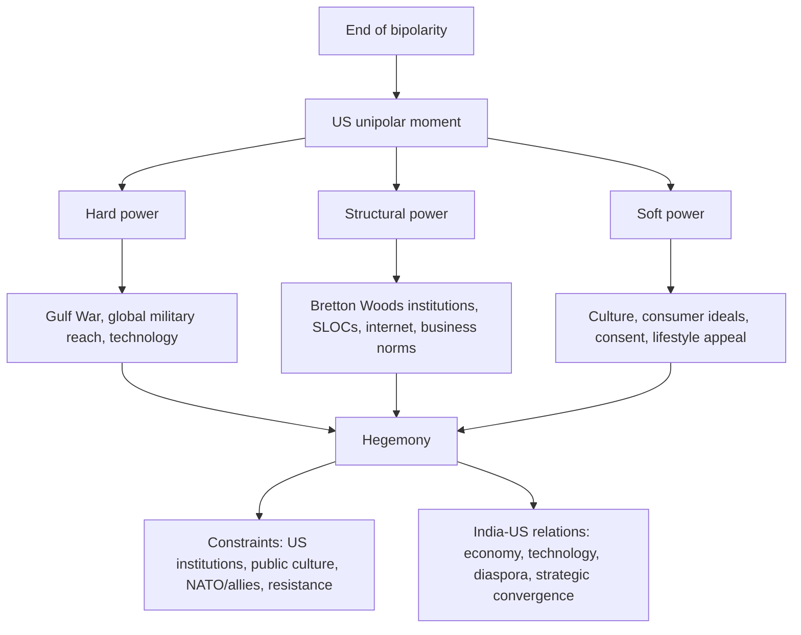

# US Hegemony in World Politics

**Class 12 - Contemporary World Politics**  

**Source policy:** supplemental-old-upsc-complete  

**Answer note:** Prelims explanations and Mains outlines are AI-generated study aids; verify against official UPSC keys and the NCERT source.

## Exam Orientation

- Prelims: fix the exact NCERT vocabulary around us hegemony, world politics, unipolarity, Hegemony (hard, structural, soft power); expect statement-based traps that alter scope, sequence, or institutional roles.
- General Studies II: use the chapter to frame Constitution, governance, democracy, polity, rights, institutions, and social-justice arguments where relevant.
- Essay and interview: convert the chapter's central tension into balanced language: principle, institution, citizen impact, limitation, and reform direction.

## Master Summary

This chapter examines the emergence and nature of US hegemony after the Cold War. It traces the rise of a unipolar world through events like the First Gulf War, the Clinton years, 9/11, and the Iraq invasion. The concept of hegemony is elaborated in three forms: hard power (military dominance), structural power (control over global economic institutions and norms), and soft power (cultural and ideological influence). The chapter also discusses constraints on American power, including domestic institutional checks and the role of NATO, and assesses India's evolving relationship with the US. It concludes that while US hegemony faces challenges, it remains deeply embedded in world politics.

## Key Concepts

- Hegemony (hard, structural, soft power)
- Unipolarity
- Operation Desert Storm
- Global War on Terror
- Operation Enduring Freedom
- Operation Iraqi Freedom
- Weapons of Mass Destruction (WMD)
- Bretton Woods institutions
- Smart bombs and computer war
- Guantanamo Bay
- Sea Lanes of Communication (SLOCs)
- MBA as structural power symbol
- Coalition of the willing
- NATO as a constraint
- Indian-American diaspora and technology ties

## UPSC Relevance

The chapter is crucial for understanding post-Cold War international relations, US foreign policy, and theoretical perspectives on power. It directly connects to GS Paper 2 (International Relations) and Political Science and IR optional. Concepts like hard, structural, and soft power are foundational for analyzing current global dynamics, including India-US relations, the role of international institutions, and challenges to US dominance.

## High-Yield Facts

- Source anchor: Class 12 Contemporary World Politics, Chapter 3, US Hegemony in World Politics.
- Edition policy: supplemental-old-upsc-complete; revise from the linked source before relying on exact wording in the exam hall.
- Keep a one-line definition, NCERT example, and constitutional or political linkage ready for us hegemony.
- Keep a one-line definition, NCERT example, and constitutional or political linkage ready for world politics.
- Keep a one-line definition, NCERT example, and constitutional or political linkage ready for unipolarity.
- Keep a one-line definition, NCERT example, and constitutional or political linkage ready for Hegemony (hard, structural, soft power).
- Keep a one-line definition, NCERT example, and constitutional or political linkage ready for Operation Desert Storm.
- Keep a one-line definition, NCERT example, and constitutional or political linkage ready for Global War on Terror.

## Topic Notes

### Beginning of the ‘New World Order’

The sudden collapse of the Soviet Union in 1991 left the US as the sole superpower. However, US hegemony has roots in the post-World War II order (1945). The First Gulf War (1990–91) marked the emergence of a ‘new world order’. Iraq's invasion of Kuwait prompted a UN-mandated US-led coalition (Operation Desert Storm) that showcased American military superiority, including 'smart bombs' and extensive media coverage. The US profited from the war, receiving more from allies than it spent, highlighting its dominant position.

### The Clinton Years

President Bill Clinton (1993–2001) focused on 'soft issues' like democracy promotion, climate change, and world trade. However, the US still used military force, notably in Kosovo (1999) against Yugoslavia without UN mandate, and in response to Al-Qaeda bombings of US embassies in 1998 (Operation Infinite Reach). These actions set precedents for unilateral military engagement.

### 9/11 and the ‘Global War on Terror’

The 11 September 2001 attacks killed nearly 3,000 people, shocking the US. President George W. Bush launched ‘Operation Enduring Freedom’ against Al-Qaeda and the Taliban. The US arrested suspects globally, detained them in secret prisons and Guantanamo Bay, often violating international law. The campaign expanded into a broader Global War on Terror.

### The Iraq Invasion

In March 2003, the US invaded Iraq ('Operation Iraqi Freedom') with a 'coalition of the willing', bypassing the UN. The stated reason was to eliminate WMDs, which were never found. Real motives may include controlling oil and installing a friendly regime. Despite toppling Saddam Hussein quickly, the US faced a protracted insurgency and high casualties, marking it a military and political failure.

### What Does Hegemony Mean?

Hegemony refers to the leadership or predominance of one state over others. In the contemporary unipolar system, the US is the sole superpower. The chapter identifies three forms of hegemony: hard power (military), structural power (economic), and soft power (cultural/ideological).

### Hegemony as Hard Power

US military supremacy is both absolute and relative. The US spends more on defense than the next 12 countries combined and possesses a technological edge. Its capabilities allow global reach for conquest, deterrence, and punishment, but it has shown weakness in policing occupied territories (e.g., Iraq). The Pentagon's command structure covers the entire world.

### Hegemony as Structural Power

Structural power is the ability to shape the global economic framework. The US provides global public goods like security of sea lanes (SLOCs) and the Internet (originally a US military project). It holds a 28% share of world economy and 15% of world trade. Institutions like the IMF, World Bank, and WTO reflect US dominance. The MBA degree symbolizes the spread of US business norms. The Bretton Woods system continues to underpin global economic structure.

### Hegemony as Soft Power

Soft power is the ability to manufacture consent and persuade rather than coerce. US cultural influence is pervasive—from blue jeans to ideas of the good life. During the Cold War, soft power helped the US win ideological battles, as seen in the symbolic power of blue jeans in the Soviet Union. This 'cultural seduction' makes people internalize US values without force.

### Constraints on American Power

Three domestic and external constraints limit US hegemony: (1) the institutional division of powers (checks and balances) within the US; (2) the open, skeptical political culture and media that can restrain military adventures; (3) NATO, which is the only organization capable of moderating US unilateralism, given the importance of the alliance to the US.

### India’s Relationship with the US

During the Cold War, India was aligned with the USSR. After the Soviet collapse, India liberalized its economy, integrating with the global market. This economic openness, along with high growth rates, made India an attractive partner. Two new factors strengthened ties: (1) the technological dimension (US absorbs 65% of India's software exports; many Indians in Silicon Valley); (2) the Indian-American diaspora's role. These have shifted Indo-US relations from estrangement to engagement.

## Prelims Traps

- Do not treat NCERT examples as exhaustive lists.
- Watch qualifiers such as only, always, never, directly, indirectly, constitutional, statutory, formal, and informal.
- Separate the broad idea of us hegemony from adjacent terms; UPSC often swaps related concepts.
- When a statement sounds familiar, check whether it matches the NCERT claim or merely uses NCERT vocabulary.

## Mains Framing

- Opening: define the demand using NCERT language from US Hegemony in World Politics, then state why it matters for Indian democracy or governance.
- Body: organise points around us hegemony, world politics, unipolarity; add one institution, one citizen-impact angle, and one limitation.
- Conclusion: avoid a slogan; close with a constitutional, democratic, or reform-oriented balancing line.

## Answer Framework Bank

- Use when the question asks you to define us hegemony: definition, source anchor from Class 12 Contemporary World Politics, NCERT example, limitation, and balanced way forward.
- Dimensions to cover: institutional design, citizen impact, democratic accountability, and the link with world politics, unipolarity, Hegemony (hard, structural, soft power).
- Contrast frame: distinguish us hegemony from adjacent ideas and show the consequence of confusing them in Prelims statements or Mains arguments.
- Practice conversion: turn one Prelims trap into a 150-word Mains paragraph with introduction, three analytical points, and a reform-oriented close.

## UPSC Expansion Drills

### Mains Answer Scaffold

For US Hegemony in World Politics, build a 150-250 word answer as: one-line definition of us hegemony, NCERT source anchor from Class 12 Contemporary World Politics, two analytical dimensions linked to world politics, unipolarity, Hegemony (hard, structural, soft power), one limitation, and a balanced constitutional or democratic way forward.

### Prelims Trap Check

Turn each familiar phrase about us hegemony into a true-or-false statement. Test scope words such as only, always, never, formal, informal, constitutional, statutory, direct, and indirect before accepting the option.

### Key Term Anchors

Prepare one precise NCERT-style definition, one chapter example, and one Indian polity or governance linkage for: us hegemony, world politics, unipolarity, Hegemony (hard, structural, soft power), Operation Desert Storm.

### Comparison Prompt

Compare us hegemony with the nearest related concept in the chapter by basis, institution involved, citizen impact, and limitation. This prevents using adjacent terms as synonyms in Prelims or Mains.

### Weakness Repair Drill

After every wrong quiz or weak Mains outline, label the error as definition, scope, example, institution, chronology, or conclusion; then rewrite the corrected point as one exam-ready sentence.

## Current-Affairs Bridge

- Use news only as an illustration of the static concept: map any report to us hegemony, world politics, unipolarity before writing it in notes.
- Record the institution involved, constitutional or political principle, affected group, and policy trade-off without inventing a current fact.
- Keep current examples replaceable; the NCERT concept should survive even when the news cycle changes.

## Revision Ladder

- [ ] Explain the chapter title in two sentences: US Hegemony in World Politics.
- [ ] Define and differentiate: us hegemony, world politics, unipolarity.
- [ ] Attach one NCERT example and one Indian polity or governance linkage to each key concept.
- [ ] Attempt the Prelims drill without notes, then rewrite every wrong answer as a trap statement.
- [ ] Write one 150-word Mains answer using definition, dimensions, example, limitation, and way forward.

## Expanded NCERT-to-UPSC Notes

### Core Argument of the Chapter

US hegemony after the Cold War is not only a story of military superiority. The chapter asks students to understand power in three forms: the ability to coerce, the ability to shape rules and institutions, and the ability to secure consent through culture and ideas. This is why "hegemony" is more useful than the narrower term "dominance". Dominance may suggest only force; hegemony includes leadership, institutional control, agenda-setting, and cultural attraction.

For UPSC, the best answers avoid both exaggeration and denial. The US has unmatched military reach, deep influence over global economic institutions, and extensive cultural power. Yet its power is not unlimited. Iraq showed the limits of occupation and political control. Domestic institutions, public opinion, media scrutiny, allied preferences, and the costs of unilateral action can constrain the hegemon.

### Concept Map

Use this map in Mains to ensure you do not write only about wars. At least one paragraph should cover structural or soft power.

### Three Meanings of Hegemony

| Type of hegemony | Meaning | NCERT-style example | Mains use |
|---|---|---|---|
| Hard power | Ability to compel through military capability | Operation Desert Storm, smart bombs, global command structure | Use for coercion, deterrence, punishment, and limits of occupation. |
| Structural power | Ability to shape the rules and institutions within which others operate | Bretton Woods institutions, SLOC security, internet origins, MBA norms | Use for global public goods and rule-setting power. |
| Soft power | Ability to attract and manufacture consent | Blue jeans, consumer culture, American lifestyle | Use for legitimacy, ideas, and cultural influence. |

The chapter's sophistication lies in showing that these forms reinforce one another. Military capability protects routes and allies; structural power embeds US preferences in institutions; soft power makes US-led arrangements appear normal or desirable.

### Gulf War and the New World Order

The First Gulf War demonstrated the post-Cold War hierarchy of military power. Iraq's invasion of Kuwait triggered a US-led coalition backed by UN authorisation. Operation Desert Storm displayed precision weapons, satellite communication, media spectacle, and coalition financing. It signalled that the US could mobilise international legitimacy and superior technology in a way no rival could match.

In Prelims, remember the difference between the First Gulf War and the 2003 Iraq invasion. The former had a stronger UN-backed coalition context; the latter was a coalition of the willing and became controversial because weapons of mass destruction were not found. In Mains, use the contrast to show the shift from multilateral legitimacy to unilateral or selective coalition action.

### 9/11, War on Terror, and Limits of Power

The 9/11 attacks changed the agenda of US foreign policy. Operation Enduring Freedom targeted Al-Qaeda and the Taliban. The broader war on terror expanded US security operations across borders and generated debates on sovereignty, human rights, detention, and international law. Guantanamo Bay is important because it shows that even liberal democracies may violate rights when security discourse becomes dominant.

The Iraq invasion is the clearest example of the limits of hard power. The US could defeat Saddam Hussein's regime quickly, but it could not easily create stable political order. This distinction is valuable for UPSC: military victory is not the same as political legitimacy, state-building, or social consent.

### Structural Power: Why Institutions Matter

Structural power is often underwritten in student answers, but UPSC optional and GS II questions reward it. A hegemon does not need to issue direct orders every day if the rules of trade, finance, technology, standards, and security already reflect its preferences. The IMF, World Bank, WTO-era trade norms, dollar centrality, management education, and global communications networks illustrate rule-setting power.

This does not mean every international institution is merely an American instrument. A balanced answer says that US influence is high because of economic weight, voting power, expertise, agenda-setting capacity, and historical role in institution-building, but other states also negotiate, resist, and reshape rules.

### Soft Power and Consent

Soft power works when people voluntarily admire, imitate, or internalise the hegemon's culture and values. Blue jeans in the NCERT chapter is not just a clothing example; it symbolises how everyday consumption can carry political meaning. During the Cold War, the appeal of consumer freedom, popular culture, universities, technology firms, and the "American dream" helped the US compete ideologically with the Soviet model.

For Mains, connect soft power with Gramsci's idea of hegemony if the question is theoretical. Hegemony survives not only through coercion but through consent. However, soft power is not permanent. It can be damaged by war, racism, economic crises, hypocrisy, or unilateral action.

### Constraints on US Hegemony

| Constraint | How it works | Example of answer use |
|---|---|---|
| Institutional division of power | US executive action faces Congress, courts, elections, and constitutional checks. | Domestic checks can slow or contest foreign policy. |
| Open political culture | Media, civil society, universities, and public opinion can question wars. | Legitimacy matters even for a superpower. |
| Alliances and NATO | Allies provide legitimacy, bases, and burden-sharing, so their preferences matter. | A hegemon must bargain with partners. |
| Costs of occupation | Military superiority cannot automatically produce social order. | Iraq shows limits of hard power. |
| Other power centres | EU, China, Russia, regional organisations, and Global South coalitions can resist. | Hegemony is powerful but contested. |

### India-US Relations: From Estrangement to Engagement

The chapter locates India-US relations in the post-Cold War shift. During the Cold War, India had closer ties with the USSR, while the US often viewed India through the lens of Pakistan, non-alignment, and Cold War calculations. After 1991, India's economic reforms, software sector, diaspora, and changing strategic environment created new convergence.

Use a four-part frame:

- Economic: liberalisation made India more connected to global markets.
- Technology: software exports and knowledge networks deepened links.
- Diaspora: Indian-Americans became a bridge in business, academia, and politics.
- Strategic: both countries found areas of convergence while retaining differences.

Do not write that India became an American ally in the formal treaty sense. The better phrase is "strategic partnership with continuing autonomy."

### Comparison Bank

| Concept | Meaning | Common trap | Correct use |
|---|---|---|---|
| Unipolarity | One state has overwhelming system-level power | Assuming no resistance exists | Other states can resist but cannot match the hegemon alone. |
| Hegemony | Leadership or predominance through coercion, structure, and consent | Reducing it to military dominance | Include hard, structural, and soft power. |
| Hard power | Coercive military/economic capacity | Treating it as legitimacy | It can compel but may fail in state-building. |
| Structural power | Rule-setting capacity | Confusing with soft culture | It works through institutions and frameworks. |
| Soft power | Attraction and consent | Calling it propaganda only | It includes culture, values, education, and lifestyle appeal. |

### Prelims Trap Bank

- If a statement says US hegemony began only in 1991, be careful. The chapter notes roots in the post-Second World War order, though unipolar hegemony became clear after the Soviet collapse.
- If a statement says Operation Desert Storm was the same as Operation Iraqi Freedom, reject it.
- If a statement says WMDs were found in Iraq after the 2003 invasion, reject it in the NCERT frame.
- If a statement equates soft power with military alliances, reject it.
- If a statement says structural power means cultural attraction, reject it; that is soft power.
- If a statement says the US has no constraints because it is hegemonic, reject it.

### Mains Answer Scaffolds

**Question type: "Explain the three forms of US hegemony."**

1. Define hegemony as predominance in world politics.
2. Explain hard power with Gulf War and military reach.
3. Explain structural power with institutions, SLOCs, and economic norms.
4. Explain soft power with culture and consent.
5. Add a limitation: Iraq and resistance show that hegemony is not omnipotence.

**Question type: "Assess limits of American power."**

1. Begin with the US unipolar moment.
2. Acknowledge military and institutional superiority.
3. Explain domestic checks and open political culture.
4. Explain allied constraints and need for legitimacy.
5. Use Iraq to show limits of occupation.
6. Conclude that US power is dominant but politically constrained.

**Question type: "India-US relations in the post-Cold War period."**

1. Start with Cold War estrangement and post-1991 change.
2. Add economic reforms and market integration.
3. Add technology and diaspora links.
4. Add strategic convergence with autonomy.
5. Conclude that India engages US hegemony pragmatically without formal dependence.

### Contemporary Relevance Without Unsupported Current Affairs

The chapter remains useful for analysing technology governance, sanctions, dollar-based finance, global security partnerships, and debates over international law. Keep examples broad unless current facts are verified. Instead of claiming that US hegemony has ended, write that it is being contested by other centres of power while remaining deeply embedded in military networks, financial institutions, technological standards, and cultural flows.

For India, the stable relevance is issue-based cooperation. India can cooperate with the US in technology, defence, education, and Indo-Pacific frameworks while also preserving relations with other partners. The UPSC-safe phrase is: "India's approach reflects strategic autonomy within an asymmetric but increasingly diversified world order."

### Weakness-Repair Drills

- If your answer mentions only Iraq and Afghanistan, add structural and soft power.
- If you write "the US controls the world", replace it with a precise claim about agenda-setting, institutions, or military reach.
- If you praise US-led order, add one line on unilateralism, human rights concerns, or unequal rule-making.
- If you criticise US hegemony, add one line on global public goods such as SLOC security or institution-building.
- If you discuss India-US ties, avoid "alliance" unless the question uses it; prefer partnership, convergence, or cooperation.
- If you use Gramsci, connect consent to soft power rather than dropping the theorist's name without application.

## Prelims Drill

Q1
AI-generated study aid from NCERT Class 12 Contemporary World Politics, Chapter 3
MCQ

Which of the following best describes the concept of &#x27;structural power&#x27; in the context of US hegemony?

<label data-opt="a">AMilitary superiority and global reach</label>
<label data-opt="b">BCultural and ideological influence</label>
<label data-opt="c">CControl over global economic institutions and norms</label>
<label data-opt="d">DDiplomatic leadership and alliances</label>

Show Answer

<strong>Answer: C.</strong> AI-generated study aid: Structural power, as discussed in the chapter, refers to the ability to shape the global economy by establishing norms and institutions (like the IMF, World Bank, WTO) that serve the hegemon&#x27;s interests. It is distinct from hard power (military) and soft power (cultural). The chapter highlights the Bretton Woods system and the universal appeal of the MBA as examples of US structural power. (AI-generated study aid)

Q2
UPSC CSE Prelims 2002 General Studies Paper I
MCQ

Who among the following won the men&#x27;s singles title at the World Badminton Championship in the year 2001?

<label data-opt="a">AGopichand</label>
<label data-opt="b">BHendrawn</label>
<label data-opt="c">CJi Xin Peng</label>
<label data-opt="d">DPeter Gade</label>

Show Answer

<strong>Answer: B.</strong> AI-generated study aid: Hendrawan (from Indonesia) won the men&#x27;s singles title at the 2001 World Badminton Championship. This question tests general awareness of international sports. While not directly about US hegemony, such global sporting events are part of the broader world politics landscape. (AI-generated study aid referencing the provided UPSC PYQ)

## Mains Answer Practice

### Mains Prompt 1: UPSC CSE Mains 2016 Political Science & IR Paper I

> (e) ग्रामसी का प्राधान्य सिद्धान्त । Gramsci's concept of Hegemony. 10

**Source:** UPSC CSE Mains 2016 Political Science & IR Paper I  

**Outline hint (AI-generated study aid):** Introduction: Gramsci's hegemony as ideological leadership and consent, distinct from pure coercion. Body: (1) Meaning: Hegemony arises when a dominant class/group successfully projects its worldview as universal, shaping the desires and norms of subordinate groups. (2) Application in world politics: Dominant states (like the US) use cultural and ideological tools alongside military and economic power. (3) Examples: Spread of consumerism, American dream, 'Washington Consensus' as normative framework. (4) Link to chapter: US soft power (blue jeans, MBA) illustrates Gramscian consent. Conclusion: Gramsci helps explain how hegemony is sustained through the manufacture of consent, complementing hard power analysis.

### Mains Prompt 2: UPSC CSE Mains 2016 Political Science & IR Paper II

> 3. (a) 'नव साम्राज्यवादी काल' में टी० एन० सी०, बैंकों और निवेश फर्मों के हितों को साधने के लिए अंतर्राष्ट्रीय मुद्रा कोष, विश्व बैंक, जी-7, गेट और अन्य संरचनाएँ बनाई गई हैं।' नयी विश्व व्यवस्था में शासन के उदाहरण प्रस्तुत करते हुए इसको संपुष्ट कीजिये। 'The IMF, World Bank, G-7, GATT and other structures are designed to serve the interests of TNCs, banks and investment firms in a 'new imperial age'.' Substantiate with examples of governance of new world order.

**Source:** UPSC CSE Mains 2016 Political Science & IR Paper II  

**Outline hint (AI-generated study aid):** Introduction: Assert that post-WWII global economic institutions were created under US hegemony to promote free trade and open markets, which primarily benefit transnational capital. Body: (1) IMF and World Bank: Structural Adjustment Programs (SAPs) imposed on debtor nations (e.g., Latin America, Africa) ensure deregulation, privatization, and free capital flows, aiding TNCs and financial firms. (2) GATT/WTO: Trade liberalization rules force developing countries to open markets, often at the expense of domestic industries; TRIPS protects intellectual property, benefiting Big Pharma and tech MNCs. (3) G-7: The club of rich nations coordinates economic policies that maintain a stable global framework for capital accumulation. (4) Examples: Washington Consensus, Bhopal disaster (corporate impunity?), Iraq invasion partially for oil interests. (5) Counter-argument: Rising powers and reforms in IMF/WTO show some diffusion of power, but structural bias remains. Conclusion: These institutions form a governance architecture that perpetuates a 'new imperial age', reinforcing US-led hegemony and entrenching global inequality.
