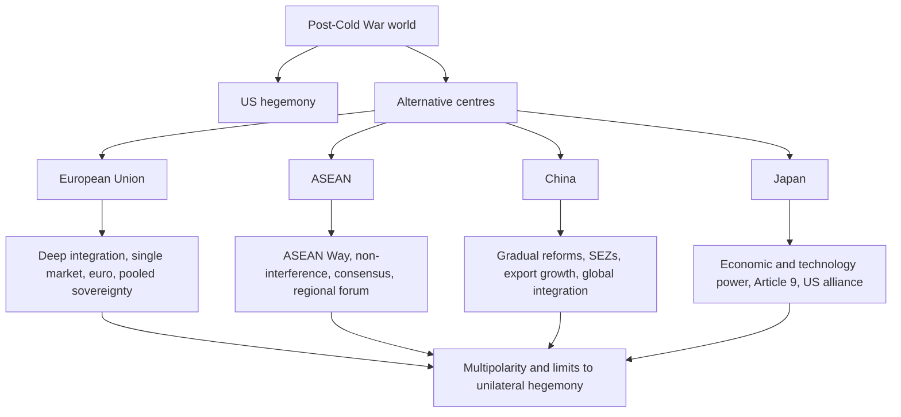

# Alternative Centres of Power

**Class 12 - Contemporary World Politics**  

**Source policy:** supplemental-old-upsc-complete  

**Answer note:** Prelims explanations and Mains outlines are AI-generated study aids; verify against official UPSC keys and the NCERT source.

## Exam Orientation

- Prelims: fix the exact NCERT vocabulary around european union, asean, china, centres of power; expect statement-based traps that alter scope, sequence, or institutional roles.
- General Studies II: use the chapter to frame Constitution, governance, democracy, polity, rights, institutions, and social-justice arguments where relevant.
- Essay and interview: convert the chapter's central tension into balanced language: principle, institution, citizen impact, limitation, and reform direction.

## Master Summary

After the Cold War, the bipolar world order shifted, allowing for the emergence of alternative centres of political and economic power that could challenge US dominance. The European Union (EU) and the Association of Southeast Asian Nations (ASEAN) have developed regional cooperative frameworks that promote peace and prosperity. The EU evolved from an economic union to a political entity with a single currency and common foreign policy. ASEAN, based on the informal and cooperative 'ASEAN Way', has become a rapidly growing economic bloc. China's dramatic economic rise since the late 1970s has made it a major global player, with significant implications for its neighbours, including India. The chapter also examines India-China relations, highlighting historical conflicts and recent economic and strategic engagements.

## Key Concepts

- European Union (EU) integration: Marshall Plan, Treaty of Rome, Maastricht Treaty, Euro, common foreign and security policy
- ASEAN: Bangkok Declaration, ASEAN Way, three pillars (Security, Economic, Socio-Cultural Community), ASEAN Regional Forum
- China's economic transformation: Open Door Policy, Special Economic Zones, gradual market reforms, global integration
- India-China relations: 1962 war, boundary dispute, Rajiv Gandhi's 1988 visit, growing economic ties, strategic competition and cooperation
- Alternative centres of power: multipolarity, regionalism, limits to US hegemony

## UPSC Relevance

This chapter is crucial for UPSC as it covers international relations concepts like regional integration, multipolarity, and the rise of new powers. Questions on EU, ASEAN, and China frequently appear in both Prelims and Mains. Understanding the evolution, structure, and challenges of these organisations helps in answering contemporary global issues. India's relations with these centres, especially from a strategic and economic perspective, are directly relevant to India's foreign policy.

## High-Yield Facts

- Source anchor: Class 12 Contemporary World Politics, Chapter 4, Alternative Centres of Power.
- Edition policy: supplemental-old-upsc-complete; revise from the linked source before relying on exact wording in the exam hall.
- Keep a one-line definition, NCERT example, and constitutional or political linkage ready for european union.
- Keep a one-line definition, NCERT example, and constitutional or political linkage ready for asean.
- Keep a one-line definition, NCERT example, and constitutional or political linkage ready for china.
- Keep a one-line definition, NCERT example, and constitutional or political linkage ready for centres of power.
- Keep a one-line definition, NCERT example, and constitutional or political linkage ready for European Union (EU) integration: Marshall Plan, Treaty of Rome, Maastricht Treaty, Euro, common foreign and security policy.
- Keep a one-line definition, NCERT example, and constitutional or political linkage ready for ASEAN: Bangkok Declaration, ASEAN Way, three pillars (Security, Economic, Socio-Cultural Community), ASEAN Regional Forum.

## Topic Notes

### European Union (EU)

Post-WWII European integration began with the Marshall Plan (1948) and the Organisation for European Economic Cooperation (OEEC). The Council of Europe (1949) fostered political cooperation. The European Coal and Steel Community (ECSC, 1951) and European Economic Community (EEC, 1957) deepened economic integration. The Maastricht Treaty (1992) formally established the EU with a common foreign and security policy, justice and home affairs cooperation, and a single currency. The EU has a flag, anthem, and the Euro (launched 2002). It is the world's largest economy (GDP > $12 trillion in 2005), with the Euro challenging the dollar's dominance. Politically, it holds two permanent UNSC seats (UK, France) and influences global policies (e.g., Iran nuclear deal). Militarily, combined forces are second largest; UK and France possess nuclear arsenals. Challenges include Euroscepticism, resistance to supranational authority, and divergent national interests (e.g., Iraq War). Enlargement: from 6 founders to 27 members by 2007 (Bulgaria, Romania). The Schengen Agreement abolished internal border controls.

### ASEAN

Formed in 1967 by Indonesia, Malaysia, Philippines, Singapore, and Thailand via the Bangkok Declaration. Aims: accelerate economic growth, social progress, cultural development, and maintain regional peace. Now 10 members (Brunei, Vietnam, Laos, Myanmar, Cambodia). The 'ASEAN Way' emphasises informality, non-confrontation, and respect for sovereignty. In 2003, members agreed to establish an ASEAN Community with three pillars: Security Community, Economic Community, and Socio-Cultural Community. The ASEAN Regional Forum (ARF, 1994) coordinates security policy. Economically, it is a fast-growing region, creating a Free Trade Area (FTA) and common market. The US and China have negotiated FTAs with ASEAN. ASEAN mediated the Cambodian conflict and East Timor crisis. India's 'Look East' policy since 1991 has strengthened ties, signing FTAs with Singapore and Thailand, and pursuing a comprehensive FTA with ASEAN.

### Rise of the Chinese Economy

After 1949, China adopted a Soviet-style centrally planned economy focusing on heavy industry and import substitution. Growth stagnated by the 1970s. In 1978, Deng Xiaoping initiated the 'Open Door' policy and gradual market reforms: privatisation of agriculture (1982), industry (1998), and Special Economic Zones (SEZs). China avoided 'shock therapy', maintaining state control. Reforms led to rapid growth, large FDI inflows, and WTO accession (2001). It now holds massive foreign exchange reserves. Challenges: unemployment, inequality, environmental degradation, and corruption. Regionally, China drives East Asian growth, stabilised ASEAN after the 1997 crisis, and invests globally (Africa, Latin America).

### India–China Relations

Historical ties were limited; both ancient powers rarely overlapped. Post-independence, hopes for solidarity ('Hindi-Chini bhai-bhai') were dashed by the 1962 border war over Arunachal Pradesh and Aksai Chin. Diplomatic relations were downgraded until 1976. Rajiv Gandhi's 1988 visit marked a thaw, leading to border talks and confidence-building measures. Post-Cold War, relations acquired strategic and economic dimensions. Bilateral trade soared from $338 million (1992) to over $18 billion (2006). Cooperation in energy and WTO. Contentious issues: boundary dispute, China's role in Pakistan's nuclear programme, and military ties with neighbours. However, frequent high-level visits and growing interdependence signal cautious engagement.

### Japan

Japan is the second-largest economy, an Asian G-8 member, and the tenth most populous nation. It renounces war under Article 9 of its constitution, yet maintains the fourth-largest military budget. It is the second-largest UN budget contributor and has a US security alliance (since 1951). While not covered in detail in the chapter, Japan is presented as another potential centre of power due to its economic and technological prowess.

## Prelims Traps

- Do not treat NCERT examples as exhaustive lists.
- Watch qualifiers such as only, always, never, directly, indirectly, constitutional, statutory, formal, and informal.
- Separate the broad idea of european union from adjacent terms; UPSC often swaps related concepts.
- When a statement sounds familiar, check whether it matches the NCERT claim or merely uses NCERT vocabulary.

## Mains Framing

- Opening: define the demand using NCERT language from Alternative Centres of Power, then state why it matters for Indian democracy or governance.
- Body: organise points around european union, asean, china; add one institution, one citizen-impact angle, and one limitation.
- Conclusion: avoid a slogan; close with a constitutional, democratic, or reform-oriented balancing line.

## Answer Framework Bank

- Use when the question asks you to define european union: definition, source anchor from Class 12 Contemporary World Politics, NCERT example, limitation, and balanced way forward.
- Dimensions to cover: institutional design, citizen impact, democratic accountability, and the link with asean, china, centres of power.
- Contrast frame: distinguish european union from adjacent ideas and show the consequence of confusing them in Prelims statements or Mains arguments.
- Practice conversion: turn one Prelims trap into a 150-word Mains paragraph with introduction, three analytical points, and a reform-oriented close.

## UPSC Expansion Drills

### Mains Answer Scaffold

For Alternative Centres of Power, build a 150-250 word answer as: one-line definition of european union, NCERT source anchor from Class 12 Contemporary World Politics, two analytical dimensions linked to asean, china, centres of power, one limitation, and a balanced constitutional or democratic way forward.

### Prelims Trap Check

Turn each familiar phrase about european union into a true-or-false statement. Test scope words such as only, always, never, formal, informal, constitutional, statutory, direct, and indirect before accepting the option.

### Key Term Anchors

Prepare one precise NCERT-style definition, one chapter example, and one Indian polity or governance linkage for: european union, asean, china, centres of power, European Union (EU) integration: Marshall Plan, Treaty of Rome, Maastricht Treaty, Euro, common foreign and security policy.

### Comparison Prompt

Compare european union with the nearest related concept in the chapter by basis, institution involved, citizen impact, and limitation. This prevents using adjacent terms as synonyms in Prelims or Mains.

### Weakness Repair Drill

After every wrong quiz or weak Mains outline, label the error as definition, scope, example, institution, chronology, or conclusion; then rewrite the corrected point as one exam-ready sentence.

## Current-Affairs Bridge

- Use news only as an illustration of the static concept: map any report to european union, asean, china before writing it in notes.
- Record the institution involved, constitutional or political principle, affected group, and policy trade-off without inventing a current fact.
- Keep current examples replaceable; the NCERT concept should survive even when the news cycle changes.

## Revision Ladder

- [ ] Explain the chapter title in two sentences: Alternative Centres of Power.
- [ ] Define and differentiate: european union, asean, china.
- [ ] Attach one NCERT example and one Indian polity or governance linkage to each key concept.
- [ ] Attempt the Prelims drill without notes, then rewrite every wrong answer as a trap statement.
- [ ] Write one 150-word Mains answer using definition, dimensions, example, limitation, and way forward.

## Expanded NCERT-to-UPSC Notes

### Core Argument of the Chapter

Alternative centres of power are not merely "countries other than the US". The chapter studies how regional organisations and rising economies can create influence through markets, institutions, diplomacy, technology, and strategic location. After the end of bipolarity, the US remained the most powerful state, but world politics became more layered. The European Union, ASEAN, China, and Japan show that power can be regional, economic, institutional, and civilisational, not only military.

For UPSC, this chapter is a bridge between static NCERT and contemporary international relations. EU helps answer questions on regional integration and pooled sovereignty. ASEAN helps answer questions on consensus, informality, and Southeast Asian regionalism. China helps answer questions on economic transformation, gradual reform, and India's strategic environment. Japan helps show how constitutional pacifism can coexist with major economic and technological capacity.

### Concept Map

Use this map to avoid reducing the chapter to factual lists. The analytical theme is the diffusion of power after bipolarity.

### European Union: Integration as Power

The EU represents the most advanced experiment in regional integration. It began from the practical idea that economic interdependence, especially in coal and steel, could reduce the risk of war in Europe. Over time, integration moved from sectoral cooperation to a common market, common institutions, common currency for many members, and some shared foreign and security ambitions.

For UPSC, the EU is a case study in pooled sovereignty. Member states do not disappear, but they accept common rules and institutions in selected areas because the benefits of scale, stability, bargaining power, and peace are high. This is different from a federation like India and different from a loose intergovernmental forum. The EU has supranational features, but national governments remain powerful.

### EU Strengths and Limits

| Strength | Explanation | Limitation |
|---|---|---|
| Economic scale | Single market and eurozone give large bargaining capacity. | Not all members share the euro; economic priorities differ. |
| Institutional depth | Parliament, Commission, Council, Court, and regulatory capacity create rule-making power. | Decision-making can be slow and complex. |
| Normative power | EU influences standards on trade, environment, privacy, and human rights. | Normative claims can clash with member-state interests. |
| Diplomatic weight | France and the UK historically gave UNSC and military weight; EU also negotiates as a bloc in many areas. | Foreign policy unity is uneven, as seen in divergent positions on wars. |
| Peace project | Integration reduced historic intra-European rivalry. | Euroscepticism and national identity politics challenge integration. |

In Mains, avoid saying the EU is a "superstate". It is better described as a unique regional organisation with both supranational and intergovernmental features.

### ASEAN: Regionalism Through Consensus

ASEAN is less legally integrated than the EU, but that does not make it insignificant. Its strength lies in flexible diplomacy, habit of consultation, and the "ASEAN Way": informality, consensus, non-confrontation, and respect for sovereignty. This style suited a region with diverse political systems, colonial histories, religions, languages, and levels of development.

ASEAN's three pillars show its broad ambition: security community, economic community, and socio-cultural community. The ASEAN Regional Forum adds a security dialogue platform involving external powers. ASEAN matters to India because Southeast Asia sits at the intersection of trade routes, maritime security, connectivity, diaspora, and Indo-Pacific strategy.

### EU vs ASEAN: Comparison for UPSC

| Basis | European Union | ASEAN |
|---|---|---|
| Integration model | Legal-institutional and relatively deep | Informal, consensus-driven, sovereignty-sensitive |
| Core method | Treaties, common institutions, single market, common currency for many members | Consultation, non-interference, gradual cooperation |
| Political diversity | Democracies with shared broad institutional norms, though with internal variations | Wide range of political systems |
| Security approach | Some common foreign/security policy ambitions, NATO overlap for many members | ASEAN Regional Forum and confidence-building |
| Main UPSC theme | Pooled sovereignty and regional integration | Regional cooperation without heavy supranationalism |
| Limitation | Slow decisions, Euroscepticism, divergent national interests | Weak enforcement, consensus paralysis, limited institutional depth |

### China's Rise: Gradual Reform and State Capacity

China's transformation is central because it did not follow shock therapy. After 1978, reforms were gradual, experimental, and state-directed. Agriculture was liberalised before many industrial reforms; Special Economic Zones attracted foreign investment; export manufacturing linked China to global markets; WTO accession deepened integration. The party-state retained political control while allowing market mechanisms in selected areas.

UPSC answers should identify the paradox: China liberalised economically without liberalising politically in the Western democratic sense. This created rapid growth and state capacity, but also generated inequality, environmental stress, corruption, labour pressures, and regional imbalance. The chapter's China material is useful for comparing development models, not merely for listing dates.

### India-China Relations: Cooperation and Competition

India-China relations should be written as a duality. Historical civilisational contact and post-independence solidarity created early optimism, but the 1962 war and boundary dispute produced distrust. Rajiv Gandhi's 1988 visit helped normalise relations and enabled dialogue, confidence-building, and economic engagement. Post-Cold War trade expanded, but strategic concerns remained: boundary dispute, Pakistan factor, Tibet-related sensitivities, Indian Ocean presence, and competition for influence.

Use this balanced frame:

- Cooperation: trade, multilateral forums, climate negotiations, WTO-related developing-country issues, high-level dialogue.
- Competition: boundary, strategic influence in South Asia and the Indian Ocean, technology and infrastructure, China-Pakistan ties.
- Management: confidence-building, diplomatic mechanisms, economic caution, and India's broader partnerships.

Do not reduce the relationship to either war or trade. UPSC usually rewards the phrase "cooperation with competition" or "managed rivalry" when supported by examples.

### Japan as a Distinct Power Centre

Japan is important because it shows that power can be economic and technological even when military posture is constitutionally constrained. Article 9 renounces war, yet Japan maintains significant self-defence capacity and remains under a US security alliance. It is a major economy, technology leader, development partner, and contributor to international institutions.

For India, Japan is relevant through infrastructure, technology, Indo-Pacific cooperation, and development partnerships. Keep the NCERT point stable: Japan is a potential centre of power due to economic and technological strength, not because it behaves like a traditional military superpower.

### Alternative Centres and Multipolarity

Multipolarity does not mean all poles are equal. It means power is distributed across more than one significant centre, and states have more room for issue-based alignment. The EU may be strong economically and normatively but uneven militarily. China may be economically and strategically powerful but faces domestic and external constraints. ASEAN is institutionally lighter but diplomatically central in Southeast Asia. Japan is economically advanced but constitutionally and strategically constrained.

This differentiated view is important. A weak answer says "the world is multipolar because many powers exist." A strong answer says "different centres possess different forms of power, and their interaction limits unilateral dominance while creating complex interdependence."

### Prelims Trap Bank

- If a statement says ASEAN includes China or India as members, reject it. They are partners, not members.
- If a statement says ASEAN operates like the EU with a strong supranational authority, reject it.
- If a statement says the EU abolished all national sovereignty, reject it. Sovereignty is pooled in selected areas.
- If a statement says China adopted shock therapy, reject it. Its reforms were gradual and state-managed.
- If a statement says economic power and military power are identical, reject it; Japan is the standard caution.
- If a statement says alternative centres have fully replaced US hegemony, reject it. They constrain and complicate hegemony; they do not automatically erase it.

### Mains Answer Scaffolds

**Question type: "Compare EU and ASEAN as regional organisations."**

1. Define regional integration.
2. Explain EU's deep, treaty-based institutional model.
3. Explain ASEAN's consensus-based and sovereignty-sensitive model.
4. Compare strengths: EU's regulatory power, ASEAN's diplomatic flexibility.
5. Compare limits: EU's internal divisions, ASEAN's weak enforcement.
6. Conclude that regionalism adapts to historical and political context.

**Question type: "Assess China's rise as an alternative centre."**

1. Start with post-1978 reforms.
2. Explain gradual reform, SEZs, FDI, export-led growth, WTO integration.
3. Add state control and political continuity.
4. Discuss consequences: global influence, regional leadership, pressure on India.
5. Add limits: inequality, environment, demographic and geopolitical frictions.
6. Conclude that China's rise is transformative but contested.

**Question type: "India's approach to alternative centres of power."**

1. Begin with the need for strategic autonomy in a post-bipolar world.
2. EU: trade, technology, climate, standards, investment.
3. ASEAN: Act East, connectivity, maritime and regional engagement.
4. China: engagement plus deterrence and competition management.
5. Japan: infrastructure, technology, and Indo-Pacific cooperation.
6. Conclude with multi-alignment based on issue-specific partnerships.

### Contemporary Relevance Without Unsupported Current Affairs

This chapter should be used as a static framework for current affairs, not as a place to add unverified claims. EU remains useful for questions on trade standards, climate regulation, data governance, and regional integration. ASEAN remains useful for Indo-Pacific, maritime routes, and consensus diplomacy. China remains central to questions on supply chains, border management, economic interdependence, and Asian balance of power. Japan remains useful for infrastructure, technology, and debates over pacifism and security normalisation.

When using contemporary examples, write in broad terms unless you have verified the latest fact. A safe sentence is: "Recent developments can be mapped onto the NCERT framework of regionalism, economic power, and strategic competition, but the exact facts should be revised from current sources before the examination."

### Weakness-Repair Drills

- If your EU answer becomes a list of treaties, add the concept of pooled sovereignty.
- If your ASEAN answer says "weak organisation", add why informality and consensus were suitable for Southeast Asia.
- If your China answer says only "economic rise", add reform sequencing and state capacity.
- If your India-China answer is only conflict-based, add trade, dialogue, and multilateral cooperation; if it is only trade-based, add boundary and strategic concerns.
- If you use "multipolarity", specify the type of power each centre holds.
- If you mention Japan, connect Article 9 with economic and technological influence.

## Prelims Drill

Q1
Prelims 2011
MCQ

Consider the following statements:
1. The Australia Group comprises predominantly of Asian, African and North American countries.
2. The member countries of Wassenaar Arrangement are predominantly from the European Union and American continents.
Which of the statements given above is/are correct?

<label data-opt="a">A1 only</label>
<label data-opt="b">B2 only</label>
<label data-opt="c">CBoth 1 and 2</label>
<label data-opt="d">DNeither 1 nor 2</label>

Show Answer

<strong>Answer: D.</strong> AI-generated study aid: The Australia Group has members from Europe, the Americas, Asia-Pacific, and Africa, so statement 1 is incorrect. The Wassenaar Arrangement includes countries from various continents globally, not just the EU and Americas, so statement 2 is incorrect.

Q2
Prelims 2023
MCQ

Consider the following statements:
Statement-I: Recently, the United States of America (USA) and the European Union (EU) have launched the &#x27;Trade and Technology Council&#x27;.
Statement-II: The USA and the EU claim that through this they are trying to bring technological progress and physical productivity under their control.
Which one of the following is correct in respect of the above statements?

<label data-opt="a">ABoth Statement-I and Statement-II are correct and Statement-II is the correct explanation for Statement-I</label>
<label data-opt="b">BBoth Statement-I and Statement-II are correct and Statement-II is not the correct explanation for Statement-I</label>
<label data-opt="c">CStatement-I is correct but Statement-II is incorrect</label>
<label data-opt="d">DStatement-I is incorrect but Statement-II is correct</label>

Show Answer

<strong>Answer: C.</strong> AI-generated study aid: The US-EU Trade and Technology Council (TTC) was indeed launched in 2021 to coordinate approaches to global trade, economic, and technology issues. However, Statement-II is incorrect as the TTC&#x27;s stated purpose is to promote cooperation and democratic values, not to &#x27;bring technological progress and physical productivity under their control&#x27;.

Q3
Prelims 2024
MCQ

Consider the following statements:
Statement-I: The European Parliament approved The Net-Zero Industry Act recently.
Statement-II: The European Union intends to achieve carbon neutrality by 2040 and therefore aims to develop all of its own clean technology by that time.
Which one of the following is correct in respect of the above statements?

<label data-opt="a">ABoth Statement-I and Statement-II are correct and Statement-II explains Statement-I</label>
<label data-opt="b">BBoth Statement-I and Statement-II are correct, but Statement-II does not explain Statement-I</label>
<label data-opt="c">CStatement-I is correct, but Statement-II is incorrect</label>
<label data-opt="d">DStatement-I is incorrect, but Statement-II is correct</label>

Show Answer

<strong>Answer: C.</strong> AI-generated study aid: The European Parliament did approve the Net-Zero Industry Act to accelerate clean technology manufacturing in the EU. However, the EU&#x27;s legally binding target under the European Climate Law is to achieve climate neutrality by 2050, not 2040. Thus, Statement-II is factually incorrect regarding the timeline.

Q4
Prelims 2005
MCQ

Which one of the following is not an ASEAN member?

<label data-opt="a">ACambodia</label>
<label data-opt="b">BChina</label>
<label data-opt="c">CLaos</label>
<label data-opt="d">DPhilippines</label>

Show Answer

<strong>Answer: B.</strong> AI-generated study aid: The Association of Southeast Asian Nations (ASEAN) includes 10 Southeast Asian countries: Brunei, Cambodia, Indonesia, Laos, Malaysia, Myanmar, the Philippines, Singapore, Thailand, and Vietnam. China is a dialogue partner but not a member.

Q5
Prelims 2006
MCQ

Which one of the following countries is *not* a member of ASEAN?

<label data-opt="a">AVietnam</label>
<label data-opt="b">BBrunei Darussalam</label>
<label data-opt="c">CBangladesh</label>
<label data-opt="d">DMyanmar</label>

Show Answer

<strong>Answer: C.</strong> AI-generated study aid: Bangladesh is located in South Asia and is not a member of ASEAN, which consists of Southeast Asian nations. Vietnam, Brunei, and Myanmar are full members.

Q6
Prelims 2006
MCQ

Other than India and China, which of the following groups of countries border Myanmar?

<label data-opt="a">ABangladesh, Thailand and Vietnam</label>
<label data-opt="b">BCambodia, Laos and Malaysia</label>
<label data-opt="c">CThailand, Vietnam and Malaysia</label>
<label data-opt="d">DThailand, Laos and Bangladesh</label>

Show Answer

<strong>Answer: D.</strong> AI-generated study aid: Myanmar shares land borders with India, China, Bangladesh, Laos, and Thailand. Excluding India and China, the bordering countries are Bangladesh, Laos, and Thailand.

Q7
Prelims 2008
MCQ

Which two countries follow China and India in the decreasing order of their populations?

<label data-opt="a">ABrazil and USA</label>
<label data-opt="b">BUSA and Indonesia</label>
<label data-opt="c">CCanada and Malaysia</label>
<label data-opt="d">DRussia and Nigeria</label>

Show Answer

<strong>Answer: B.</strong> AI-generated study aid: As per standard demographic estimates, the four most populous countries are China, India, USA, and Indonesia, in that order.

Q8
Prelims 2008
MCQ

For India, China, the UK and the USA, which one of the following is the correct sequence of the median age of their populations?

<label data-opt="a">AChina &lt; India &lt; UK &lt; USA</label>
<label data-opt="b">BIndia &lt; China &lt; USA &lt; UK</label>
<label data-opt="c">CChina &lt; India &lt; USA &lt; UK</label>
<label data-opt="d">DIndia &lt; China &lt; UK &lt; USA</label>

Show Answer

<strong>Answer: B.</strong> AI-generated study aid: India has the youngest population (median age ~28), followed by China (~38), then the USA (~38), and the UK (~40). Thus, the correct increasing order is India &lt; China &lt; USA &lt; UK.

## Mains Answer Practice

### Mains Prompt 1: Mains 2009 GS2

> China's 'peaceful rise' doctrine

**Source:** UPSC CSE Mains 2009 GS Paper 2, Q1(b)  

**Outline hint (AI-generated study aid):** Define China's 'peaceful rise' doctrine: Originated in early 2000s by Zheng Bijian; emphasises economic development, multilateralism, and non-confrontation. Key points: 1. China seeks a peaceful international environment for its growth. 2. Rejects historical hegemonic models. 3. Focus on soft power, win-win cooperation. Criticism: Contrast with growing military assertiveness in South China Sea, BRI, and border tensions. Conclusion: Doctrine as a strategic narrative; mixed reception globally.

### Mains Prompt 2: Mains 2017 GS2

> 'China is using its economic relations and positive trade surplus as tools to develop potential military power status in Asia.' In the light of this statement, discuss its impact on India as her neighbour.

**Source:** UPSC CSE Mains 2017 GS Paper 2, Q9  

**Outline hint (AI-generated study aid):** Introduction: China leverages economic might to expand strategic influence (e.g., BRI, CPEC). Impact on India: 1. Economic: Trade deficit, Chinese investment in infrastructure through CPEC in PoK challenges sovereignty. 2. Strategic: China-Pakistan axis, military modernisation, access to Indian Ocean ports (Gwadar). 3. Diplomacy: China's growing influence in South Asia (Bangladesh, Nepal, Sri Lanka). India's response: Act East, Quad, enhancing naval capabilities, balancing engagement with China. Conclusion: Need for cautious, multi-pronged approach to safeguard interests.

### Mains Prompt 3: Mains 2004 GS2

> European Union's trade restrictions against India.

**Source:** UPSC CSE Mains 2004 GS Paper 2, Q2(c)  

**Outline hint (AI-generated study aid):** Types of restrictions: Non-tariff barriers (NTBs), sanitary and phytosanitary (SPS) measures, technical barriers to trade (TBT). Specific cases: EU's anti-dumping duties on Indian textiles, restrictions on agricultural imports (e.g., mangoes, rice) due to pesticide residues. Impact: Limits Indian exports, hinders market access. India's response: Bilateral negotiations, WTO dispute settlement. Assessment: Reflects EU's protectionist tendencies; need for continued dialogue and compliance with international standards.

### Mains Prompt 4: Mains 2009 GS2

> Evaluate the prospects for greater economic co-operation between India and China.

**Source:** UPSC CSE Mains 2009 GS Paper 2, Q7(a)  

**Outline hint (AI-generated study aid):** Current state: Bilateral trade > $100 billion, but India has large deficit. Complementarities: India's services, IT, pharma; China's manufacturing. Potential areas: Infrastructure, energy, technology, and pharmaceuticals. Challenges: Trust deficit due to border issues, China's stance on Pakistan, competing strategic interests. Ways forward: Proposed projects in third countries, joint R&D, connectivity initiatives. Future: Cautious optimism; need to address trade imbalance and build mutual trust through economic interdependence.

### Mains Prompt 5: Mains 2009 GS2

> Critically assess the recent Free Trade Agreement entered into by India with ASEAN.

**Source:** UPSC CSE Mains 2009 GS Paper 2, Q7(c)  

**Outline hint (AI-generated study aid):** Background: India's Look East Policy; ASEAN-India FTA in goods signed 2009. Features: Tariff liberalisation, special safeguards for sensitive products. Benefits: Enhanced trade in goods, market diversification, strategic presence in Southeast Asia. Concerns: Impact on Indian agriculture (palm oil, tea), manufacturing; slow progress on services and investment agreements. Assessment: Positive step for economic integration, but India needs to address non-tariff barriers and protect vulnerable sectors. More recent agreements (services, investment) aim to deepen ties.

### Mains Prompt 6: Mains 2016 PSIR

> Illustrate the main causes of tension between India and China. Suggest the possibilities of improving relationship.

**Source:** UPSC CSE Mains 2016 Political Science & IR Paper II, Q5(c)  

**Outline hint (AI-generated study aid):** Causes of tension: 1. Border dispute: Undefined boundaries, Doklam 2017, Depsang plains, frequent incursions. 2. China's support to Pakistan: Nuclear proliferation, CPEC through PoK. 3. Strategic competition: India's neighbourhood, China's 'string of pearls' in Indian Ocean. 4. Trade imbalance. Possibilities for improvement: 1. Regular bilateral dialogue (Special Representatives' talks). 2. Confidence-building measures (military hotlines, border personnel meetings). 3. Economic interdependence: trade, investment, and joint projects. 4. Multilateral engagement: BRICS, SCO, G20. Conclusion: Resolving border issue crucial; otherwise, managing differences while expanding cooperation.
