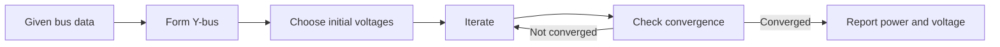

# Adding notes and subjects

The source of truth for learner notes is `docs/`. The site discovers Markdown from the folder structure, generates a subject catalog, rewrites local links and assets, and gives each note a public URL.

Use the copy-ready [`templates/academic-note.md`](../templates/academic-note.md) as a starting point. Copy it into the intended subject folder before replacing the placeholders. Never move the template folder itself under `docs/`: every Markdown file there must be treated as publishable.

## Add one note

For a normal MIT academic subject, use this path:

```text
docs/sem<semester>/<lowercase-subject-code>/<ordered-file-name>.md
```

Example:

```text
docs/sem7/pse/03-load-flow-analysis.md
```

This produces:

```text
course code: SEM7-PSE
course route: /courses/SEM7-PSE
note slug:   sem7-pse-03-load-flow-analysis
note route:  /notes/sem7-pse-03-load-flow-analysis
```

The folder and filename become part of the public identity. Choose them before publishing. Moving or renaming a note changes its URL.

### Recommended frontmatter

Put YAML frontmatter at the very top of the file:

```yaml
---
title: "Load Flow Analysis"
sidebar_label: "03 · Load Flow Analysis"
sidebar_position: 3
description: "Bus types, power-flow equations, Gauss-Seidel, Newton-Raphson, and exam-ready worked problems."
tags:
  - power-systems
  - load-flow
  - numerical-methods
---
```

The content builder currently reads these fields:

| Field | Use | Recommendation |
|---|---|---|
| `title` | Main note title and metadata | Required in practice |
| `sidebar_label` | Short label in course navigation | Recommended; `sidebarLabel` also works |
| `sidebar_position` | Numeric fallback order | Recommended for a simple flat subject |
| `description` | Metadata and fallback summary | Write one specific sentence |
| `tags` | Searchable/indexed labels | Use a YAML list of lowercase terms |
| `content_type` | Selects specialized presentation | Leave out for academic notes; `research_note` has special behavior |
| `status` | Status metadata used by specialized content | It does not hide an academic note |
| `published` | Publication-date metadata | Use an ISO date only when the content type needs it |

There is no draft or hidden flag in the normal pipeline. A file is not kept private merely because `status: draft` is present.

### Title and heading structure

Use one source-level `#` title matching `title`, then start lesson sections at `##`:

```markdown
# Load Flow Analysis

Two or three sentences explaining what this lesson teaches and why it matters.

## Learning outcomes

## 1. Bus classification

### 1.1 Slack bus

## 2. Power-flow equations

## Worked examples

## Common mistakes

## Quick revision

## Practice quiz
```

The matching `#` title is removed from the generated body because the note page renders its own `<h1>`. Headings from `##` through `####` feed the reader outline and search index. Keep them descriptive and do not skip levels merely for visual size.

The first substantial prose paragraph becomes the card excerpt. Put a useful orientation paragraph before formulas, tables, or long lists.

## Write notes that fit the reader

A detailed note should still be scannable. A reliable academic sequence is:

1. Orientation and learning outcomes.
2. Definitions and physical intuition.
3. Core theory in syllabus order.
4. Derivations with assumptions stated before the algebra.
5. Diagrams, tables, or comparisons where they reduce mental load.
6. Worked examples from easy to exam-level.
7. Common mistakes, sign conventions, and unit checks.
8. A compact revision sheet.
9. Recall questions or a quiz with explanations.
10. Sources and any uncertainty that remains.

Do not create one giant wall of text. Use short paragraphs, meaningful headings, compact tables, and lists only when the information is genuinely list-shaped.

### Mathematics

Use standard dollar delimiters:

```markdown
The synchronous speed is $N_s = \frac{120f}{P}$ rpm.

$$
P = \sqrt{3}V_L I_L \cos\phi
$$
```

KaTeX renders the result. Put punctuation outside a display block, define every symbol near its first use, and state units. The normalizer supports some legacy delimiters, but new notes should use `$...$` and `$$...$$` consistently.

### Tables

GitHub-flavored Markdown tables are supported:

```markdown
| Method | Main advantage | Main limitation |
|---|---|---|
| Gauss-Seidel | Simple implementation | Slow convergence |
| Newton-Raphson | Fast near the solution | Larger Jacobian calculation |
```

Keep tables narrow enough for a phone. Move long explanations below the table.

### Code

Use a fenced block with a language:

````markdown
```python
def per_unit(value: float, base: float) -> float:
    return value / base
```
````

Any fenced code block marks the note as runnable in catalog statistics. Use the correct language label so highlighting and the code runner behave predictably.

### Mermaid diagrams

Use Mermaid when relationships or sequence are clearer visually:

````markdown

````

Quote node labels containing punctuation. Keep diagrams focused; a large diagram is not a substitute for section structure.

### Images and downloadable assets

Keep a note's assets beside the note in an `assets/` or `images/` folder:

```text
docs/sem7/pse/
├── 03-load-flow-analysis.md
└── assets/
    └── load-flow-bus-types.svg
```

Reference the asset relative to the note:

```markdown

```

The content build copies it to `public/content-assets/` and rewrites the URL. Use meaningful alt text. Prefer tracked local assets over fragile hotlinks, and record the source or licence when the asset is not original.

### Links between notes

Link to the source Markdown path relative to the current note:

```markdown
[Review the per-unit system](./02-per-unit-system.md)
[Return to the subject overview](./overview.md#syllabus-map)
```

The builder converts resolvable Markdown links into `/notes/<slug>` routes and preserves the heading fragment. Run the content build after adding both sides of a link.

### Answers and collapsible explanations

A blockquote whose first line is exactly `Answer` or `Answer and explanation` becomes a collapsible answer:

```markdown
> Answer and explanation
>
> The slack bus fixes voltage magnitude and angle while balancing the remaining real and reactive power mismatch.
```

Use this for recall prompts and worked checks, not for core theory that should always be visible.

### Recognized practice sections

The catalog recognizes question headings such as `## Question 1` and practice headings named `## Prelims Drill` or `## Mains Answer Practice`.

For a parsed quiz set, use one of the recognized headings, including `Quiz`, `Practice Quiz`, `Quick Quiz`, `MCQ Drill`, `Solved Examples`, or `200/200 Drill`. A normal academic example is:

```markdown
## Quiz: Load Flow Check

1. Which bus has specified voltage magnitude and real power?
   Options: (a) Slack (b) PV (c) PQ (d) Isolated

> Answer and explanation
>
> **(b) PV.** A generator or voltage-controlled bus specifies $P$ and $|V|$; $Q$ and angle are solved within limits.
```

Keep an explanation with every answer. Automatic quiz counts depend on recognizable numbering and option syntax, so check the rendered result rather than assuming a heading alone created a quiz.

## Add a new academic subject

Adding a subject takes two small source changes.

### 1. Create the subject folder and first notes

```text
docs/sem7/pse/
├── overview.md
├── 01-power-system-representation.md
└── 02-per-unit-system.md
```

Use a lowercase, stable folder code. The generated course code will be `SEM7-PSE`. Add a useful `overview.md` first; it is automatically placed near the start of the course map.

### 2. Add the friendly subject name

In `scripts/build-content-data.ts`, add an entry to `courseNames`:

```ts
"SEM7-PSE": "Power System Engineering",
```

Without this entry, the subject is still discovered but its display name falls back to a title-cased folder code.

No route file is required for a normal academic subject. The course catalog and `/courses/[code]` route read the generated catalog automatically.

Add a focused assertion to `tests/content-generator.test.ts` when introducing a new path convention or special course behavior. A standard new `semN/<subject>` subject normally needs only the generic content tests plus visual verification.

## Ordering rules

Use path naming as the primary reading-order contract:

- `overview.md` is treated as an introduction;
- numeric names such as `01-`, `02-`, and `03-` sort naturally;
- `week-01`, `week-02`, and similar paths are ordered by week and grouped in the course map;
- structured paths such as `class-11/<book>/01-chapter.md` follow path order;
- `sidebar_position` is a fallback for notes not already ordered by those structural rules.

Do not rely on operating-system directory order. Check the actual course map after regeneration.

## Preview and validate

From the repository root:

```powershell
npm run build:content
npm run dev
```

The generator reports the number of notes and courses. Then inspect:

```text
http://localhost:3000/courses/<COURSE-CODE>
http://localhost:3000/notes/<generated-slug>
```

Check the title, excerpt, order, outline, formulas, diagrams, code, links, quiz count, and narrow layout. Finish with the content tier in [Validation and release](validation-and-release.md).

## Common failures

| Symptom | Likely cause | Fix |
|---|---|---|
| Note does not appear | Generator was not run, file is outside `docs/`, or the file is an excluded support document | Run `npm run build:content` and inspect the generated index |
| Contributor document appears as a course | It was placed under `docs/` | Move it to `handbook/`, `templates/`, or another non-publishable root |
| Subject card has an ugly name | Friendly name is missing | Add the course code to `courseNames` |
| Note order is surprising | Filename and structural order outrank frontmatter in some layouts | Use numeric filenames or week folders and inspect the course map |
| Duplicate title appears | Source `#` title differs from frontmatter title | Make them match or remove the source `#` heading |
| Image is broken | Asset path is wrong relative to the note | Fix the relative path and regenerate content |
| Internal link remains a source path | Target could not be resolved during generation | Check spelling, extension, and relative location |
| Formula is plain text | Delimiters are malformed or split incorrectly | Use `$...$` or `$$...$$` and check braces |
| Mermaid shows an error | Diagram syntax or unquoted punctuation is invalid | Simplify the graph and quote complex labels |
| Quiz count is zero | Heading, numbering, or option syntax is not recognized | Follow a recognized quiz shape and inspect generated note JSON |

When the website and this guide disagree, the implementation is the immediate truth. Fix the note, then update this handbook so the next contribution does not repeat the discovery work.
