# <Full lesson title>

<Write a short orientation paragraph. State what this lesson covers, why it matters, and any prerequisite. This paragraph is a candidate for the library excerpt.>

## Learning outcomes

After this lesson, I should be able to:

- <explain the first core idea>;
- <apply the main method or equation>;
- <avoid the most common exam mistake>.

## 1. <First core concept>

<Define the idea, then explain the physical or practical intuition.>

### 1.1 <Important detail>

<Build the explanation in small steps. Define every symbol before using it.>

$$
<equation>
$$

where:

- $<symbol>$ is <meaning and unit>;
- $<symbol>$ is <meaning and unit>.

> Key idea
>
> <Write the one sentence that must survive revision.>

## 2. <Second core concept or derivation>

<State assumptions before the derivation. Explain what each step means instead of showing algebra alone.>

| <Comparison basis> | <Case A> | <Case B> |
|---|---|---|
| <Row label> | <Value or explanation> | <Value or explanation> |

## Worked example

**Given:** <known values with units>

**Find:** <required result>

**Method:** <why this method applies>

$$
<substitution and calculation>
$$

**Answer:** <result with unit and a short reasonableness check>

## Diagram or process map

```mermaid
flowchart LR
    A["<Input or starting idea>"] --> B["<Main process>"]
    B --> C["<Result>"]
```

<!-- Delete this section if a diagram does not improve understanding. -->

## Common mistakes

- **<Mistake>:** <why it happens and how to prevent it>.
- **<Sign or unit trap>:** <the correct check>.
- **<Concept confusion>:** <the clean distinction>.

## Quick revision

- <Definition in one line>.
- <Main equation and when it applies>.
- <One comparison or exception>.
- <One exam-hall check>.

## Quiz: <Short quiz name>

1. <Write a question that tests understanding rather than copied wording>?
   Options: (a) <option> (b) <option> (c) <option> (d) <option>

> Answer and explanation
>
> **(<correct option>).** <Explain why it is correct and why the nearest distractor is wrong.>

2. <Write a numerical or application question>?
   Options: (a) <option> (b) <option> (c) <option> (d) <option>

> Answer and explanation
>
> **(<correct option>).** <Show the minimum calculation or reasoning needed.>

## Sources

- <Primary textbook, lecture, standard, or official source with chapter/page when available>.
- <Secondary source used for clarification>.

<!-- Before publishing: replace every angle-bracket placeholder, verify facts and units, run npm run build:content, and inspect the generated course and note routes. -->
